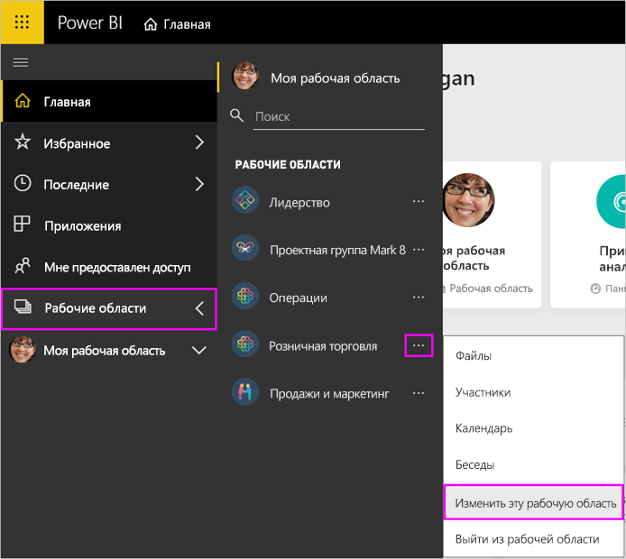
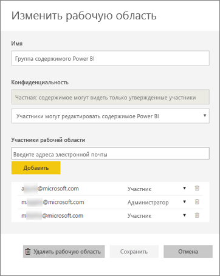
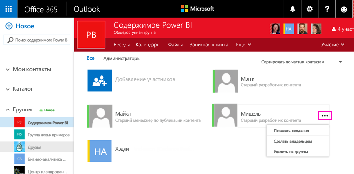
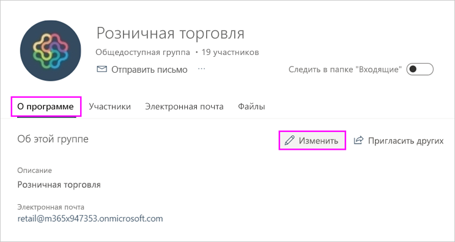
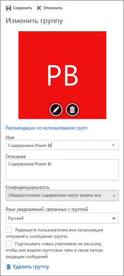

# Управление рабочей областью приложения в Power BI и Office 365
Автор или администратор [рабочей области приложения в Power BI](service-install-use-apps.md) или в Office 365 может управлять некоторыми аспектами рабочей области в Power BI. Управление другими аспектами осуществляется в Office 365. 

**В Power BI** можно выполнять следующие задачи:

* Добавлять или удалять участников рабочей области приложения, включая присвоение участнику рабочей области прав администратора.
* Менять название рабочей области приложения.
* Удалять рабочую область приложения.

**В Office 365** можно выполнять следующие задачи:

* добавлять или удалять участников рабочей области приложения, включая присвоение участнику прав администратора;
* менять название группы, ее изображение, описание и другие параметры;
* просматривать адрес электронной почты группы;
* удалять группу.

Лицензия [Power BI Pro](service-free-vs-pro.md) необходима для администратора или участника рабочей области приложения. Вашим пользователям приложения также требуется лицензия Power BI Pro, если только рабочая область приложения не хранится емкости Power BI Premium. Дополнительные сведения см. в статье [Что такое Power BI Premium?](service-premium.md)

## Изменение рабочей области приложения в Power BI
1. В службе Power BI щелкните стрелку рядом с элементом **Рабочие области**, щелкните многоточие (**…**) рядом с именем рабочей области, а затем выберите **Изменить рабочую область**. 
   
   
   
   > [!NOTE]
   > Кнопка **Edit workspace** (Изменить рабочую область) отображается только для администраторов рабочих областей.
   > 
   > 
2. Здесь можно переименовать, добавить или удалить участников, а также переименовать или удалить рабочую область приложения. 
   
   
3. Выберите **Сохранить** или **Отменить**.

## Изменение свойств рабочей области приложения Power BI в Office 365
1. В службе Power BI щелкните стрелку рядом с элементом **Рабочие области**, щелкните многоточие (**…**) рядом с именем рабочей области и выберите **Участники**. 
   
   
   
   Откроется представление Outlook для группы Office 365 для рабочей области приложения.
   
   Возможно, вам потребуется войти в свою корпоративную учетную запись.
2. Щелкните многоточие (**…**) рядом с именем участника, чтобы сделать его администратором, или удалите участника из рабочей области приложения. 
   
   

## Добавление изображения и задание других свойств рабочей области в группе Office 365
При распространении приложения из рабочей области приложения изображение, которое вы добавите, будет изображением вашего приложения. Ознакомьтесь с разделом [Добавление изображения в приложение](service-create-distribute-apps.md#add-an-image-to-your-app-optional) статьи [Создание и распространение приложения в Power BI](service-create-distribute-apps.md).

1. В представлении Outlook для Office 365 для рабочей области приложения выберите значок с ее изображением, чтобы изменить свойства рабочей области.
   
   
2. Здесь можно изменить имя, описание и языка, добавить изображение и задать другие свойства.
   
   
3. Выберите **Сохранить** или **Отменить**.

## Дальнейшие действия
* [Что из себя представляют приложения в Power BI?](service-install-use-apps.md)
* [Создание и распространение приложения в Power BI](service-create-distribute-apps.md)
* Появились дополнительные вопросы? [Ответы на них см. в сообществе Power BI.](http://community.powerbi.com/)

