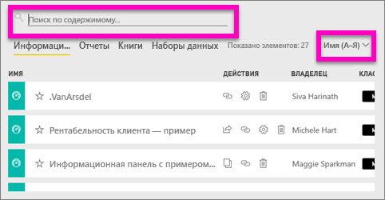
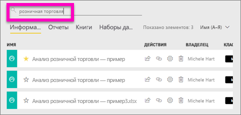
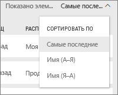
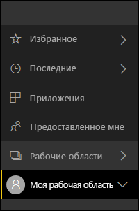
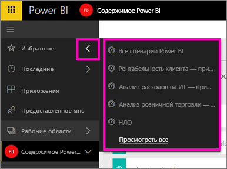

# Навигация: поиск, обнаружение и сортировка содержимого в службе Power BI
Есть множество способов навигации по содержимому в службе Power BI. Содержимое в рабочих областях распределяется по типу: панели мониторинга, отчеты, книги и наборы данных.  Кроме того, содержимое упорядочено по принципу использования: избранное, недавно просмотренное, основное, приложения и содержимое, к которому предоставлен общий доступ. Различные подходы к упорядочению содержимого позволяют быстро находить нужные данные в службе Power BI.  

>[!NOTE] 
>Сведения, приведенные в этой статье, относятся к службе Power BI (app.powerbi.com), но не к Power BI Desktop.

## Навигация по рабочим областям

В службе Power BI содержимое разделено по типам: панели мониторинга, отчеты, книги и наборы данных. При выборе рабочей области вы увидите, как оно упорядочено. В этом примере рабочая область с названием Sales and marketing app sample (Пример приложения для продаж и маркетинга) содержит 2 панели мониторинга, 6 отчетов, 1 книгу и 5 наборов данных.

________________________________________

## Поиск и сортировка содержимого в рабочих областях
В рабочей области находятся четыре вкладки содержимого: "Информационные панели", "Отчеты", "Книги" и "Наборы данных".  Каждая из этих вкладок содержит поле поиска и кнопку сортировки.  Если вы только начали работать со службой Power BI, это может вам не пригодиться, так как на вкладке будет расположен один или два элемента.  Но со временем список содержимого может стать значительно большим.  Элементы поиска и сортировки значительно упростят поиск необходимого содержимого.

* Введите условие поиска, чтобы найти соответствия, которые отобразятся в следующем окне:
  
   
* Нажмите кнопку сортировки, чтобы отобразить варианты для текущей страницы. Эти варианты можно отсортировать по имени и владельцу.
  
   

## Навигация с помощью панели навигации слева
На панели навигации слева представлено классифицированное содержимое. Это обеспечивает простой и быстрый поиск нужных данных.  

Содержимое, созданное для собственного пользования, доступно в области **Моя рабочая область**, содержимое для совместного создания и использования с группой — в рабочей области **Приложения**, содержимое, к которому вам предоставили доступ, находится в области **Мне предоставлен доступ**, а последнее просмотренное содержимое отображается в области **Последние**.

Кроме того, можно отметить содержимое как [избранное](service-dashboard-favorite.md) и [основное](service-dashboard-featured.md). Чтобы упорядочить содержимое, одну из панелей мониторинга, которую вы просматриваете чаще всего, можно сделать *основной*. При каждом открытии службы Power BI сначала будет отображаться эта информационная панель. У вас есть часто используемые информационные панели и приложения? Если вы настроите их как избранные, они всегда будут отображаться на панели навигации слева.

.

## Рекомендации и устранение неполадок
* В наборах данных **сортировка** по владельцу не поддерживается.

## Дальнейшие действия
[Power BI — основные понятия](service-basic-concepts.md)

Появились дополнительные вопросы? [Ответы на них см. в сообществе Power BI.](http://community.powerbi.com/)