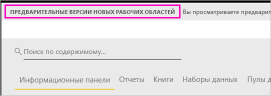

# Организация работы в новых рабочих областях (предварительная версия) в Power BI

Рабочие области — это места, где вы вместе с коллегами создаете коллекции панелей мониторинга и отчетов. Затем эти коллекции можно объединять в *приложения*, которые можно распространять в рамках всей организации или передать конкретным пользователям или группам. В Power BI представлена предварительная версия нового интерфейса рабочей области. 

Возможности новой предварительной версии рабочих областей:

- Назначение ролей рабочей области для групп пользователей: группы безопасности, списки рассылки, группы Office 365 и отдельные пользователи.
- Создание рабочей области в Power BI без создания группы Office 365.
- Используйте более детализированные роли рабочих областей для более гибкого управления разрешениями в рабочей области.

Узнайте, как [создать одну из новых рабочих областей](service-create-the-new-workspaces.md).
 
При создании новой рабочей области вы не создаете соответствующую базовую группу Office 365. Все действия по администрированию рабочей области выполняются в Power BI, не в Office 365. Группы Office 365 по-прежнему можно добавлять в рабочие области, чтобы управлять доступом пользователей к содержимому с помощью групп Office 365. Но вы также можете использовать группы безопасности и списки рассылки и добавлять пользователей напрямую в Power BI для удобного управления доступом к рабочей области. Так как администрирование рабочих областей теперь выполняется в Power BI, администраторы Power BI принимают решения о том, кто в организации может создавать рабочие области. На странице **Параметры рабочей области** портала администрирования администраторы могут разрешить или запретить всем пользователям в организации создавать рабочие области. Они также могут разрешить их создание только участникам определенных групп безопасности.

См. дополнительные сведения о [портале администрирования Power BI](service-admin-portal.md).

## Развертывание новых рабочих областей

На этапе предварительной версии старые и новые рабочие области могут сосуществовать, и вы можете создать любой вариант. Когда новые рабочие области будут выпущены в качестве общедоступной версии, старые рабочие области по-прежнему будут существовать некоторое время. Вы не сможете их создавать, и вам необходимо подготовиться к переносу рабочих областей в новую инфраструктуру рабочих областей. Не волнуйтесь, у вас будет несколько месяцев на перенос.

## Роли в новых рабочих областях

В новые рабочие области группы и отдельных пользователей можно добавлять как членов, участников или администраторов. Каждый из пользователей в группе получает определенную вами роль. Если пользователь входит в несколько групп пользователей, он получает наивысший уровень разрешений, предоставляемых ролью.  См. объяснение разных ролей в разделе [Роли в новых рабочих областях](#roles-in-the-new-workspaces) далее в этой статье.

Каждый член рабочей области должен иметь лицензию Power BI Pro. Рабочая область позволяет этим пользователям совместно работать над панелями мониторинга и отчетами, которые вы планируете опубликовать для более широкой аудитории или даже для всей организации. Если вы хотите распространить содержимое для других пользователей в вашей организации, можно назначить им лицензии Power BI Pro или поместить рабочую область в емкость Power BI Premium.

Роли позволяют управлять разрешениями в рабочих областях для удобной совместной работы. В новых рабочих областях можно назначать роли пользователям и группам пользователей: группам безопасности, группам Office 365 и спискам рассылки. 

При назначении ролей группе пользователей у всех пользователей в группе будет доступ к содержимому. Если группа пользователей имеет вложения, разрешение получат все пользователи во вложенных группах. Если пользователь находится в нескольких группах пользователей с разными ролями, он получает самый высокий уровень разрешения. 

В новых рабочих областях есть три роли: администратор, член и участник.

**Администраторы могут:**

- Обновлять и удалять рабочую область. 
- Добавлять и удалять пользователей, включая других администраторов.
- Выполнять все действия, доступные членам.

**Члены могут:** 

- Добавлять членов или других пользователей с разрешениями более низкого уровня.
- Публиковать и обновлять приложение.
- Предоставлять общий доступ к элементу или приложению.
- Разрешать другим пользователям повторно предоставлять совместный доступ к элементам.
- Выполнять все действия, доступные участникам.

**Участники могут:** 

- Создавать, редактировать и удалять содержимое в рабочей области. 
- Публиковать отчеты в рабочей области, удалять содержимое.
- Не могут предоставлять новым пользователям доступ к содержимому. Не могут предоставлять совместный доступ к новому содержимому, но могут делиться с пользователями, которым уже предоставлен совместный доступ к рабочей области, элементу или приложению. 
- Не могут менять членов группы.
 
Мы создаем рабочие процессы запроса на доступ по всей службе, поэтому пользователи могут запросить доступ, если у них его нет. Рабочие процессы запроса доступа в настоящее время существуют для панелей мониторинга, отчетов и приложений.

## Преобразование старых рабочих областей в новые

На этапе предварительной версии нельзя автоматически преобразовать старые рабочие области в новые. Однако вы можете создать новую рабочую область и опубликовать содержимое в новом месте. 

Когда выйдет общедоступная версия новых рабочих областей, вы сможете включить автоматический перенос старых рабочих областей. Через некоторое время после выхода общедоступной версии вам придется перенести рабочие области.

## Часто задаваемые вопросы о приложениях Power BI

### Чем отличаются новые рабочие области от существующих?

В новых рабочих областях мы изменяем некоторые функции. Ниже описываются изменения в предварительной версии, которые будут сохранены. 

* При создании рабочих областей соответствующие сущности в Office 365 создаваться не будут, как это происходит в существующих рабочих областях. (Вы по-прежнему можете добавить группу Office 365 в рабочую область, назначив ей роль). 
* В существующих рабочих областях в список администраторов или членов можно добавлять только отдельных пользователей. В новых рабочих областях вы можете добавлять несколько групп безопасности AD, списков рассылки или групп Office 365 в эти списки для удобного управления пользователями. 
- Можно создать пакет содержимого организации в существующей рабочей области. Нельзя создать такой пакет в новых рабочих областях.
- Можно использовать пакет содержимого организации в существующей рабочей области. Нельзя использовать такой пакет в новых рабочих областях.
- На этапе предварительной версии некоторые возможности еще не включены для новых рабочих областей. Дополнительные сведения см. в следующем разделе — [Запланированные возможности новых рабочих областей](service-new-workspaces.md#planned-new-workspace-preview-features).

## Запланированные возможности предварительной версии новых рабочих областей

Некоторые возможности предварительной версии новых рабочих областей по-прежнему разрабатываются, но пока не доступны при запуске предварительной версии.

- Нет кнопки **Выход из рабочей области**.
- Метрики использования пока не поддерживаются.
- Как работает уровень Premium: вы можете назначать и создавать рабочие области в емкости Premium, но для перемещения рабочей области между емкостями перейдите к параметрам рабочей области.
- Внедрение веб-части SharePoint пока не поддерживается.
- Нет кнопки **OneDrive** для групп Office 365 в разделе получения данных и файлов.

## Функции рабочих областей, которые работают иначе

Некоторые функции работают по-разному в существующих и новых рабочих областях. Эти отличия являются намеренными, основаны на отзывах от клиентов и предоставляют более универсальный подход к совместной работе в рабочих областях.

- Члены, которым можно или нельзя повторно делиться: заменено ролью участника.
- Рабочие области только для чтения: вместо предоставления пользователям доступа к рабочей области только для чтения вы сможете назначать пользователям готовящуюся к выходу роль читателя с аналогичными правами на чтение содержимого в рабочей области.

## Известные проблемы

Так как это предварительная версия функции, существуют некоторые ограничения. Ниже перечислены известные проблемы, исправления находятся в стадии разработки.

- Пользователи или группы пользователей с бесплатной лицензией, добавленные в качестве получателей в подписке на сообщения, могут не получать сообщения, хотя должны. Эта проблема возникает, если одна из новых рабочих областей находится в емкости Premium, но "Моя рабочая область" создающего подписку пользователя в такую емкость не входит. Если "Моя рабочая область" находится в емкости Premium, пользователи и группы пользователей с бесплатной лицензией будут получать сообщения.
- После перемещения рабочей области из емкости Premium в общую емкость в некоторых случаях пользователи и группы пользователей с бесплатной лицензией будут продолжать получать сообщения, хотя не должны. Эта проблема возникает, когда "Моя рабочая область" подписавшегося пользователя находится в емкости Premium.

## Дальнейшие действия
* [Создание рабочих областей (предварительная версия) в Power BI](service-create-the-new-workspaces.md)
* [Создание текущих рабочих областей](service-create-workspaces.md)
* [Установка и использование приложений с информационными панелями и отчетами в Power BI](service-create-distribute-apps.md)
* У вас появились вопросы? [Попробуйте задать вопрос в сообществе Power BI.](http://community.powerbi.com/)
