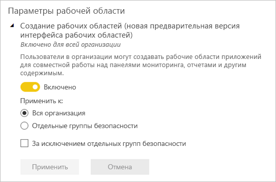

# Организация работы в новых рабочих областях в Power BI

 *Рабочие области* — это места, где вы вместе с коллегами создаете коллекции панелей мониторинга, отчетов и отчетов с разбивкой на страницы. Новая рабочая область помогает вам лучше управлять доступом к содержимому. В этой статье описываются новые рабочие области и их отличие от классических рабочих областей.  Как и в случае с классическими рабочими областями, вы по-прежнему используете их для создания и распространения приложений. Узнайте, как [создать интерфейс новой рабочей области](service-create-the-new-workspaces.md).

Новая версия рабочих областей теперь общедоступна. Эта версия является рабочей областью по умолчанию. Вы по-прежнему можете создавать и использовать [классические рабочие области](service-create-workspaces.md) на основе групп Office 365. 

> [!NOTE]
> Чтобы обеспечить безопасность на уровне строк для пользователей, просматривающих содержимое в рабочей области, используйте роль зрителя. Чтобы применять параметры безопасности на уровне строк (RLS), не предоставляя доступ к рабочей области, опубликуйте приложение Power BI для этих пользователей или используйте возможности общего доступа для распространения содержимого.

Возможности новой версии рабочих областей:

- Назначение ролей рабочей области для групп пользователей: группы безопасности, списки рассылки, группы Office 365 и отдельные пользователи.
- Создание рабочей области в Power BI без создания группы Office 365.
- Используйте более детализированные роли рабочих областей для более гибкого управления разрешениями в рабочей области.
- Администратор Power BI может контролировать тех, кто может создавать рабочие области в Power BI.

При создании новой рабочей области вы не создаете соответствующую базовую группу Office 365. Все действия по администрированию рабочей области выполняются в Power BI, не в Office 365. Теперь вы можете добавить группу Office 365 в список доступа к новой рабочей области, чтобы управлять доступом пользователей к содержимому с помощью групп Office 365.

## Администрирование новых рабочих областей
Так как администрирование новых рабочих областей выполняется в Power BI, администраторы Power BI принимают решения о том, кто в организации может создавать рабочие области. Они также могут управлять рабочими областями и восстанавливать их с помощью портала администрирования Power BI или командлетов PowerShell. Для классических рабочих областей на основе групп Office 365 администрирование по-прежнему выполняется на портале администрирования Office 365 и в Azure Active Directory.

В **настройках рабочей области** на портале администратора можно использовать параметр Create workspaces (new workspace experience) (Создание рабочих областей (новая версия интерфейса рабочих областей)), чтобы позволить или запретить всем в организации создавать рабочие области новой версии. Они также могут разрешить их создание только участникам определенных групп безопасности.

> [!NOTE]
> По умолчанию параметр Create workspaces (new workspace experience) (Создание рабочих областей (новая версия интерфейса рабочих областей)) разрешает создавать новые рабочие области в Power BI только тем пользователям, которые могут создавать группы Office 365. Обязательно установите на портале администрирования Power BI значение, позволяющее соответствующим пользователям создавать рабочие области новой версии.

Список [рабочих областей доступен](service-admin-portal.md#workspaces) на портале администрирования Power BI. 

## Новые рабочие области сосуществуют с классическими рабочими областями

Новые модернизированные рабочие области и существующие классические рабочие области могут сосуществовать, и вы можете создавать любые из них. Новая версия интерфейса рабочих областей является типом рабочей области по умолчанию. Во избежание изменения существующих рабочих процессов в Power BI по-прежнему выводятся все группы Office 365, участником которых является пользователь Power BI. Сведения о создании рабочей области новой версии в Power BI см. в [этой статье](service-create-the-new-workspaces.md). Сведения о создании классической рабочей области в Power BI см. в [этой статье](service-create-workspaces.md).

## Роли в новых рабочих областях

Чтобы предоставить доступ к новой рабочей области, добавьте группы пользователей или отдельных лиц к одной из ролей рабочей области: зрители, члены, участники или администраторы. Каждый из пользователей в группе получает определенную вами роль. Если пользователь входит в несколько групп пользователей, он получает наивысший уровень разрешений, предоставляемых назначенной ему ролью.

Роли позволяют управлять разрешениями в рабочих областях для удобной совместной работы. В новых рабочих областях можно назначать роли пользователям и группам пользователей: группам безопасности, группам Office 365 и спискам рассылки. 

При назначении ролей группе пользователей у всех пользователей в группе будет доступ к содержимому. Если группа пользователей имеет вложения, разрешение получат все пользователи во вложенных группах.

Ниже перечислены возможности четырех ролей: администраторов, членов, участников и зрителей. Для использования всех этих возможностей, за исключением просмотра и взаимодействия, требуется лицензия Power BI Pro.

|Возможность   | Администратор  | Участник  | Участник  | Зритель |
|---|---|---|---|---|
| Обновлять и удалять рабочую область.  | X  |   |   |   | 
| Добавлять и удалять пользователей, включая других администраторов.  | X  |   |   |   |
| Добавлять членов или других пользователей с разрешениями более низкого уровня.  |  X | X  |   |   |
| Публиковать и обновлять приложение. |  X | X  |   |   |
| Предоставлять общий доступ к элементу или приложению. |  X | X  |   |   |
| Разрешать другим пользователям повторно предоставлять совместный доступ к элементам. |  X | X  |   |   |
| Создавать, редактировать и удалять содержимое в рабочей области.  |  X | X  | X  |   |
| Публиковать отчеты в рабочей области, удалять содержимое.  |  X | X  | X  |   |
| Создавать в другой рабочей области отчет на основе набора данных из текущей области1. |  X | X  | X  |   |
| Копировать отчет1. | X | X | X |  |
| Просматривать элемент и взаимодействовать с ним2. |  X | X  | X  | X  |

1. Чтобы скопировать отчет или создать в другой рабочей области новый отчет, основанный на наборе данных из текущей области, пользователь должен соответствовать дополнительным критериям:
    - Необходима лицензия Power BI Pro. Дополнительные сведения см. в следующем разделе: [Лицензирование](#licensing).
    - Необходимо разрешение на сборку для набора данных. В отношении наборов данных из этой рабочей области пользователи с ролями администратора, члена или участника получают разрешения на сборку в рамках роли рабочей области.
2. Даже если у вас нет лицензии Power BI Pro, вы можете просматривать элементы и взаимодействовать с ними в службе Power BI, если они находятся в рабочей области в емкости Premium.

## Лицензирование
Каждый член, добавляемый к рабочей области в общей емкости, должен иметь лицензию Power BI Pro. Рабочая область позволяет этим пользователям совместно работать над панелями мониторинга и отчетами, которые вы планируете опубликовать для более широкой аудитории или даже для всей организации. 

Если вы хотите распространить содержимое для других пользователей в вашей организации, можно назначить им лицензии Power BI Pro или поместить рабочую область в емкость Power BI Premium.

Если рабочая область находится в емкости Premium Power BI, пользователи с ролью зрителя могут получить доступ к области, даже если у них нет лицензии Power BI Pro. Однако если вы назначите этим пользователям более высокую роль, например администратора, члена или участника, при попытке доступа к рабочей области им будет предложено запустить бесплатную пробную версию Pro. Чтобы использовать возможности роли зрителя для пользователей без лицензий Pro, убедитесь, что пользователи с этой ролью не находятся в других ролях рабочей области ни по отдельности, ни в группе пользователей. 

> [!NOTE]
> Публикация отчетов в новом интерфейсе рабочей области требует более строгого соблюдения существующих правил лицензирования. Пользователи, которые пытаются публиковать из Power BI Desktop или других клиентских средств без лицензии Pro, получают ошибку "Публикация в этой рабочей области доступна только пользователям с лицензиями Power BI Pro".

## Чем отличаются новые рабочие области

В новых рабочих областях мы изменили некоторые функции. Ниже приведены изменения, которые будут сохранены. 

* Создание этих рабочих областей не приводит к созданию групп Office 365, как это происходит с классическими рабочими областями. Однако теперь вы можете использовать группу Office 365, чтобы предоставить пользователям доступ к вашей рабочей области, назначив ему роль. 
* В классических рабочих областях в список администраторов или членов можно добавлять только отдельных пользователей. В новых рабочих областях вы можете добавлять несколько групп безопасности AD, списков рассылки или групп Office 365 в эти списки для удобного управления пользователями. 
- Вы можете создать пакет содержимого организации в классической рабочей области. Нельзя создать такой пакет в новых рабочих областях.
- Вы можете использовать пакет содержимого организации из классической рабочей области. Нельзя использовать такой пакет в новых рабочих областях.

## Список контактов рабочей области
Новая функция **Список контактов** позволяет указать, какие пользователи будут получать уведомления о проблемах, возникающих в рабочей области. По умолчанию уведомление отправляется любому пользователю или группе, указанным в качестве администратора рабочей области, но вы можете настроить список. Пользователи или группы, перечисленные в списке контактов, будут отображаться в пользовательском интерфейсе, чтобы пользователи могли обратиться к ним за помощью, связанной с рабочей областью. 

Дополнительные сведения см. в разделе [Workspace contact list](service-create-the-new-workspaces.md#workspace-contact-list) (Список контактов в рабочей области).

## OneDrive для рабочей области
Функция OneDrive для рабочей области позволяет настроить группу Office 365, хранилище файлов библиотеки документов SharePoint которой доступно для пользователей рабочей области. Группу необходимо создавать вне Power BI. 

Power BI не синхронизирует разрешения пользователей или групп, для которых настроен доступ к рабочей области с членством в группе Office 365. Рекомендуется управлять доступом к рабочей области через ту же группу Office 365, хранилище файлов которой вы настраиваете в этом параметре. 

Узнайте, как [настроить и получить доступ к OneDrive для рабочей области](service-create-the-new-workspaces.md#workspace-onedrive).  
   
## Аудит
Power BI проверяет следующие действия на наличие рабочих областей новой версии.

| Понятное имя |   Имя операции |
|---|---|
| Создана папка Power BI | CreateFolder |
| Удалена папка Power BI | DeleteFolder |
| Обновлена папка Power BI | UpdateFolder |
| Обновлен доступ к папке Power BI| UpdateFolderAccess |

Дополнительные сведения [об аудите в Power BI](service-admin-auditing.md#activities-audited-by-power-bi).

## Рекомендации и ограничения

Учитывайте следующие ограничения:

- Рабочие области могут содержать не более 1000 наборов данных или 1000 отчетов на набор данных. 
- Пользователь с лицензией Power BI Pro может быть членом не более 1000 рабочих областей.
- Издатель Power BI для Excel не поддерживается.

## Функции рабочих областей, которые работают иначе

Некоторые функции работают по-разному в существующих и новых рабочих областях. Эти отличия являются намеренными. Они основаны на отзывах от клиентов и предоставляют более универсальный подход к совместной работе в рабочих областях.

- Применение лицензирования. Публикация отчетов в новой рабочей области обеспечивает соблюдение существующих правил лицензирования, которые требуют лицензию Power BI Pro для пользователей, совместно работающих в рабочих областях или предоставляющих общий доступ к содержимому другим в службе Power BI. Пользователи без лицензии Pro увидят ошибку "Публикация в этой рабочей области доступна только пользователям с лицензиями Power BI Pro".
- Члены, которым можно или нельзя повторно делиться: заменено ролью участника.
- Рабочие области только для чтения: Вместо предоставления пользователям доступа к рабочей области только для чтения вы сможете назначать пользователям роль зрителя с аналогичными правами на чтение содержимого в рабочей области.
- Если рабочая область находится в емкости Premium Power BI, пользователи без лицензии Pro могут получить доступ к этой области, даже находясь в роли зрителя.
- Чтобы разрешить пользователям с ролью зрителя экспортировать данные, назначьте им разрешение на сборку для наборов данных в рабочей области. Дополнительные сведения о [разрешении на сборку для наборов данных](service-datasets-build-permissions.md).
- Нет кнопки **Выход из рабочей области**.

## Часто задаваемые вопросы

**Новая общедоступная версия рабочих областей влияет на ссылки на существующее содержимое?**

Нет. Новые рабочие области не влияют на ссылки на существующие элементы в классических рабочих областях. Общая доступность новой рабочей области изменяет созданную вами рабочую область по умолчанию, но не изменяет существующие рабочие области. 

**Обновлен ли интерфейс существующих рабочих областей до нового интерфейса общедоступной версии?**

Нет. Общедоступная версия нового интерфейса рабочих областей изменяет только тип рабочей области по умолчанию (им становится рабочая область новой версии). Имеющиеся классические рабочие области на основе групп Office 365 остаются без изменений.

**Рабочие области по-прежнему автоматически создаются для групп Office 365?**

Да. Так как мы поддерживаем оба типа рабочих областей с параллельным сосуществованием, мы продолжаем указывать в списке рабочих областей все группы Office 365, к которым у пользователя есть доступ.

## Дальнейшие действия
* [Create the new workspaces in Power BI](service-create-the-new-workspaces.md) (Создание рабочих областей новой версии в Power BI)
* [Create classic workspaces in Power BI](service-create-workspaces.md) (Создание классических рабочих областей в Power BI)
* [Установка и использование приложений с информационными панелями и отчетами в Power BI](service-create-distribute-apps.md)
* У вас появились вопросы? [Попробуйте задать вопрос в сообществе Power BI.](https://community.powerbi.com/)
