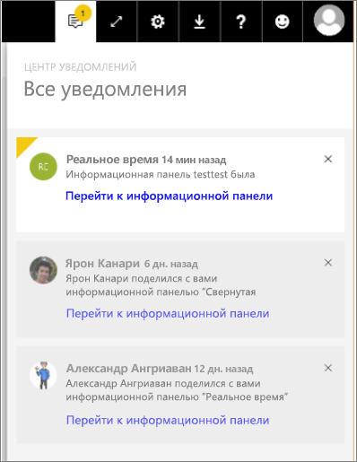

# Уведомления в Power BI
Центр уведомлений — это канал непрерывной передачи информации, связанной с работой Power BI. С его помощью можно просматривать сообщения о новых панелях мониторинга, к которым вам предоставлен доступ, об изменениях в вашем групповом пространстве, сведения о мероприятиях и встречах, связанных с Power BI, настроенные оповещения и многое другое. [Оповещения можно настраивать в службе Power BI](service-set-data-alerts.md) и мобильных приложениях Power BI.

В следующем видео Аманда просматривает полученные уведомления, управляет ими и реагирует на них. Сделайте то же самое, выполнив приведенные ниже инструкции.

<iframe width="560" height="315" src="https://www.youtube.com/embed/bZMSv5KAlcE" frameborder="0" allowfullscreen></iframe>

1. При входе в Power BI новые уведомления, отправленные вам в ходе автономной работы, добавляются в ваш веб-канал. При наличии новых уведомлений в Power BI отображается желтый пузырек с количеством новых сообщений.
   
   
2. В строке меню Power BI выберите значок уведомлений.
   
   
3. Новые уведомления отображаются вверху списка, а непрочитанные сообщения выделяются. Уведомления хранятся в течение 90 дней, если вы их не удалите раньше или их количество не достигнет максимума (100 штук).
   
   
4. Чтобы закрыть уведомление, нажмите значок "X".

### Дальнейшие действия
* [Оповещения о данных в службе Power BI](service-set-data-alerts.md)
* [Create a Microsoft Flow that is triggered by a Power BI data alert](service-flow-integration.md) (Создание последовательности Microsoft Flow, которая активируется оповещением о данных Power BI)
* [Настройка оповещений о данных в приложении Power BI для iOS на устройствах iPhone и iPad](mobile-set-data-alerts-in-the-mobile-apps.md)
* [Настройка оповещений о данных в мобильном приложении Power BI для Windows 10](mobile-set-data-alerts-in-the-mobile-apps.md)
* Появились дополнительные вопросы? [Ответы на них см. в сообществе Power BI.](http://community.powerbi.com/)

