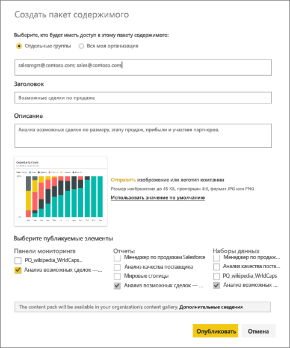
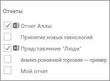
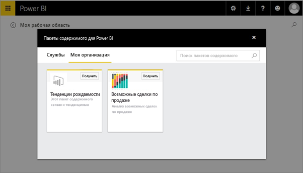

# Руководство. Создание и публикация пакета содержимого организации в Power BI

В этом руководстве вы создадите пакет содержимого организации, предоставите доступ к нему определенной группе и опубликуете его в библиотеке пакетов содержимого своей организации в Power BI.

Создание пакетов содержимого отличается от предоставления общего доступа к информационным панелям и от совместной работы над ними в группе. Чтобы определить наилучшее решение в вашей ситуации, ознакомьтесь со статьей [Способы совместного использования работы в Power BI](service-how-to-collaborate-distribute-dashboards-reports.md).

Создание пакета контента организации требует, чтобы у вас и ваших коллег была [учетная запись Power BI Pro](https://powerbi.microsoft.com/pricing).

> [!NOTE]
> Нельзя создавать или устанавливать пакеты содержимого организации в новом интерфейсе рабочей области. Сейчас самое время обновить пакеты содержимого для приложений, если вы еще этого не сделали. Узнайте [больше о новом интерфейсе рабочей области](service-create-the-new-workspaces.md).

## Создание и публикация пакета содержимого

Предположим, вы менеджер по выпускам в компании Contoso и готовитесь к запуску нового продукта.  Вы создали панель мониторинга и отчеты, которыми хотели бы поделиться. Другие сотрудники, управляющие запуском, могут найти их полезными. Вам нужно сделать панель мониторинга и отчеты решением, которым смогут пользоваться ваши коллеги.

Хотите попробовать? В [службе Power BI](https://powerbi.com) перейдите в раздел **Моя рабочая область**. Затем выберите **Получить данные** > **Примеры** > **Анализ возможностей — пример** > **Подключение** для получения собственной копии.

1. В области навигации щелкните **Рабочие области** > **Моя рабочая область**.

1. В области навигации сверху щелкните значок шестеренки . > **Создайте пакет содержимого**.

   

1. В окне **Создание пакета содержимого** введите следующие сведения.  

   Помните, что библиотека пакетов содержимого организации может заполняться очень быстро. В ней могут оказаться сотни пакетов, опубликованных для использования в организации или группах. Выделите время, чтобы присвоить пакету содержимого понятное имя, добавить хорошее описание и выбрать правильную аудиторию.  Используйте слова, которые облегчат поиск пакета. Это позволит упростить дальнейший поиск.

      

    1. Выберите **Отдельные группы**.

    1. Введите адреса электронной почты сотрудников, [групп Office 365](https://support.office.com/article/Create-a-group-in-Office-365-7124dc4c-1de9-40d4-b096-e8add19209e9), групп рассылки или групп безопасности. Например: salesmgrs@contoso.com; sales@contoso.com

        В этом учебнике используйте адрес электронной почты своей группы.

    1. Присвойте пакету контента имя *Возможности продаж*.

        > [!TIP]
        > Имя панели мониторинга можно добавить в имя пакета содержимого. В этом случае вашим коллегам будет легче найти панель мониторинга после того, как они подключатся к пакету содержимого.

    1. Рекомендуется: Добавьте описание. Оно позволит вашим сотрудникам легко найти нужный пакет содержимого. Помимо описания добавьте ключевые слова, которые ваши коллеги могут использовать для поиска этого пакета содержимого. Наконец, включите контактную информацию, которая потребуется, если у ваших коллег возникнут вопросы или им понадобится ваша помощь.

    1. Отправьте изображение или эмблему, чтобы облегчить поиск пакета содержимого членами группы.

        Проще найти изображение, чем искать текст. На снимке экрана изображена плитка гистограммы **Число возможных сделок**.

    1. Щелкните панель мониторинга **Анализ возможностей — пример** , чтобы добавить его в пакет контента.

        Power BI автоматически добавит связанный отчет и набор данных. При необходимости можно добавить другие отчеты и наборы данных.

       > [!NOTE]
       > Power BI перечисляет только панели мониторинга, отчеты, наборы данных и книги, которые вы можете изменять. Поэтому в приложении отсутствуют панели мониторинга и отчеты, к которым вам был предоставлен общий доступ.

   1. При наличии книг Excel они отображаются в области **Отчеты** со значком Excel. Их также можно добавить в пакет содержимого.

      

      > [!NOTE]
      > Если члены группы не могут просмотреть книгу Excel, возможно, вам потребуется [опубликовать для них эту книгу в OneDrive для бизнеса](https://support.office.com/article/Share-documents-or-folders-in-Office-365-1fe37332-0f9a-4719-970e-d2578da4941c).

1. Нажмите кнопку **Опубликовать** для добавления пакета контента в библиотеку пакетов контента организации для группы.  

   При успешной публикации появится сообщение об успешном выполнении.

1. Когда члены группы выберут **Получить данные** > **Пакеты содержимого организации**, они увидят ваш пакет содержимого.

   

   > [!TIP]
   > URL-адрес, отображаемый в браузере, — это уникальный адрес для данного пакета содержимого.  Хотите сообщить об этом новом пакете контента вашим коллегам?  Вставьте URL-адрес в сообщение электронной почты.

1. Когда члены группы выберут **Подключить**, они смогут [просматривать ваш пакет содержимого и работать с ним](service-organizational-content-pack-copy-refresh-access.md).

## Дальнейшие действия

* [Знакомство с пакетами содержимого организации в Power BI](service-organizational-content-pack-introduction.md).

* [Управление пакетами содержимого организации, их обновление и удаление](service-organizational-content-pack-manage-update-delete.md).

* [Публикация приложения в Power BI](service-create-distribute-apps.md).

* [Что такое OneDrive для бизнеса?](https://support.office.com/article/What-is-OneDrive-for-Business-187f90af-056f-47c0-9656-cc0ddca7fdc2)

* Появились дополнительные вопросы? [Ответы на них см. в сообществе Power BI.](https://community.powerbi.com/)
