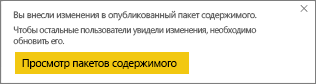

# Управление пакетами содержимого организации, их обновление и удаление
> [!NOTE]
> Слышали о новых *приложениях*? Приложения — это новый способ предоставления содержимого для большого количества пользователей в Power BI. Мы советуем использовать их вместо пакетов содержимого организации или рабочих областей с доступом только для чтения. Дополнительные сведения о приложениях см. [здесь](service-install-use-apps.md).
> 
> 

Вы можете упаковать панели мониторинга, отчеты, книги Excel и наборы данных и поделиться ими со своими коллегами как [пакетами содержимого организации](service-organizational-content-pack-introduction.md). Ваши коллеги могут использовать их как есть или создать собственные копии.

Создание пакетов содержимого отличается от предоставления общего доступа к информационным панелям и от совместной работы над ними в группе. Чтобы выбрать оптимальный вариант для вашей ситуации, см. статью [Как предоставить общий доступ к панелям мониторинга, отчетам и плиткам?](service-how-to-collaborate-distribute-dashboards-reports.md)

Вы можете выполнять некоторые задачи для пакетов содержимого организации, только если являетесь автором пакета содержимого:

* повторная публикация;
* ограничение или расширение доступа к пакету содержимого;
* настройка и изменение запланированного обновления;
* удаление пакета содержимого.

## Изменение и повторная публикация пакета содержимого организации
Если вы внесете изменения в информационную панель исходного пакета содержимого или книгу Excel, Power BI предложит выполнить повторную публикацию. Кроме того, автор пакета содержимого может обновить любые параметры, выбранные в окне создания пакета содержимого во время создания исходного пакета. 

## Повторная публикация с новым содержимым
Когда вы вносите изменения в панель мониторинга, включенную в пакет содержимого, и сохраняете их, Power BI напоминает о необходимости обновить панель, чтобы другие пользователи могли увидеть эти изменения. Например, обновление требуется при закреплении новой плитки или при изменении имени панели мониторинга.

1. Щелкните ссылку **Просмотр пакетов содержимого** в сообщении.
   
   
2. Или щелкните значок шестеренки в правом верхнем углу  и выберите команду **Просмотреть пакет содержимого**.
   
   
   
   Обратите внимание на значок предупреждения .  Он уведомляет вас о том, что пакет содержимого изменен тем или иным образом и больше не соответствует опубликованному пакету.
3. Выберите **Изменить**.  
4. Внесите необходимые изменения в окне **Обновить пакет содержимого** и выберите **Обновить**. Появится сообщение об **успешном выполнении** .
   
   * Если член группы не настроил пакет содержимого, обновление применяется автоматически.
   * Если член группы настроил пакет содержимого, он получит уведомление о наличии новой версии.  Он может перейти в AppSource и получить обновленный пакет содержимого без потери своей персонализированной версии.  Теперь у него есть две версии: персонализированная версия и обновленный пакет содержимого.  В персонализированной версии все плитки из исходного пакета содержимого будут удалены.  Однако плитки, закрепленные из других отчетов, будут по-прежнему отображаться.    

## Обновление аудитории: расширение или ограничение доступа
Еще одним доступным изменением для авторов пакетов содержимого является расширение и ограничение доступа к пакету.  Предположим, что вы опубликовали пакет содержимого для широкой аудитории и вас попросили сузить доступ до одной группы.  

1. Щелкните значок шестеренки  и выберите **Показать пакеты содержимого**.
2. Выберите **Изменить**. 
3. Внесите необходимые изменения в окне **Обновить пакет содержимого** и выберите **Обновить**. Например, удалите исходную группу рассылки в поле **Отдельные группы** и замените ее другой группой рассылки (с меньшим числом членов).
   
   Появится сообщение об успешном выполнении.
   
   Для сотрудников, которые не входят в новый псевдоним, будут выполнены следующие условия.
   
   * Если член этой группы не настраивал пакет содержимого, обновление будет применено автоматически и информационные панели и отчеты, связанные с этим пакетом содержимого, станут недоступными (и пакет содержимого не будет отображаться в области навигации).
   * Если член группы уже изменил пакет содержимого, в следующий раз, когда он откроет настроенную информационную панель, все плитки из исходного пакета содержимого будут удалены.  Однако плитки, закрепленные из других отчетов, будут по-прежнему отображаться. Отчеты и наборы данных исходного пакета содержимого станут недоступны (и пакет содержимого перестанет отображаться в области навигации).   

## Обновление пакета содержимого организации
Автор пакета содержимого организации может [запланировать обновление набора данных](refresh-data.md).  При создании и отправке пакета содержимого расписание обновления передается вместе с наборами данных. Если изменить расписание обновления, потребуется повторно опубликовать пакет содержимого (см. выше).

## Удаление пакета содержимого организации из AppSource
Вы можете удалить пакет содержимого из AppSource, только если создали его. 

> [!TIP]
> Вы можете [удалить свое подключение к пакету содержимого](service-organizational-content-pack-disconnect.md), который был создан не вами. При этом такой пакет содержимого не удаляется из AppSource.
> 
> 

1. Чтобы удалить пакет содержимого из AppSource, перейдите в рабочую область приложения, где он был создан, нажмите значок шестеренки  и выберите **Просмотр пакетов содержимого**.
2. Последовательно выберите **Удалить \> Удалить**. 
   
   * Если член группы не настроил пакет содержимого, информационные панели и отчеты, связанные с этим пакетом содержимого, будут автоматически удалены. Они станут недоступны (и пакет содержимого перестанет отображаться в области навигации).
   * Если член группы уже изменил пакет содержимого, в следующий раз, когда он откроет настроенную информационную панель, все плитки из исходного пакета содержимого будут удалены.  Однако плитки, закрепленные из других отчетов, будут по-прежнему отображаться. Отчеты и наборы данных исходного пакета содержимого станут недоступны (и пакет содержимого перестанет отображаться в области навигации).   

## Дальнейшие действия
* [Знакомство с пакетами содержимого организации](service-organizational-content-pack-introduction.md)
* [Создание и распространение приложения в Power BI](service-create-distribute-apps.md) 
* Появились дополнительные вопросы? [Ответы на них см. в сообществе Power BI.](http://community.powerbi.com/)

