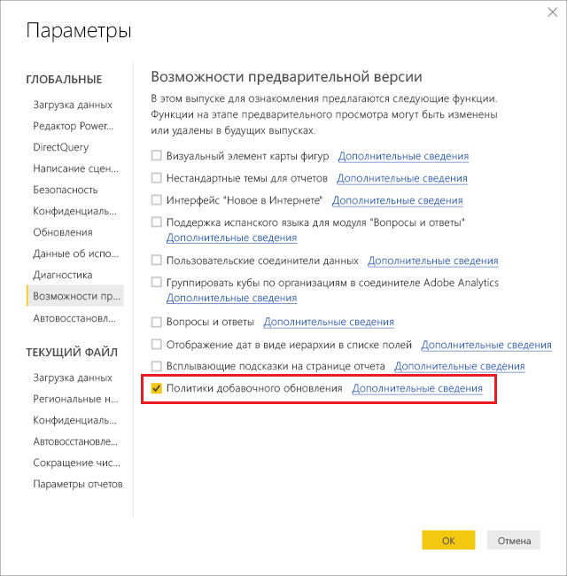
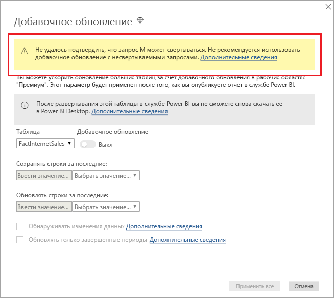
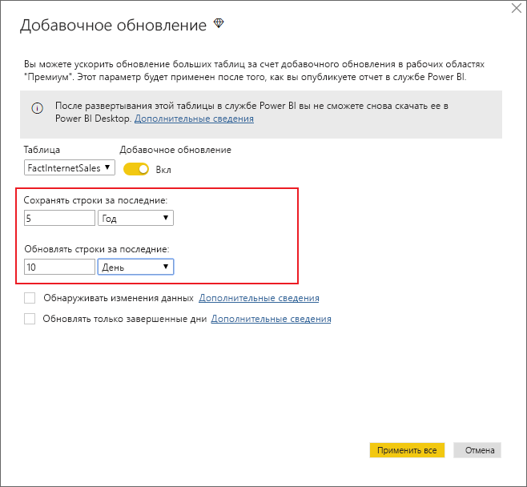
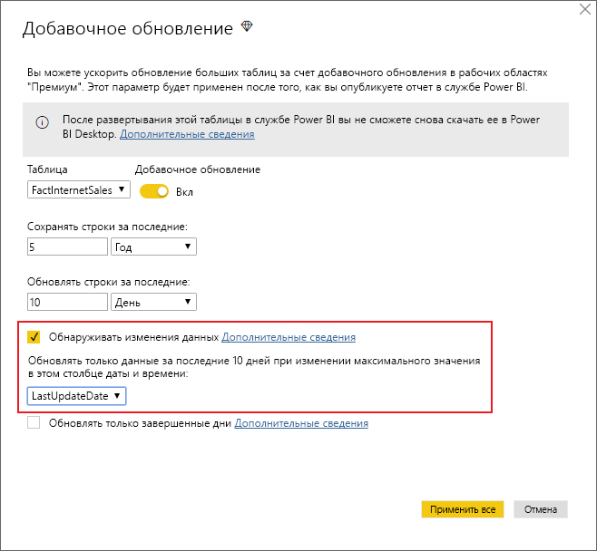
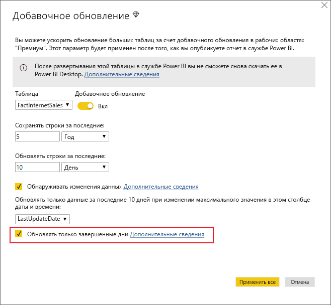
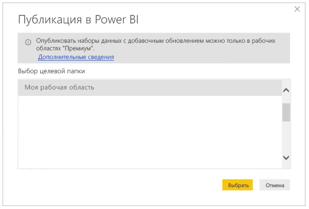

# <a name="incremental-refresh-in-power-bi-premium"></a>Добавочное обновление в Power BI Premium

Добавочное обновление дает указанные ниже преимущества при работе с очень большими наборами данных в службе Power BI Premium.

- **Обновление происходит быстрее** — обновлять нужно только те данные, которые изменились. Например, в наборе данных за 10 лет могут обновляться данные только за последние пять дней.

- **Обновления становятся надежнее** — нет необходимости надолго подключаться к нестабильным исходным системам.

- **Снижается потребление ресурсов** — так как обновлять требуется меньше данных, сокращается общее потребление памяти и других ресурсов.

## <a name="configure-incremental-refresh"></a>Настройка добавочного обновления

Политики добавочного обновления определяются в Power BI Desktop и применяются при публикации в службе Power BI.

Сначала включите добавочное обновление в **функциях предварительной версии**.



### <a name="filter-large-datasets-in-power-bi-desktop"></a>Фильтрация больших наборов данных в Power BI Desktop

Большие наборы данных, насчитывающие миллиарды строк, могут не помещаться в модель Power BI Desktop, так как возможности PBIX-файла обычно ограничены ресурсами памяти, имеющимися на компьютере. Поэтому, как правило, они фильтруются при импорте. Этот тип фильтрации применяется независимо от того, используется ли добавочное обновление. Для добавочного обновления можно выполнить фильтрацию с помощью параметров даты и времени Power Query.

#### <a name="rangestart-and-rangeend-parameters"></a>Параметры RangeStart и RangeEnd

При использовании добавочного обновления наборы данных фильтруются с помощью параметров даты и времени Power Query с зарезервированными именами **RangeStart** и **RangeEnd**, в которых учитывается регистр. Эти параметры используются для фильтрации данных, импортируемых в Power BI Desktop, а также для динамического секционирования данных на диапазоны после публикации в службе Power BI. Значения параметров подставляются службой для фильтрации для каждой секции. После публикации значения параметров переопределяются автоматически службой Power BI. Задавать их в параметрах набора данных службы не нужно. После публикации значения параметров переопределяются автоматически службой Power BI. 

Чтобы задать для параметров значения по умолчанию, в редакторе Power Query нажмите кнопку **Управление параметрами**.


Определив параметры, можно применить фильтр. Для этого выберите пункт меню **Пользовательский фильтр** для столбца.


Отфильтруйте строки, в которых значение столбца *позже или одновременно* **RangeStart** и *ранее* **RangeEnd**.


> [!TIP]
> Хотя параметры должны иметь тип данных "дата и время", их можно преобразовать в соответствии с требованиями источника данных. Например, приведенная ниже функция Power Query преобразует значение даты и времени в целочисленный суррогатный ключ в формате *ггггммдд*, типичном для хранилищ данных. Эту функцию можно вызывать на этапе фильтрации.
>
> `(x as datetime) => Date.Year(x)*10000 + Date.Month(x)*100 + Date.Day(x)`

В редакторе Power Query нажмите кнопку **Закрыть и применить**. В Power BI Desktop должно появиться подмножество набора данных.

#### <a name="filter-date-column-updates"></a>Обновление фильтра столбцов даты

Фильтр столбцов даты используется для динамического секционирования данных на диапазоны в службе Power BI. Добавочное обновление не поддерживает случаи, когда отфильтрованный столбец даты обновляется в исходной системе. Обновление будет интерпретировано как вставка и удаление (а не как фактическое обновление). Если произошло удаление в диапазоне архива, а не добавочного обновления, данные не будут извлекаться. Это может привести к сбоям обновления данных, возникающим из-за конфликтов ключа и секции.

#### <a name="query-folding"></a>Свертывание запроса

Важно, чтобы на момент отправки запросов для операций обновления фильтры секций отправлялись в исходную систему. Это значит, что источник данных должен поддерживать "свертывание запроса". Большинство источников данных, которые поддерживают запросы SQL, также поддерживают свертывание запроса. При этом источники данных, такие как неструктурированные файлы, BLOB-объекты, веб-каналы и каналы OData, обычно не поддерживают свертывание. Если фильтр не поддерживается в серверной части источника данных, он не может быть отправлен в исходную систему. В таких случаях подсистема гибридных веб-приложений применяет фильтр локально, для чего может потребоваться извлечь полный набор данных из источника данных. Это может привести к существенному замедлению добавочного обновления, и процессу будет недостаточно ресурсов в службе Power BI или в локальном шлюзе данных (если он используется).

Так как каждый источник данных поддерживает собственный уровень свертывания запросов, рекомендуется выполнить проверку, чтобы гарантировать включение логики фильтра в исходные запросы. Чтобы облегчить эту задачу, Power BI Desktop пытается выполнить эту проверку автоматически. Если выполнить проверку не удается, в диалоговом окне добавочного обновления при определении политики добавочного обновления отображается предупреждение. Работа источников данных на основе SQL, таких как SQL, Oracle и Teradata, может зависеть от этого предупреждения. Другие источники данных могут быть неспособны выполнить проверку без трассировки запросов. Если Power BI Desktop не удается выполнить проверку, отображается следующее предупреждение.

 

### <a name="define-the-refresh-policy"></a>Определение политики обновления

Команда добавочного обновления доступна в контекстном меню таблиц, кроме таблиц на основе модели с динамическим подключением.


#### <a name="incremental-refresh-dialog"></a>Диалоговое окно добавочного обновления

Открывается диалоговое окно добавочного обновления. Чтобы включить или отключить его, используйте переключатель.


> [!NOTE]
> Если в выражении Power Query для таблицы не используются параметры с зарезервированными именами, переключатель отключен.

Текст в заголовке уточняет следующие моменты.

- Добавочное обновление поддерживается только для рабочих областей в емкости Premium. Политики обновления определяются в Power BI Desktop и применяются при операциях обновления в службе.

- Даже если вам удалось скачать PBIX-файл с политикой добавочного обновления из службы Power BI,его нельзя будет открыть в Power BI Desktop. Хотя эта возможность может поддерживаться в будущем, имейте в виду, что наборы данных могут увеличиваться до таких размеров, что скачивать и открывать их на обычном настольном компьютере будет нецелесообразно.

#### <a name="refresh-ranges"></a>Диапазоны обновления

В следующем примере определяется политика обновления для хранения данных в течение пяти полных календарных лет и данных за текущий год до текущей даты, а также добавочное обновление данных за последние 10 дней. Первая операция обновления загружает исторические данные. Последующие обновления являются добавочными и (если запланировано ежедневное выполнение) выполняют следующие операции.

- Добавляются данные за последний день.

- Обновляются данные за последние 10 дней до текущей даты.

- Удаляются данные за календарные годы старше пяти лет до текущей даты. Например, если сегодня 1 января 1 2019 г., удаляются данные за 2013 г.

Первое обновление в службе Power BI может занять много времени, так как импортируются все данные за пять лет. Последующие обновления обычно завершаются гораздо быстрее.



> [!NOTE]
> Определения этих диапазонов может быть достаточно. В этом случае можно сразу перейти к публикации. В остальных раскрывающихся списках можно настроить дополнительные возможности.

### <a name="advanced-policy-options"></a>Параметры расширенной политики

#### <a name="detect-data-changes"></a>Обнаруживать изменения данных

Добавочное обновление данных за 10 дней гораздо эффективнее полного обновления за пять лет. Однако эффективность может быть еще выше. Если установить флажок **Обнаруживать изменения данных**, можно выбрать столбец типа "дата и время", с помощью которого будут определяться дни, в которые данные изменились; тогда обновляться будут данные только за эти дни. Предполагается, что в исходной системе есть такой столбец. Обычно он предназначен для аудита. **Это не должен быть столбец, использованный для секционирования данных с помощью параметров RangeStart и RangeEnd.** Для каждого из периодов в диапазоне добавочного обновления вычисляется максимальное значение этого столбца. Если оно не изменилось с момента последнего обновления, обновлять данные за этот период не нужно. Благодаря этому в примере число дней, за которые нужно обновить данные, может уменьшиться, например с 10 до двух.



> [!TIP]
> Сейчас требуется, чтобы столбец, который служит для обнаружения изменений данных, был хранимым и кэшировался в памяти. Чтобы уменьшить кратность и потребление памяти, можно воспользоваться одним из описанных ниже приемов.
>
> Сохраняйте только максимальное значение этого столбца во время обновления, например, с помощью функции Power Query.
>
> Уменьшите точность до приемлемого уровня с учетом требований к частоте обновления.
>
> Позднее мы планируем реализовать возможность определения пользовательских запросов для обнаружения изменений данных. Благодаря этому можно будет полностью избежать сохранения значений столбца.

#### <a name="only-refresh-complete-periods"></a>Обновление только завершенных периодов

Допустим, запланировано ежедневное обновление в 04:00. Возможна ситуация, когда данные, появившиеся в исходной системе за эти четыре часа, учитывать не требуется. Некоторые бизнес-метрики, например баррели в сутки в нефтегазовой отрасли, не имеет смысла учитывать за неполные дни.

Другим примером является обновление данных в финансовой системе, в которой данные за предыдущий месяц утверждаются в 12-й календарный день месяца. В этом случае можно задать диапазон добавочного обновления длительностью в месяц и настроить запуск обновления в 12-й день месяца. Например, данные за январь будут обновляться 12 февраля.



> [!NOTE]
> Время выполнения обновления в службе задается в формате UTC. Это может влиять на дату выполнения и полные периоды. Мы планируем добавить возможность переопределять дату выполнения обновления.

## <a name="publish-to-the-service"></a>Публикация в службе

Так как добавочное обновление — это функция уровня Premium, в диалоговом окне публикации можно выбрать только рабочую область, относящуюся к емкости Premium.



Теперь можно обновить модель. Первое обновление может занять много времени, так как данные импортируются за весь период. Последующие обновления могут происходить гораздо быстрее, так как они являются добавочными.

## <a name="query-timeouts"></a>Истечение времени ожидания запроса

В статье, посвященной [устранению неполадок](https://docs.microsoft.com/power-bi/refresh-troubleshooting-refresh-scenarios), объясняется, что при операциях обновления в службе Power BI может истекать время ожидания. В отношении запросов также может действовать время ожидания по умолчанию, настроенное для источника данных. Большинство реляционных источников позволяют переопределять время ожидания в выражении M. Например, в приведенном ниже выражении с помощью [функции доступа к данным SQL Server](https://msdn.microsoft.com/query-bi/m/sql-database) оно задается равным двум часам. Для каждого периода, определенного в диапазонах политики, запрос выполняется с учетом времени ожидания команды.

```
let
    Source = Sql.Database("myserver.database.windows.net", "AdventureWorks", [CommandTimeout=#duration(0, 2, 0, 0)]),
    dbo_Fact = Source{[Schema="dbo",Item="FactInternetSales"]}[Data],
    #"Filtered Rows" = Table.SelectRows(dbo_Fact, each [OrderDate] >= RangeStart and [OrderDate] < RangeEnd)
in
    #"Filtered Rows"
```

## <a name="limitations"></a>Ограничения

В настоящее время для [составной модели](desktop-composite-models.md), добавочное обновление поддерживается для SQL, Oracle, и только источники данных Teradata.
