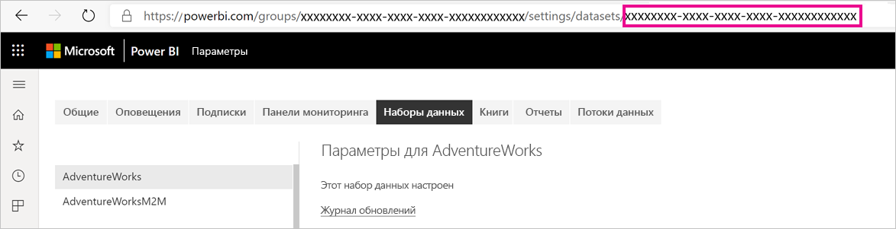
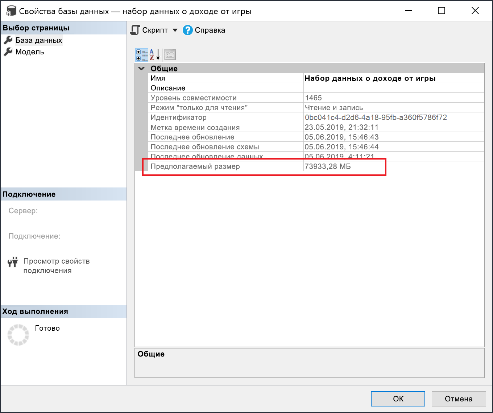

# <a name="large-models-in-power-bi-premium-preview"></a>Большие модели в Power BI Premium (Предварительная версия)

Наборы данных Power BI могут хранить данные в кэше в памяти с высоким уровнем сжатия для оптимизации производительности запросов. Это обеспечивает быстрое взаимодействие пользователей с большими наборами данных. Функция больших моделей позволяет размерам наборов данных в Power BI Premium превышать 10 ГБ. Размер набора данных вместо этого ограничивается размером емкости Power BI Premium. Это похоже на то, как работает Azure Analysis Services с точки зрения ограничений размера модели. Дополнительные сведения о размерах емкости в Power BI Premium см. в разделе "Узлы емкости". Вы можете настроить большие модели для всех номеров SKU P Premium и Внедренных номеров SKU A, однако они работают только с [новых рабочих областей](service-create-the-new-workspaces.md).

Большие модели не влияют на размер передачи PBIX, который по-прежнему ограничен 10 ГБ. Вместо этого при обновлении службы наборы данных выходят за пределы 10 ГБ. Чтобы настроить набор данных, превышающий 10 ГБ, можно использовать добавочное обновление.

## <a name="enable-large-models"></a>Включение больших моделей

Чтобы создать набор данных, превышающий 10 ГБ, выполните следующие действия.

1. Создайте набор данных в Power BI Desktop и настройте [добавочное обновление](service-premium-incremental-refresh.md).

1. Опубликуйте набор данных в службе Power BI Premium.

1. Включите набор данных для больших моделей, выполнив приведенные ниже командлеты PowerShell. Эти командлеты приводят к тому, что Power BI хранит набор данных в файлах Azure Premium, а ограничение в 10 ГБ не применяется.

1. Вызов обновления для загрузки исторических данных на основе политики добавочного обновления. Для загрузки журнала первому обновлению может понадобится некоторое время. Последующие обновления должны выполняться быстрее, так как они являются добавочными.

### <a name="powershell-cmdlets"></a>Командлеты PowerShell

Включите набор данных для хранилища файлов класса Premium с помощью командлетов PowerShell в текущей версии больших моделей. Для запуска командлетов PowerShell требуются права администратора емкости и администратора рабочей области.

1. Найдите идентификатор набора данных (GUID). Идентификатор можно увидеть в URL-адресе, на вкладке **Наборы данных** для рабочей области в разделе параметров набора данных.

    

1. В командной строке администратора PowerShell установите модуль [MicrosoftPowerBIMgmt](/powershell/module/microsoftpowerbimgmt.data/).

    ```powershell
    Install-Module -Name MicrosoftPowerBIMgmt
    ```

1. Выполните следующие командлеты, чтобы войти и проверить режим хранения набора данных.

    ```powershell
    Login-PowerBIServiceAccount

    (Get-PowerBIDataset -Scope Organization -Id <Dataset ID> -Include actualStorage).ActualStorage
    ```

    Ответ должен выглядеть следующим образом. Режим хранения — ABF (файл резервной копии Analysis Services), который используется по умолчанию.

    ```
    Id                   StorageMode

    --                   -----------

    <Dataset ID>         Abf
    ```

1. Выполните следующие командлеты, чтобы настроить режим хранения для файлов Premium и проверить его. Преобразование в файлы Premium может занять несколько секунд.

    ```powershell
    Set-PowerBIDataset -Id <Dataset ID> -TargetStorageMode PremiumFiles

    (Get-PowerBIDataset -Scope Organization -Id <Dataset ID> -Include actualStorage).ActualStorage
    ```

    Ответ должен выглядеть следующим образом. Теперь для режима хранения заданы файлы Premium.

    ```
    Id                   StorageMode
    
    --                   -----------
    
    <Dataset ID>         PremiumFiles
    ```

Состояние преобразований наборов данных в файлы Premium и из них можно проверить с помощью командлета [Get-PowerBIWorkspaceMigrationStatus](/powershell/module/microsoftpowerbimgmt.workspaces/get-powerbiworkspacemigrationstatus).

## <a name="dataset-eviction"></a>Исключение наборов данных

Power BI использует управление динамической памятью для исключения неактивных наборов данных из памяти. Power BI исключает наборы данных, чтобы они могли загружать другие наборы данных для устранения запросов пользователей. Управление динамической памятью позволяет значительно увеличить сумму размеров набора данных по сравнению с объемом доступной памяти, но один набор данных должен помещаться в памяти. Дополнительные сведения об управлении динамической памятью см. в разделе [Принцип функционирования емкостей](service-premium-what-is.md#how-capacities-function).

Следует учитывать влияние вытеснений на большие модели. Несмотря на относительно быстрое время загрузки набора данных, для пользователей может быть заметной задержка, если они ожидают повторной загрузки больших наборов данных. По этой причине в текущей форме функция больших моделей рекомендуется в первую очередь для производственных мощностей, выделенных для корпоративных требований бизнес-аналитики, а не в сочетании с требованиями самостоятельной бизнес-аналитики. Менее вероятно, что емкость, выделенная для корпоративных требований бизнес-аналитики, будет часто вызывать выгрузку и требовать перезагрузки наборов данных. С другой стороны, емкости для самостоятельной бизнес-аналитики могут иметь небольшие наборы данных, которые чаще всего загружаются в память и выгружаются из нее.

## <a name="checking-dataset-size"></a>Проверка размера набора данных

После загрузки исторических данных вы можете использовать [SSMS](https://docs.microsoft.com/sql/ssms/download-sql-server-management-studio-ssms) с помощью [конечной точки XML для аналитики](service-premium-connect-tools.md), чтобы проверить оценочный размер набора данных в окне "Свойства модели".



Вы также можете проверить размер набора данных, выполнив следующие запросы динамического административного представления из SSMS. Суммируйте столбцы DICTIONARY\_SIZE и USED\_SIZE на выходе, чтобы увидеть размер набора данных в байтах.

```sql
SELECT * FROM SYSTEMRESTRICTSCHEMA
($System.DISCOVER_STORAGE_TABLE_COLUMNS,
 [DATABASE_NAME] = '<Dataset Name>') //Sum DICTIONARY_SIZE (bytes)

SELECT * FROM SYSTEMRESTRICTSCHEMA
($System.DISCOVER_STORAGE_TABLE_COLUMN_SEGMENTS,
 [DATABASE_NAME] = '<Dataset Name>') //Sum USED_SIZE (bytes)
```

## <a name="current-feature-restrictions"></a>Ограничения текущей функции

При использовании больших моделей учитывайте следующие ограничения.

- **Перенос собственного ключа шифрования BYOK**: Наборы данных, включенные для файлов уровня "Премиум", не шифруются [BYOK](service-encryption-byok.md).
- **Поддержка нескольких регионов**: Для наборов данных, включенных для файлов уровня "Премиум", не будет работать емкость, в которой также включен пункт [несколько регионов](service-admin-premium-multi-geo.md).

- **Скачивание Power BI Desktop**: Если набор данных хранится в файлах уровня "Премиум", [скачивание в виде PBIX-файла](service-export-to-pbix.md) завершится сбоем.
- **Поддерживаемые регионы**: Крупные модели поддерживаются в следующих регионах.
  - Восточная Австралия
  - Юго-Восточная Австралия
  - Центральная часть США
  - Восточная Азия
  - Восточная часть США
  - Восточная часть США 2
  - Восточная Япония
  - Западная Япония
  - Центральная Корея, центральный регион
  - Республика Корея, южный регион
  - Центрально-северная часть США
  - Северная Европа
  - Центрально-южная часть США
  - Юго-Восточная Азия
  - Южная часть Соединенного Королевства
  - Западная часть Соединенного Королевства
  - Западная Европа
  - Западная часть США
  - Западная часть США 2