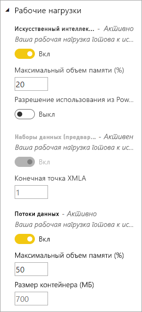
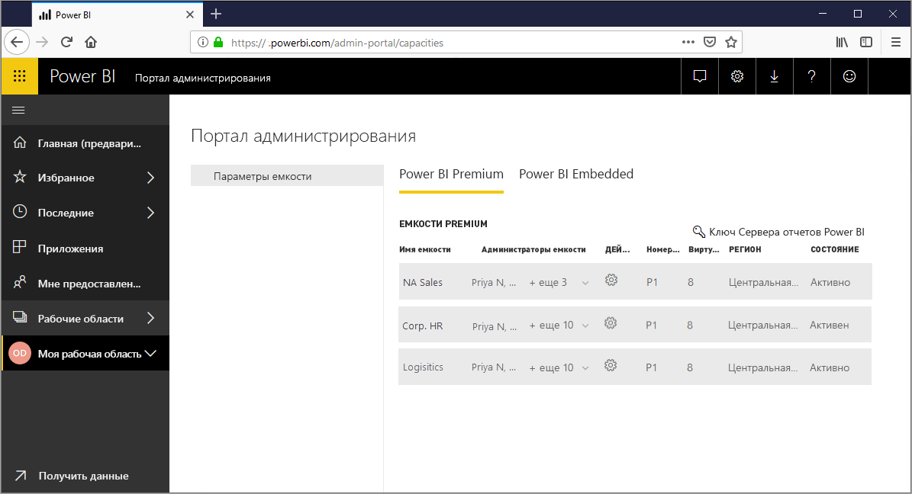
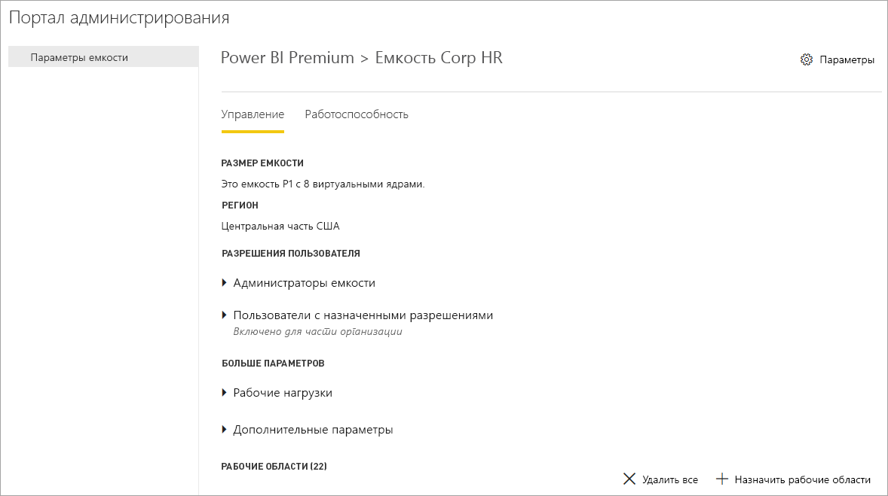
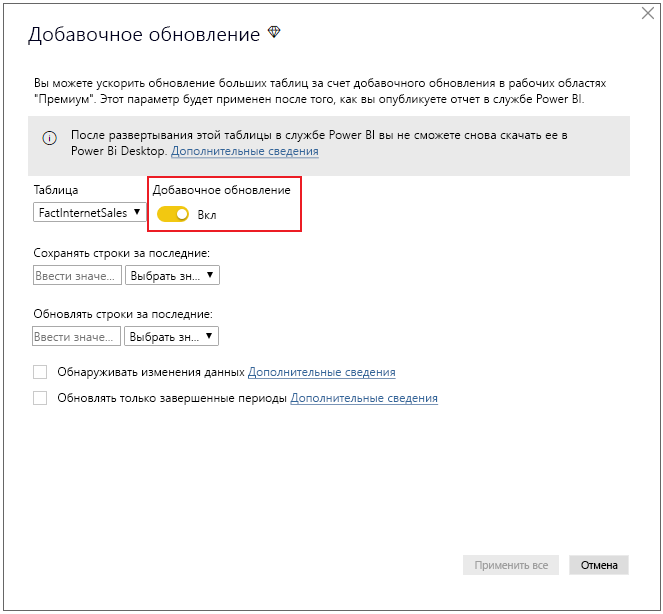

# Что такое Power BI Premium?

Power BI Premium предоставляет выделенные и улучшенные ресурсы для выполнения службы Power BI для вашей организации. Например:

- Повышенная масштабируемость и производительность
- Гибкость лицензирования по емкости
- Унифицированное средство самостоятельной и корпоративной бизнес-аналитики
- Расширение локальной бизнес-аналитики за счет Сервера отчетов Power BI
- Поддержка расположения данных по регионам (поддержка нескольких регионов)
- Предоставление любым пользователям общего доступа к данным без приобретения лицензий "на пользователя"

Эта статья не содержит подробные сведения о каждой функции Power BI Premium, а лишь затрагивает общие понятия. При необходимости приводятся ссылки на дополнительные статьи с более подробными сведениями.

## Подписки и лицензирование

Power BI Premium — это подписка Office 365 уровня клиента, доступная в двух семействах номеров единиц хранения (SKU):

- Номера SKU **EM** (EM1–EM3), которые используются для внедрения содержимого. Они требуют годового обязательства и оплачиваются ежемесячно. Номера SKU EM1 и EM2 доступны только по планам корпоративного лицензирования. Вы не сможете приобрести их напрямую.
- Номера SKU **P** (P1–P3), которые используются для внедрения содержимого и предоставления корпоративных функций. Они требуют ежемесячного или годового обязательства, оплачиваются ежемесячно и содержат лицензию на локальную установку Сервера отчетов Power BI.

Альтернативный подход заключается в приобретении подписки **Azure Power BI Embedded**, которая содержит одно семейство номеров SKU **A** (A1–A6), которые предназначены только для внедрения содержимого и тестирования емкости. Все номера SKU предоставляют виртуальные ядра для создания емкостей, но номера SKU EM имеют ограничения для внедрения меньшего масштаба. Номера SKU EM1, EM2, A1 и A2, содержащие менее четырех виртуальных ядер, не выполняются в выделенной инфраструктуре.

Несмотря на то что основное внимание в этой статье уделяется SKU P, многие сведения также относятся и к SKU A. В отличие от SKU подписки Premium, SKU Azure не требуют временного обязательства и оплачиваются ежечасно. Они обеспечивают полную эластичность, позволяя выполнять операции масштабирования, приостановки, возобновления и удаления. 

Описание Azure Power BI Embedded в значительной степени выходит за рамки этой статьи, однако в разделе [Подходы к тестированию](service-premium-capacity-optimize.md#testing-approaches) статьи "Оптимизация емкостей Premium" приведен как практический, так и экономичный вариант тестирования и измерения рабочих нагрузок. Дополнительные сведения о номерах SKU Azure см. в [документации по Azure Power BI Embedded](https://azure.microsoft.com/services/power-bi-embedded/).

### Покупка

Подписки Power BI Premium приобретаются администраторами в Центре администрирования Microsoft 365. В частности, только глобальные администраторы Office 365 или администраторы выставления счетов могут приобретать номера SKU. После приобретения клиент получает соответствующее количество виртуальных ядер для назначения емкостям, что называется *объединением виртуальных ядер в пул*. Например, при приобретении SKU P3 клиент получает 32 виртуальных ядра. Дополнительные сведения см. в статье [Как купить Power BI Premium](service-admin-premium-purchase.md).

## Выделенные емкости

Используя Power BI Premium, вы получаете *выделенные емкости*. В отличие от общей емкости, где рабочие нагрузки выполняются на вычислительных ресурсах, совместно используемых с другими клиентами, выделенная емкость предназначена для монопольного использования организацией. Она изолирована выделенными вычислительными ресурсами, которые обеспечивают надежную и стабильную производительность для размещенного содержимого. 

Рабочие области находятся внутри емкостей. У каждого пользователя Power BI есть личная рабочая область, так называемая **Моя рабочая область**. Для обеспечения совместной работы и выполнения развертывания можно создавать дополнительные рабочие области. Они называются **Рабочие области приложения**. По умолчанию рабочие области, включая личные рабочие области, создаются в общей емкости. При наличии емкостей Premium им можно назначить как "Мои рабочие области", так и "Рабочие области приложения".

### Узлы емкости

Как указано в разделе [Подписки и лицензирование](#subscriptions-and-licensing), существует два семейства номеров SKU Power BI Premium: **EM** и **P**. Все номера SKU Power BI Premium доступны в качестве *узлов* емкости, каждый из которых представляет собой определенный объем ресурсов процессора, памяти и хранилища. Кроме ресурсов, каждый номер SKU содержит операционные ограничения на количество подключений DirectQuery и активных подключений в секунду и количество параллельных обновлений моделей.

Обработка выполняется с помощью заданного количества виртуальных ядер, разделенных поровну между сервером и интерфейсом.

**Серверные виртуальные ядра** отвечают за выполнение основных операций Power BI: обработку запросов, управление кэшем, выполнение служб R, обновление моделей, обработку запросов на естественном языке ("Вопросы и ответы"), а также отрисовку отчетов и изображений на стороне сервера. Серверным виртуальным ядрам назначается фиксированный объем памяти, который в основном используется для размещения моделей, также называемых активными наборами данных.

**Интерфейсные виртуальные ядра** отвечают за управление веб-службами, панелями мониторинга и отчетами, управление правами доступа, планирование, интерфейсы API, передачу и скачивание, а также за взаимодействие с пользователем.

Для объема хранилища установлено значение **100 ТБ на узел емкости**.

Ресурсы и ограничения каждого номера SKU Premium (и номера SKU A эквивалентного размера) описаны в следующей таблице.

| Узлы емкости | Число виртуальных ядер | Серверные виртуальные ядра | ОЗУ (ГБ) | Интерфейсные виртуальные ядра | Подключения DirectQuery и активные подключения (в секунду) | Параллелизм обновления модели |
| --- | --- | --- | --- | --- | --- | --- |
| EM1/A1 | 1 | 0,5 | 2.5 | 0,5 | 3,75 % | 1 |
| EM2/A2 | 2 | 1 | 5 | 1 | 7,5 % | 2 |
| EM3/A3 | 4 | 2 | 10 | 2 | 15 | 3 |
| P1/A4 | 8 | 4 | 25 | 4 | 30 | 6 |
| P2/A5 | 16 | 8 | 80 | 8 | 60 | 12 |
| P3/A6 | 32 | 16 | 100 | 16 | 120 | 24 |
| | | | | | | |

### Рабочие нагрузки емкости

Рабочие нагрузки емкости — это службы, предоставляемые пользователям. По умолчанию емкости Premium и Azure поддерживают только рабочие нагрузки набора данных, связанные с выполнением запросов Power BI. Эту рабочую нагрузку набора данных невозможно отключить. Дополнительные рабочие нагрузки можно включить для [ИИ (Cognitive Services)](https://powerbi.microsoft.com/blog/easy-access-to-ai-in-power-bi-preview/), [потоков данных](service-dataflows-overview.md#dataflow-capabilities-on-power-bi-premium) и [отчетов с разбивкой на страницы](paginated-reports-save-to-power-bi-service.md). Эти рабочие нагрузки поддерживаются только в подписках Premium. 

Каждая дополнительная рабочая нагрузка позволяет настроить максимальный объем памяти (процент от общего объема доступной памяти), который может использоваться рабочей нагрузкой. Значения по умолчанию для максимального объема памяти определяются номером SKU. Вы можете максимально увеличить доступные ресурсы емкости, включая дополнительные рабочие нагрузки, только когда они используются. Кроме того, вы можете изменять параметры памяти, только если параметры по умолчанию не соответствуют требованиям к ресурсам емкости. Администраторы емкости могут включить и настроить рабочие нагрузки для емкости, используя **Параметры емкости** на [портале администрирования](service-admin-portal.md) либо [REST API емкостей](https://docs.microsoft.com/rest/api/power-bi/capacities).  

Дополнительные сведения см. в разделе [Настройка рабочих нагрузок в емкости Premium](service-admin-premium-workloads.md). 

### Принцип функционирования емкостей

Служба Power BI всегда стремится максимально эффективно использовать ресурсы емкости в рамках пределов, установленных для емкости.

Операции с использованием емкости классифицируются как *интерактивные* или *фоновые*. К интерактивным операциям относятся отрисовка отчетов и реагирование на взаимодействие с пользователем (фильтрация, "Вопросы и ответы" и т. д.). Как правило, выполнение запросов к модели импорта требует значительных ресурсов памяти, тогда как запросы моделей активных подключений и DirectQuery сильно загружают ЦП. К фоновым операциям относится обновление потока данных и модели импорта, а также кэширование запросов панели мониторинга.

Важно понимать, что интерактивные операции всегда имеют приоритетное значение по сравнению с фоновыми, обеспечивая таким образом лучшее взаимодействие с пользователем. Если ресурсов недостаточно, фоновые операции добавляются в очередь для обработки после освобождения ресурсов. Служба Power BI может остановить выполнение фоновых операций, таких как обновление набора данных, и добавить их в очередь.

Модели импорта должны быть полностью загружены в память, чтобы к ним можно было отправлять запросы или выполнять их обновление. Служба Power BI управляет потреблением памяти с помощью сложных алгоритмов, чтобы обеспечить максимальное использование доступной памяти. Кроме того, служба может вызвать избыточное выделение емкости. Несмотря на возможность хранения большого количества моделей импорта (до 100 ТБ на емкость Premium), если их объединенное хранилище дисков превышает поддерживаемую память (и дополнительный объем памяти, требуемый для запросов и обновлений), одновременно загрузить все модели в память будет невозможно.

Поэтому модели импорта загружаются в память и удаляются из нее в зависимости от использования. Загрузка выполняется после запроса модели импорта (интерактивная операция), которая еще не находится в памяти, или при обновлении этой модели (фоновая операция).

Удаление модели из памяти называется *вытеснением*. Длительность выполнения этой операции службой Power BI зависит от размера моделей. При наличии достаточного объема памяти в емкости модели просто загружаются в память. Однако, когда для загрузки модели памяти недостаточно, службе Power BI сначала потребуется освободить память. Она освобождает память, обнаруживая и удаляя неактивные модели, выполнив поиск моделей, которые не использовались в течение последних трех минут \[[1](#endnote-1)\]. Если неактивные модели отсутствуют, служба Power BI пытается удалить модели, загруженные для фоновых операций. В крайнем случае после 30 секунд неудачных попыток удаления \[[1](#endnote-1)\] происходит сбой выполнения интерактивной операции. В этом случае пользователь отчета получает уведомление о сбое с предложением повторить попытку в ближайшее время. Иногда модели могут выгружаться из памяти из-за служебных операций.

Важно подчеркнуть, что вытеснение из набора данных является обычным и ожидаемым поведением. Служба пытается максимизировать потребление памяти путем загрузки и выгрузки моделей, общий размер которых может превышать объем доступной памяти. Такое поведение настроено намеренно. Оно является полностью прозрачным для пользователей. Высокие показатели вытеснения не обязательно означают, что для емкости выделено недостаточное количество ресурсов. Тем не менее эта ситуация может стать проблемой, если в результате высоких показателей вытеснения возникают сбои в выполнении запросов или обновления.

Для обновления моделей импорта всегда требуется большой объем памяти, так как они должны быть загружены в память. Дополнительный объем памяти требуется для обработки. Для полного обновления может потребоваться примерно вдвое больше памяти. Это позволяет отправлять запросы к модели даже во время обработки, так как запросы отправляются к имеющейся модели, пока не завершится обновление и данные новой модели не станут доступными. Добавочное обновление потребует меньший объем памяти. Кроме того, оно выполняется быстрее, что может существенно снизить нагрузку на ресурсы емкости. Обновления также могут сильно загружать ЦП, особенно это касается моделей со сложными преобразованиями Power Query или сложными вычисляемыми таблицами и столбцами либо такими, которые созданы на основе больших таблиц.

Обновления, как и запросы, требуют загрузки модели в память. Если памяти недостаточно, служба Power BI попытается удалить неактивные модели, а если это невозможно (так как все модели активны), задание обновления будет добавлено в очередь. Обновления обычно сильно загружают ЦП, даже больше, чем запросы. По этой причине существуют ограничения емкости на количество одновременных обновлений, которое в 1,5 раза превышает количество серверных виртуальных ядер, округленное в большую сторону. Если одновременных обновлений слишком много, запланированное обновление будет добавлено в очередь. В таких ситуациях обновление занимает больше времени. При выполнении обновлений по требованию (инициируемые запросом пользователя или вызовом API) будет предпринято три попытки \[[1](#endnote-1)\]. Затем, если ресурсов будет по-прежнему недостаточно, обновление завершится сбоем.

Заметки к разделу.   
\[1\] сведения могут быть изменены.

### Региональная поддержка

При создании емкости глобальные администраторы Office 365 и администраторы службы Power BI могут указать регион, где будут находиться рабочие области, назначенные емкости. Эта функция называется **поддержкой нескольких регионов**. С ее помощью организации могут удовлетворить требования к месту расположения данных, развертывая содержимое в центрах обработки данных в определенном регионе, даже если он отличается от региона, к которому относится подписка Office 365. Дополнительные сведения см. в разделе [Поддержка нескольких регионов для Power BI Premium](service-admin-premium-multi-geo.md).

### Управление емкостью

Управление емкостями Premium включает в себя создание или удаление емкостей, назначение администраторов, назначение рабочих областей, настройку рабочих нагрузок, мониторинг и внесение изменений для оптимизации производительности емкости. 

Глобальные администраторы Office 365 или администраторы Power BI могут создавать емкости Premium из доступных виртуальных ядер или изменять имеющиеся емкости Premium. При создании емкости указываются ее размер и географический регион, а также назначается по меньшей мере один администратор емкости. 

При создании емкостей большинство административных задач выполняется на [портале администрирования](service-admin-portal.md).

Администраторы емкости могут назначать емкости рабочие области, управлять разрешениями пользователей и назначать других администраторов. Кроме того, они могут настраивать рабочие нагрузки, регулировать выделение памяти и при необходимости перезапускать емкость, сбрасывая операции в случае перегрузки емкости.

Администраторы емкости могут также проверить правильность работы емкости. Они могут отслеживать работоспособность емкости на портале администрирования или с помощью приложения метрик емкостей Premium.

Дополнительные сведения о создании емкостей, назначении администраторов и назначении рабочих областей см. в разделе [Управление емкостями Premium](service-premium-capacity-manage.md). Дополнительные сведения о ролях см. в разделе [Роли администратора, связанные с Power BI](service-admin-administering-power-bi-in-your-organization.md#administrator-roles-related-to-power-bi).

### Мониторинг

Мониторинг емкостей Premium предоставляет администраторам сведения о выполнении емкостей. Емкости можно отслеживать на портале администрирования Power BI или с помощью [приложения метрик емкости Power BI Premium](https://app.powerbi.com/groups/me/getapps/services/capacitymetrics).

Мониторинг на портале администрирования обеспечивает быстрое отслеживание высокоуровневых метрик, которые указывают нагрузку и ресурсы (усредненное значение), использованные вашей емкостью за последние семь дней. 

Приложение **метрик емкости Power BI Premium** предоставляет наиболее полные сведения об эффективности использования емкостей. В приложении присутствует высокоуровневая панель мониторинга с более подробными отчетами.

На панели мониторинга приложения можно щелкнуть ячейку метрики, чтобы открыть подробный отчет. Отчеты предоставляют подробные метрики и возможность фильтрации для детализации до наиболее важных сведений, которые необходимы для беспроблемной работы емкостей.

Дополнительные сведения о мониторинге емкостей см. в разделах [Мониторинг на портале администрирования Power BI](service-admin-premium-monitor-portal.md) и [Мониторинг с помощью приложения метрик емкости Power BI Premium](service-admin-premium-monitor-capacity.md).

### Оптимизация емкостей

Оптимальное использование емкостей очень важно для обеспечения надлежащей работы пользователей и для получения максимальной отдачи от приобретения версии Premium. Отслеживая основные метрики, администраторы могут определить, как эффективнее всего устранить узкие места и принять необходимые меры. Дополнительные сведения см. в разделах [Оптимизация емкостей Premium](service-premium-capacity-optimize.md) и [Сценарии емкостей Premium](service-premium-capacity-scenarios.md).

### REST API емкостей

REST API Power BI включают коллекцию [API емкостей](https://docs.microsoft.com/rest/api/power-bi/capacities). С помощью этих API администраторы могут программно управлять многими аспектами емкостей Premium, в том числе включением и отключением рабочих нагрузок, назначением рабочих областей емкости и многое другое.

## Большие наборы данных

В зависимости от номера SKU, Power BI Premium поддерживает отправку файлов моделей Power BI Desktop (PBIX) с размером до **10 ГБ**. После загрузки модели можно опубликовать в рабочей области, назначенной емкости Premium. Потом этот набор данных можно обновить вплоть до **12 ГБ**.

### Рекомендации по размерам

Крупные модели могут использовать много ресурсов. Для всех моделей, размер которых превышает 1 ГБ, требуется по меньшей мере номер SKU P1. Хотя для крупных моделей в рабочих областях, поддерживаемых номерами SKU от A до A3, может работать публикация, их обновление выполняться не будет.

В следующей таблице описаны рекомендуемые номера SKU для PBIX-файлов разного размера.

   |Номер SKU  |Размер PBIX-файла   |
   |---------|---------|
   |P1    | < 3 ГБ        |
   |P2    | < 6 ГБ        |
   |P3, P4, P5    | До 10 ГБ   |

Номер SKU Power BI Embedded A4 аналогичен номеру SKU P1, A5 = P2 и A6 = P3. Обратите внимание, что публикация крупных моделей в SKU A и EM может возвращать ошибки, не относящиеся непосредственно к ограничениям размера моделей в общей емкости. Ошибки обновления для крупных моделей в номерах SKU A и EM, скорее всего, указывают на истечение времени ожидания. 

В PBIX-файлах представлены данные с *высокой степенью сжатия*. Вероятно, при загрузке в память их объем увеличится в несколько раз, а при обновлении данных из памяти — еще в несколько раз.

Запланированное обновление больших наборов данных может потребовать много времени и ресурсов. Важно не планировать слишком много перекрывающихся обновлений. Рекомендуется настроить [добавочное обновление](service-premium-incremental-refresh.md), так как этот тип является более быстрым, надежным и потребляет меньше ресурсов.

Начальная загрузка отчета для больших наборов данных может занять много времени, если с момента последнего использования набора данных прошло некоторое время. Ход загрузки такого отчета отображается на панели загрузки.

Хотя ограничения памяти и времени для каждого запроса гораздо выше в емкости Premium, рекомендуется использовать фильтры и срезы, чтобы отображались только необходимые визуальные элементы.

## Добавочное обновление

Добавочное обновление является неотъемлемой частью использования и обслуживания больших наборов данных в Power BI Premium. Добавочное обновление имеет множество преимуществ, например обновление происходит быстрее, так как обновлять нужно только те данные, которые изменились. Обновления становятся надежнее, так как нет необходимости надолго подключаться к нестабильным источникам данных. Так как требуется обновлять меньше данных, сокращается общее потребление памяти и других ресурсов. Политики добавочного обновления определяются в **Power BI Desktop** и применяются при публикации в рабочей области внутри емкости Premium. 

Дополнительные сведения см. в разделе [Добавочное обновление в Power BI Premium](service-premium-incremental-refresh.md).

## Отчеты с разбивкой на страницы

Отчеты с разбивкой на страницы, поддерживаемые в номерах SKU P1–P3 и A4–A6, основаны на технологии RDL (языка определения отчетов), используемой в SQL Server Reporting Services. Хотя они и основаны на технологии языка определения отчетов, они отличаются от Сервера отчетов Power BI — скачиваемой платформы для создания отчетов, которая может быть установлена локально, а также входит в состав Power BI Premium. Формат отчетов с разбивкой на страницы подбирается с учетом особенностей страницы, предназначенной для печати или совместного использования. Данные отображаются в таблице, даже если для этого потребуется несколько страниц. С помощью бесплатного приложения [**построителя отчетов Power BI**](https://go.microsoft.com/fwlink/?linkid=2086513) для Windows Desktop пользователи могут создавать отчеты с разбивкой на страницы и публиковать их в службе.

В Power BI Premium отчеты с разбивкой на страницы представляют собой рабочую нагрузку, которую нужно включить для емкости с помощью портала администрирования. Администраторы емкости могут включить ее и затем указать объем памяти в процентах от общего количества ресурсов памяти. В отличие от других типов рабочих нагрузок Power BI Premium выполняет отчеты с разбивкой на страницы в автономной области в пределах емкости. Максимальный объем памяти, указанный для этой области, используется независимо от активности рабочей нагрузки. Значение по умолчанию равно 20 %. 

Дополнительные сведения см. в разделе [Отчеты с разбивкой на страницы в Power BI Premium](paginated-reports-report-builder-power-bi.md). Дополнительные сведения о включении рабочей нагрузки отчетов с разбивкой на страницы см. в разделе [Настройка рабочих нагрузок](service-admin-premium-workloads.md).

## Сервер отчетов Power BI
 
Сервер отчетов Power BI, входящий в состав Power BI Premium, — это *локальный* сервер отчетов с веб-порталом. Вы можете создать собственную локальную среду бизнес-аналитики и распространять отчеты под защитой корпоративного брандмауэра. Сервер отчетов дает пользователям доступ к многофункциональным интерактивным корпоративным возможностям ведения отчетов в SQL Server Reporting Services. Пользователи могут работать с наглядно представленными данными и быстро обнаруживать закономерности для принятия более взвешенных и оперативных решений. Сервер отчетов предоставляет систему управления на ваших условиях. Если возникнет такая необходимость, Сервер отчетов Power BI упростит переход в облако, где ваша организация сможет полноценно воспользоваться преимуществами всех функций Power BI Premium.

Дополнительные сведения см. в разделе [Сервер отчетов Power BI](report-server/get-started.md).

## Неограниченный общий доступ к содержимому

Благодаря версии Premium все пользователи — как в организации, так и за ее пределами — могут просматривать ваше содержимое Power BI, включая постраничные и интерактивные отчеты, не приобретая лицензии для отдельных пользователей. 

Версия Premium позволяет распространять содержимое пользователям Pro, и при этом для просмотра этого содержимого получателями лицензии Pro не требуются. Лицензии Pro нужны создателям содержимого. Они подключаются к источникам данных, данным модели и создают отчеты и панели мониторинга, которые упаковываются в виде приложений рабочей области. 

Дополнительные сведения см. в разделе [Лицензирование Power BI](service-admin-licensing-organization.md).

## Возможность подключения средств (предварительная версия)

За работу с наборами данных Power BI отвечает хорошо зарекомендовавшая себя корпоративная система Microsoft **Analysis Services Vertipaq**. Analysis Services обеспечивает программируемость и поддержку клиентских приложений и средств посредством клиентских библиотек и API, поддерживающих основанный на открытых стандартах протокол XMLA. Сейчас наборы данных Power BI Premium поддерживают операции *только для чтения* со стороны клиентских приложений и средств Майкрософт и других производителей через **конечные точки XMLA**. 

Инструменты Майкрософт, например SQL Server Management Studio и SQL Server Profiler, и сторонние приложения, такие как DAX Studio и приложения визуализации данных, могут подключиться к наборам данных Premium и отправлять в них запросы с помощью XMLA, DAX, многомерных выражений, динамических административных представлений и событий трассировки. 

Дополнительные сведения см. в разделе [Подключение к наборам данных с помощью клиентских приложений и средств](service-premium-connect-tools.md).

## Дальнейшие действия

> [!div class="nextstepaction"]
> [Управление емкостями Premium](service-premium-capacity-manage.md)

Появились дополнительные вопросы? [Попробуйте задать вопрос в сообществе Power BI.](https://community.powerbi.com/)

||||||
