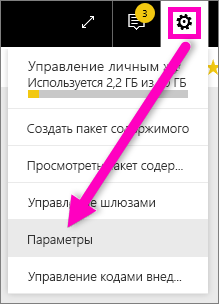
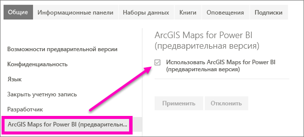

# Испытайте предварительные версии функций Power BI
## Что собой представляют *предварительные версии функций*?
В рамках улучшения Power BI ряд новых функциональных возможностей будет выпущен в качестве *предварительных версий*. Чтобы опробовать предварительные версии функций, вы можете включать и отключать их.

> [!TIP]
> Возникли вопросы или хотите оставить отзыв? [Посетите форум сообщества Power BI](http://community.powerbi.com/t5/Navigation-Preview-Forum/bd-p/NavigationPreview).
> 
> 

## Текущие доступные предварительные версии
**Карты ArcGIS для Power BI (предварительная версия).** Сочетание карт ArcGIS и Power BI — это больше, чем простое отображение точек на карте.
Дополнительные сведения см. в статье [Руководство. Карты ArcGIS в Power BI (предварительная версия)](power-bi-visualization-arcgis.md).

## Включение (и отключение) предварительной версии функции ArcGIS
1. Откройте меню "Параметры", щелкнув значок шестеренки в правом верхнем углу окна Power BI и выбрав пункт **Параметры**.
   
   .
2. Откройте вкладку **Общие** и выберите **Предварительная версия функций**.
   
   
3. Установите переключатель в положение **Вкл.**, чтобы опробовать новые возможности. Щелкните **Применить**.
4. Чтобы отключить предварительные версии функций, выполните шаги 1 и 2 выше, а на шаге 3 выберите **Откл.** > **Применить**.

## Дальнейшие действия
[Новый интерфейс навигации по Power BI](service-the-new-power-bi-experience.md)

Возникли вопросы или хотите оставить отзыв? [Посетите форум сообщества Power BI](http://community.powerbi.com/t5/Navigation-Preview-Forum/bd-p/NavigationPreview).

