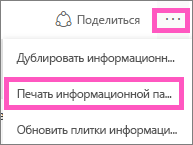
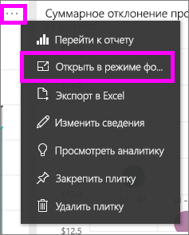
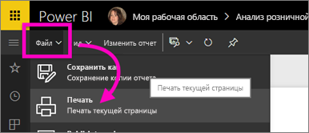

# Печать из службы Power BI
Печать всей панели мониторинга, плитки на панели мониторинга, страницы отчета или визуального элемента отчета из службы Power BI. Отчеты можно распечатывать только постранично, весь отчет сразу распечатать нельзя.

> [!NOTE]
> Печать доступна только в службе Power BI и недоступна в Power BI Desktop.
> 
> 

В следующем видео Аманда выполнит печать из информационной панели и отчетов. Затем сделайте то же самое, выполнив пошаговые инструкции, приведенные под видео.

<iframe width="560" height="315" src="https://www.youtube.com/embed/jtlLGRKBvXY" frameborder="0" allowfullscreen></iframe>

## Печать панели мониторинга
1. Откройте панель мониторинга, которую хотите напечатать.
2. В правом верхнем углу щелкните многоточие (...) и выберите **Печать панели мониторинга**.
   
    
3. Откроется окно печати для браузера. Выберите параметры и место назначения печати и нажмите **Печать**.
   
   > [!NOTE]
   > Внешний вид диалогового окна печати зависит от вашего браузера.
   > 
   > 
   
    

## Печать плитки на панели мониторинга
1. [Откройте плитку в режиме фокусировки](service-focus-mode.md), нажав кнопку с многоточием и выбрав значок фокусировки .
   
    
2. Откройте плитку в [полноэкранном режиме](service-fullscreen-mode.md), щелкнув соответствующий значок  в верхней области навигации.
3. Наведите указатель мыши на плитку, чтобы открыть меню "Параметры".
   
    
4. Выберите значок "Печать" .     
   
   > [!NOTE]
   > Внешний вид диалогового окна печати зависит от вашего браузера.
   > 
   > 

## Печать страницы отчета
Отчеты можно выводить на печать по одной странице за раз.

1. Откройте отчет в режиме чтения или редактирования.
2. Чтобы напечатать текущую страницу отчета, выберите **Файл** > **Печать**.
   
    
3. Откроется окно печати для браузера.
   
   > [!NOTE]
   > Внешний вид диалогового окна печати зависит от вашего браузера.
   > 
   > 

## Печать визуального элемента отчета
1. [Откройте визуальный элемент в режиме фокусировки](service-focus-mode.md), наведя указатель на плитку и выбрав значок фокусировки  в правом верхнем углу.
2. Выполните шаги 2–3 в разделе *Печать страницы отчета* выше.

## Рекомендации и устранение неполадок
* Вопрос. Не могу найти кнопку **Печать**.    
* Ответ. Если вы используете Power BI Desktop, печать не поддерживается.  Печать работает только в службе Power BI.
* Вопрос. Не могу распечатать все страницы отчета за один раз.    
* Ответ. Все верно. Страницы отчета можно выводить на печать только по одной.
* Вопрос. Не могу распечатать отчет в PDF.    
* Ответ. Этот параметр отображается, только если в браузере уже настроен драйвер PDF.    
* Вопрос. То, что я вижу при выборе параметра **Печать**, не соответствует тому, что показано здесь.    
* Ответ. Экраны печати зависят от браузера и версии программного обеспечения.
* Вопрос. При печати был выбран неверный масштаб.  Панель мониторинга не уместилась на странице. Другие вопросы по масштабированию и ориентации.    
* Ответ. Мы не можем гарантировать, что печатные копии будут в точности соответствовать содержимому, отображаемому в службе Power BI. Power BI не позволяет управлять такими параметрами, как масштабирование, поля, сведения о визуальных элементах, ориентация и размер. Справку по подобным вопросам см. в документации к конкретному браузеру.      

## Дальнейшие действия
[Предоставление общего доступа к панели мониторинга и отчетам коллегам и другим пользователям](service-share-dashboards.md)

Появились дополнительные вопросы? [Ответы на них см. в сообществе Power BI.](http://community.powerbi.com/)

