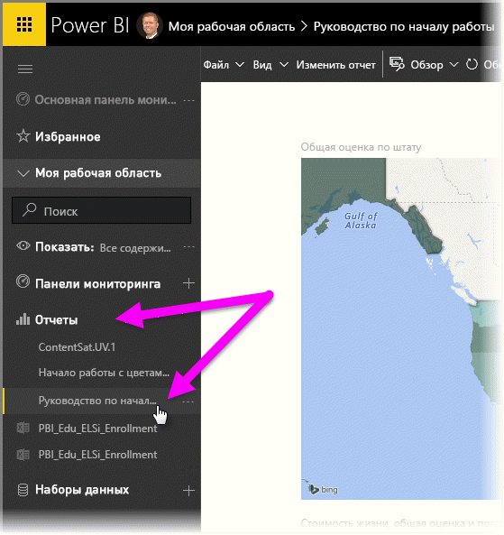
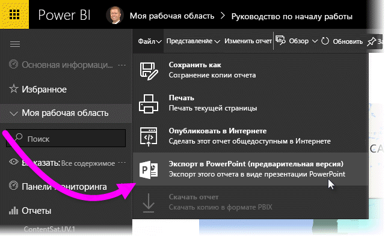
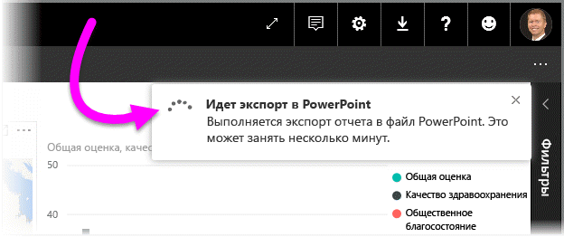
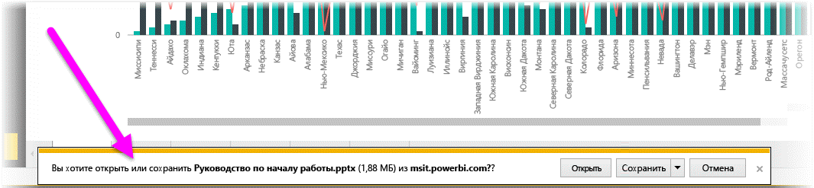
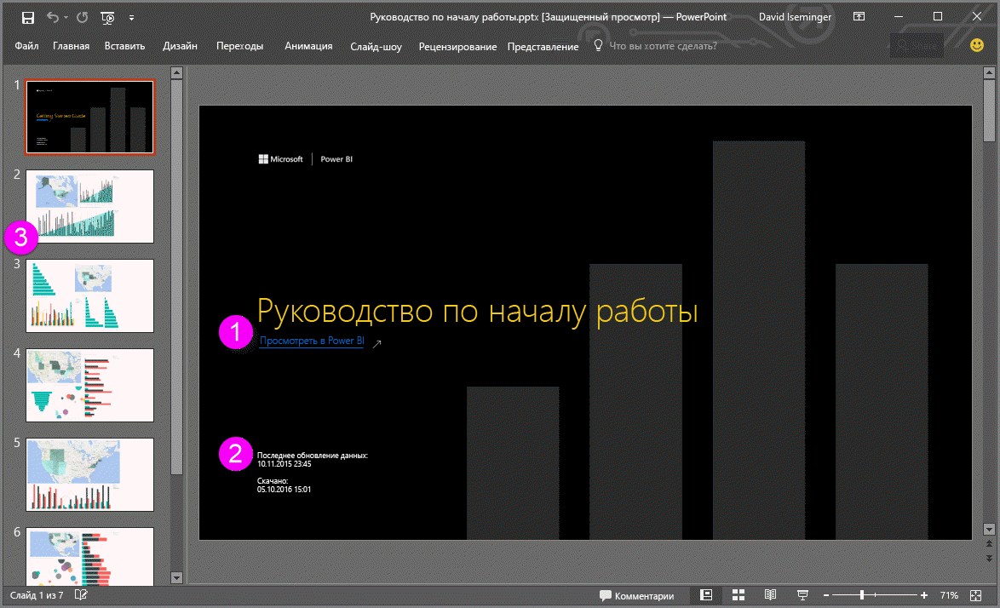
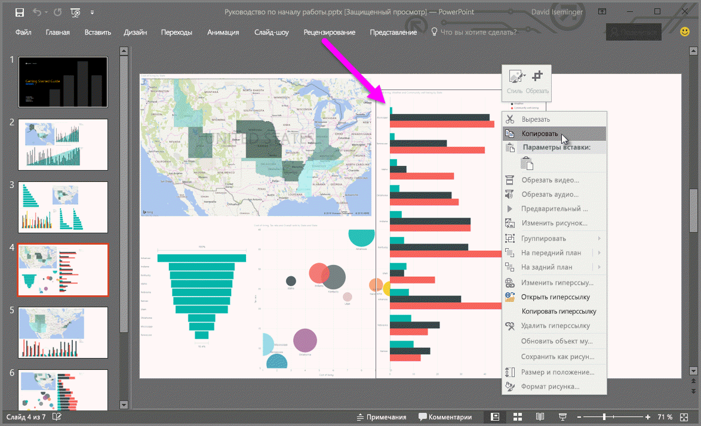

# Экспорт отчетов из Power BI в PowerPoint (предварительная версия)
Служба Power BI позволяет опубликовать отчет в программе **Microsoft PowerPoint** и без труда создать на его основе набор слайдов. При **экспорте в PowerPoint** происходит следующее:

* Каждая страница отчета Power BI становится в PowerPoint отдельным слайдом.
* Каждая страница в отчете Power BI экспортируется как одно изображение с высоким разрешением в PowerPoint.
* Текстовые поля в отчете Power BI становятся в PowerPoint редактируемыми текстовыми полями.
* В PowerPoint создается ссылка на отчет Power BI.

Экспортировать **отчет Power BI** в программу **PowerPoint** несложно. Для этого нужно выполнить действия, описанные в следующем разделе.

## Как экспортировать отчет из службы Power BI в программу PowerPoint
В службе Power BI в области навигации слева разверните раздел **Отчеты**, а затем выберите отчет, чтобы он отобразился на холсте. Кроме того, отчет можно выбрать из раздела **Моя рабочая область** или **Избранное**, если отчет находится в одном из этих расположений.

Когда отчет, который необходимо экспортировать в PowerPoint, отобразится на холсте, на панели меню в службе Power BI щелкните **Файл > Экспорт в PowerPoint (предварительная версия)**, как показано на рисунке ниже.

В окне браузера в правом верхнем углу службы Power BI появится баннер с уведомлением о том, что отчет экспортируется в PowerPoint. Этот процесс может занять несколько минут. Пока выполняется экспорт, вы можете продолжать работать в Power BI.

Когда экспорт завершится, баннер уведомления изменится, сообщая, что служба Power BI завершила экспортирование.

После этого ваш файл станет доступным для скачивания в браузере. На рисунке ниже показано сообщение в нижней части браузера, предлагающее скачать файл.

Вот, собственно, и все. Скачав файл и открыв его в PowerPoint, вы можете изменять его точно так же, как любую другую презентацию PowerPoint.

## Просмотр экспортированного файла PowerPoint
Открыв в PowerPoint файл, экспортированный из службы Power BI, вы увидите несколько интересных моментов. Взгляните на рисунок ниже, а затем прочтите под ним описание некоторых полезных функций.

1. На первой странице набора слайдов указано название отчета и приведена ссылка **Просмотреть в Power BI**, с помощью которой можно просмотреть соответствующий отчет в службе Power BI.
2. Кроме того, здесь также приведены такие полезные сведения об отчете, как *время последнего обновления данных*, на которых основан экспортированный отчет, а также время и дата *скачивания*, то есть время и дата, когда отчет Power BI был экспортирован в файл PowerPoint.
3. Каждая страница отчета представлена отдельным слайдом, как показано в области навигации слева.
4. Опубликованный отчет отображается на языке, заданном в параметрах Power BI или в браузере. Чтобы просмотреть или настроить параметры языка, выберите значок  **> Параметры > Общие > Язык**. Дополнительные сведения см. в статье [Поддерживаемые языки и страны (регионы) для Power BI](supported-languages-countries-regions.md).
5. Презентация PowerPoint включает титульный слайд с экспортированными данными времени в надлежащем часовом поясе.

Если открыть отдельный слайд, вы увидите, что каждая страница отчета является отдельным изображением.

>[!NOTE]
> Один визуальный элемент для всех страниц отчета является нововведением. Предыдущая схема, когда для каждого визуального элемента требовалось отдельное изображение, больше не применяется. 
 

Получившийся набор слайдов PowerPoint и все изображения из него можно использовать в различных целях. Выбор за вами.

## Ограничения
При работе с функцией **Экспорт в PowerPoint** следует учитывать несколько рекомендаций и ограничений.

* **Визуальные элементы R** пока не поддерживаются. Такие визуальные элементы экспортируются в виде пустого изображения в PowerPoint с сообщением об ошибке: "Визуальный элемент не поддерживается".
* **Пользовательские визуальные элементы**, которые прошли **сертификацию**, поддерживаются. Дополнительные сведения о сертифицированных пользовательских визуальных элементах, включая способы получения сертификации, см. в статье [Получение сертификации для пользовательского визуального элемента](power-bi-custom-visuals-certified.md). Пользовательские визуальные элементы, которые не прошли сертификацию, не поддерживаются. Они экспортируются в виде пустого изображения в PowerPoint с сообщением об ошибке: "Визуальный элемент не поддерживается".
* **Сертифицированные пользовательские визуальные элементы** поддерживаются. Сертифицированным является пользовательский визуальный элемент, который одобрен для использования с Power BI, соответствует требованиям к коду и прошел строгие тесты безопасности. [Узнайте больше о **сертифицированных пользовательских визуальных элементах**](power-bi-custom-visuals-certified.md).
* Экспорт отчетов, в которых больше 15 страниц, пока не поддерживается.
* Процесс экспорта отчета в PowerPoint может занять несколько минут, поэтому наберитесь терпения. На продолжительность экспорта могут влиять такие факторы, как структура отчета и текущая нагрузка на службу Power BI.
* Если в службе Power BI в меню нет пункта **Экспорт в PowerPoint (предварительная версия)**, вероятно, эта функция отключена администратором клиента. Обратитесь к администратору клиента за подробными сведениями.
* Фоновые изображения будут обрезаны по ограничивающей области диаграммы. Настоятельно рекомендуем удалить фоновые рисунки перед экспортом в PowerPoint.
* **Интерактивные возможности сеанса**, такие как выделение и фильтрация, детализация и т. д., пока не поддерживаются в экспортированном в PowerPoint файле. В экспортированном файле PowerPoint исходные визуальные элементы отображаются так, как они были сохранены в отчете.
* Страницы в PowerPoint всегда создаются в стандартном размере 16:9 независимо от размеров или параметров исходной страницы в отчете Power BI.
* Отчеты, принадлежащие пользователям вне домена клиента Power BI (например, отчет, принадлежащий пользователю не из вашей организации, к которому он предоставил вам доступ), нельзя опубликовать в PowerPoint.
* Если вы совместно используете панель мониторинга с кем-либо не из вашей организации (то есть этот пользователь находится вне клиента Power BI), этот пользователь не сможет экспортировать отчеты, связанные с общей панелью мониторинга, в PowerPoint. Например, если вы aaron@contoso.com, вы сможете предоставить общий доступ david@cohowinery.com. Но david@cohowinery.com не может экспортировать связанные отчеты в PowerPoint.
* Как упоминалось ранее, каждая страница отчета экспортируется в виде одного изображения в файл PowerPoint.
* Служба Power BI использует параметр языка Power BI в качестве языка для экспорта в PowerPoint. Чтобы просмотреть или настроить параметры языка, выберите значок  **> Параметры > Общие > Язык**.
* Время **загрузки** на слайде-обложке экспортированного файла PowerPoint совпадает с часовым поясом вашего компьютера во время экспорта.

## Дальнейшие действия
[Анализ в Excel](service-analyze-in-excel.md)

[Данные Excel в Power BI](service-excel-workbook-files.md)

[Получение сертификации для пользовательского визуального элемента](power-bi-custom-visuals-certified.md)

