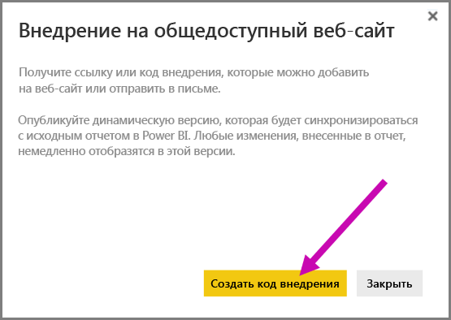
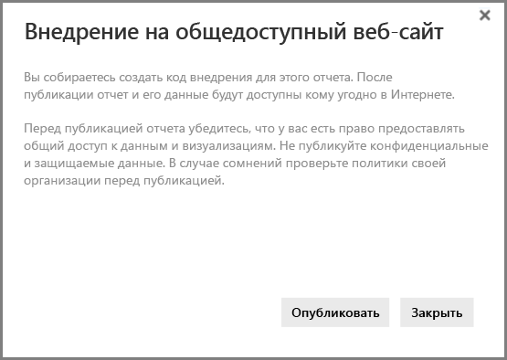
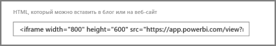
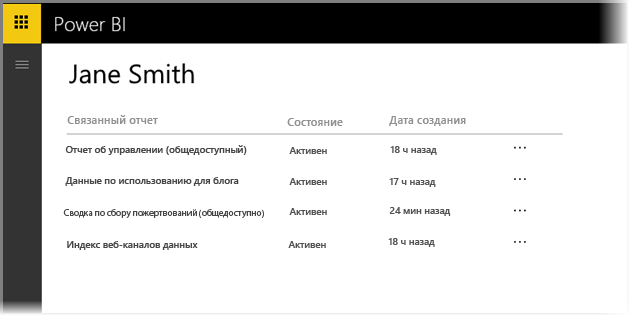
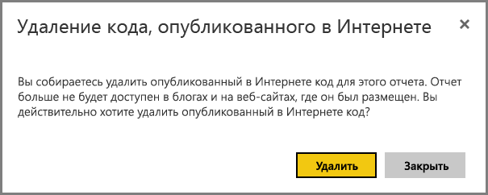

# Публикация в Интернете из Power BI

С помощью функции Power BI **Опубликовать в Интернете** вы можете легко встраивать интерактивное содержимое Power BI в публикации блогов, на веб-сайты, в электронные письма или социальные сети. Опубликованные визуальные элементы можно без труда изменять и обновлять или отменять общий доступ к ним.

> [!WARNING]
> При использовании функции **Опубликовать в Интернете** просмотреть публикуемый отчет или визуальный элемент может любой пользователь в Интернете. Для просмотра проверка подлинности не требуется. Для просмотра доступны подробные данные уровня, агрегированные в отчетах. Перед публикацией отчета убедитесь в том, что у вас есть право на предоставление общего доступа к данным и визуализациям. Не публикуйте конфиденциальные и защищаемые данные. Если вы не уверены в своих правах, изучите политики своей организации, прежде чем приступать к публикации.

>[!Note]
>Вы можете безопасно внедрить содержимое во внутренний портал или сайт. Используйте параметры [Внедрить](service-embed-secure.md) или [Внедрить в SharePoint Online](service-embed-report-spo.md). Они обеспечивают правильное применение всех разрешений и политик защиты данных при обращении пользователей к внутренним данным.

## Создание кодов внедрения с помощью функции "Опубликовать в Интернете"

Функция **Опубликовать в Интернете** доступна для отчетов, которые вы можете изменить в личных и групповых рабочих областях.  Она недоступна для отчетов, к которым вам был предоставлен доступ, а также для отчетов, в которых для защиты данных используются функции безопасности на уровне строк. Полный список ситуаций, в которых не поддерживается функция **Опубликовать в Интернете**, см. в разделе [**Ограничения**](#limitations) ниже. Прежде чем использовать функцию **Опубликовать в Интернете**, ознакомьтесь со сведениями в подразделе **Предупреждение**, приведенными выше.

Приведенное ниже короткое видео показывает, как работает эта функция. Затем вы сможете оценить ее самостоятельно, как это описано ниже.

<iframe width="560" height="315" src="https://www.youtube.com/embed/UF9QtqE7s4Y" frameborder="0" allowfullscreen></iframe>

Далее описано использование функции **Опубликовать в Интернете**.

1. Откройте отчет в доступной для редактирования рабочей области и выберите **Дополнительные параметры (...)**   > **Внедрить** > **Опубликовать в Интернете (общедоступно)** .

   
   
2. Если администратор Power BI запретил вам создавать коды внедрения, может потребоваться обратиться к нему.

   
   
   Сведения о том, как найти пользователя, который может включить функцию "Опубликовать в Интернете" в организации, см. в разделе [Как найти своего администратора Power BI](#find-your-power-bi-administrator) далее в этой статье.

3. Просмотрите содержимое диалогового окна и выберите **Создать код внедрения**.

   

4. Ознакомьтесь с предупреждением, которое показано здесь, и подтвердите, что данные можно внедрить в общедоступный веб-сайт. Нажмите кнопку **Опубликовать**.

   

5. Отображается диалоговое окно со ссылкой. Выберите ссылку, чтобы отправить ее по электронной почте, или скопируйте код HTML. Его можно внедрить в код (например, iFrame) или вставить непосредственно на веб-страницу или в блог.

   

6. Если вы ранее создали код внедрения для отчета и выбрали **Опубликовать в Интернете**, то не увидите диалоговые окна в шагах 2–4. Вместо этого отображается диалоговое окно **Код внедрения**.

   

   Для каждого отчета можно создать только один код внедрения.

### Советы по режимам просмотра

Содержимое, внедряемое в публикацию блога, обычно требуется разместить в соответствии с конкретным размером экрана.  Вы можете настроить необходимую высоту и ширину в теге iFrame. Однако также может потребоваться, чтобы отчет размещался в рамках заданной области iFrame, поэтому при редактировании отчета необходимо задать нужный режим просмотра.

В следующей таблице содержатся рекомендации по режимам просмотра и их отображению после внедрения.

| Режим просмотра | Вид после внедрения |
| --- | --- |
|  |**Вписать в страницу** — в этом случае учитываются высота и ширина страницы отчета. Если для вашей страницы установлены *динамические* пропорции (например, 16:9 или 4:3), содержимое будет масштабироваться с учетом размеров области iFrame. Когда содержимое размещено в кадре iFrame, использование функции **Вписать в страницу** может привести к *появлению серого фона* в областях iFrame после масштабирования содержимого. Чтобы избежать этого, задайте правильные параметры высоты и ширины для области iFrame. |
|  |**Фактический размер** — в этом случает отчет сохраняет свой размер, заданный на странице отчета. Это может привести к появлению в iFrame полос прокрутки. Чтобы избавиться от полос, задайте для области iFrame значения высоты и ширины. |
|  |**По ширине** — в этом случае содержимое заполняет горизонтальную область iFrame. Рамка по-прежнему отображается, но содержимое масштабируется в соответствии со всем доступным горизонтальным пространством. |

### Советы по выбору оптимальной высоты и ширины iFrame

Код внедрения функции **Опубликовать в Интернете** выглядит как следующий пример:

 
Ширину и высоту кода можно изменить вручную, чтобы он размещался на странице именно так, как требуется.

Чтобы содержимое лучше вписывалось в кадр, попробуйте добавить 56 пикселей к высоте iFrame. Это позволит учесть текущий размер нижней строки. Если для страницы вашего отчета задан динамический размер, воспользуйтесь таблицей ниже, чтобы выбрать размеры, позволяющие не допустить появления пустых участков.

| Соотношение | Размер | Ширина x высота |
| --- | --- | --- |
| 16:9 |Малый |640 x 416 пикселей |
| 16:9 |Средний |800 x 506 пикселей |
| 16:9 |Большой |960 x 596 пикселей |
| 4:3 |Малый |640 x 536 пикселей |
| 4:3 |Средний |800 x 656 пикселей |
| 4:3 |Большой |960 x 776 пикселей |

## Управление кодами внедрения

После создания кода внедрения функции **Опубликовать в Интернете** вы можете управлять кодами в меню **Параметры** Power BI. Управление кодами внедрения позволяет удалять конечный визуальный элемент или отчет для кода (отображение кода внедрения является нецелесообразным) или получать код внедрения.

1. Чтобы управлять кодами внедрения для **публикации в Интернете** , откройте окно **Настройки** с шестеренкой и выберите пункт **Управление кодами внедрения**.

   

2. Отображаются ваши коды внедрения.

   

3. Вы можете извлечь или удалить код внедрения. При удалении все ссылки на этот отчет или визуальный элемент отключаются.

   

4. Если выбрать вариант **Удалить**, вам будет предложено подтвердить эту операцию.

   

## Обновления отчетов и данных

После создания кода внедрения для функции **Опубликовать в Интернете** и предоставления к нему общего доступа отчет обновляется с помощью любых вносимых вами изменений, а ссылка на код внедрения активируется немедленно. Код может просмотреть каждый, кто открывает ссылку. Но после этого исходного действия обновления отчетов или визуальных элементов могут стать доступными пользователям через два или три часа. Дополнительные сведения см. в разделе [**Принцип действия**](#howitworks) далее в этой статье. 

### Обновление данных

Обновления данных автоматически отражаются во внедренном отчете или визуальном элементе. Обновленные данные начинают отображаться из кодов внедрения приблизительно через час. Чтобы отключить автоматическое обновление, выберите **Не обновлять** в расписании для набора данных, используемого в отчете.  

## Визуальные элементы Power BI

Функция **Опубликовать в Интернете**поддерживает визуальные элементы Power BI. Когда вы используете функцию **Опубликовать в Интернете**, пользователям, которым вы предоставляете общий доступ к опубликованному визуальному элементу, не нужно включать визуальные элементы Power BI для просмотра отчета.

## Основные сведения о столбце состояния кода внедрения

>[!Note]
>Просмотрите часто публикуемые коды внедрения. Удалите те, которые больше не нужны для общего доступа.

На странице **Управление кодами внедрения** присутствует столбец состояния. По умолчанию коды внедрения **активны**, но могут находиться в одном из состояний, перечисленных ниже.

| Состояние | Описание |
| --- | --- |
| **Активен** |Пользователи Интернета могут просматривать отчет и работать с ним. |
| **Заблокирован** |Содержимое отчета не соответствует [условиям предоставления услуг для Power BI](https://powerbi.microsoft.com/terms-of-service). Оно было заблокировано корпорацией Майкрософт. Если вы считаете, что это произошло по ошибке, обратитесь в службу поддержки. |
| **Не поддерживается** |Для данных в отчете используются функции безопасности на уровне строк либо другая неподдерживаемая конфигурация. Полный список см. в разделе [**Ограничения**](#limitations). |
| **Нарушено** |На код внедрения не распространяется определенная политика клиента. Как правило, так происходит, когда создан код внедрения, а затем изменен параметр клиента **Опубликовать в Интернете**, чтобы исключить пользователя, которому принадлежит этот код. Если параметр клиента отключен или пользователю запрещено создавать коды внедрения, для существующих кодов отображается состояние **Нарушено**. Подробные сведения см. в разделе [Как найти своего администратора Power BI](#find-your-power-bi-administrator) этой статьи. |

## Сообщение о проблеме с содержимым, опубликованным в Интернете

Чтобы сообщить о проблеме, связанной с содержимым, **публикуемым в Интернете** , которое внедрено в веб-сайт или блог, выберите значок **флажка** на нижней панели отчета **Опубликовать в Интернете**.

Вам будет предложено отправить в корпорацию Майкрософт сообщение с описанием проблемы. Специалисты Майкрософт оценят содержимое на соответствие [условиям предоставления услуг для Power BI](https://powerbi.microsoft.com/terms-of-service) и примут соответствующие меры.

## Лицензирование

Чтобы использовать функцию **Опубликовать в Интернете**, необходимо быть пользователем Microsoft Power BI. Лица, просматривающие ваш отчет, не обязаны быть пользователями Power BI.

## Принцип действия (технические подробности)

При создании кода внедрения с помощью функции **Опубликовать в Интернете** отчет становится виден пользователям в Интернете. Он находится в открытом доступе, и пользователи, которые его просматривают, могут легко делиться им с помощью различных каналов связи. Когда пользователи просматривают отчет, используя прямой общедоступный URL-адрес, или видят его встроенным в веб-страницу или блог, Power BI кэширует определения отчета и результаты запросов, необходимых для просмотра отчета. Кэширование гарантирует, что отчет могут просматривать тысячи пользователей одновременно без какого-либо влияния на производительность.

Кэш сохраняется в течение длительного времени. При обновлении определения отчета (например, при изменении режима просмотра) или обновлении данных отчета изменения будут отражены в версии отчета, просматриваемой пользователями, приблизительно через час. Поэтому мы рекомендуем заранее планировать и организовывать работу и создавать код внедрения для **публикации в Интернете** только в том случае, если вас устраивают все параметры.

## Как найти своего администратора Power BI

На портале администрирования Power BI есть параметры для управления тем, кто может публиковать содержимое в Интернете. Изменить [параметры публикации в Интернете для клиента](service-admin-portal.md#publish-to-web) можно только совместно с [администратором Power BI](service-admin-role.md).

У небольших организаций или частных лиц, которые зарегистрировались для работы с Power BI, возможно, еще нет администратора Power BI. В таком случае выполните наши [инструкции по получению прав администратора клиента](https://docs.microsoft.com/azure/active-directory/users-groups-roles/domains-admin-takeover). Когда у вас будет администратор Power BI, он сможет включить для вас создание кодов внедрения.

У давно сформированных организаций, как правило, уже есть администратор Power BI. Администратором Power BI может быть сотрудник с любой из следующих ролей:

- администратор Office 365;
- администратор Azure Active Directory;
- пользователь с ролью администратора службы Power BI в Azure Active Directory.

Вам необходимо [найти одного из этих сотрудников](https://docs.microsoft.com/office365/admin/admin-overview/admin-overview#who-has-admin-permissions-in-my-business) в своей организации и попросить его изменить [параметры публикации в Интернете для клиента](service-admin-portal.md#publish-to-web) на портале администрирования.

## Ограничения

Функция **Опубликовать в Интернете** поддерживается большинством источников данных и отчетов в службе Power BI. Однако перечисленные ниже отчеты в настоящее время не поддерживаются или недоступны для использования с функцией **Опубликовать в Интернете**.

- Отчеты, использующие функции безопасности на уровне строк.
- Отчеты, использующие любой источник данных динамического подключения, включая локальные многомерные службы Analysis Services, размещенные в табличной модели Analysis Services, и службы Azure Analysis Services.
- Отчеты, использующие [общий набор данных](service-datasets-across-workspaces.md), который хранится в другой рабочей области отчета.
- [Общие и сертифицированные наборы данных](service-datasets-share.md).
- Отчеты, к которым вам предоставлен доступ непосредственно или через пакет содержимого организации.
- Отчеты в рабочей области, в которой вы не являетесь участником с правами редактирования.
- В настоящее время в отчетах для функции **Опубликовать в Интернете** не поддерживаются визуальные элементы R.
- Экспорт данных из визуальных элементов в отчете, опубликованном в Интернете.
- Визуальные элементы ArcGIS Maps for Power BI.
- Отчеты, содержащие меры уровня отчета DAX.
- Модели запросов данных единого входа.
- Безопасность конфиденциальной или защищаемой информации.
- Возможность автоматической аутентификации, предоставляемая параметром **Внедрение**, не работает с API JavaScript для Power BI. При работе с API JavaScript для Power BI следует использовать подход к внедрению, основанный на концепции [данные принадлежат пользователю](developer/embedded/embed-sample-for-your-organization.md).

## Дальнейшие действия

- [Внедрение с помощью веб-части отчетов в SharePoint Online](service-embed-report-spo.md) 

- [Embed a report in a secure portal or website](service-embed-secure.md) (Внедрение отчета на защищенный портал или сайт)

Появились дополнительные вопросы? [Ответы на них см. в сообществе Power BI.](https://community.powerbi.com/)
