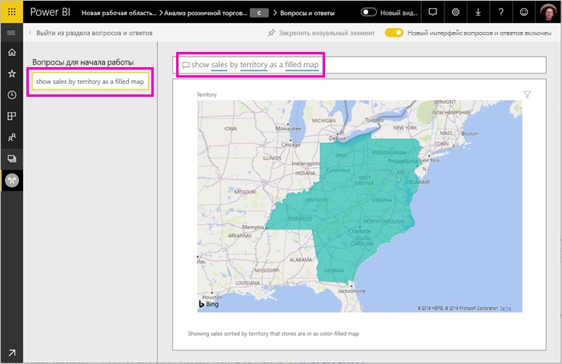

# Создание избранных вопросов для функции вопросов и ответов Power BI
Если у вас есть набор данных, вы можете добавить для него собственные избранные вопросы. Power BI Q & A покажет эти вопросы вашим коллегам, использование отчетов на основе этого набора.  Избранные вопросы дают вашим коллегам представление о типах вопросов, которые можно задавать о наборе данных. Вы сами определяете избранные вопросы — добавьте популярные вопросы, вопросы, дающие интересный результат, или вопросы, которые трудно выразить.

> [!NOTE]
> Избранные вопросы и ответы доступны для использования в [приложения Microsoft Power BI для iOS на iPad, iPhone и iPod Touch устройств](consumer/mobile/mobile-apps-ios-qna.md) и Power BI Desktop вопросов и ответов Создавать вопросы доступна только в службе Power BI (app.powerbi.com).
> 

## Создание популярный вопрос

В статье используется пример [Анализ розничной торговли](sample-datasets.md). Выполните эти пошаговые инструкции, чтобы повторить изучение набора данных самостоятельно.

1. Выберите поле "Вопросы и ответы" на панели мониторинга.   Обратите внимание, что функция вопросов и ответов уже помогает вам, отображая список терминов, которые присутствуют в наборе данных.
2. Чтобы добавить в этот список, щелкните значок шестеренки в правом верхнем углу Power BI.  
   
3. Выберите **Параметры** &gt; **Наборы данных** &gt; **Анализ розничной торговли — пример** &gt; **Избранные вопросы**.  
4. Выберите **Добавить вопрос**.
   
   
5. Введите вопрос в текстовое поле и выберите **Применить**.   При необходимости добавьте другой вопрос, выбрав **Добавить вопрос**.  
   
6. Вернитесь к панели мониторинга Power BI для примера анализа розничной торговли и наведите курсор мыши на окно вопросов и ответов.   
   
7. Новый популярный вопрос **Sales by territory as a map**(Продажи по территориям в виде карты) стоит первым в списке. Выберите его.  
8. Ответ отображается в виде заполненной визуализации карты.  
   

## Дальнейшие действия

- [Вопросы И ответы для потребителей](consumer/end-user-q-and-a.md)  
- [Используйте вопросы И ответы в панелях мониторинга и отчеты](power-bi-tutorial-q-and-a.md)  
- [Power BI — основные понятия](consumer/end-user-basic-concepts.md)  

Появились дополнительные вопросы? [Ответы на них см. в сообществе Power BI.](http://community.powerbi.com/)

