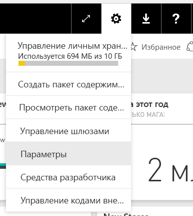
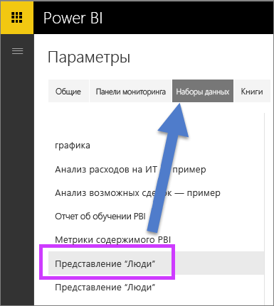
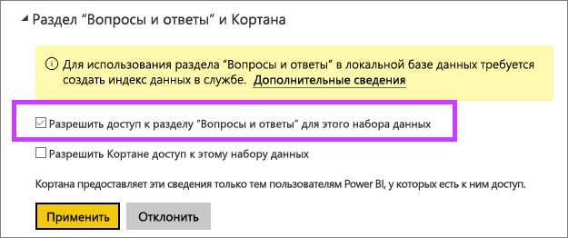

# Включение вопросов и ответов для активных подключений в Power BI
## Что такое локальный шлюз данных?  Что такое активное подключение?
Наборы данных в Power BI можно импортировать в Power BI или создавать активное подключение к этим данным. Наборы данных активного подключения часто называют "локальными". Для управления активными подключениями используется [шлюз](service-gateway-onprem.md), а обмен данными и запросами осуществляется с помощью активных запросов.

## Вопросы и ответы о наборах данных локальных шлюзов
Для того чтобы использовать вопросы и ответы с наборами данных, доступ к которым осуществляется через шлюз, их необходимо предварительно активировать.

После этого Power BI создаст индекс источников данных и передаст подмножество данных в Power BI, чтобы включить возможность использования вопросов. Создание первоначального индекса может занять несколько минут. При изменении данных Power BI дополняет и обновляет индекс автоматически. Применение вопросов и ответов к таким наборам данных работает также, как публикация данных в Power BI. В обоих случаях поддерживается весь набор функций, доступных при работе с вопросами и ответами, включая использование источника данных с Cortana.

Когда вы задаете вопросы в Power BI, функция вопросов и ответов определяет наиболее подходящий визуальный элемент для формирования отчета, который позволит ответить на ваш вопрос, исходя из индекса вашего набора данных. Определив наилучший потенциальный ответ, с помощью DirectQuery функция вопросов и ответов извлекает динамические данные для заполнения диаграмм и графиков из источника данных через шлюз. Таким образом, функция вопросов и ответов в Power BI всегда отображает актуальные данные, полученные непосредственно из соответствующего источника данных.

Так как функция вопросов и ответов в Power BI выбирает форму запроса ответов из исходной модели, используя текстовые значения и значения схем из вашего источника данных, поиск определенных новых или удаленных текстовых значений (например, запрос имени клиента, связанного с вновь добавленной текстовой записью) осуществляется на основе актуального индекса последних значений. Power BI автоматически обновляет индекс текстовых значений и схем с 60-минутным окном изменений.

Для получения дополнительной информации см.

* Что такое [локальный шлюз данных](service-gateway-onprem.md)?
* [Введение в вопросы и ответы в Power BI](consumer/end-user-q-and-a.md)

## Включить вопросы и ответы
Настроив шлюз данных, подключитесь к данным из Power BI.  Создайте панель мониторинга на основе локальных данных или отправьте PBIX-файл, использующий локальные данные.  Кроме того, локальные данные можно использовать в панелях мониторинга, отчетах и наборах данных, к которым вам предоставили доступ.

1. В правом верхнем углу экрана Power BI щелкните значок шестеренки  и выберите пункт **Settings** (Параметры).
   
   
2. Выберите **наборы данных** и укажите, какой набор данных необходимо включить для функции вопросов и ответов.
   
   
3. Разверните пункт **Вопросы и ответы и Cortana**, установите флажок **Включить вопросы и ответы для этого набора данных** и выберите **Применить**.
   
    

## Какие данные кэшируются и каким образом осуществляется защита конфиденциальности?
При включении функции вопросов и ответов для локальных данных подмножество ваших данных кэшируется в службе. Это обеспечивает адекватную скорость работы функции вопросов и ответов. Служба Power BI исключает значения, длина которых превышает 24 символа. Кэш удаляется в течение нескольких часов после отключения функции вопросов и ответов, когда вы снимаете флажок **Разрешить доступ к разделу "Вопросы и ответы" для этого набора данных** или удаляете свой набор данных.

## Рекомендации и устранение неполадок
На этапе тестирования предварительной версии этой функции действуют несколько ограничений:

* Изначально эта функция доступна только для табличных источников данных SQL Server 2016 Analysis Services. Функция оптимизирована для работы с табличными данными. Интерфейс вопросов пока не поддерживается для многомерных данных. Поддержка дополнительных источников данных локальным шлюзом данных будет реализована со временем.
* Полная поддержка безопасности на уровне строк, определенная в SQL Server Analysis Services, в общедоступной предварительной версии изначально недоступна. При формулировке вопросов с помощью функции вопросов и ответов автозаполнение вопросов во время ввода может предлагать строковые значения, недоступные пользователю. При этом в визуальных элементах отчетов и схем соблюдается безопасность на уровне строк, поэтому числовые данные на экран не выводятся. Соответствующие параметры управления будут реализованы в следующих обновлениях.
* Безопасность на уровне объектов (OLS) не поддерживается. Компонент "Вопросы и ответы" не учитывает безопасность на уровне объектов и может отображать имена таблиц или столбцов для пользователей, у которых нет к ним доступа. Необходимо включить безопасность на уровне строк (RLS), чтобы гарантировать, что значения данных также надежно защищены. 
* Активные подключения поддерживаются только для локального шлюза данных. Поэтому их невозможно использовать для личного шлюза.

## Дальнейшие действия
[Локальный шлюз данных](service-gateway-onprem.md)  
[Управление своим источником данных — службы Analysis Services](service-gateway-enterprise-manage-ssas.md)  
[Power BI — основные понятия](consumer/end-user-basic-concepts.md)  
[Общие сведения о функции "Вопросы и ответы" в Power BI](consumer/end-user-q-and-a.md)  

Появились дополнительные вопросы? [Попробуйте задать вопрос в сообществе Power BI.](http://community.powerbi.com/)

