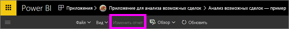

# Режимы чтения и правки в отчетах службы Power BI
В службе Power BI (не в Power BI Desktop) есть два режима для просмотра и взаимодействия с отчетами: чтения и правки.  

Режим чтения доступен всем пользователям, а режим правки — только авторам и владельцам отчетов. Режим чтения предназначен для *пользователей* отчета, т. е. для коллег, которые открывают отчеты из приложения или имеют общий доступ к отчетам. Режим чтения обеспечивает отображение одного и того же отчета с одними и теми же визуализациями и примененными фильтрами для каждого пользователя такого отчета.  Пользователи могут работать с отчетами, но не могут сохранять изменения в них.

>**Примечание**. В некоторых случаях пользователи отчетов могут видеть разные данные из-за применения функции безопасности на уровне строк и разрешений на просмотр данных. 

Режим правки доступен только для пользователей, создавших отчет или совместно владеющих отчетом как участник или администратор рабочей области приложения.

## Режим чтения

Режим чтения — это удобный и безопасный способ ознакомления с данными и их изучения. Режим чтения не так интерактивен, как [режим редактирования](service-interact-with-a-report-in-editing-view.md), но также поддерживает разные функции для работы с данными. Он удобен, например, при просмотре отчетов, к которым [вам предоставлен доступ](service-share-dashboards.md), так как их можно открывать только в режиме чтения.

Дополнительные сведения см. в статье о [взаимодействии с отчетом в режиме чтения в Power BI](service-interact-with-a-report-in-reading-view.md).

## Режим правки
В представлении редактирования в Power BI (по сравнению с [режимом чтения](service-interact-with-a-report-in-reading-view.md)) вы можете более глубоко изучать данные за счет добавления и удаления полей, изменения типа визуализации, создания новых визуализаций, добавления и удаления визуализаций и страниц из отчета.

Дополнительные сведения см. в статье о [взаимодействии с отчетом в режиме правки в Power BI](service-interact-with-a-report-in-editing-view.md).

## Переключения между режимами чтения и правки
Помните, что только авторы и владельцы отчетов могут открывать отчет в режиме правки.

1. По умолчанию отчет, как правило, открывается в режиме чтения. Вы можете узнать, что находитесь в режиме чтения, если видите параметр **Изменить отчет**. Если параметр **Изменить отчет** неактивен, у вас нет разрешений открывать отчет в режиме правки.

   

2. Если параметр **Изменить отчет** активен, выберите его, чтобы открыть отчет в режиме правки. 
   
   
   
   Теперь отчет используется в режиме правки с теми же [параметрами отображения](power-bi-report-display-settings.md), с которыми вы работали в режиме чтения.

2. Чтобы вернуться в режим чтения, щелкните **Режим чтения** на панели навигации вверху.
   
    

Есть разные способы взаимодействия с отчетами в режиме чтения с использованием срезов и разделения данных для обнаружения дополнительных сведений и получения ответов на вопросы.  Более подробно они описаны в следующем разделе о [взаимодействии с отчетом в режиме чтения](service-interact-with-a-report-in-editing-view.md).

### Дальнейшие действия
[Взаимодействие с отчетом в режиме чтения в Power BI](service-interact-with-a-report-in-editing-view.md)    
Переключение к [отчетам в Power BI](service-reports.md)    
Появились дополнительные вопросы? [Ответы на них см. в сообществе Power BI.](http://community.powerbi.com/) 

