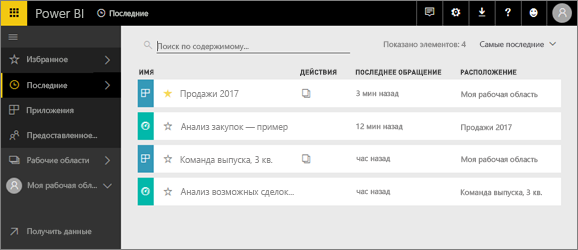
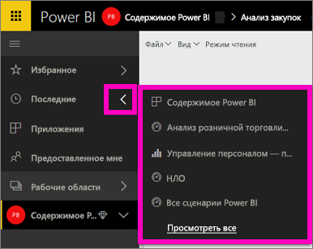
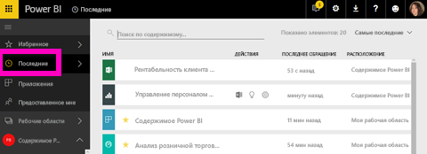

# **Недавно просмотренное** содержимое в службе Power BI

## Что такое недавно просмотренное содержимое
Недавнее содержимое — это последние элементы, которые вы просматривали, но оно включает не более 20 элементов.  Это содержимое включает панели мониторинга, отчеты, приложения и книги во всех рабочих областях.

Узнайте, как Аманда заполняет списки содержимого **Последние**, а затем сделайте то же самое, выполнив пошаговые инструкции, приведенные под видео.

<iframe width="560" height="315" src="https://www.youtube.com/embed/G26dr2PsEpk" frameborder="0" allowfullscreen></iframe>

## Отображение недавно просмотренного содержимого
Чтобы увидеть пять недавно использованных элементов, в левой области навигации щелкните стрелку справа от элемента **Recent** (Недавнее).  Отсюда можно выбрать недавно использованное содержимое, чтобы открыть его. Здесь перечислено 5 недавно использованных элементов.

Если у вас есть более 5 недавно использованных элементов, выберите **Просмотреть все**, чтобы открыть экран Recent (Недавнее) (см. ниже). Вы также можете выбрать **Recent** (Недавнее) или соответствующий значок  в левой области навигации.

Отсюда вы можете взаимодействовать с содержимым так же, как и на отдельных вкладках [**Информационные панели**](service-dashboards.md), [**Отчеты**](service-reports.md), **Книги** и на экране [**приложений**](service-install-use-apps.md).

## Дальнейшие действия
[Power BI service Apps](service-install-use-apps.md) (Приложения службы Power BI)

Появились дополнительные вопросы? [Ответы на них см. в сообществе Power BI.](http://community.powerbi.com/)

