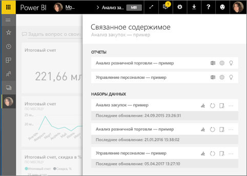
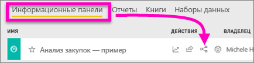
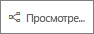
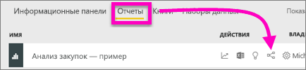
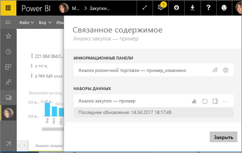
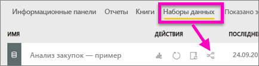
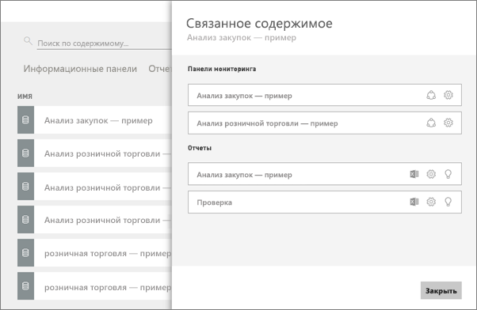

# Просмотр связанного содержимого в службе Power BI
В области **Связанное содержимое** вы можете видеть, как связано между собой содержимое службы Power BI: панели мониторинга, отчеты и наборы данных.  Здесь вы можете также выполнять такие общие задачи, как обновление и переименование данных, создание аналитики и многое другое. Выберите связанный отчет или панель мониторинга. Эти элементы откроются в рабочей области Power BI.   

Как вы, вероятно, уже знаете, отчеты основываются на наборах данных, их визуализации закрепляются на панелях мониторинга, а визуальные элементы на этих панелях, в свою очередь, связаны с отчетами. Но как узнать, на каких панелях мониторинга размещаются визуализации из отчета по маркетингу? И как найти эти панели мониторинга? Отображаются ли на панели мониторинга с анализом закупок визуализации на основе только одного набора данных? Если отображаются, как они называются и как их можно открыть и отредактировать? Используется ли набор данных по управлению персоналом в отчетах или на панелях мониторинга, а также можно его переместить так, чтобы ссылка оставалась рабочей? Область **Связанное содержимое** предоставит вам ответы на все эти вопросы.  Здесь отображается не только связанное содержимое. Эта область также позволяет выполнять действия с содержимым, а также переходы между ним.

> [!NOTE]
> Функция связанного содержимого не поддерживается для наборов данных при потоковой передаче.
> 
> 

## Просмотр связанного содержимого на панели мониторинга
Просмотрите описание связанного содержимого на панели мониторинга. Затем сделайте то же самое в соответствии с пошаговыми инструкциями, приведенными под видео, используя набор данных "Анализ закупок — пример".

<iframe width="560" height="315" src="https://www.youtube.com/embed/B2vd4MQrz4M#t=3m05s" frameborder="0" allowfullscreen></iframe>

Чтобы открыть область **связанного содержимого**, вам нужны по крайней мере разрешения на *просмотр* панели мониторинга. В этом примере мы используем пример [Анализ закупок](sample-procurement.md).

**Способ 1**

В рабочей области перейдите на вкладку **Панели мониторинга** и найдите значок **Просмотр похожих** — .

 

**Способ 2**

Выберите на открытой панели мониторинга  в верхней строке меню.

Откроется область **Связанное содержимое**. На ней отображаются все отчеты, которые содержат закрепленные на панели мониторинга визуализации, а также связанные наборы данных. На этой панели мониторинга закреплены три визуализации, связанные с разными отчетами, которые, в свою очередь, основаны на трех разных наборах данных.

Здесь вы можете выполнять разные действия со связанным содержимым.  Например, вы можете выбрать имя отчета, чтобы открыть его.  Для работы с отображенным отчетом щелкните значок [анализа в Excel](service-analyze-in-excel.md), [переименования](service-rename.md) или [получения данных](service-insights.md). Для работы с набором данных щелкните значок [создания нового отчета](service-report-create-new.md), [обновления](refresh-data.md), переименования, [анализа в Excel](service-analyze-in-excel.md), [получения данных](service-insights.md). Или откройте окно **Параметры** для набора данных.  

## Просмотр содержимого, связанного с отчетом
Чтобы открыть область **связанного содержимого**, вам нужны по крайней мере разрешения на *просмотр* отчета. В этом примере мы используем пример [Анализ закупок](sample-procurement.md).

**Способ 1**

В рабочей области перейдите на вкладку **Отчеты** и найдите значок **Просмотр похожих** — .

 
**Способ 2**

Откройте отчет в [режиме чтения](service-reading-view-and-editing-view.md) и выберите  в верхней строке меню.

Откроется область **Связанное содержимое**. На ней отображается связанный набор данных и все панели мониторинга, которые содержат по крайней мере одну закрепленную плитку, связанную с отчетом. С этим отчетом связаны визуализации, прикрепленные к двум разным панелям мониторинга.

Здесь вы можете выполнять разные действия со связанным содержимым.  Например, вы можете выбрать имя панели мониторинга, чтобы открыть ее.  Вы можете щелкнуть соответствующий значок, чтобы [предоставить к любой панели мониторинга в списке общий доступ для других пользователей](service-share-dashboards.md) или открыть для нее окно **Параметры**. Для работы с набором данных можно выбрать значок [создания нового отчета](service-report-create-new.md), [обновления](refresh-data.md), переименования, [анализа в Excel](service-analyze-in-excel.md), [получения данных](service-insights.md). Также можно открыть окно **Параметры** для набора данных.  

## Просмотр содержимого, связанного с набором данных
Чтобы открыть область **связанного содержимого**, вам нужны по крайней мере разрешения на *просмотр* набора данных. В этом примере мы используем пример [Анализ закупок](sample-procurement.md).

В рабочей области перейдите на вкладку **Наборы данных** и найдите значок **Просмотр похожих** — .

Щелкните значок, чтобы открыть область **Связанное содержимое**.

Здесь вы можете выполнять разные действия со связанным содержимым.  Например, вы можете выбрать имя панели мониторинга или отчета, чтобы открыть эти элементы.  Вы можете щелкнуть соответствующий значок, чтобы [предоставить к любой панели мониторинга в списке общий доступ для других пользователей](service-share-dashboards.md) или открыть для нее окно **Параметры**. Для работы с отчетами можно щелкнуть значок [анализа в Excel](service-analyze-in-excel.md), [переименования](service-rename.md) или [получения данных](service-insights.md).  

## Ограничения и устранение неполадок
* Из-за ограничений браузера вы можете не видеть параметр **Просмотреть похожие**. При этом будет отображаться соответствующий значок — . Щелкните значок, чтобы открыть область **Связанное содержимое**.
* Чтобы открыть связанное содержимое для отчета, необходимо находиться в [режиме чтения](service-reading-view-and-editing-view.md).
* Связанное содержимое недоступно в Power BI Desktop.
* Функция связанного содержимого не поддерживается для наборов данных для потоковой передачи.

## Дальнейшие действия
* [Приступая к работе с Power BI](service-get-started.md)
* Появились дополнительные вопросы? [Ответы на них см. в сообществе Power BI.](http://community.powerbi.com/)

