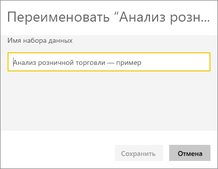
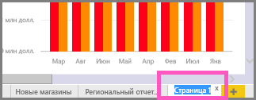

# Переименование содержимого в службе Power BI
В этой статье показано, как изменить имя информационной панели, отчета, страницы отчета, книги, набора данных, приложения и рабочей области в службе Power BI.

**Кто может изменять имена**

| Тип содержимого | Автор или создатель | Панель "Мне предоставлен доступ" |
| --- | --- | --- |
| Информационная панель в рабочей области |Да |Нет |
| Отчет в рабочей области |Да |Нет |
| Книга в рабочей области |Да |Нет |
| Набор данных в рабочей области |Да |Нет |
| Рабочая область приложения |Да, если вы владелец или имеете разрешения администратора. |Нет |
| Опубликованные приложения |Не в приложении. Имя приложения можно изменить в рабочей области приложения, а затем это приложение необходимо повторно опубликовать с новым именем, если у вас есть разрешения администратора. |Нет |
| Содержимое приложения (информационная панель, отчет, книга, набор данных) |Не в приложении. Содержимое приложения можно переименовать в рабочей области приложения, а затем это приложение необходимо повторно опубликовать, если у вас есть разрешения администратора. |Нет |
| Содержимое на панели **Мне предоставлен доступ** |Нет |Нет |

## Переименование информационной панели, отчета или книги
1. Запустите рабочую область и выберите вкладку **Информационные панели**, **Отчеты** или **Книги**. Наведите указатель мыши на элемент, имя которого необходимо изменить, и щелкните значок шестеренки . Если значок шестеренки не отображается, у вас нет разрешений переименовывать.
   
   
2. На странице "Параметры" введите новое имя и щелкните **Сохранить**.
   
   

## Переименование набора данных
1. Запустите рабочую область и выберите вкладку **Наборы данных**.
   
   
2. Наведите указатель мыши на элемент, имя которого необходимо изменить, щелкните многоточие (...) и выберите **Переименовать**.  
   
      
   
   > [!NOTE]
   > Параметры в раскрывающемся списке могут отличаться.
   > 
   > 
3. На странице "Параметры" введите новое имя и щелкните **Сохранить**.
   
     

## Переименование рабочей области приложения
Любой пользователь с правами администратора может изменить имя рабочей области приложения.

1. Войдите в рабочую область, имя которой требуется изменить.
2. В правом верхнем углу щелкните многоточие (...) и выберите **Edit workspace** (Изменить рабочую область). Если этот параметр не отображается, у вас нет разрешений переименовывать эту рабочую область. 
   
    
3. Введите новое имя рабочей области и щелкните **Сохранить**.
   
   

## Переименование страницы в отчете
Не нравится имя страницы в отчете Power BI?  Новое имя назначить очень просто. Имена страниц можно изменять в [режиме правки отчета](service-interact-with-a-report-in-editing-view.md).

1. Откройте отчет в [режиме редактирования](consumer/end-user-reading-view.md).
2. Найдите вкладки страницы отчета в нижней части окна Power BI.
   
    
3. Откройте страницу отчета, которую нужно переименовать. Для этого перейдите на соответствующую вкладку.
4. Дважды щелкните имя вкладки, чтобы выделить его.  
   
    
5. Введите новое имя страницы отчета и нажмите клавишу ВВОД.
   
    

## Рекомендации и устранение неполадок
* Если к элементу, который нужно переименовать, вам предоставили доступ или он входит в пакет содержимого, значок шестеренки отображаться не будет, и у вас не будет доступа к странице "Параметры".
* Если вы не видите многоточие (...) на вкладке **Наборы данных**, разверните окно браузера.

Появились дополнительные вопросы? [Ответы на них см. в сообществе Power BI.](http://community.powerbi.com/)

