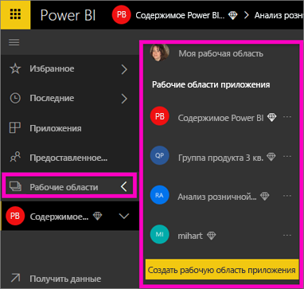
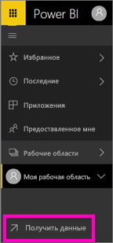
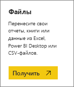
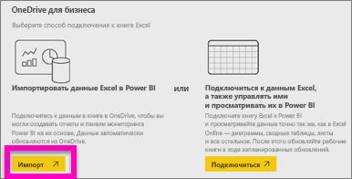
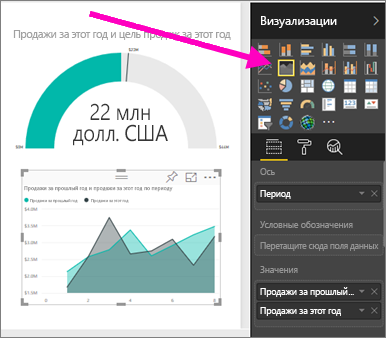

# Создание отчета в службе Power BI путем импорта набора данных
Вы ознакомились со статьей [Отчеты в Power BI](service-reports.md) и хотите создать свои собственные отчеты. Существует много различных способов создания отчетов. В этой статье мы создадим простой отчет из набора данных Excel, воспользовавшись службой Power BI. Поняв принцип создания отчета, вы можете ознакомиться с более подробными темами в разделе **Дальнейшие действия** ниже.  

> **Совет.** Сведения о создании отчета из имеющегося отчета см. [здесь](power-bi-report-copy.md).
> 
### Предварительные требования
- Служба Power BI (сведения о создании отчетов с помощью приложения Power BI Desktop см. в статье [Представление отчетов в Power BI Desktop](desktop-report-view.md)).  
- Набор данных "Анализ розничной торговли — пример"

## Импорт набора данных
Чтобы создать отчет таким способом, сначала вам потребуется набор данных и пустой холст отчета. Для дальнейшей работы [скачайте набор данных Excel "Анализ розничной торговли — пример"](http://go.microsoft.com/fwlink/?LinkId=529778) и сохраните его в OneDrive для бизнеса (предпочтительный вариант) или в локальной среде.

1. Мы создадим отчет в рабочей области службы Power BI, поэтому создайте рабочую область или выберите существующую.
   
   
2. В нижней части панели навигации слева выберите **Получить данные**.
   
   
3. Выберите **Файлы** и перейдите к расположению, в котором вы сохранили пример анализа розничной торговли.
   
    
4. Для этого упражнения выберите **Импорт**.
   
   
5. После импорта набора данных выберите **Просмотреть набор данных**.
   
   
6. При просмотре набора фактически запускается редактор отчетов.  На экране появляется пустой холст и инструменты для редактирования отчета.
   
   

> **Совет.** Если вы еще не работали с холстом редактирования отчета или хотите вспомнить ранее изученные сведения, перед продолжением прочтите статью [Знакомство с редактором отчетов](service-the-report-editor-take-a-tour.md).
> 
> 

## Добавление диаграммы "Радиальный датчик" в отчет
После импорта набора данных сначала ответим на некоторые вопросы.  Руководитель отдела маркетинга хочет знать, насколько мы близки к запланированному показателю продаж в этом году. Визуальный элемент "Датчик" [хорошо подходит](power-bi-report-visualizations.md) для отображения такого типа информации.

1. В области "Поля" выберите **По продажам** > **This Year Sales** (Продажи за этот год) > **Значение**.
   
    
2. Преобразуйте визуальный элемент в датчик, выбрав соответствующий шаблон  в области **VIsualizations** (Визуализации).
   
    
3. Перетащите поле **Sales** (Продажи) > **This Year Sales** (Продажи за этот год) > **Goal** (Цель) в столбец **Целевое значение**. Похоже, мы очень близки к цели.
   
    
4. Теперь [сохраните отчет](service-report-save.md).
   
   

## Добавление диаграммы с областями и среза в отчет
Руководитель отдела маркетинга имеет дополнительные вопросы. Он хотел узнать об уровне продаж в этом году по сравнению с предыдущим, а также хотел бы увидеть результаты по региону.

1. Во-первых, создадим дополнительное пространство на холсте. Выберите визуальный элемент "Датчик" и переместите его в правый верхний угол. Затем перетащите один из углов, чтобы уменьшить размер холста.
2. Отмените выбор визуального элемента "Датчик". В области "Поля" выберите **По продажам** > **This Year Sales** (Продажи за этот год) > **Значение** и выберите **По продажам** > **Last Year Sales** (Продажи за прошлый год).
   
    
3. Преобразуйте визуальный элемент в диаграмму с областями, выбрав соответствующий шаблон  в области **VIsualizations** (Визуализации).
4. Выберите **Время** > **Период**, чтобы добавить время в качестве **оси**.
   
    
5. Чтобы отсортировать визуальные элементы по времени, нажмите кнопку с многоточием и выберите **Sort by Period** (Сортировать по периоду).
6. Теперь добавим срез. Щелкните пустую область на холсте и выберите шаблон Slicer     (Срез). После этого на холсте появится пустой срез.
   
        
7. В области "Поля" выберите **District** (Округ) > **District** (Округ). Переместите срез и измените его размер.
   
      
8. Срез позволяет находить шаблоны и аналитические сведения по округу.
   
     

Продолжайте анализировать данные и добавлять визуализации. Если вы найдете особенно интересную информацию, [закрепите ее на панели мониторинга](service-dashboard-pin-tile-from-report.md).

## Дальнейшие действия
* [Добавление страницы в отчет Power BI](power-bi-report-add-page.md)  
* [Закрепление плитки на панели мониторинга Power BI из отчета](service-dashboard-pin-tile-from-report.md)   
* Появились дополнительные вопросы? [Ответы на них см. в сообществе Power BI.](http://community.powerbi.com/)

