# Подписка на отчет или панель мониторинга Power BI
Теперь получать актуальные версии важных панелей мониторинга и отчетов стало проще, чем когда-либо. Подпишитесь на страницы наиболее важных отчетов и панели мониторинга, и Power BI будет отправлять вам моментальные снимки по электронной почте. Вы можете указать, с какой частотой это нужно делать: ежедневно или еженедельно.

> [!NOTE]
> Подписки можно создавать только в службе Power BI. Вы получите сообщение со ссылкой "go to report/dashboard" (Перейти к отчету или панели мониторинга). На мобильных устройствах с приложениями Power BI при выборе этой ссылки запустится приложение (в отличие от сайта Power BI, где по умолчанию открывается отчет или панель мониторинга).
> 
> 

Посмотрите видео, где Сируи настраивает подписку на отчет по электронной почте. Затем сделайте то же самое, выполнив пошаговые инструкции, приведенные под видео.

<iframe width="560" height="315" src="https://www.youtube.com/embed/saQx7G0pxhc" frameborder="0" allowfullscreen></iframe>

## Требования
**Создание** подписки — функция Power BI Pro. Для ее использования требуется разрешение на просмотр или изменение содержимого (панели мониторинга или отчета).

## Подписка на панель мониторинга
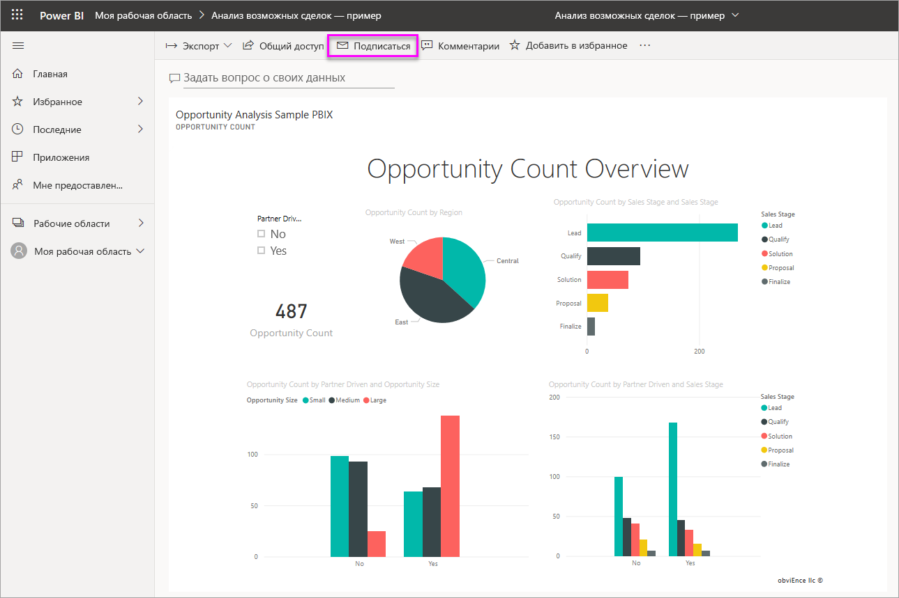

1. Откройте информационную панель.
2. В верхней строке меню выберите **Подписаться** или нажмите значок конверта .
   
   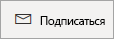
3. Для включения и отключения подписки используйте ползунок желтого цвета.  Установив ползунок в положение "Выкл.", вы не удалите подписку. Для удаления подписки выберите значок корзины.
   
   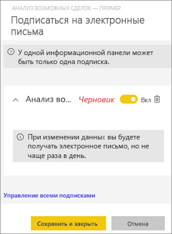
4. Чтобы сохранить подписку, щелкните **Сохранить и закрыть**. Вы будете получать моментальный снимок панели мониторинга по электронной почте при каждом изменении базовых наборов данных. Если панель мониторинга обновляется несколько раз в день, вы получите по электронной почте только тот моментальный снимок, который создан после первого обновления.
   
   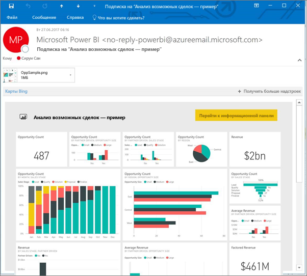
   
   > [!TIP]
   > Хотите получить сообщение электронной почты прямо сейчас? Активируйте сообщение электронной почты, обновив один из наборов данных, связанных с панелью мониторинга. Если у вас нет разрешений на изменение набора данных, попросите пользователя с соответствующими правами сделать это для вас. Чтобы узнать, какие наборы данных использованы для создания панели мониторинга, щелкните значок **Просмотреть похожие** , чтобы открыть окно **Связанное содержимое**, и щелкните значок обновления . 
   > 
   > 
   
   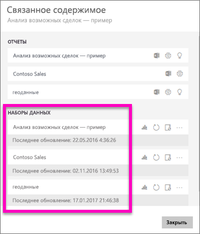

## Подписка на страницу отчета
1. Откройте отчет в [режиме чтения](service-report-open-in-reading-view.md).
2. В верхней строке меню выберите **Подписаться**.
   
   
3. За один раз можно подписаться на одну страницу отчета. В раскрывающемся списке выберите конкретную страницу отчета.
   
   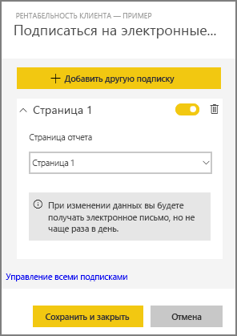
   
   Продолжайте добавлять страницы отчета.
4. Чтобы включить или отключить подписку для каждой страницы, используйте ползунок желтого цвета.  Установив ползунок в положение "Выкл.", вы не удалите подписку. Для удаления подписки выберите значок корзины.
   
   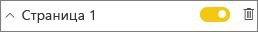
5. Чтобы сохранить подписку, щелкните **Сохранить и закрыть**. Когда отчет будет обновлен, вы получите по электронной почте моментальный снимок каждой его страницы. В дни, когда отчет не обновляется, вы не будете получать моментальные снимки по электронной почте.  Если отчет обновляется несколько раз в день, вы получите по электронной почте только тот моментальный снимок, который создан после первого обновления.
   
   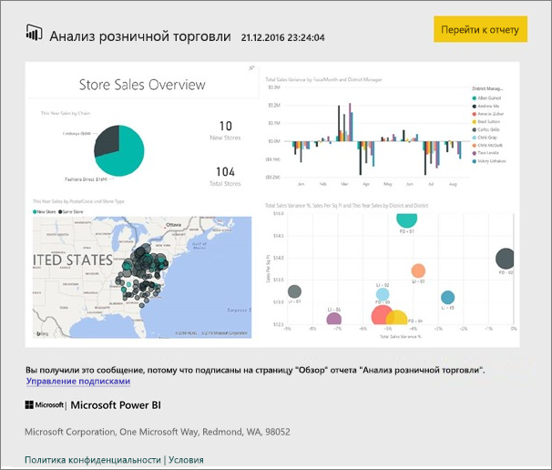
   
   > [!TIP]
   > Хотите получить сообщение электронной почты прямо сейчас? Активируйте отправку сообщения, открыв набор данных и выбрав команду **Обновить сейчас**. Если у вас нет разрешений на изменение набора данных, попросите пользователя с соответствующими правами сделать это для вас.
   > 
   > 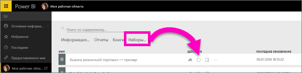
   > 
   > 

## Как настроить расписание отправки отчетов по электронной почте
В следующей таблице представлена периодичность отправки сообщений электронной почты. Все зависит от метода подключения набора данных, на основе которого создается панель мониторинга или отчет (DirectQuery, Live Connect, импорт в Power BI или файл Excel в OneDrive либо SharePoint Online), а также доступных и выбранных параметров подписки (ежедневное или еженедельное обновление либо его отсутствие).

|  | **DirectQuery** | **Live Connect** | **Запланированное обновление (импорт)** | **Файл Excel в OneDrive или SharePoint Online** |
| --- | --- | --- | --- | --- |
| **С какой частотой обновляется отчет или панель мониторинга?** |Каждые 15 минут |Power BI выполняет проверку каждые 15 минут. Если набор данных изменился, отчет обновляется. |Обновление может быть ежедневным или еженедельным либо не выполняться вообще. Ежедневное обновление может выполняться до 8 раз в сутки. Еженедельное обновление — это по сути создаваемое пользователем расписание обновления с частотой от одного раза в неделю до одного раза в день. |Каждый час |
| **Какую частоту может указать пользователь для подписки на рассылку по электронной почте?** |Варианты: ежедневно или еженедельно |Без вариантов: если отчет обновляется, пользователю отправляется сообщение электронной почты, но не чаще одного раза в день. |Если в расписании задано ежедневное обновление, возможно ежедневное и еженедельное выполнение операции.  Если в расписании задано еженедельное обновление, возможно только еженедельное выполнение операции. |Без вариантов: если набор данных обновляется, пользователю отправляется сообщение электронной почты, но не чаще одного раза в день. |

## Управление подписками
Открыть экран для управления подписками можно двумя способами.  Первый способ: в диалоговом окне **Оформление подписки на рассылку по электронной почте** можно выбрать параметр **Управление всеми подписками** (см. шаг 3 выше). Второй способ: в верхней строке меню щелкните значок шестеренки  Power BI и выберите **Параметры**.

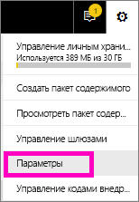

Перечень отображаемых подписок зависит от того, какая рабочая область сейчас активна.  Чтобы отобразить сразу все подписки для всех рабочих областей, активируйте параметр **Моя рабочая область**. Чтобы разобраться в том, что такое рабочие области, см. сведения о [рабочих областях в Power BI](service-create-distribute-apps.md).

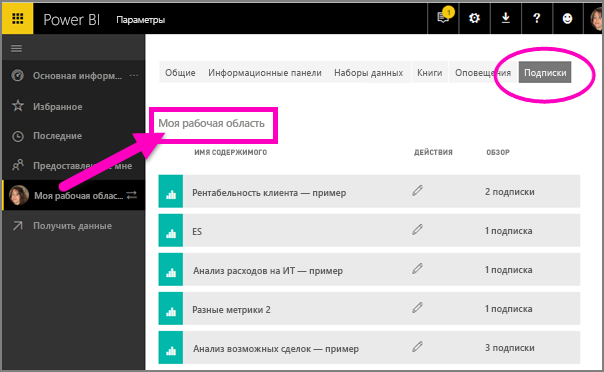

По истечении срока действия лицензии Pro подписка заканчивается, панель мониторинга или отчет удаляется владельцем, учетная запись пользователя для создания подписки также удаляется.

## Рекомендации и устранение неполадок
* Сейчас подписка на панели мониторинга или отчеты, создаваемые пакетами содержимого или приложениями Power BI, недоступна. Но есть и решение: создайте копию отчета или панели мониторинга и добавьте подписки на эту версию.
* Настроив для наборов данных динамического подключения подписку на рассылку по электронной почте, вы будете получать сообщения электронной почты только при изменении данных. Следовательно, если обновление выполнено без изменения данных, Power BI не будет отправлять вам сообщение электронной почты.
* Подписки на рассылку по электронной почте не поддерживают большинство [пользовательских визуальных элементов](power-bi-custom-visuals.md).  Единственным исключением являются [сертифицированные](power-bi-custom-visuals-certified.md) пользовательские элементы.  
* Подписки на рассылку по электронной почте обрабатываются с учетом состояний среза и стандартного фильтра отчета. Любые изменения стандартных значений, внесенные до оформления подписки, не будут отображаться в сообщениях электронной почты.    
* Почтовые подписки еще не поддерживаются на страницах отчетов, созданных с помощью функции активного подключения к службе Power BI Desktop.    
* Для подписок на панели мониторинга некоторые типы плиток пока не поддерживаются.  К ним относятся плитки потоковой передачи, видео и пользовательского веб-содержимого.     
* При совместном использовании панели мониторинга с коллегами вне вашего клиента они не смогут подписаться на панель мониторинга или связанные с ней страницы отчета. Таким образом, если вы aaron@xyz.com, вы сможете предоставить общий доступ anyone@ABC.com.  Но anyone@ABC.com не сможет подписаться на общее содержимое.    
* Попытка подписки на панели мониторинга и отчеты с изображениями очень большого размера может быть неудачной из-за ограничений электронной почты.    
* Power BI автоматически приостанавливает обновление наборов данных, связанных с панелями мониторинга и отчетами, которые не просматривались более 2 месяцев.  Но если добавить подписку на панель мониторинга или отчет, она не будет приостановлена даже при отсутствии посещений.    
* Если вы не получаете сообщения электронной почты по подписке, убедитесь, что ваше имя субъекта-пользователя (UPN) поддерживает получение сообщений электронной почты. [Команда Power BI работает над смягчением этого требования](https://community.powerbi.com/t5/Issues/No-Mail-from-Cloud-Service/idc-p/205918#M10163) — следите за новостями. 

## Дальнейшие действия
* Появились дополнительные вопросы? [Попробуйте задать вопрос в сообществе Power BI.](http://community.powerbi.com/)    
* [Ознакомьтесь с этой записью блога.](https://powerbi.microsoft.com/blog/introducing-dashboard-email-subscriptions-a-360-degree-view-of-your-business-in-your-inbox-every-day/)

