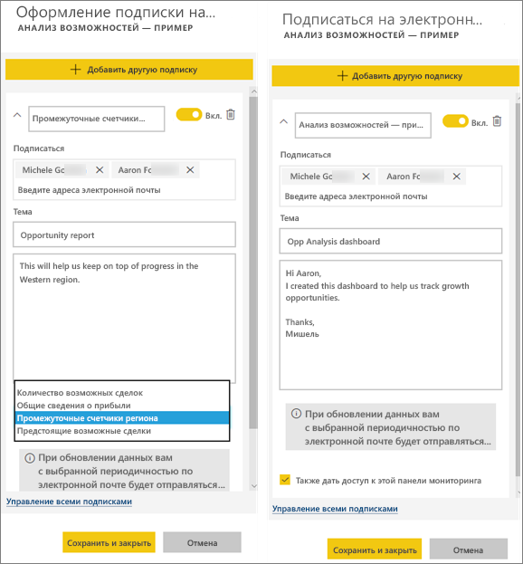

# Подписка на отчет или панель мониторинга в службе Power BI
Теперь получать актуальные версии важных панелей мониторинга и отчетов стало проще, чем когда-либо. Подпишитесь сами и подпишите своих коллег на самые важные страницы отчетов и панели мониторинга, и Power BI будет отправлять вам моментальные снимки по электронной почте. Вы можете указать, с какой частотой это нужно делать: ежедневно или еженедельно. 

Для электронной почты и моментальных снимков будет использоваться язык, заданный в параметрах Power BI (см. статью [Поддерживаемые языки и страны (регионы) для Power BI](supported-languages-countries-regions.md)). Если язык не задан, в Power BI используется язык, установленный в текущем браузере. Чтобы просмотреть или настроить предпочитаемый язык, выберите значок шестеренки  >   **> Параметры > Общие > Язык**. 

Подписки можно создавать только в службе Power BI. Вы получите электронное письмо со ссылкой "Перейти к отчету или панели мониторинга". На мобильных устройствах с приложениями Power BI при выборе этой ссылки запустится приложение (в отличие от сайта Power BI, где по умолчанию открывается отчет или панель мониторинга).

## Требования
- **Создание** подписки — функция Power BI Pro. Для ее использования необходимы разрешения на изменение содержимого (панели мониторинга или отчета). 
- Электронные письма по подписке отправляются только при обновлении или изменении базового набора данных, поэтому подписки не работают для наборов данных, которые не поддерживают такие действия.

## Подписка на панель мониторинга или страницу отчета
Процедуры подписки на панель мониторинга и отчет почти не отличаются. Для оформления подписки на панели мониторинга и отчеты службы Power BI как для себя, так и для других пользователей используется одна и та же кнопка.
 
.

1. Откройте панель мониторинга или отчет.
2. В верхней строке меню выберите **Subscribe** (Подписаться) или нажмите значок конверта .
   
   

3. Для включения и отключения подписки используйте ползунок желтого цвета.  Установив ползунок в положение "Выкл.", вы не удалите подписку. Для удаления подписки выберите значок корзины.

4. Введите данные в сообщение электронной почты. Письмо будет предварительно заполнено, но вы также можете добавить в подписку других пользователей. Вы можете добавлять только адреса электронной почты из одного домена (дополнительные сведения см. ниже в разделе **Рекомендации и устранение неполадок**). Если отчет или панель мониторинга размещается в [емкости Premium](service-premium.md), вы сможете подписывать других пользователей по отдельным адресам электронной почты и групповым псевдонимам. Если отчет или панель мониторинга не размещены в емкости Premium, вы тоже можете подписывать других по отдельным адресам, но у этих пользователей должны быть лицензии Power BI Pro, как у вас.

    На снимках экрана ниже обратите внимание, что при подписке на отчет вы фактически подписываетесь на *страницу* отчета.  Чтобы подписаться в отчете на несколько страниц, нажмите **Добавить другую подписку** и выберите другую страницу. 
      
     

5. Чтобы сохранить подписку, щелкните **Сохранить и закрыть**. Подписчики будут получать электронное письмо и моментальный снимок панели мониторинга или страницы отчета каждый раз, когда в них изменяются наборы данных. Если панель мониторинга или отчет обновляется несколько раз за день, письмо отправляется только при первом обновлении.  
   
    
   
   > [!TIP]
   > Хотите получить сообщение электронной почты прямо сейчас? Активируйте сообщение электронной почты, обновив один из наборов данных, связанных с панелью мониторинга или отчетом. Если у вас нет разрешений на изменение набора данных, попросите пользователя с соответствующими правами сделать это для вас. Чтобы узнать, какие используются наборы данных, щелкните значок **Просмотреть похожие** , чтобы открыть **Связанное содержимое**, а затем щелкните значок обновления . 
   > 
   > 
   
   

## Как настроить расписание отправки сообщений электронной почты
В следующей таблице представлена периодичность отправки сообщений электронной почты. Все зависит от метода подключения набора данных, на основе которого создается панель мониторинга или отчет (DirectQuery, Live Connect, импорт в Power BI или файл Excel в OneDrive либо SharePoint Online), а также доступных и выбранных параметров подписки (ежедневное или еженедельное обновление либо его отсутствие).

|  | **DirectQuery** | **Live Connect** | **Запланированное обновление (импорт)** | **Файл Excel в OneDrive или SharePoint Online** |
| --- | --- | --- | --- | --- |
| **С какой частотой обновляется отчет или панель мониторинга?** |Каждые 15 минут |Power BI выполняет проверку каждые 15 минут. Если набор данных изменился, отчет обновляется. |Обновление может быть ежедневным или еженедельным либо не выполняться вообще. Ежедневное обновление может выполняться до 8 раз в сутки. Еженедельное обновление — это по сути создаваемое пользователем расписание обновления с частотой от одного раза в неделю до одного раза в день. |Каждый час |
| **Какую частоту может указать пользователь для подписки на рассылку по электронной почте?** |Варианты: ежедневно или еженедельно |Варианты отсутствуют. Если отчет обновляется, пользователю отправляется сообщение электронной почты, но не чаще одного раза в день. |Если в расписании задано ежедневное обновление, возможно ежедневное и еженедельное выполнение операции.  Если в расписании задано еженедельное обновление, возможно только еженедельное выполнение операции. |Без вариантов: если набор данных обновляется, пользователю отправляется сообщение электронной почты, но не чаще одного раза в день. |

## Управление подписками
Управлять подпиской может только тот, кто ее создал.  Открыть экран для управления подписками можно двумя способами.  Первый способ: в диалоговом окне **Оформление подписки на рассылку по электронной почте** выберите **Управление всеми подписками** (см. снимки экрана для шага 4 выше). Второй способ: в верхней строке меню щелкните значок шестеренки  Power BI и выберите **Settings** (Параметры).

Перечень отображаемых подписок зависит от того, какая рабочая область сейчас активна.  Чтобы отобразить сразу все подписки для всех рабочих областей, активируйте параметр **Моя рабочая область**. Чтобы разобраться в том, что такое рабочие области, см. сведения о [рабочих областях в Power BI](service-create-distribute-apps.md).

По истечении срока лицензии Pro действие подписки прекращается, панель мониторинга или отчет удаляется владельцем либо удаляется учетная запись пользователя, с которой была создана подписка.

## Рекомендации и устранение неполадок
* Для подписок на электронную почту панели мониторинга плитки, для которых действует безопасность на уровне строк (RLS), не отображаются.  Что касается подписок на отчеты по электронной почте, если для набора данных действует безопасность на уровне строк (RLS), вы не можете создавать подписки.
* Подписки на страницу отчета привязаны к ее имени. Если вы подпишетесь на страницу отчета и переименуете ее, потребуется создать подписку повторно.
* В Azure Active Directory вы можете настроить некоторые параметры, которые ограничивают возможность использования в Power BI подписок, оформляемых по электронной почте.  Среди прочего, такой эффект дает применение многофакторной проверки подлинности и ограничение диапазона IP-адресов для доступа к ресурсам.
* В настоящее время вы не можете оформлять другим пользователям подписку по электронной почте на отчеты и панели мониторинга, где используются наборы данных с динамическим подключением.
* Настроив для наборов данных динамического подключения подписку на рассылку по электронной почте, вы будете получать сообщения электронной почты только при изменении данных. Следовательно, если обновление выполнено без изменения данных, Power BI не будет отправлять вам сообщение электронной почты.
* Подписки на рассылку по электронной почте не поддерживают большинство [пользовательских визуальных элементов](power-bi-custom-visuals.md).  Единственным исключением являются [сертифицированные](power-bi-custom-visuals-certified.md) пользовательские элементы.  
* Подписка по электронной почте сейчас не поддерживает настраиваемые визуальные элементы на базе языка R.  
* Плитки панели мониторинга, для которых действует безопасность на уровне строк (RLS), не отображаются.
* Нельзя подписать других пользователей на отчет, к которому применяется безопасность на уровне строк (RLS).
* Подписки на рассылку по электронной почте обрабатываются с учетом состояний среза и стандартного фильтра отчета. Любые изменения стандартных значений, внесенные после оформления подписки, в письмах отображаться не будут.    
* Почтовые подписки еще не поддерживаются на страницах отчетов, созданных с помощью функции активного подключения к службе Power BI Desktop.    
* Для подписок на панели мониторинга некоторые типы плиток пока не поддерживаются.  К ним относятся плитки потоковой передачи, видео и пользовательского веб-содержимого.     
* При совместном использовании панели мониторинга с коллегами не из вашего клиента вы не сможете также создать для них подписку. Например, если вы aaron@xyz.com, вы сможете предоставить общий доступ anyone@ABC.com, но не сможете подписать anyone@ABC.com, и этот пользователь не сможет подписаться на предоставляемое содержимое.      
* Попытка подписки на панели мониторинга и отчеты с изображениями очень большого размера может быть неудачной из-за ограничений электронной почты.    
* Power BI автоматически приостанавливает обновление наборов данных, связанных с панелями мониторинга и отчетами, которые не просматривались более 2 месяцев.  Но если добавить подписку на панель мониторинга или отчет, она не будет приостановлена даже при отсутствии посещений.    
* Если вы не получаете сообщения электронной почты по подписке, убедитесь, что ваше имя субъекта-пользователя (UPN) поддерживает получение сообщений электронной почты. [Команда Power BI работает над смягчением этого требования](https://community.powerbi.com/t5/Issues/No-Mail-from-Cloud-Service/idc-p/205918#M10163) — следите за новостями. 
* Если панель мониторинга или отчет находится в емкости Premium, вы можете не подписывать коллег по отдельным адресам, а использовать групповые псевдонимы электронной почты. Псевдонимы зависят от текущей службы каталогов Active Directory. 

## Дальнейшие действия
* Появились дополнительные вопросы? [Попробуйте задать вопрос в сообществе Power BI.](http://community.powerbi.com/)    
* [Ознакомьтесь с этой записью блога.](https://powerbi.microsoft.com/blog/introducing-dashboard-email-subscriptions-a-360-degree-view-of-your-business-in-your-inbox-every-day/)

