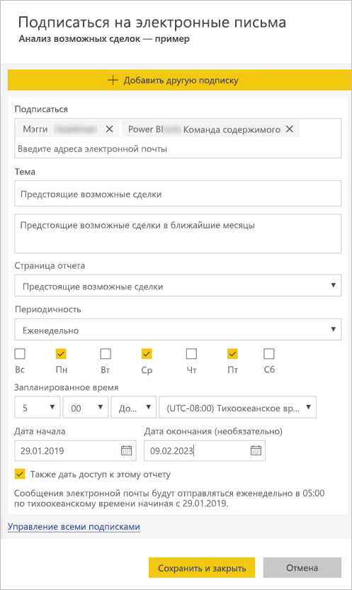
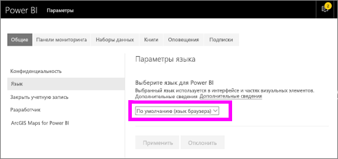

# Создание подписки на отчеты и панели мониторинга в службе Power BI для себя и других пользователей

Вы можете оформить подписку для себя и своих коллег на самые важные страницы отчетов и панели мониторинга, и Power BI будет отправлять вам моментальные снимки по электронной почте. Вы можете указать, с какой частотой это нужно делать: ежедневно, еженедельно или после первоначального обновления данных (раз в день).  Если выбрать ежедневную или еженедельную отправку, можно указать время запуска рассылки.  В целом можно настроить до 24 разных рассылок в день для каждой страницы отчета и панели мониторинга.

 

Подписки можно создавать только в службе Power BI. Вы получите сообщение электронной почты с моментальным снимком страницы отчета или панели мониторинга и ссылкой для открытия этого отчета или панели мониторинга. На мобильных устройствах с приложениями Power BI при выборе этой ссылки запустится приложение Power BI (в отличие от сайта Power BI, где открывается отчет или панель мониторинга).

## Требования
- **Создание** подписки — это одна из функций Power BI Pro.
- Для создания подписки для себя не требуются разрешения на изменение содержимого (панели мониторинга или отчета), однако у вас должны быть такие разрешения, если вы создаете подписку для другого пользователя. 
- Начиная с января 2019 г. для запуска рассылки больше не требуется настройка обновления набора данных.  Она выполняется независимо от любых настроенных плановых обновлений.  

## Подписка на панель мониторинга или страницу отчета
Процедуры подписки на панель мониторинга и отчет почти не отличаются. Одна кнопка позволяет оформить подписки на панели мониторинга и отчеты службы Power BI.
 
.

1. Откройте панель мониторинга или отчет.
2. В верхней строке меню выберите **Подписаться** или нажмите значок конверта .
   
   

3. Для включения и отключения подписки используйте ползунок желтого цвета.  Установив ползунок в положение **Выкл.**, вы не удалите подписку. Для удаления подписки выберите значок корзины.

4. Ваш адрес электронной почты уже указан в поле **Подписаться**. В подписку также можно добавить другие адреса электронной почты, но только из того же домена. Если отчет или панель мониторинга размещается в [емкости Premium](service-premium.md), вы сможете подписывать других пользователей по отдельным адресам электронной почты и групповым псевдонимам. Если отчет или панель мониторинга размещается в емкости Premium, вы можете подписывать других пользователей, но у них также должны быть лицензии Power BI Pro. Дополнительные сведения см. в разделе [Рекомендации и устранение неполадок](#considerations-and-troubleshooting) ниже. 

5. Введите нужные сведения в полях **Тема** и **Сообщение**. 

5. Выберите **частоту** для подписки: **Ежедневно**, **Еженедельно** или **После обновления данных (ежедневно)**.  Чтобы получать сообщения только в определенные дни, выберите вариант **Еженедельно**, а затем — нужные дни.  Например, если вы хотите получать рассылку по электронной почте только в рабочие дни, выберите **Еженедельно** и снимите флажки для **субботы** и **воскресенья**.  

6. При выборе варианта **Ежедневно** или **Еженедельно** вы также можете указать **запланированное время** рассылки.  Можно выполнять рассылку раз в час или через 15, 30 или 45 минут.  Выберите время с утра (AM) или после полудня (PM). Можно также указать часовой пояс.

7. По умолчанию датой начала подписки является дата ее создания. Вы можете выбрать дату окончания. Если не задать дату окончания, срок действия подписки автоматически истекает через год. Вы можете указать любую дату в будущем (до 9999 года) в любое время до истечения срока действия подписки. Когда будет достигнута дата окончания подписки, ее действие прекращается до повторного включения. Перед запланированной датой окончания подписки вы получите уведомление с запросом на продление.    

    На снимке экрана ниже обратите внимание, что при подписке на отчет вы фактически подписываетесь на *страницу* отчета.  Чтобы подписаться в отчете на несколько страниц, нажмите **Добавить другую подписку** и выберите другую страницу. 
      
     

7. Щелкните **Сохранить и закрыть**. Подписчики получают сообщение электронной почты и моментальные снимки страницы отчета или панели мониторинга с выбранной частотой и в указанное вами время. В общем можно создать до 24 подписок на отчет или панель мониторинга и указать уникальных получателей, значения времени и частоты для каждой подписки.  Все подписки, для которых для отчета или панели мониторинга задана частота **После обновления данных**, будут отправлять сообщение только после первого запланированного обновления.   
      
   > [!TIP]
   > Хотите отправлять электронное письмо из подписки немедленно или по требованию в любое время? Выберите **Выполнить** для подписок в панели мониторинга или отчете, которые будут отправлять сообщение. Появится уведомление, информирующее об отправке электронного письма всем пользователям конкретной подписки.  Эту операцию можно проделывать сколько угодно раз. Она не учитывается как один из 24 максимально допустимых запланированных запусков подписки в день на каждый отчет или панель мониторинга. Обратите внимание, что это не приводит к обновлению используемого набора данных. 
   > 
   > 
   
## Язык сообщений

Для электронной почты и моментальных снимков используется язык, заданный в параметрах Power BI (см. статью [Поддерживаемые языки и страны (регионы) для Power BI](supported-languages-countries-regions.md)). Если язык не задан, в Power BI используется язык, установленный в текущем браузере. Чтобы просмотреть или настроить предпочитаемый язык, выберите значок шестеренки  >   **> Параметры > Общие > Язык**. 

## Управление подписками
Управлять подпиской может только тот, кто ее создал.  Открыть экран для управления подписками можно двумя способами.  Первый способ: в диалоговом окне **Оформление подписки на рассылку по электронной почте** выберите **Управление всеми подписками** (см. снимки экрана для шага 4 выше). Второй способ: в верхней строке меню щелкните значок шестеренки  Power BI и выберите **Settings** (Параметры).

Перечень отображаемых подписок зависит от того, какая рабочая область сейчас активна.  Чтобы отобразить сразу все подписки для всех рабочих областей, активируйте параметр **Моя рабочая область**. Чтобы разобраться в том, что такое рабочие области, см. сведения о [рабочих областях в Power BI](service-create-workspaces.md).

По истечении срока действия лицензии Pro подписка заканчивается, панель мониторинга или отчет удаляется владельцем или удаляется учетная запись пользователя для создания подписки.

## Рекомендации и устранение неполадок
* Панели мониторинга с более чем 25 закрепленными плитками или 4 закрепленными страницами динамического отчета могут отображаться не полностью в рассылках, отправляемых пользователям.  Подписки на панели мониторинга с числом плиток, превышающим это значение, блокироваться не будут. Однако при возникновении проблем они будут считаться неподдерживаемыми и должны быть соответствующим образом изменены, чтобы войти в диапазон поддерживаемых.
* В рассылках по панелям мониторинга плитки, для которых действует безопасность на уровне строк (RLS), не отображаются.  Что касается рассылок по отчетам, если для набора данных действует безопасность на уровне строк (RLS), вы не можете создавать подписки.
* Подписки на страницу отчета привязаны к ее имени. Если вы подпишетесь на страницу отчета и переименуете ее, потребуется создать подписку повторно.
* В Azure Active Directory вы можете настроить некоторые параметры, которые ограничивают возможность использования в Power BI подписок, оформляемых по электронной почте.  Эти ограничения включают в том числе применение многофакторной проверки подлинности и ограничение диапазона IP-адресов для доступа к ресурсам.
* В настоящее время вы не можете оформлять другим пользователям подписку по электронной почте на отчеты и панели мониторинга, где используются наборы данных с динамическим подключением.
* Подписки на рассылку по электронной почте не поддерживают большинство [пользовательских визуальных элементов](power-bi-custom-visuals.md).  Единственным исключением являются [сертифицированные](power-bi-custom-visuals-certified.md) пользовательские элементы.  
* Рассылка по электронной почте сейчас не поддерживает настраиваемые визуальные элементы на базе языка R.  
* Плитки панели мониторинга, для которых действует безопасность на уровне строк (RLS), не отображаются.
* Нельзя подписать других пользователей на отчет, к которому применяется безопасность на уровне строк (RLS).
* Подписки на рассылку по электронной почте обрабатываются с учетом состояний среза и стандартного фильтра отчета. Любые изменения стандартных значений, внесенные после оформления подписки, в письмах не отображаются.    
* Для подписок на панели мониторинга некоторые типы плиток пока не поддерживаются.  К ним относятся плитки потоковой передачи, видео и пользовательского веб-содержимого.     
* При совместном использовании панели мониторинга с коллегами не из вашего клиента вы также не можете создать для них подписку. Например, если вы aaron@xyz.com, вы можете предоставить общий доступ anyone@ABC.com, но не сможете подписать anyone@ABC.com, и этот пользователь не может подписаться на предоставляемое содержимое.      
* Попытка подписки на панели мониторинга и отчеты с изображениями очень большого размера может быть неудачной из-за ограничений электронной почты.    
* Power BI автоматически приостанавливает обновление наборов данных, связанных с панелями мониторинга и отчетами, которые не просматривались более двух месяцев.  Однако если добавить подписку на панель мониторинга или отчет, она не приостанавливается даже при отсутствии посещений.    
* Если вы не получаете рассылку по подписке, убедитесь, что ваше имя участника-пользователя (UPN) поддерживает получение сообщений электронной почты. [Команда Power BI работает над смягчением этого требования](https://community.powerbi.com/t5/Issues/No-Mail-from-Cloud-Service/idc-p/205918#M10163) — следите за новостями. 
* Если панель мониторинга или отчет находится в емкости Premium, вы можете не подписывать коллег по отдельным адресам, а использовать групповые псевдонимы электронной почты. Псевдонимы зависят от текущей службы каталогов Active Directory. 

## Дальнейшие действия
* Появились дополнительные вопросы? [Попробуйте задать вопрос в сообществе Power BI.](http://community.powerbi.com/)    
* [Ознакомьтесь с этой записью блога.](https://powerbi.microsoft.com/blog/introducing-dashboard-email-subscriptions-a-360-degree-view-of-your-business-in-your-inbox-every-day/)

