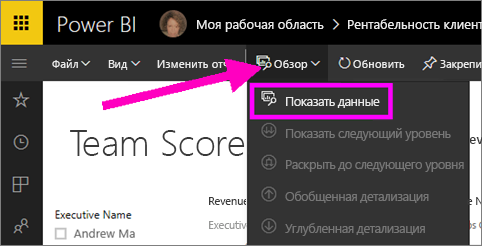
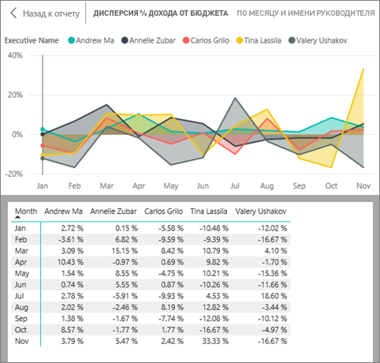
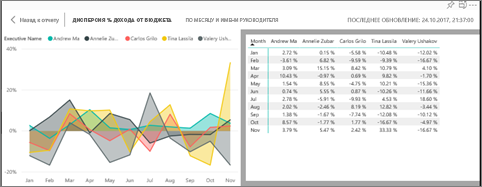
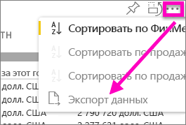

# Отображение данных, использованных для создания визуализации
## Отображение данных
Визуализация Power BI создается на основе данных из наборов данных. Если вы хотите копнуть поглубже, Power BI дает возможность *просмотреть* данные, лежащие в основе визуального элемента. Если выбрать функцию **Показать данные**, Power BI отобразит рядом с визуализацией или под ней связанную информацию.

Данные, используемые для создания визуализации, можно экспортировать в файл XLSX или CSV и просмотреть его в Excel. Дополнительные сведения см. в статье [Экспорт данных из визуализаций Power BI](power-bi-visualization-export-data.md).

> [!NOTE]
> Функции *Показать данные* и *Экспортировать данные* доступны как в службе Power BI, так и в приложении Power BI Desktop. Но в Power BI Desktop есть дополнительный уровень детализации: функция [*Показать записи* отображает фактические строки из набора данных](desktop-see-data-see-records.md).
> 
> 

## Использование функции *Показать данные* в службе Power BI
1. В службе Power BI откройте отчет в [режиме чтения](service-report-open-in-reading-view.md) или [режиме правки](service-reading-view-and-editing-view.md) и выберите визуальный элемент.  В приложении Power BI Desktop откройте представление отчетов.
2. Чтобы отобразить данные, лежащие в основе визуального элемента, выберите **Проводник** > **Показать данные**.
   
   
3. По умолчанию данные отображаются под визуальным элементом.
   
   
4. Чтобы изменить ориентацию, в правом верхнем углу визуализации выберите вертикальный макет .
   
   
5. Чтобы экспортировать данные в CSV-файл, щелкните значок многоточия и выберите **Экспортировать данные**.
   
    
   
    Дополнительные сведения об экспорте данных в Excel см. в статье [Экспорт данных из визуализаций Power BI](power-bi-visualization-export-data.md).
6. Чтобы скрыть данные, снимите флажок, выбрав **Проводник** > **Показать данные**.

### Дальнейшие действия
[Экспорт данных из визуализаций Power BI](power-bi-visualization-export-data.md)    
[Визуализации в Power BI](power-bi-report-visualizations.md)    
[Отчеты в Power BI](service-reports.md)    
[Power BI — основные понятия](service-basic-concepts.md)    
Появились дополнительные вопросы? [Ответы на них см. в сообществе Power BI.](http://community.powerbi.com/)

