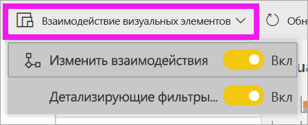

# Изменение способа взаимодействия визуальных элементов в отчете Power BI
При наличии разрешений на изменение отчета вы можете использовать **взаимодействие визуализаций**, чтобы задавать влияние друг на друга визуализаций на странице отчета. 

## Общие сведения о взаимодействии визуализации
По умолчанию визуализации на странице отчета можно использовать для кроссфильтрации и перекрестного выделения других визуализаций на странице.
Например, при выборе состояния в визуализации карты выделяется диаграмма столбца и фильтруется график, чтобы отобразить только данные, применимые к этому состоянию.
См. раздел [Сведения о фильтрации и выделении](power-bi-reports-filters-and-highlighting.md). При наличии визуализации, которая поддерживает [детализацию](consumer/end-user-drill.md), детализация одной визуализации по умолчанию не оказывает влияния на другие визуализации на странице отчета. Но вы можете переопределить оба этих способа работы по умолчанию и задать взаимодействия для каждой визуализации отдельно.

В этой статье показано, как использовать **взаимодействия визуализации** в Power BI Desktop. Процесс аналогичный [режиму правки](service-interact-with-a-report-in-editing-view.md) в службе Power BI. Если у вас есть доступ только для чтения или отчет предоставлен вам другим пользователем, вы не сможете изменять настройки взаимодействия визуализаций.

Термины *кроссфильтрация* и *перекрестное выделение* используются для отделения поведения, описанного здесь, от того, что происходит при использовании области **Фильтры** для *фильтрации* и *выделения* визуализаций.  

> [!NOTE]
> В этом видео используются более старые версии Power BI Desktop и служба Power BI. 
>
>

<iframe width="560" height="315" src="https://www.youtube.com/embed/N_xYsCbyHPw?list=PL1N57mwBHtN0JFoKSR0n-tBkUJHeMP2cP" frameborder="0" allowfullscreen></iframe>

## Включение элементов управления взаимодействием визуализации
При наличии разрешений на изменение отчета, вы можете включить элементы управления взаимодействием визуализации, а затем настроить отображение и выделение визуализаций на странице отчета. 

1. Выберите визуализацию, чтобы сделать ее активной.  
2. Откройте параметры **Взаимодействия визуализаций**.
    

    - В версии Desktop выберите **Формат > Взаимодействия**.

        

    - В службе Power BI откройте отчет в режиме редактирования и выберите раскрывающийся список в строке меню отчета.

        

3. Чтобы отобразить элементы управления взаимодействиями визуализаций, выберите **Изменить взаимодействия**. Power BI добавит значки фильтрации и выделения во все остальные визуализации на странице отчета. Теперь вы можете изменить способ взаимодействия выбранной визуализации с другими визуализациями на странице отчета.
   
    

## Изменение поведения взаимодействия
Ознакомьтесь с тем, как ваши визуализации взаимодействуют, выбрав каждую визуализацию на странице отчета, по одному.  Выберите точку данных, линейку или фигуру и посмотрите влияние на другие визуализации. Если отображаемое поведение не является предпочтительным, взаимодействия можно изменить. Эти изменения сохраняются вместе с отчетом, поэтому пользователи отчетов будут иметь одинаковый интерфейс взаимодействия визуализаций.

Укажите, как **выбранная визуализация** должна влиять на другие.  При необходимости повторите эти действия для всех остальных визуализаций на странице отчета.
   
   * Если нужно выполнить перекрестную фильтрацию визуализации, выберите значок **фильтра** .
   * Если нужно выполнить перекрестное выделение визуализации, выберите значок **выделения** .
   * Если влияния не должно быть, выберите значок **отсутствия влияния** .

## Изменение взаимодействий детализированных визуализаций
[Некоторые визуализации Power BI можно детализировать](consumer/end-user-drill.md). По умолчанию при детализации визуализации она не влияет на другие визуализации на странице отчета. Однако это поведение можно изменить. 

1. Выберите визуализацию с детализацией, чтобы сделать ее активной. 

> [!TIP]
> Попробуйте сами, используя [PBIX-файл "Управление персоналом — пример"](https://download.microsoft.com/download/6/9/5/69503155-05A5-483E-829A-F7B5F3DD5D27/Human%20Resources%20Sample%20PBIX.pbix) Здесь есть гистограмма с детализацией на вкладке **Новые сотрудники**.
>

2. В строке меню выберите **Формат** > **Детализирующие фильтры для других визуализаций**.  Теперь при детализации (и обобщении) другие визуализации на странице отчета изменяются в зависимости от выбранных вариантов детализации. 

    .
    
## Дальнейшие действия
[Фильтрация и выделение в отчетах Power BI](power-bi-reports-filters-and-highlighting.md)