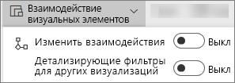
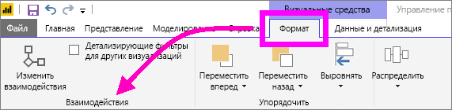
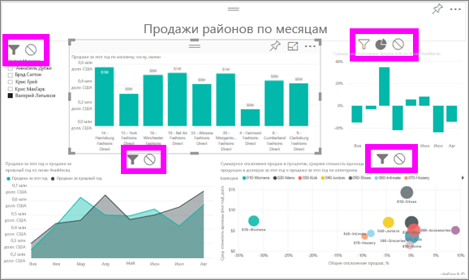

# Взаимодействия с визуализациями в отчете Power BI
При наличии разрешений на изменение отчета вы можете использовать **взаимодействие визуализаций**, чтобы задавать влияние друг на друга визуализаций на странице отчета. 

По умолчанию визуализации на странице отчета можно использовать для кроссфильтрации и перекрестного выделения других визуализаций на странице.
Например, при выборе состояния в визуализации карты выделяется диаграмма столбца и фильтруется график, чтобы отобразить только данные, применимые к этому состоянию.
См. раздел [Сведения о фильтрации и выделении](power-bi-reports-filters-and-highlighting.md). При наличии визуализации, которая поддерживает [детализацию](power-bi-visualization-drill-down.md), детализация одной визуализации по умолчанию не оказывает влияния на другие визуализации на странице отчета. Но вы можете переопределить оба этих способа работы по умолчанию и задать взаимодействия для каждой визуализации отдельно.

Эта статья описывает, как использовать **взаимодействие визуализаций** в [режиме редактирования](service-interact-with-a-report-in-editing-view.md) службы Power BI и в Power BI Desktop. Если отчет предоставлен вам другим пользователем, вы не сможете изменять настройки взаимодействия визуализаций.

> [!NOTE]
> Термины *кроссфильтрация* и *перекрестное выделение* используются для отделения поведения, описанного здесь, от того, что происходит при использовании области **Фильтры** для фильтрации и выделения визуализаций.  
> 
> 

<iframe width="560" height="315" src="https://www.youtube.com/embed/N_xYsCbyHPw?list=PL1N57mwBHtN0JFoKSR0n-tBkUJHeMP2cP" frameborder="0" allowfullscreen></iframe>

1. Выберите визуализацию, чтобы сделать ее активной.  
2. Откройте параметры **Взаимодействия визуализаций**.
    - В службе Power BI щелкните раскрывающийся список в строке меню отчета.

       

    - В версии Desktop выберите **Формат > Взаимодействия**.

        

3. Чтобы включить элементы управления взаимодействиями визуализаций, выберите **Изменить взаимодействия**. Power BI добавит значки перекрестной фильтрации и выделения во все остальные визуализации на странице отчета.
   
    
3. Укажите, как выбранная визуализация должна влиять на другие.  При необходимости повторите эти действия для всех остальных визуализаций на странице отчета.
   
   * Если нужно выполнить перекрестную фильтрацию визуализации, выберите значок **фильтра** .
   * Если нужно выполнить перекрестное выделение визуализации, выберите значок **выделения** .
   * Если влияния не должно быть, выберите значок **отсутствия влияния** .

4. Чтобы включить элементы управления детализации, выберите **Детализирующие фильтры для других визуализаций**.  Теперь при детализации (и обобщении) другие визуализации на странице отчета изменяются в зависимости от выбранных вариантов детализации. 

   

### Дальнейшие действия
[Использование фильтров отчетов](power-bi-how-to-report-filter.md)

[Фильтры и выделение в отчетах](power-bi-reports-filters-and-highlighting.md)

[Power BI — основные понятия](service-basic-concepts.md)

Появились дополнительные вопросы? [Ответы на них см. в сообществе Power BI.](http://community.powerbi.com/)

