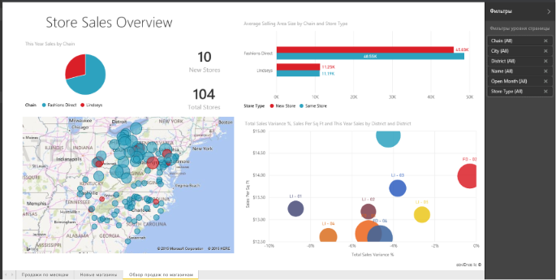

# Отчеты в Power BI
## Что такое отчет Power BI?
***Отчет*** Power BI — это разностороннее представление набора данных с визуализациями, которые отображают различные результаты и сведения, полученные из этого набора данных.  В отчете может быть одна визуализация или несколько страниц, заполненных визуализациями. В зависимости от вашей должности вы можете *создавать* или *использовать* отчеты.

Этот отчет содержит 3 страницы (или вкладки). В данный момент просматривается страница Store Sales Overview (Обзор продаж магазинов). На этой странице отображается 6 различных визуализаций и заголовок. Визуализации можно *закреплять* на информационных панелях. При выборе закрепленной визуализации открывается отчет, из которого она была закреплена.

Если вы недавно начали использовать службу Power BI, ознакомьтесь со статьей [Power BI — основные понятия](service-basic-concepts.md), где приведены базовые сведения.

Отчеты — это компонент службы Power BI и Power BI Desktop. Возможности работы с отчетами практически идентичны. Однако на мобильных устройствах нельзя создавать отчеты, но вы можете [просматривать и совместно использовать отчеты, а также добавлять к ним комментарии](mobile-reports-in-the-mobile-apps.md).

## Преимущества отчетов
Отчеты формируются на основе одного набора данных. Каждая визуализация в отчете представляет собой фрагмент данных. и не является статической. Работая с данными, вы можете добавить и удалить их, изменить типы визуализации и применить фильтры и срезы (учитывая углубленное изучение данных), чтобы обнаружить дополнительные сведения и получить ответы на вопросы. Как и информационная панель, отчет предоставляет широкие возможности для взаимодействия и настройки, при этом обновление визуализаций происходит при изменении базовых данных.

## Панели мониторинга и отчеты
[Информационные панели](service-dashboards.md) зачастую путают с отчетами, так как они также являются полотнами, заполненными визуализациями. Но есть некоторые существенные различия.  

| **Возможность** | **Панели мониторинга** | **Отчеты** |
| --- | --- | --- |
| Страницы |Одна страница |Одна или несколько страниц |
| Источники данных |Один или несколько отчетов и один или несколько наборов данных на каждую панель мониторинга |Один набор данных на каждый отчет |
| Доступность в Power BI Desktop |Нет |Да, можно создавать и просматривать отчеты на рабочем столе |
| Закрепление |Возможно закрепление существующих визуализаций (плиток) только из текущей панели мониторинга на другие панели мониторинга |Можно закреплять визуализации (в виде плиток) на любой из панелей мониторинга Можно закреплять целые страницы отчетов на любой из панелей мониторинга |
| Подписаться |На панель мониторинга подписаться нельзя |Можно подписаться на страницы отчета |
| Фильтрация |Невозможно выполнить фильтрацию и срез |Множество различных способов для выполнения фильтрации, выделения и среза |
| Настройка оповещений |Можно создавать оповещения, которые будут отправляться вам по электронной почте при соблюдении некоторых условий |Нет |
| Избранное |Можно задать одну панель мониторинга в качестве избранной |Нельзя создать избранный отчет |
| Запросы на естественном языке |Доступно на панели мониторинга |Недоступно из отчетов |
| Изменение типа визуализации |Нет. Фактически, если владелец отчета изменяет тип визуализации в отчете, закрепленная визуализация на панели мониторинга не обновляется |Да |
| Просмотр таблиц и полей базового набора данных |Нет. Можно экспортировать данные, но нельзя просматривать таблицы и поля непосредственно на панели мониторинга |Да. Можно просматривать таблицы, поля и значения набора данных |
| Создание визуализаций |Ограничивается возможностью добавления мини-приложений на панель мониторинга с помощью команды "Добавить плитку" |Можно создавать много разных визуальных элементов, добавлять пользовательские визуальные элементы, изменять визуальные элементы и многое другое при наличии разрешений на редактирование |
| Настройка |Можно выполнять различные действия в отношении визуализаций (плиток), например перемещать и упорядочивать, изменять размер, добавлять ссылки, переименовывать, удалять и отображать в полноэкранном режиме. Но сами визуализации и данные доступны только для чтения |В режиме чтения можно выполнять публикацию, внедрение, фильтрацию, экспорт, загрузку в формате PBIX, просмотр связанного содержимого, создание QR-кодов, анализ в Excel и многие другие операции.  В режиме редактирования можно выполнять все перечисленные операции и многие другие |

## ***Создатели*** отчетов и те, кто их ***используют***
В зависимости от вашей роли, вы можете быть создателем отчетов для собственного пользования или для совместного использования с коллегами. Возможно, вы хотите узнать, как создавать и совместно использовать отчеты. Или вы можете получать отчеты от других. Возможно, вы хотите разобраться в особенностях использования отчетов и способах взаимодействия с ними.

В следующих разделах вы найдете информацию, которая поможет вам приступить к работе в рамках любой из этих ролей.

### Если вы хотите создавать и совместно использовать отчеты
* Начните со [службы Power BI](service-basic-concepts.md), чтобы узнать, где находятся отчеты и средства создания отчетности.
* Ознакомьтесь с [редактором отчетов](service-the-report-editor-take-a-tour.md).
* Узнайте, как [создать отчет из набора данных](service-report-create-new.md).
* [Узнайте, как использовать визуализацию, страницу и фильтры на уровне отчетов](power-bi-how-to-report-filter.md).
* Узнайте о других способах [совместного использования отчетов с коллегами](service-share-dashboards.md).

### Если вы хотите получать и использовать отчеты
* Начните со [службы Power BI](service-basic-concepts.md), чтобы узнать, где находятся отчеты и средства создания отчетности.
* Узнайте, как [открыть отчет](service-report-open.md), а также узнайте обо всех действиях, доступных в [режиме чтения](service-reading-view-and-editing-view.md).
* Ознакомьтесь с обзорными сведениями об использовании на примере одного из наших [отчетов](sample-tutorial-connect-to-the-samples.md).  
* Отчет больше не нужен? Вы можете [удалить его](service-delete.md).
* Чтобы определить, какой набор данных используется в отчете и какие информационные панели содержат плитки, закрепленные из отчета, [просмотрите связанное содержимое](service-related-content.md).

> [!TIP]
> Если здесь вы не нашли ответ на интересующий вас вопрос, используйте оглавление слева для просмотра всех разделов об *отчете*.
> 
> 

## Дальнейшие действия
[Приступая к работе с Power BI](service-get-started.md) 

[Power BI — основные понятия](service-basic-concepts.md)

Появились дополнительные вопросы? [Ответы на них см. в сообществе Power BI.](http://community.powerbi.com/)

