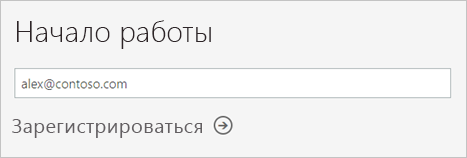
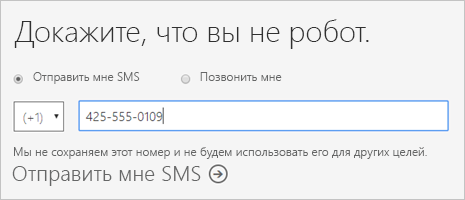
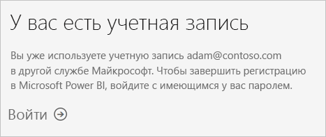
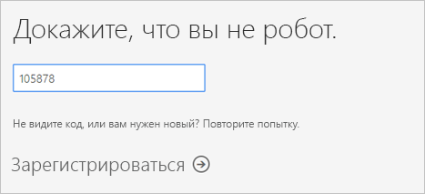
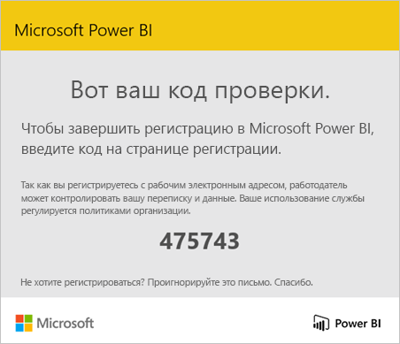
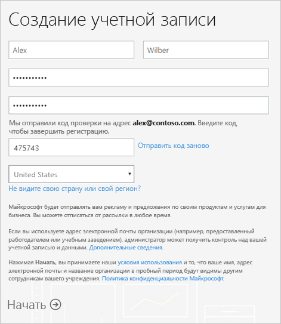
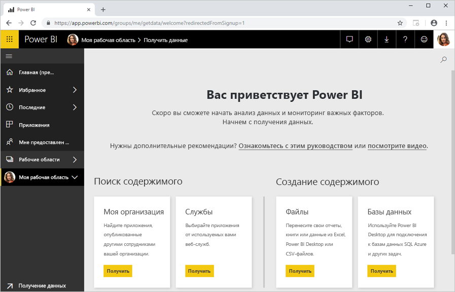

# Регистрация учетной записи отдельного пользователя в Power BI

Power BI может выступать в качестве вашего личного инструмента анализа и визуализации данных, а также служить механизмом анализа и принятия решений для групповых проектов, подразделений или целых корпораций. В этой статье объясняется, как зарегистрировать личную учетную запись в Power BI. Если вы являетесь администратором Power BI, см. раздел [Лицензирование Power BI в организации](service-admin-licensing-organization.md).

## Поддерживаемые адреса электронной почты

Прежде чем приступать к процедуре регистрации, важно разобраться в типах адресов электронной почты, которые можно использовать для регистрации в Power BI.

* Для регистрации в Power BI необходим рабочий или учебный адрес электронной почты. Вы не сможете зарегистрироваться с помощью адреса, предоставленного общедоступной службой электронной почты или поставщиком телекоммуникационных услуг. К их числу относятся платформы outlook.com, hotmail.com, gmail.com и т. д.

* После регистрации вы сможете [приглашать гостей](https://docs.microsoft.com/azure/active-directory/active-directory-b2b-what-is-azure-ad-b2b) для просмотра содержимого Power BI. Для просмотра гости могут использовать любой адрес электронной почты, включая личные учетные записи.

* Вы можете зарегистрироваться в Power BI с адресами .gov или .mil, однако процедура отличается. Дополнительные сведения см. в статье [Регистрация государственных организаций США в службе Power BI](service-govus-signup.md).

## Регистрация учетной записи Power BI

Выполните следующие действия, чтобы зарегистрировать учетную запись Power BI. После завершения этого процесса вы получите лицензию на Power BI (бесплатная версия), которую можно использовать для самостоятельной работы с Power BI с помощью раздела "Моя рабочая область", использования содержимого из рабочей области Power BI, назначенной емкости Power BI Premium, или запуска личной пробной версии Power BI Pro. Дополнительные сведения см. в разделе [Функции Power BI по типам лицензий](service-features-license-type.md). 

1. Перейдите к [странице регистрации](https://signup.microsoft.com/signup?sku=a403ebcc-fae0-4ca2-8c8c-7a907fd6c235).

1. Введите адрес электронной почты, а затем выберите **Зарегистрироваться**.

    

1. Если вы получаете примерно следующее сообщение, установите флажок для получения кода проверки, а затем перейдите к следующему шагу в этой процедуре.

    

    Если вы получаете примерно следующее сообщение, выполните действия, чтобы войти в систему и приступить к работе с Power BI.

    

1. Введите полученный код, а затем выберите **Зарегистрироваться**.

    

1. Проверьте свой почтовый ящик. В нем должно быть примерно следующее сообщение.

    

1. На следующем экране введите свои данные и код проверки из сообщения электронной почты. Выберите регион, просмотрите политики, доступные по ссылкам на этом экране, а затем выберите **Запуск**.

    

1. Вы будете перенаправлены на страницу [входа в Power BI](https://powerbi.microsoft.com/landing/signin/) и сможете приступить к работе с Power BI.

    

## Срок действия пробной версии

Закончив регистрацию, вы можете зарегистрироваться для получения пробной версии Power BI Pro в службе Power BI. После истечения срока действия этой пробной версии ваша лицензия меняется обратно на Power BI (бесплатная версия). При этом вы потеряете доступ к функциям, для работы с которыми требуется лицензия Power BI Pro. Дополнительные сведения см. в разделе [Функции по типам лицензий](service-features-license-type.md).

Если вам достаточно лицензии на Power BI (бесплатная версия), вам не нужно предпринимать никаких других действий. Чтобы воспользоваться преимуществами Power BI Pro, обратитесь к ИТ-администратору по поводу приобретения лицензии Power BI Pro.

## Устранение неполадок в процессе регистрации

Как правило, вы можете зарегистрироваться в Power BI, следуя описанной выше процедуре. Некоторые проблемы, которые могут помешать регистрации, описаны в следующей таблице с возможными обходными решениями.

| Симптом / сообщение об ошибке | Причины и возможное решение |
| ----------------------- | -------------------- |
| <strong>Личные адреса электронной почты (например nancy@gmail.com)</strong>. При регистрации вы получите приблизительно следующее сообщение:    *Вы указали личный адрес электронной почты. Введите рабочий адрес электронной почты, чтобы мы могли обеспечить безопасное хранение данных вашей компании.*    или    *Возможно, это личный адрес электронной почты. Введите свой рабочий адрес для подключения к другим пользователям в организации. Не беспокойтесь. Мы никому не сообщим ваш адрес.* | Power BI не поддерживает адреса электронной почты, предоставляемые службами потребительской электронной почты или поставщиками телекоммуникационных услуг.    Чтобы завершить регистрацию, повторите попытку, используя адрес электронной почты, назначенный вам на работе или в школе.    Если вам по-прежнему не удается зарегистрироваться и вы хотите выполнить более сложную процедуру установки, вы можете [зарегистрироваться для получения новой пробной подписки Office 365 и использовать для регистрации полученный адрес электронной почты](service-admin-signing-up-for-power-bi-with-a-new-office-365-trial.md).    Кроме того, вы можете попросить существующего пользователя [пригласить вас в качестве гостя](service-admin-azure-ad-b2b.md). |
| **Возможность самостоятельной регистрации отключена**. Во время регистрации вы получаете сообщение об ошибке следующего содержания:    *Не удается завершить регистрацию. Ваш ИТ-отдел отключил регистрацию в службе Microsoft Power BI. Свяжитесь с ним, чтобы завершить регистрацию.*    или    *Возможно, это личный адрес электронной почты. Введите свой рабочий адрес для подключения к другим пользователям в организации. Не беспокойтесь. Мы никому не сообщим ваш адрес.* | ИТ-администратор вашей организации отключил самостоятельную регистрацию в Power BI.    Чтобы завершить регистрацию, обратитесь к ИТ-администратору и попросите его [выполнить инструкции для добавления возможности регистрации](service-admin-licensing-organization.md#enable-or-disable-individual-user-sign-up-in-azure-active-directory).    Эта проблема также может наблюдаться, если вы [зарегистрировались в Office 365 через партнера](service-admin-syndication-partner.md). |
| **Адрес электронной почты не является идентификатором Office 365**. Во время регистрации вы получаете примерно следующее сообщение об ошибке:    *Не удается найти вас в contoso.com.  Вы используете другой идентификатор на работе или в школе?    Попробуйте войти в систему, используя этот идентификатор. Если это не поможет, обратитесь в ИТ-отдел.* | Ваша организация использует для входа в Office 365 и другие службы Майкрософт идентификаторы, которые отличаются от адреса электронной почты.  Например, у вас может быть адрес электронной почты Nancy.Smith@contoso.com, а идентификатор — nancys@contoso.com.    Чтобы завершить регистрацию, используйте идентификатор, назначенный вам организацией, для входа в Office 365 или другие службы Майкрософт.  Если вы его не знаете, обратитесь к ИТ-администратору.    Если вам по-прежнему не удается зарегистрироваться и вы хотите выполнить более сложную процедуру установки, вы можете [зарегистрироваться для получения новой пробной подписки Office 365 и использовать для регистрации полученный адрес электронной почты](service-admin-signing-up-for-power-bi-with-a-new-office-365-trial.md). |

## Дальнейшие действия

[Приобретение Power BI Pro](service-admin-purchasing-power-bi-pro.md)  
[Условия использования Microsoft Power BI Preview](https://powerbi.microsoft.com/terms-of-service/)  

Появились дополнительные вопросы? [Попробуйте задать вопрос в сообществе Power BI.](https://community.powerbi.com/)
