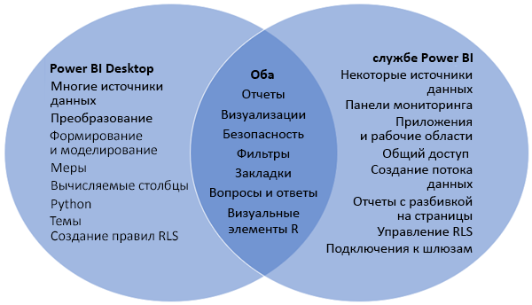

# Сравнение Power BI Desktop и службы Power BI

На представленной ниже диаграмме Венна область в середине показывает, в чем пересекаются возможности Power BI Desktop и службы Power BI. Некоторые задачи можно выполнять как в Power BI Desktop, так и в службе. Однако приложение и служба имеют и уникальные возможности, которые представлены на непересекающихся частях диаграммы.  

**Power BI Desktop** — это полнофункциональное средство для анализа данных и создания отчетов. Установив это бесплатное приложение на локальном компьютере, вы сможете подключиться к разным источникам данных, а также объединить их в модель данных (этот процесс называется моделированием). В [руководстве по началу работы с Power BI Desktop](desktop-getting-started.md) приводятся пошаговые инструкции.

**Служба Power BI** — это облачная веб-служба, предоставляющая базовые возможности редактирования отчетов и совместной работы для небольших групп и крупных компаний. В службе Power BI также можно подключаться к источникам данных, но возможности моделирования ограничены. 

Большинство разработчиков отчетов, работающих над проектами бизнес-аналитики, применяют **Power BI Desktop** для создания отчетов, а **службу Power BI** — для предоставления общего доступа к отчетам другим пользователям.

## Редактирование отчетов

Как в приложении, так и в службе можно создавать и редактировать *отчеты*. Отчет может иметь одну или несколько страниц с визуальными элементами и их коллекциями. Вы можете добавлять закладки, кнопки, фильтры и детализации, чтобы упростить навигацию по отчетам.

Редакторы в Power BI Desktop и в службе аналогичны. Они состоят из трех разделов:  

1. верхних панелей навигации, которые различаются в Power BI Desktop и в службе;    
2. Холст отчетов     
3. областей **Поля**, **Визуализации** и **Фильтры**.

В этом видео демонстрируется редактор отчетов в Power BI Desktop. 

<iframe width="560" height="315" src="https://www.youtube.com/embed/IkJda4O7oGs" frameborder="0" allowfullscreen></iframe>

## Совместная работа в Power BI

Создав отчеты, вы можете сохранить их в *рабочей области* в **службе Power BI**, где вы ведете совместную работу с коллегами. На основе отчетов создаются *панели мониторинга*. Затем вы предоставляете доступ к панелям мониторинга и отчетам пользователям в вашей организации и за ее пределами. Пользователи отчетов просматривают их в службе Power BI в [представлении чтения](consumer/end-user-reading-view.md), но не в представлении редактирования. Они имеют доступ не ко всем функциям, которые доступны создателям отчетов. 

## Дальнейшие действия

[Что такое Power BI Desktop?](desktop-what-is-desktop.md)

[Создание отчета](service-report-create-new.md) в службе Power BI

[Основные понятия для разработчиков отчетов](service-basic-concepts.md)

Появились дополнительные вопросы? [Ответы на них см. в сообществе Power BI.](http://community.powerbi.com/)

