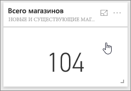
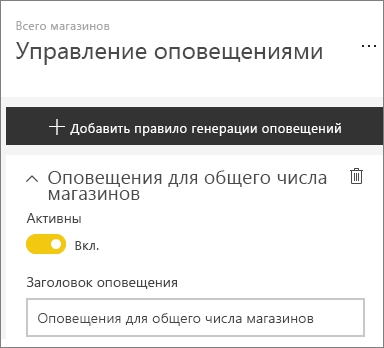
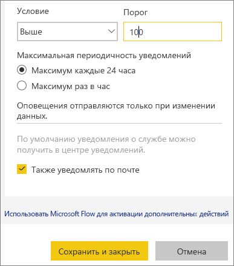
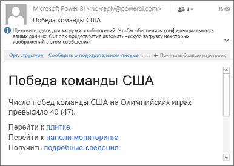
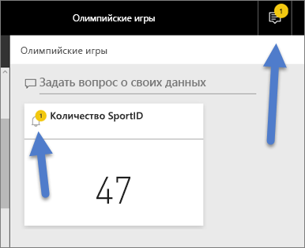
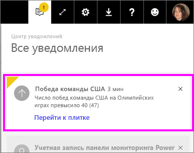
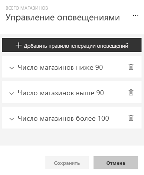
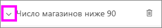
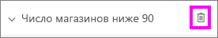
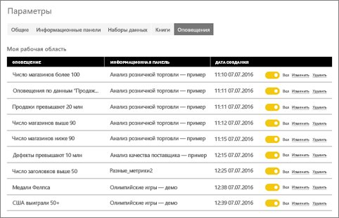

# Оповещения о данных в службе Power BI
Вы можете настроить оповещения, уведомляющие вас о том, что данные в панелях мониторинга выходят за пределы заданного порога. 

Настраивать оповещения для плиток можно, если имеется лицензия Power BI Pro или если доступ к панели мониторинга был предоставлен вам из [емкости Premium](service-premium.md). Оповещения можно настроить только для закрепленных плиток на основе визуальных элементов отчетов, которые содержат только датчики, ключевые показатели эффективности и карточки. Можно настроить оповещения для визуальных элементов на основе потоковых наборов данных, если они закреплены на панели мониторинга из отчета. Для плиток потоковой передачи, созданных непосредственно на панели мониторинга с помощью элементов **Добавление плитки** > **Пользовательские данные потоковой передачи**, оповещения настроить нельзя. 

Видеть настроенные вами оповещения можете только вы (даже если доступ к панели мониторинга предоставлен другим пользователям). Оповещения о данных полностью синхронизированы на всех платформах. Их можно настроить и просматривать [в мобильных приложениях Power BI](mobile-set-data-alerts-in-the-mobile-apps.md) и службе Power BI. Они недоступны для Power BI Desktop. Оповещения можно даже [автоматизировать и интегрировать с Microsoft Flow](https://flow.microsoft.com) - [попробовать](service-flow-integration.md).

> [!WARNING]
> Уведомления на основе данных содержат сведения о данных. Если вы просматриваете данные Power BI на мобильном устройстве и это устройство украдено, рекомендуем отключить все правила генерации оповещений на основе данных с помощью службы Power BI.
> 
> 

## Настройка оповещений о данных в службе Power BI
В следующем видео Аманда добавляет оповещения на плитки панели мониторинга. Затем сделайте то же самое, выполнив пошаговые инструкции, приведенные под видео.

<iframe width="560" height="315" src="https://www.youtube.com/embed/JbL2-HJ8clE" frameborder="0" allowfullscreen></iframe>

В этом примере используется плитка карточки из примера панели мониторинга «Анализ розничной торговли».

1. Перейдите на панель мониторинга. Щелкните многоточие на плитке панели мониторинга с датчиком, ключевым показателем эффективности или карточкой.
   
   
2. Выберите значок колокольчика , чтобы добавить одно или несколько оповещений для показателя **Total stores** (Всего магазинов).
   
1. Для начала щелкните **+Добавить правило оповещения**, переместите переключатель в положение **Вкл.** и укажите название оповещения. Заголовки позволяют легко распознать оповещения.
   
   
4. Прокрутите содержимое вниз и введите параметры оповещения.  В этом примере мы создадим оповещение, которое уведомляет нас один раз в сутки о превышении общим количеством магазинов порога в 100 штук. Оповещения будут появляться в Центре уведомлений. Кроме того, служба Power BI будет отправлять нам сообщения электронной почты.
   
   
5. Нажмите кнопку **Сохранить**.

## Получение оповещений
Если при обновлении данных отслеживаемые значения выходят за установленные пороги, может произойти несколько вещей. Во-первых, Power BI проверяет, прошло ли больше часа или 24 часов (в зависимости от выбранного варианта) с момента отправки предыдущего оповещения. Оповещение приходит тогда, когда пороговое значение, заданное для оповещения, превышено.

После этого Power BI отправляет оповещение в центр уведомлений и, возможно, по электронной почте. Каждое оповещение содержит прямую ссылку на данные. Выберите ссылку, чтобы просмотреть соответствующую плитку, изучить данные, разрешить совместное использование и получить дополнительные сведения.  

1. Если вы включили отправку оповещений на электронную почту, в ваш ящик придет примерно такое сообщение:
   
   
2. Power BI добавляет сообщение в ваш **Центр уведомлений**, а также значок нового оповещения на соответствующую плитку.
   
   
3. Чтобы просмотреть подробные сведения об оповещении, откройте свой Центр уведомлений.
   
    
   
   > [!NOTE]
   > Оповещения отправляются только при обновлении данных. При обновлении данных Power BI проверяет, настроены ли для них оповещения. Если значение достигает заданного порога, оповещение срабатывает.
   > 
   > 

## Управление оповещениями
Управлять оповещениями можно разными способами: непосредственно на плитке панели мониторинга, в меню параметров Power BI, а также на соответствующих плитках в [мобильном приложении Power BI для iPhone](mobile-set-data-alerts-in-the-mobile-apps.md) или [мобильном приложении Power BI для Windows 10](mobile-set-data-alerts-in-the-mobile-apps.md).

### Непосредственно с плитки
1. Если нужно изменить или удалить оповещение для плитки, снова откройте окно **Manage alerts** (Управление оповещениями), выбрав значок колокольчика . Отобразятся все оповещения, заданные вами для этой плитки.
   
    .
2. Чтобы изменить оповещение, нажмите на стрелку рядом с его названием.
   
    .
3. Чтобы удалить оповещение, выберите значок корзины справа от его названия.
   
      

### Меню параметров Power BI
1. Выберите значок шестеренки в строке меню Power BI.
   
    .
2. В разделе **Параметры** выберите **Оповещения**.
   
    
3. Здесь можно включать, отключать и удалять оповещения, а также открывать окно **Управление оповещениями** для внесения изменений.

## Советы и устранение неполадок
* В настоящее время не поддерживаются оповещения для плиток Bing, а также для плиток карточек с мерами даты и времени.
* Оповещения работают только с числовыми данными.
* Оповещения отправляются только при обновлении данных. Они не работают со статическими данными.
* Оповещения работают с потоковыми наборами данных, только если вы создаете визуальный элемент отчета, содержащий ключевые показатели эффективности, карты или датчики, а затем закрепляете его на панели мониторинга.

## Дальнейшие действия
[Microsoft Flow и Power BI](service-flow-integration.md)    
[Настройка оповещений о данных в мобильных приложениях Power BI](mobile-set-data-alerts-in-the-mobile-apps.md)    
[Что такое Power BI?](power-bi-overview.md)    
Появились дополнительные вопросы? [Попробуйте задать вопрос в сообществе Power BI.](http://community.powerbi.com/)

