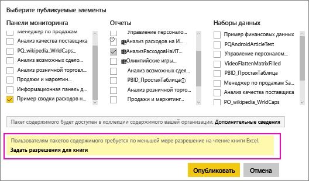

# Общий доступ к панели мониторинга Power BI, содержащей ссылки на файл Excel в OneDrive
Power BI позволяет [подключаться к книгам Excel в OneDrive для бизнеса](service-excel-workbook-files.md) и закреплять плитки из таких книг на панелях мониторинга. При предоставлении совместного доступа к этой панели мониторинга или создании пакета содержимого, в состав которого входит эта панель, будут доступны приведенные ниже действия.

* Ваши коллеги будут видеть плитки, даже если у них нет разрешений на просмотр соответствующих книг. Вы можете создать пакет содержимого и будете знать, что ваши коллеги смогут видеть плитки, созданные из книги Excel в OneDrive.
* Щелчок плитки открывает соответствующую книгу в службе Power BI. Книга откроется, только если у вашего коллеги есть разрешение по меньшей мере на [чтение](https://support.office.com/en-us/article/Share-documents-or-folders-in-Office-365-1fe37332-0f9a-4719-970e-d2578da4941c) книги в OneDrive для бизнеса.

## Общий доступ к панели мониторинга, содержащей плитки книг
Инструкции по предоставлению общего доступа к панели мониторинга, которая ссылается на книгу Excel в OneDrive для бизнеса, см. в статье [Предоставление общего доступа к панелям мониторинга и отчетам коллегам и другим пользователям](service-share-dashboards.md). Отличие в том, что перед предоставлением общего доступа вы сможете изменить разрешения для соответствующей книги Excel.

  

1. Введите адреса электронной почты своих коллег.
2. Чтобы разрешить коллегам просматривать книгу Excel в службе Power BI, щелкните ссылку **Перейти в OneDrive для бизнеса и настроить разрешения для книги**.
3. В OneDrive [измените разрешения](https://support.office.com/en-US/article/Share-files-and-folders-and-change-permissions-9fcc2f7d-de0c-4cec-93b0-a82024800c07) так, как вам нужно.
4. Выберите **Общий доступ**.

>[!NOTE]
>Ваши коллеги не смогут закреплять дополнительные плитки из этой книги или вносить изменения в книгу Excel через Power BI.
> 
> 

## Создание пакета содержимого организации с информационной панелью, содержащей плитки книги
[Публикуя пакет содержимого](service-organizational-content-pack-create-and-publish.md), вы предоставляете к нему доступ отдельным коллегам или группам. При публикации пакета содержимого, включающего ссылки на книги, можно изменить разрешения в отношении соответствующих книг Excel.

1. На экране **Создание пакета содержимого** введите адреса электронной почты, а также название и описание пакета содержимого и загрузите изображение.
2. Выберите панель мониторинга и (или) отчет со ссылкой на книгу Excel в OneDrive для бизнеса.
   
    
3. Щелкните ссылку **Перейти в OneDrive для бизнеса и настроить разрешения для книги**.
4. В OneDrive [измените разрешения](https://support.office.com/en-US/article/Share-files-and-folders-and-change-permissions-9fcc2f7d-de0c-4cec-93b0-a82024800c07) так, как вам нужно.
5. Нажмите кнопку **Опубликовать**.

## Предоставление общего доступа к панели мониторинга из рабочей области Power BI
Общий доступ к панели мониторинга предоставляется из рабочей области Power BI так же, как из вашей собственной рабочей области, за тем исключением, что файлы размещаются на сайте рабочей области в Office 365, а не в OneDrive для бизнеса. Перед предоставлением общего доступа пользователям не из рабочей области измените разрешения для книги Excel.

## Дальнейшие действия
* [Закрепление плитки на панели мониторинга Power BI из книги Excel](service-dashboard-pin-tile-from-excel.md)
* [Power BI — основные понятия](service-basic-concepts.md)
* Появились дополнительные вопросы? [Ответы на них см. в сообществе Power BI.](http://community.powerbi.com/)

