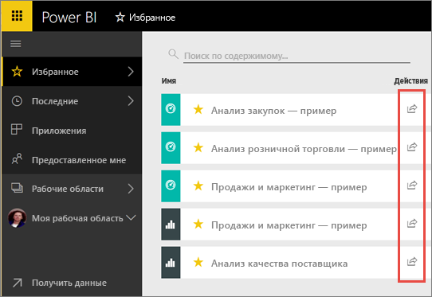
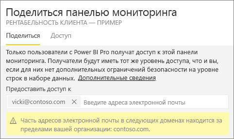
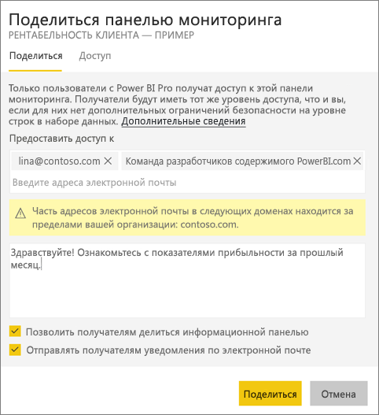
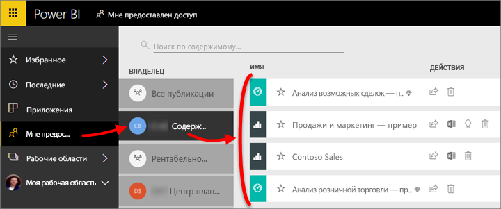
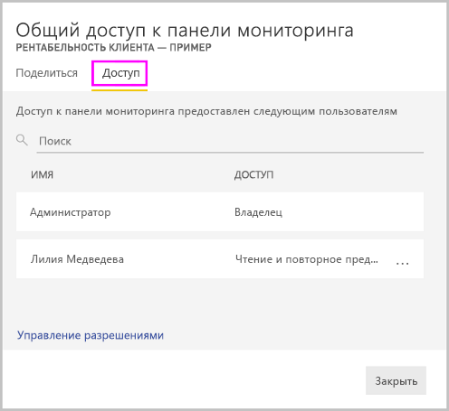
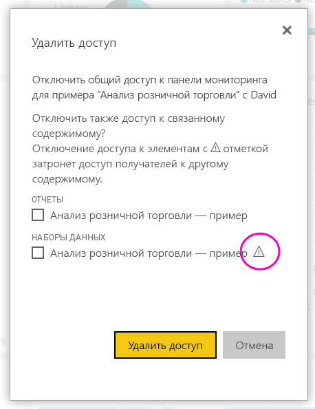
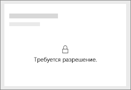
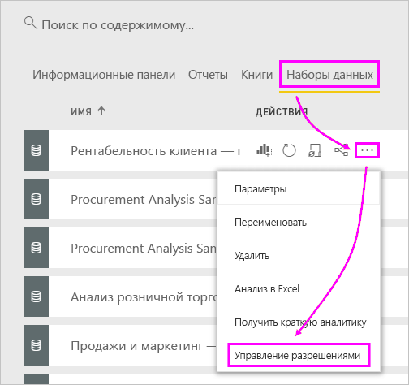

# Предоставление общего доступа коллегам и другим пользователям к панелям мониторинга и отчетам Power BI
Используя *Общий доступ*, вы можете предоставить нескольким пользователям доступ к информационным панелям и отчетам. В Power BI также доступны [другие способы совместной работы с панелями мониторинга и отчетами и их распространения](service-how-to-collaborate-distribute-dashboards-reports.md).

Независимо от того, где вы предоставляете общий доступ к своему содержимому, внутри или за пределами вашей организации, вам требуется [лицензия Power BI Pro](service-features-license-type.md). Получателям потребуется лицензия Power BI Pro, если содержимое находится в [емкости Premium](service-premium-what-is.md). 

Можно совместно использовать панели мониторинга и отчетам из большинства расположений в службе Power BI: "Избранное", последние, предоставлен me (если это позволяет владелец), "Мои представления" или другие рабочие области. Когда вы предоставляете другим пользователям общий доступ к панели мониторинга или отчету, они могут просматривать эти панели мониторинга и отчеты и взаимодействовать с ними, но не изменять их. Пользователи видят на панелях мониторинга и в отчетах те же данные, что и вы, если не применяется [защита на уровне строк (RLS)](service-admin-rls.md). Коллеги, которым вы предоставляете общий доступ, также могут, с вашего разрешения, предоставлять общий доступ своим коллегам. Пользователи за пределами вашей организации, могут также просматривать и взаимодействовать с панели мониторинга или отчета, но не могут совместно использовать. 

Вы также можете [предоставлять общий доступ к панели мониторинга из любых мобильных приложений Power BI](consumer/mobile/mobile-share-dashboard-from-the-mobile-apps.md). Тем не менее не могут совместно использовать панели мониторинга из Power BI Desktop.

## Видео. Общий доступ к панели мониторинга
В следующем видео Аманда предоставляет доступ к своей панели мониторинга пользователям из своей и других компаний. Затем сделайте то же самое, выполнив пошаговые инструкции, приведенные под видео.

<iframe width="560" height="315" src="https://www.youtube.com/embed/0tUwn8DHo3s?list=PL1N57mwBHtN0JFoKSR0n-tBkUJHeMP2cP" frameborder="0" allowfullscreen></iframe>

## Предоставление общего доступа к панели мониторинга или отчету

1. В списке панелей мониторинга или отчетов либо на открытой панели мониторинга или в отчете выберите **Поделиться** .

2. В поле сверху введите адреса электронной почты сотрудников, групп рассылки или групп безопасности. Доступ для динамических списков рассылки предоставить нельзя. 
   
   Предоставлять доступ можно и пользователям из сторонних организаций, но при этом отобразится предупреждение.
   
    
 
   >[!NOTE]
   >Однако поле ввода поддерживает не более 100 пользователей или групп. Если вам нужно использовать совместно с большим числом пользователей, рассмотрите возможность создания панели мониторинга в рабочей области и [распространения его как приложение](service-create-distribute-apps.md).
   > 
   > 

3. При необходимости добавьте сообщение. Это необязательно.
4. Чтобы разрешить вашим коллегам совместно использовать содержимое с другими пользователями, установите флажок **разрешить получателям совместно использовать панели мониторинга (или отчет)** .
   
   Предоставление другим пользователям разрешения на предоставление общего доступа называется *повторным общим доступом*. Если вы предоставите такую возможность своим сотрудникам, они повторно предоставят общий доступ из службы Power BI и мобильных приложений или отправят приглашение другим пользователям в организации. Срок действия приглашения истекает через один месяц. Пользователи за пределами организации не могут осуществлять повторное предоставление для общего доступа. Как владелец содержимого, вы можете отключить повторный общий доступ или отдельно отозвать права доступа. См. в разделе [прекратить общий доступ или общего доступа](#stop-sharing-or-stop-others-from-sharing).

5. Выберите **Общий доступ**.
   
     
   
   Power BI отправляет приглашение по электронной почте пользователям, но не к группам, со ссылкой на общее содержимое. После отправки вы увидите уведомление об **успешном завершении операции**. 
   
   Когда получатели в организации переходят по ссылке, Power BI добавляет панель мониторинга или отчет на страницу списка **Мне предоставлен доступ**. Выбрав ваше имя, получатели могут просмотреть все содержимое, которым вы поделились с ними. 
   
   
   
   Если получатели за пределами организации щелкнут ссылку, они увидят панель мониторинга или отчет, но не на обычном портале Power BI. Дополнительные сведения см. в разделе [совместное использование панели мониторинга или отчета с пользователями за пределами вашей организации](#share-a-dashboard-or-report-with-people-outside-your-organization).

## Кто имеет доступ к панели мониторинга или отчету, к которым предоставлен общий доступ?
Иногда необходимо просмотреть пользователей, которым вы предоставили доступ и узнать, кому они предоставили доступ к ней с помощью:

1. В списке панелей мониторинга и отчетов либо на конкретной панели мониторинга или в отчете выберите **Поделиться** . 
2. В **поделиться панелью мониторинга** или **общий доступ к отчету** выберите **доступа**.
   
    

    Пользователь за пределами организации обозначается как **Гость**.

## Отмена общего доступа
Только владелец панели мониторинга или отчета может включить и выключить повторный общий доступ.

### Если вы еще не отправили приглашение на совместное использование
* Очистить **разрешить получателям совместно использовать панели мониторинга (или отчет)** флажок в нижней части приглашения, перед отправкой.

### Если вы уже предоставили общий доступ к панели мониторинга или отчету
1. В списке панелей мониторинга и отчетов либо на конкретной панели мониторинга или в отчете выберите **Поделиться** . 
2. В **поделиться панелью мониторинга** или **общий доступ к отчету** выберите **доступа**.
   
    
3. Нажмите кнопку с многоточием ( **...** ) рядом с элементом **Чтение и повторное предоставление общего доступа** и выберите один из следующих вариантов:
   
   
   
   * Выберите **Чтение**, чтобы запретить этому пользователю предоставлять общий доступ другим сотрудникам.
   * **Удалите доступ**, чтобы запретить этому пользователю просматривать общее содержимое.

4. В **удалить доступ** диалоговом окне определите, будут ли также удалить доступ к связанному содержимому, например отчеты и наборы данных. Если удалить элементы со значком предупреждения , рекомендуется также удалить связанное содержимое, поскольку он не будет отображаться правильно.

    

## Совместное использование панели мониторинга или отчета с пользователями за пределами вашей организации
Когда вы предоставляете общий доступ людям за пределами вашей организации, они получают электронное сообщение со ссылкой на общую панель мониторинга или отчет, который им необходимо войти в Power BI см. в разделе. Если у пользователей нет лицензии Power BI Pro, они могут зарегистрироваться для ее получения, перейдя по ссылке.

После входа, они увидят общую панель мониторинга или отчет в отдельном окне браузера, а не на обычном портале Power BI. Чтобы позже получить доступ к этой панели мониторинга или отчету, они должны добавьте ссылку в закладки.

Пользователи не могут изменять какое-либо содержимое этой информационной панели или отчета. Несмотря на то, что они могут взаимодействовать с диаграммами и изменять фильтры или срезы, они не сохранять изменения. 

Только прямые получатели могут просматривать общую панель мониторинга или отчет. Например, если вы отправили сообщение электронной почты на адрес Vicki@contoso.com, панель мониторинга будет отображаться только для пользователя Vicki. Никто другой можно увидеть панели мониторинга, даже если они имеют ссылки. Vicki необходимо использовать один и тот же адрес электронной почты для доступа к нему; Если она зарегистрируется с любой другой адрес электронной почты, она не будет иметь доступ к панели мониторинга.

Пользователи за пределами организации не могут просматривать никакие данные, если для локальных табличных моделей Analysis Services реализована безопасность на уровне роли или строк.

Если отправить ссылку из мобильного приложения Power BI пользователям за пределами вашей организации, при щелчке ссылки открывается панель мониторинга в браузере, а не в мобильном приложении Power BI.

Если вы [разрешить внешние пользователи-Гости для редактирования и управления содержимым в организации](service-admin-portal.md#export-and-sharing-settings), по умолчанию только для потребления среда не применяется к ним. [Дополнительные сведения](service-admin-azure-ad-b2b.md).

## Рекомендации и ограничения
Ниже приведены важные замечания о совместном доступе к панелям мониторинга и отчетам.

* Обычно вы и ваши коллеги видите на панели мониторинга и в отчете одинаковые данные. Поэтому даже если у вас больше разрешений на просмотр данных, коллеги смогут просматривать все ваши данные на панели мониторинга или в отчете. Но если к основному набору данных панели мониторинга или отчета применяется [безопасность на уровне строк (RLS)](service-admin-rls.md), то для предоставления общего доступа к конкретным данным используются учетные данные каждого пользователя. При этом у каждого пользователя будет разный уровень доступа.
* Всем пользователям делиться информационной панелью с можно увидеть, как это и взаимодействовать со связанными отчетами в [режиме чтения](consumer/end-user-reading-view.md#reading-view). Они не могут создавать отчеты или сохранять изменения в имеющихся отчетах.
* Несмотря на то, что никто можно просмотреть или скачать набор данных, их можно открывать набор данных напрямую с помощью анализа в Excel функции. Администратор может ограничить возможность использовать анализ в Excel для всех пользователей в группу. Это ограничение будет применено для всех пользователей в группе, принадлежащей к соответствующей рабочей области.
* Любой пользователь может [обновить данные](refresh-data.md) вручную.
* При использовании Office 365 для работы с электронной почтой общий доступ можно предоставить членам группы рассылки, введя адрес электронной почты, связанный с группой рассылки.
* Сотрудники общий доступ к вашему домену электронной почты, а также домен которых отличается, но зарегистрирован в одном клиенте, с другими пользователями могут совместно использовать панели мониторинга. Например, если домены contoso.com и contoso2.com зарегистрированы в одном клиенте и ваш адрес электронной почты — konrads@contoso.com, то ravali@contoso.com и gustav@contoso2.com можно предоставить общий доступ, до тех пор, пока у них есть соответствующее разрешение для совместного использования.
* Если ваши коллеги уже имеют доступ к определенной панели мониторинга или отчета, можно отправить им прямую ссылку, скопировав URL-адрес, находясь на панели мониторинга или отчета. Например: `https://powerbi.com/dashboards/g12466b5-a452-4e55-8634-xxxxxxxxxxxx`
* Аналогично, если ваши коллеги уже имеют доступ к определенной панели мониторинга, вы можете [отправить им прямую ссылку на базовый отчет](service-share-reports.md). 
* Вы можете предоставить, не менее, 100 пользователей или групп в действии один общий ресурс. При этом к одному элементу можно предоставить доступ более чем 500 пользователям. Чтобы сделать это, совместно использовать несколько раз, указав пользователей по отдельности или совместно использовать с группой пользователей, которая содержит всех пользователей.

## Устранение неполадок, связанных с общим доступом

### Получатели моей панели мониторинга видят значок блокировки на плитке или сообщение "Требуется разрешение"

Пользователи, которым вы предоставляете доступ, при попытке просмотра отчета могут увидеть плитку блокировки на панели мониторинга или сообщение "Требуется разрешение".

Если Да, вам потребуется предоставить им разрешение к базовому набору данных.

1. Откройте вкладку **Наборы данных** в списке содержимого.

1. Нажмите кнопку с многоточием ( **...** ) рядом с набором данных, затем выберите **Управление разрешениями**.

    

1. Нажмите кнопку **Добавить пользователя**.

    

1. Введите адреса электронной почты сотрудников, групп рассылки или групп безопасности. Доступ для динамических списков рассылки предоставить нельзя.

    

1. Нажмите кнопку **Добавить**.

### Не удается предоставить общий доступ к панели мониторинга или отчету

Чтобы предоставить доступ к панели мониторинга или отчету, требуется разрешение на повторную публикацию базового содержимого. то есть всем связанным отчетам и наборам данных. Если появится сообщение о том, что нельзя совместно использовать, обратитесь к автору отчета, чтобы предоставить вам повторно предоставлять общий доступ разрешение к этим отчетам и наборам данных.

## Дальнейшие действия
* Хотите оставить отзыв? Поделитесь своими предложениями на [веб-сайте сообщества Power BI](https://community.powerbi.com/).
* [Как предоставить общий доступ к панелям мониторинга, отчетам и плиткам?](service-how-to-collaborate-distribute-dashboards-reports.md)
* [Поделиться отфильтрованным отчетом Power BI](service-share-reports.md).
* У вас появились вопросы? [Ответы на них см. в сообществе Power BI](http://community.powerbi.com/).

