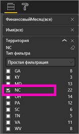
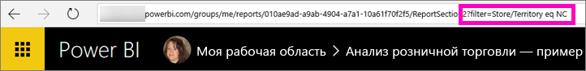
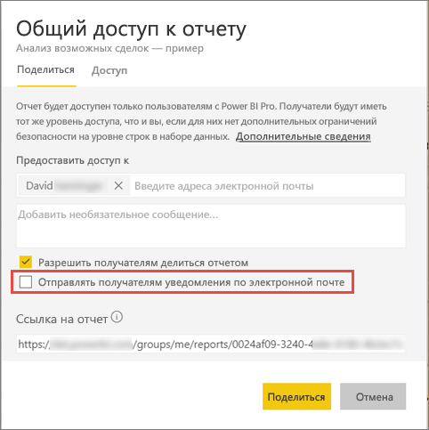

# Предоставление общего доступа коллегам к отфильтрованному отчету Power BI
Используя *Общий доступ*, вы можете предоставить нескольким пользователям доступ к информационным панелям и отчетам. В Power BI также доступны [другие способы совместной работы с отчетами и их распространения](service-how-to-collaborate-distribute-dashboards-reports.md).

Чтобы предоставить общий доступ, вам и получателям содержимого требуется [лицензия Power BI Pro](service-free-vs-pro.md) либо же содержимое должно находиться в [емкости Premium](service-premium.md). У вас есть предложения? Для команды Power BI ваши отзывы всегда важны, поэтому перейдите на [сайт сообщества Power BI](https://community.powerbi.com/).

Вы можете предоставлять общий доступ к отчетам коллегам, у которых есть электронная почта в вашем домене, из большинства расположений в службе Power BI: из списка "Избранные", списка "Последние", страниц "Мне предоставлен доступ" (если это позволяет владельцу) и "Мои представления" или других рабочих областей. Когда вы предоставляете другим пользователям общий доступ к информационной панели мониторинга, они могут просматривать ее и взаимодействовать с ней, но не могут изменять ее. Они видят в отчетах те же данные, что и вы, если не применяется [защита на уровне строк (RLS)](service-admin-rls.md). 

## Фильтрация и предоставление общего доступа
Что делать, если необходимо совместно использовать отфильтрованную версию отчета? Это может быть отчет, который отображает данные только по определенному городу, продавцу или году. Для этого необходимо создать пользовательский URL-адрес.

1. Откройте отчет в [режиме редактирования](service-reading-view-and-editing-view.md), примените фильтр и сохраните отчет.
   
   В этом примере мы применяем фильтр к набору данных [Анализ розничной торговли — пример](sample-tutorial-connect-to-the-samples.md), чтобы отобразить только значения, у которых в поле **Территория** указано значение **NC**.
   
   
2. В конец URL-адреса страницы отчета добавьте следующий фрагмент:
   
   ?filter=*tablename*/*fieldname* eq *value*
   
    Поле должно иметь тип **строка**, и ни поле *Имя таблицы*, ни *Имя поля* не должны содержать пробелы.
   
   В нашем примере имя таблицы — **Store**, имя поля — **Territory**, а значение, по которому выполняется фильтрация — **NC**.
   
    ?filter=Store/Territory eq 'NC'
   
   
   
   Браузер добавляет специальные знаки, представляющие косые черты, пробелы и апострофы, поэтому окончательный адрес будет следующим:
   
   app.powerbi.com/groups/me/reports/010ae9ad-a9ab-4904-a7a1-xxxxxxxxxxxx/ReportSection2?filter=Store%252FTerritory%20eq%20%27NC%27

3. [Предоставьте общий доступ к отчету](service-share-dashboards.md), но снимите флажок **Send email notificaton to recipients** (Отправить получателям уведомление электронной почтой). 

    

4. Отправьте ссылку с фильтром, который вы создали ранее.

## Дальнейшие действия
* Хотите оставить отзыв? Поделитесь своими предложениями на [веб-сайте сообщества Power BI](https://community.powerbi.com/).
* [Как предоставить общий доступ к панелям мониторинга, отчетам и плиткам?](service-how-to-collaborate-distribute-dashboards-reports.md)
* [предоставление общего доступа к панелям мониторинга](service-share-dashboards.md).
* Появились дополнительные вопросы? [Ответы на них см. в сообществе Power BI](http://community.powerbi.com/).

