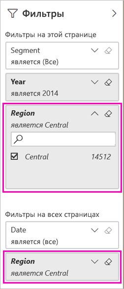

# Два способа предоставления общего доступа к отфильтрованному отчету Power BI
Используя *Общий доступ*, вы можете предоставить нескольким пользователям доступ к информационным панелям и отчетам. Что делать, если необходимо совместно использовать отфильтрованную версию отчета? Это может быть отчет, который отображает данные только по определенному городу, продавцу или году. Далее показано, как отфильтровать отчет и предоставить к нему общий доступ, а также создать пользовательский URL-адрес отчета. К отчету применяется фильтр во время первого открытия его получателями. Получатели могут удалить фильтр, изменив URL-адрес. 

В Power BI также доступны [другие способы совместной работы с отчетами и их распространения](service-how-to-collaborate-distribute-dashboards-reports.md). Чтобы предоставить общий доступ, вам и получателям содержимого требуется [лицензия Power BI Pro](service-features-license-type.md) либо же содержимое должно находиться в [емкости Premium](service-premium-what-is.md). 

## Два способа фильтрации отчета

Для обоих методов фильтрации мы используем пример приложения шаблона "Маркетинг и продажи". Итак, приступим. Вы также можете установить [пример шаблона приложения "Маркетинг и продажи"](https://appsource.microsoft.com/product/power-bi/microsoft-retail-analysis-sample.salesandmarketingsample?tab=Overview).

### Установка фильтра

Откройте отчет в [режиме правки](consumer/end-user-reading-view.md) и примените фильтр.

В этом примере мы применим фильтр к странице данных за истекший год из примера шаблона приложения "Маркетинг и продажи", чтобы отобразить только те значения, у которых параметру **Region** соответствует значение **Central**. 
 

Сохраните отчет.

### Создание фильтра в URL-адресе

При добавлении фильтра в конце URL-адреса страницы отчета фильтрация выполняется несколько иначе. Отфильтрованная страница выглядит так же. Но Power BI применяет фильтр ко всему отчету и удаляет другие значения из области фильтра.  

В конец URL-адреса страницы отчета добавьте следующий фрагмент:
   
    ?filter=*tablename*/*fieldname* eq *value*
   
Поле должно иметь тип Number, DateTime или String. Значения *tablename* и *fieldname* не должны содержать пробелов.
   
В нашем примере имя таблицы — **Geo**, имя поля — **Region**, а значение, по которому выполняется фильтрация — **Central**.
   
    ?filter=Geo/Region eq 'Central'

Браузер заменяет косые черты, пробелы и апострофы специальными знаками, и в итоге адрес будет выглядеть примерно так:
   
    app.powerbi.com/groups/xxxx/reports/xxxx/ReportSection4d00c3887644123e310e?filter=Geo~2FRegion%20eq%20'Central'

Сохраните отчет.

См. сведения о [фильтрации отчета с помощью параметров строки запроса в URL-адресе](service-url-filters.md).

## Предоставление общего доступа к отфильтрованному отчету

1. В диалоговом окне [Общий доступ к отчету ](service-share-dashboards.md) снимите флажок **Отправлять получателям уведомления по электронной почте**.

    

4. Отправьте ссылку с фильтром, который вы создали ранее.

## Дальнейшие действия
* [Способы совместного использования работы в Power BI](service-how-to-collaborate-distribute-dashboards-reports.md)
* [предоставление общего доступа к панелям мониторинга](service-share-dashboards.md).
* Появились дополнительные вопросы? [Ответы на них см. в сообществе Power BI](http://community.powerbi.com/).
* Хотите оставить отзыв? Поделитесь своими предложениями на [веб-сайте сообщества Power BI](https://community.powerbi.com/).

