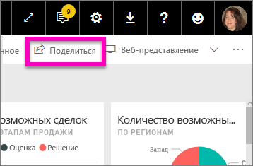
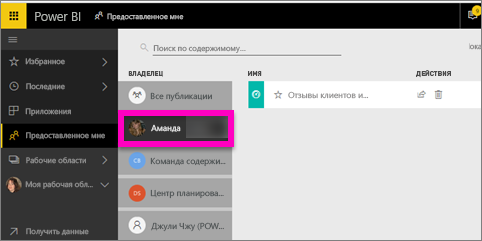

# Отображение информационных панелей Power BI, к которым мне предоставлен доступ
## Мне предоставлен доступ

Когда коллеги предоставляют вам доступ к информационной панели, ее заголовок добавляется в ваш список **Мне предоставлен доступ**. Информационная панель доступна только в списке **Мне предоставлен доступ** и недоступна в рабочей области или в **приложениях**.

Узнайте, как Аманда использует список содержимого **Мне предоставлен доступ**, включая переходы и фильтрацию. Затем сделайте то же самое, выполнив пошаговые инструкции, приведенные под видео. Для просмотра панелей мониторинга, к которым вам предоставлен общий доступ, необходимо иметь лицензию Power BI Pro. Дополнительные сведения см. в статье [Что такое Power BI Premium?](service-premium.md)

<iframe width="560" height="315" src="https://www.youtube.com/embed/G26dr2PsEpk" frameborder="0" allowfullscreen></iframe>

В зависимости от предоставленных разрешений у вас будет много возможностей взаимодействия с информационной панелью и базовым отчетом, таких как создание копий информационной панели, работа с отчетом [в режиме чтения](service-reading-view-and-editing-view.md) и повторное предоставление общего доступа другим коллегам.

## Действия, доступные на экране **Мне предоставлен доступ**
* Выбор значка звездочки для [добавления информационной панели в избранное](service-dashboard-favorite.md).
* [Удаление панели мониторинга](service-delete.md) 
* Повторное предоставление доступа к некоторым информационным панелям  
* [Поиск требуемых элементов с помощью поля поиска и сортировки](service-navigation-search-filter-sort.md) (если список информационных панелей длинный).
  
  > [!NOTE]
  > Чтобы получить сведения о классификации EGRC, нажмите кнопку классификации или см. статью [Классификация данных на панелях мониторинга](service-data-classification.md).
  > 
  > 
* Выделите имя информационной панели, чтобы открыть ее и изучить. Открыв общую информационную панель, вы можете использовать раздел вопросов и ответов, чтобы задать вопросы о базовых данных, или выбрать плитку, чтобы открыть отчет в режиме чтения и работать с ним.

## Фильтрация общих информационных панелей по владельцу
Содержимое экрана **Мне предоставлен доступ** можно отфильтровать подробнее по владельцу. Например, если выбрать **Аманду**, появятся информационные панели, к которым предоставил доступ этот пользователь.

## Дальнейшие действия
[Power BI — основные понятия](service-basic-concepts.md)  
[Что такое Power BI Premium?](service-premium.md)  

Появились дополнительные вопросы? [Попробуйте задать вопрос в сообществе Power BI.](http://community.powerbi.com/)

