# Создание приложения-шаблона в Power BI (предварительная версия)

Новые *приложения-шаблоны* Power BI позволяют партнерам создавать приложения Power BI с минимальным количеством кода или вообще без него и развертывать их для любых клиентов.  В этой статье приводятся пошаговые инструкции по созданию приложения-шаблона Power BI.

Если вы создаете отчеты и панели мониторинга Power BI, то можете стать *автором приложений-шаблонов*, который создает и упаковывает в *приложение* различное аналитическое содержимое. Затем готовое приложение можно развернуть в других клиентах Power BI с помощью любой доступной платформы, например AppSource, или используя его в вашей собственной веб-службе. Кроме того, будучи автором, вы можете создавать распространяемый защищенный пакет аналитики.

Правами пользователей на создание или установку приложений-шаблонов управляют администраторы клиента Power BI. Пользователи, у которых есть соответствующие права, могут устанавливать приложение-шаблон, а затем изменять его и распространять среди пользователей Power BI в своей организации.

## Предварительные требования

Ниже приведены требования к созданию приложения-шаблона:  

- [Лицензия Power BI Pro](service-self-service-signup-for-power-bi.md).
- [Установка Power BI Desktop](desktop-get-the-desktop.md) (необязательно).
- Знание [основных принципов Power BI](service-basic-concepts.md).
- Разрешения на создание приложения-шаблона. Дополнительные сведения см. в [разделе "Параметры приложений-шаблонов" статьи о портале администрирования](service-admin-portal.md#template-apps-settings-preview) Power BI.

## Включение режима разработчика приложений

Для создания приложения-шаблона, которое можно распространять в других клиентах Power BI, необходимо активировать режим разработчика приложений. В противном случае вы просто создаете приложение для пользователей Power BI вашей организации.

1. Откройте службу Power BI в браузере.
2. Последовательно выберите **Параметры** > **Общие** > **Разработчик** > **Включить режим разработки приложений-шаблонов**.

    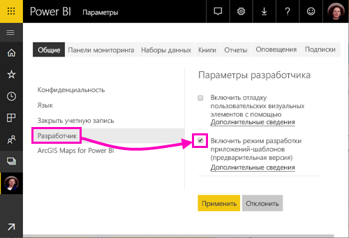

    Если этот параметр не отображается, попросите у своего администратора Power BI предоставить вам [разрешения для разработки приложений-шаблонов](service-admin-portal.md#template-apps-settings-preview) на портале администрирования.

3. Нажмите кнопку **Применить**.

## Создание рабочей области приложения-шаблона

Приложение-шаблон, которое можно распространять в других клиентах Power BI, необходимо создать в одной из новых рабочих областей.

1. В службе Power BI выберите **Рабочие области** > **Создать рабочую область приложения**.

    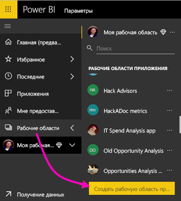

2. На экране **Создание рабочей области приложения** в разделе **Предварительный просмотр улучшенных рабочих областей** щелкните **Попробовать**.

    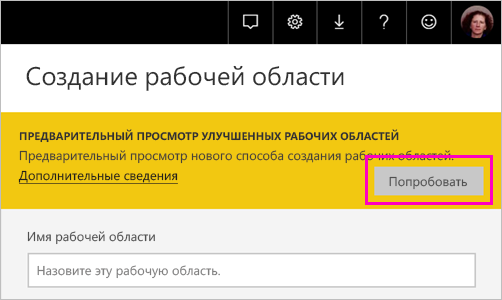

3. Введите имя, описание (необязательно) и изображение логотипа (необязательно) для рабочей области приложения.

4. Установите флажок **Разработка приложения-шаблона**.

    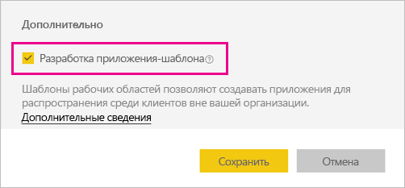

5. Нажмите кнопку **Сохранить**.
>[!NOTE]
>Вам нужно иметь разрешение от администратора Power BI для повышения уровня приложений-шаблонов.

## Создание содержимого в приложении-шаблоне

Как и при использовании обычной рабочей области приложения Power BI, следующим шагом является создание в ней содержимого.  В этой предварительной версии приложений-шаблонов поддерживается только один набор данных, один отчет и одна панель мониторинга.

- [Создайте содержимое Power BI](power-bi-creator-landing.md) в рабочей области приложения.

Если вы используете параметры в Power Query, убедитесь, что они имеют четко определенный тип (например, Text). Типы Any и Binary не поддерживаются.

Рекомендации по созданию отчетов и панелей мониторинга для приложения-шаблона см. в статье [Советы по созданию приложений-шаблонов в Power BI (предварительная версия)](service-template-apps-tips.md).

## Создание тестового приложения-шаблона

Теперь, когда в рабочей области есть содержимое, вы можете упаковать его в приложение-шаблон. Первым шагом является создание тестового приложения-шаблона, доступного только в вашем клиенте организации.

1. В рабочей области приложения-шаблона выберите **Создать приложение**.

    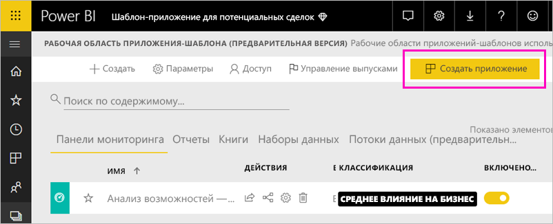

    Здесь нужно указать дополнительные параметры сборки для приложения-шаблона в пяти категориях:

    **Фирменная символика**

    
    - Имя приложения
    - Описание
    - Сайт поддержки (ссылка отображается под сведениями о приложении после повторного распространения приложения-шаблона или приложения организации)
    - Логотип приложения (файл размером не более 45 КБ, с соотношением сторон 1:1 и в формате JPEG, PNG или JPG)
    - Цвет темы приложения

    **Содержимое**

    **Целевая страница приложения**: задайте отчет или панель мониторинга в качестве целевой страницы своего приложения, которая окажет нужное впечатление:

    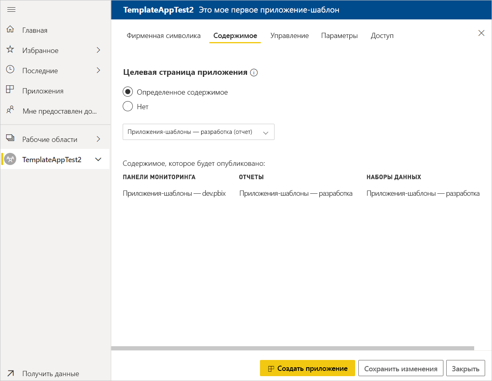

    **Управление**

    Здесь можно задать ограничения, которые будут распространяться на пользователей для содержимого приложения. Используйте для защиты интеллектуальной собственности в приложении.

    

    >[!NOTE]
    >Экспорт в формат PBIX всегда заблокирован для пользователей, устанавливающих приложение.

    **Параметры**

    Используйте эту категорию для управления поведением параметров при подключении к источникам данных. Дополнительные сведения о [создании параметров запроса](https://powerbi.microsoft.com/blog/deep-dive-into-query-parameters-and-power-bi-templates/).

    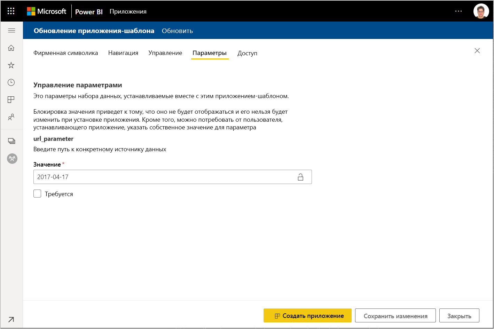
    - **Значение**: значение параметра по умолчанию.
    - **Требуется**: используйте, чтобы потребовать у установщика ввести параметр, определяемый пользователем.
    - **Блокировка**: не позволяет установщику изменить параметр.
    - **Статический**: включите, если приложение содержит *только* примеры данных. При выборе параметра **Статический** мастер установки просит пользователей подключить источник данных.

    **Доступ**: на этапе тестирования решите, какие пользователи в организации могут устанавливать и тестировать приложение. Не беспокойтесь — вы всегда можете вернуться и изменить эти параметры позже (параметр не затрагивает доступ для распределенного приложения-шаблона).

2. Выберите **Создать приложение**.

    Появится сообщение, информирующее о готовности тестового приложения и содержащее ссылку, которую можно скопировать и отправить его тестировщикам.

    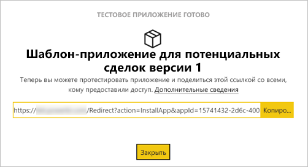

    Вы также выполнили первый шаг процесса управления выпусками, представленного далее.

## Управление выпуском приложения-шаблона

Перед выпуском общедоступной версии приложения-шаблона необходимо убедиться, что оно готово. Power BI создает панель управления выпусками, где можно изучать и контролировать всю процедуру выпуска приложения. Вы также можете активировать переход с одного этапа на другой. Ниже приведены основные этапы.

- Создание тестового приложения: для тестирования только в вашей организации.
- Повышение уровня тестового пакета до подготовительного: тестирование за пределами вашей организации.
- Повышение уровня подготовительного пакета до рабочей версии: рабочая версия.
- Удаление любого пакета или возврат к началу предыдущего этапа.

URL-адрес не изменяется при перемещении между этапами выпуска. Повышение уровня не затрагивает сам URL-адрес.

Давайте рассмотрим эти этапы:

1. В рабочей области приложения-шаблона щелкните **Управление выпусками**.

    

2. Выберите **Создать приложение**.

    Если вы создали тестовое приложение в разделе **Создание тестового приложения-шаблона** выше, рядом с пунктом **Тестирование** уже будет отображаться желтая точка и выбирать здесь **Создать приложение** не нужно. Если все же выбрать этот пункт, вы вернетесь к процессу создания приложения-шаблона.

3. Щелкните **Получить ссылку**.

    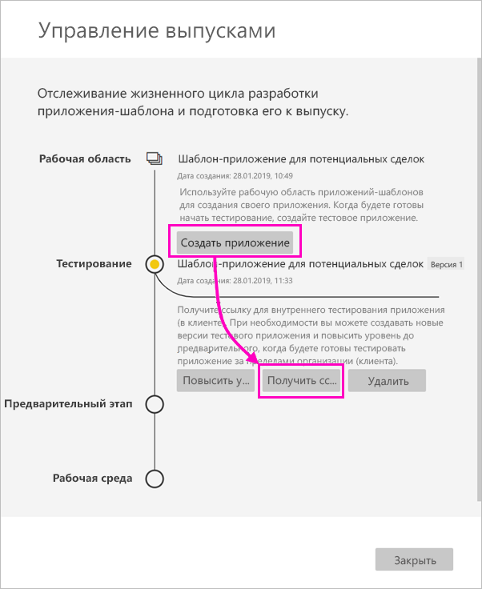

4. Чтобы протестировать процедуру установки приложения, скопируйте ссылку в окне уведомления и вставьте ее в новое окно браузера.

    Далее вы будете выполнять те же действия, которые будут выполнять ваши клиенты. Изучить процесс с их стороны можно в статье [Установка и распространение приложений-шаблонов в организации](service-template-apps-install-distribute.md).

5. В диалоговом окне выберите **Установить**.

    После установки появится уведомление о готовности нового приложения.

6. Выберите **Перейти к приложению**.
7. На экране **Начало работы с новым приложением** приложение будет отображаться так, как его увидят ваши клиенты.

    
8. Выберите **Исследовать приложение**, чтобы проверить тестовое приложение с использованием образца данных.
9. Чтобы внести изменения, вернитесь к приложению в исходной рабочей области. Изменяйте тестовое приложение, пока вас не будет все устраивать.
10. Когда вы будете готовы повысить уровень приложения до предварительного для дальнейшего тестирования вне клиента, вернитесь в область **Управление выпусками** и щелкните **Повысить уровень приложения**. 

    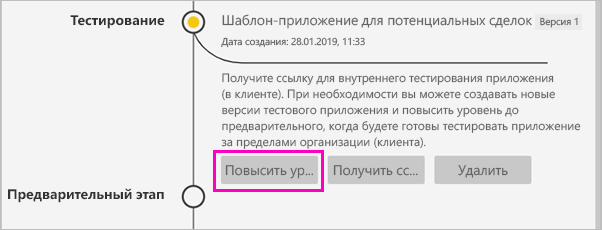

    >[!NOTE]
    > При повышении уровня приложение становится общедоступным за пределами вашей организации.

11. Выберите **Повысить уровень**, чтобы подтвердить выбор.
12. Скопируйте новый URL-адрес для доступа к тестированию приложения вне вашего клиента. Эта ссылка также отправляется, чтобы начать распространение приложения в AppSource, для чего создается [предложение портала Cloud Partner](https://docs.microsoft.com/azure/marketplace/cloud-partner-portal/power-bi/cpp-publish-offer). Отправляйте на портал Cloud Partner только ссылки предварительного уровня. Только после того, как приложение будет утверждено и вы получите уведомление о его публикации в AppSource, моно повысить уровень этого пакета до рабочего уровня в Power BI.
13. Когда приложение будет готово для использования в рабочей среде или публикации в AppSource, вернитесь в область **Управление выпусками** и щелкните **Повысить уровень приложения** рядом с пунктом **Предварительный этап**.
14. Выберите **Повысить уровень**, чтобы подтвердить выбор.

    Теперь приложение является рабочим и готово к распространению.

    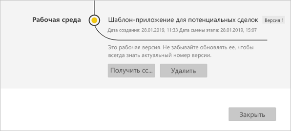

Чтобы сделать приложение общедоступным для тысяч пользователей Power BI, рекомендуем опубликовать его в AppSource. Дополнительные сведения: [Предложение приложения Power BI](https://docs.microsoft.com/azure/marketplace/cloud-partner-portal/power-bi/cpp-power-bi-offer).

## Обновление приложения

Теперь, когда приложение доступно в рабочей версии, вы можете вновь запускать этап тестирования, не нарушая работу.

1. В панели **Управление выпусками** выберите **Создать приложение**.
2. Повторите процедуру создания приложения.
3. После установки параметров в категориях **Фирменная символика**, **Содержимое**, **Управление** и **Доступ** вновь выберите **Создать приложение**.
4. Нажмите **Закрыть** и вернитесь в **Управление выпусками**.

   Теперь у вас есть две версии: версия в рабочей среде и новая версия на этапе тестирования.

    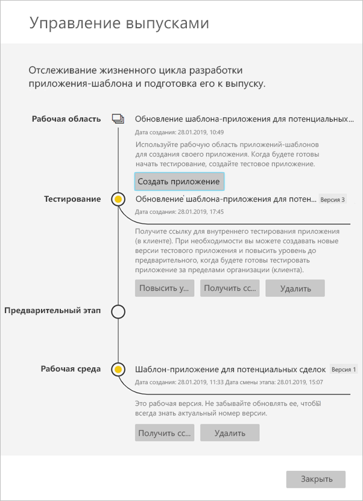

5. Когда вы будете готовы повысить уровень приложения до предварительного для дальнейшего тестирования вне клиента, вернитесь в область "Управление выпусками" и щелкните **Повысить уровень приложения** рядом с пунктом **Тестирование**.
6. Теперь ваша ссылка активна, еще раз отправьте ее на портал Cloud Partner, следуя инструкциям в разделе [Обновление предложения приложения Power BI](https://docs.microsoft.com/azure/marketplace/cloud-partner-portal/power-bi/cpp-update-existing-offer).

>[!NOTE]
>Повышать уровень приложения до рабочего можно только после того, как приложение утверждено на портале Cloud Partner и вы опубликовали его.

## Дальнейшие действия

Сведения о том, как с вашим приложением-шаблоном взаимодействуют пользователи, см. в разделе [Установка, настройка и распространение приложений-шаблонов в организации](service-template-apps-install-distribute.md).

Дополнительные сведения о распространении приложения: [Предложение приложения Power BI](https://docs.microsoft.com/azure/marketplace/cloud-partner-portal/power-bi/cpp-power-bi-offer).
