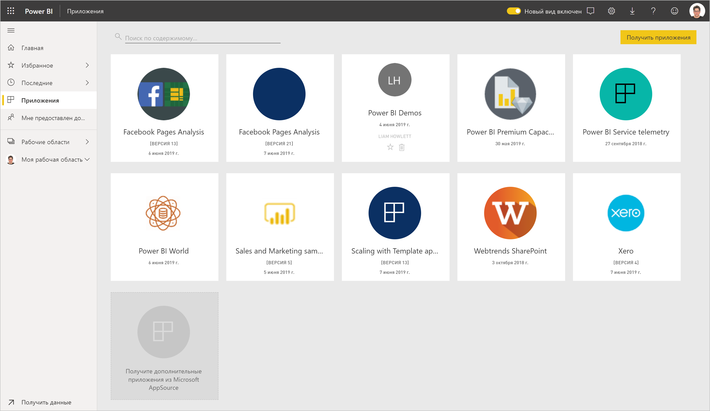
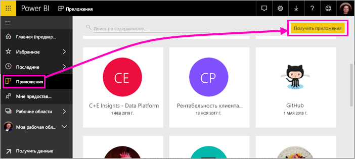
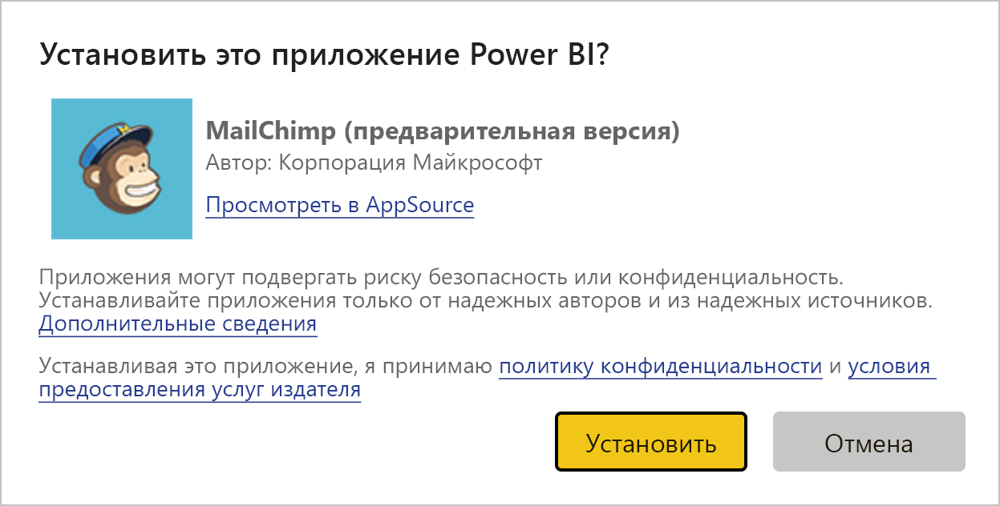
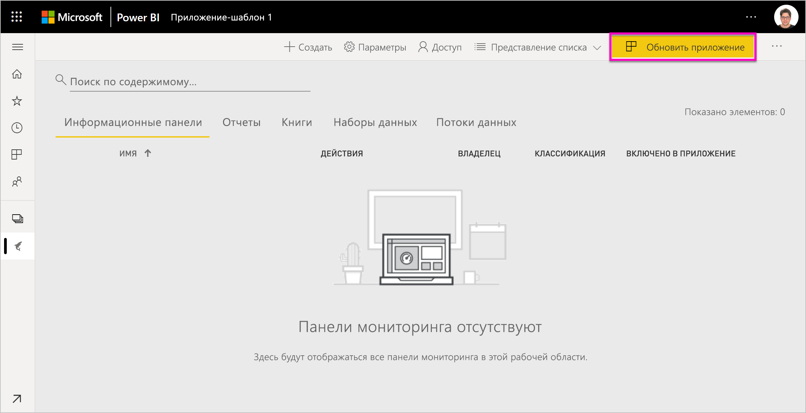
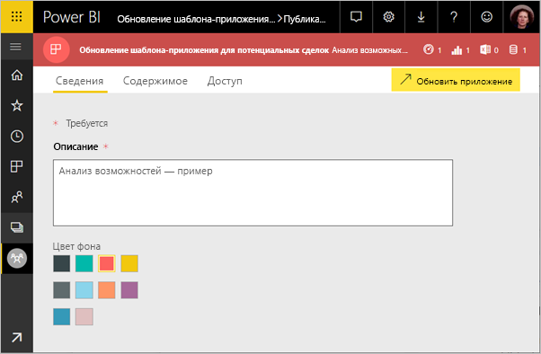
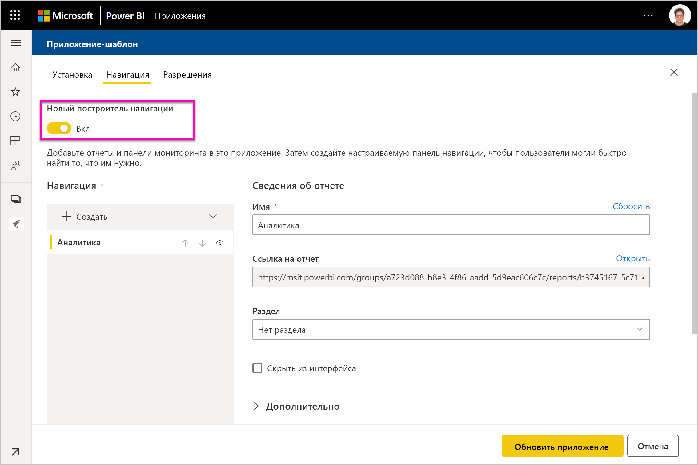
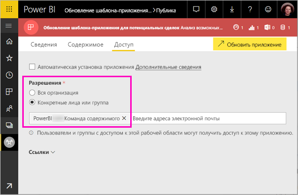

# Установка и распространение приложений-шаблонов в вашей организации — Power BI

Являетесь ли вы аналитиком Power BI? Если это так, в этой статье вы узнаете, как установить *приложения-шаблоны* для подключения к различным службам, используемым для обеспечения работы вашей организации, таким как Salesforce, Microsoft Dynamics и Google Analytics. Вы можете изменить панель мониторинга и отчеты под потребности своей организации, а затем распространить их в виде обычного *приложения* среди коллег. 

Если вас интересует создание приложений-шаблонов для самостоятельного распространения, см. статью [Создание приложения-шаблона в Power BI](service-template-apps-create.md). Партнеры Power BI могут создавать приложения Power BI с минимальным количеством кода или вообще без него и развертывать их для клиентов Power BI. 

## Предварительные требования  

Ниже приведены требования к установке, настройке и распространению шаблона-приложения: 

- [Лицензия Power BI Pro](service-self-service-signup-for-power-bi.md).
- Знание [основных принципов Power BI](service-basic-concepts.md).
- Наличие рабочей ссылки для установки, полученной от создателя приложения-шаблона или из AppSource. 
- Разрешения на установку приложений-шаблонов. 

## Установка приложения-шаблона

Ссылку на приложение-шаблон вам может кто-то прислать, или вы можете сами найти ссылку на интересующее приложение в AppSource. В любом случае установленное приложение можно будет изменять и распространять среди сотрудников вашей организации.

### Поиск в AppSource из браузера

В браузере щелкните следующую ссылку, чтобы открыть в AppSource страницу с отфильтрованными приложениями Power BI:

- https://appsource.microsoft.com/marketplace/apps?product=power-bi

### Поиск в AppSource из службы Power BI

1. В службе Power BI в левой панели навигации выберите **Приложения** > **Получить приложения**.

    

2. В AppSource выберите **Приложения**.

    

3. Найдите приложение, а затем щелкните **Получить**.

4. В диалоговом окне выберите **Установить**.

     Если у вас есть лицензия Power BI Pro, приложение устанавливается вместе со связанной рабочей областью. В этой рабочей области выполняется настройка приложения.

    После установки появится уведомление о том, что новое приложение готово.
4. Выберите **Перейти к приложению**.
5. На экране **Начало работы с новым приложением** выберите один из трех вариантов:

    

    - **Исследовать приложение**. Изучите приложение на простейшем примере данных. Здесь вы можете ознакомиться с внешним видом и функциональностью приложения. 
    - **Подключиться к данным**. Измените источник из образца данных на свой собственный. Вы можете переопределить параметры набора данных и учетные данные источника. См. раздел [Известные ограничения](service-template-apps-tips.md#known-limitations) в статье с советами по созданию приложений-шаблонов. 
    - **Перейти к рабочей области** (самый сложный вариант). Вы можете вносить любые изменения, разрешенные создателем приложения.

    Или же пропустите это диалоговое окно и перейдите напрямую к рабочей области, выбрав элемент **Рабочие области** в левой панели навигации.
    >[!NOTE]
    >При установке приложения-шаблона устанавливается как *приложение организации*, так и *приложение рабочей области*. См. дополнительные сведения о [распространении приложений в Power BI](service-create-distribute-apps.md).
 
6. Прежде чем предоставить доступ к рабочей области коллегам, вам потребуется подключиться к собственным данным. Кроме того, может потребоваться изменить отчет или панель мониторинга в соответствии с потребностями организации. На этом этапе можно также добавлять другие отчеты и панели мониторинга.

   При переходе по ссылке для установки приложения, отсутствующего в AppSource, появится диалоговое окно с просьбой подтвердить выбор.

   

   >[!NOTE]
   >Для установки приложений-шаблонов, отсутствующих в AppSource, требуется запросить разрешения у администратора. Дополнительные сведения см. в [разделе "Параметры приложений-шаблонов" статьи о портале администрирования](service-admin-portal.md#template-apps-settings) Power BI.

## Обновление и распространение приложения

После обновления под вашу организацию приложение будет готово к публикации. Для этого используются те же действия, что и для публикации любого другого приложения.

1. Завершив настройку, в представлении списка рабочей области выберите **Обновить приложение** в правом верхнем углу.  

    

2. На вкладке **Сведения** можно изменить описание и цвет фона.

   

3. На вкладке **Содержимое** можно выбрать целевую страницу — панель мониторинга или отчет.

   

4. На вкладке **Доступ** вы можете предоставить доступ выбранным пользователям или всей организации.  

   

5. Щелкните **Обновить приложение**. 

6. После публикации приложения скопируйте ссылку и отправьте ее тем, кому вы предоставили права доступа. Они увидят ссылку в AppSource на вкладке **Моя организация**.

## Дальнейшие действия 

[Создание рабочих областей вместе с коллегами в Power BI](service-create-workspaces.md)

 

 
