# Навигация в службе Power BI
#### Июнь 2017 г.
Если вы уже пользовались службой Power BI, вы, несомненно, заметили, что мы внесли значительные изменения в пользовательский интерфейс.  Большинство этих изменений касается организации содержимого (панелей мониторинга, отчетов, наборов данных) и путей (щелчков), необходимых для выполнения задач с этим содержимым. 

## Часто выполняемые действия в новом интерфейсе
Тем, кто уже знаком с предыдущим интерфейсом службы Power BI, это руководство поможет понять, как выполнять нужные действия в новом интерфейсе. Мы понимаем, что новые алгоритмы действий могут поначалу сбивать с толку, но мы убеждены, что по мере использования вы обнаружите, что новый интерфейс позволяет существенно экономить время. 

Краткий справочник

| Задача | Новая (текущая) последовательность действий |
| --- | --- | --- |
| Добавление панели мониторинга в избранное |Выберите рабочую область и щелкните "Панели мониторинга". Затем щелкните значок звездочки, чтобы он стал желтым. |
| Просмотр списка избранных панелей мониторинга |В области навигации слева выберите **Избранное**. |
| Просмотр списка недавно просмотренных панелей мониторинга и отчетов |В области навигации слева выберите **Недавние**. |
| Просмотр списка панелей мониторинга, к которым вам предоставлен доступ |В области навигации слева выберите **Мне предоставлен доступ**. |
| Общий доступ к панели мониторинга |Откройте панель мониторинга и выберите **Поделиться**. Или же создайте и опубликуйте приложение. |
| Удаление панели мониторинга |Выберите "Моя рабочая область" и щелкните "Панели мониторинга". Затем щелкните значок корзины. |
| Удаление отчета |Выберите "Моя рабочая область" и щелкните "Отчеты". Затем щелкните значок корзины. |
| Удаление набора данных |Выберите "Моя рабочая область" и щелкните "Наборы данных". Затем выберите действие "Удалить". |
| Открытие панели мониторинга |Выберите рабочую область и щелкните "Панели мониторинга". Затем щелкните имя нужной панели мониторинга. |
| Открыть отчет. |Выберите рабочую область и щелкните "Отчеты". Затем щелкните имя нужного отчета. |
| Открытие набора данных |Выберите рабочую область и щелкните "Наборы данных". Затем щелкните имя нужного набора данных. |
| Создание панели мониторинга |В области навигации вверху выберите "Создать" > "Панель мониторинга". |
| Создание отчета |В области навигации вверху выберите "Создать" > "Отчет". |
| Создание набора данных |В области навигации вверху выберите "Создать" > "Набор данных". |
| Создание приложения |Щелкните "Рабочие области" > "Создать рабочую область приложения". |
| Просмотр всех собственных панелей мониторинга, отчетов и наборов данных |Щелкните "Рабочие области" > "Моя рабочая область". |

## Почему мы изменили навигацию в службе Power BI
* Упрощены списки для панелей мониторинга, отчетов, книг и наборов данных.    
* Добавлены всплывающие меню быстрого доступа к избранным и недавно использующимся элементам, а также всплывающее меню выбора рабочей области.    
* Добавлена возможность идентификации связанного содержимого для информационных панелей, отчетов и наборов данных.    
* Добавлена отдельная область содержимого для книг.    
* Создана отдельная область для избранных панелей мониторинга.    
* Создана отдельная область для содержимого, которое вам предоставили. 
* Создана отдельная область для недавно использовавшегося содержимого.  
* Сокращено количество действий, необходимых для выполнения задач — в одном окне объединены списки содержимого и действий, выполняемых с этим содержимым. Например, переключение между информационными панелями и отчетами.</td></tr></table>

Узнайте, как Аманда использует новые возможности навигации, объясняя и демонстрируя улучшения.  Затем сделайте то же самое, выполнив пошаговые инструкции, приведенные под видео.

<iframe width="560" height="315" src="https://www.youtube.com/embed/G26dr2PsEpk" frameborder="0" allowfullscreen></iframe>

## Мы добавили ряд новых возможностей
## Просмотр содержимого (панелей мониторинга, отчетов, книг, наборов данных, рабочих областей, приложений)
Рассмотрим организацию основного содержимого (информационные панели, отчеты, наборы данных, книги). До этого все содержимое отображалось на левой панели навигации. Сейчас оно отображается там же, но по умолчанию содержимое сгруппировано по типу в контексте рабочей области. Выберите рабочую область на левой панели навигации, после чего вкладки для соответствующего содержимого (информационные панели, отчеты, книги, наборы данных) заполнят холсты Power BI в правой части.

В бесплатной версии Power BI отображается только одна рабочая область — **Моя рабочая область**.

## Избранные панели мониторинга
Элемент **Избранное** позволяет быстро получить доступ к наиболее важным информационным панелям.  

1. Откройте панель мониторинга и щелкните **Добавить в избранное** в правом верхнем углу.
   
   
   
   Элемент **Добавить в избранное** изменится на **Удалить из избранного**, и значок звездочки станет желтым.
   
   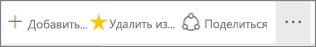
2. Чтобы увидеть список всех панелей мониторинга, добавленных в избранное, на левой панели навигации щелкните стрелку справа от меню **Избранное**. Список на левой панели навигации — постоянная функция службы Power BI. Этот список доступен из любого расположения в службе.
   
    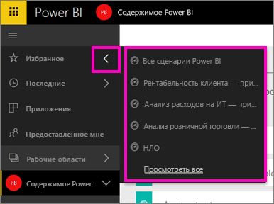
   
    Здесь можно выбрать информационную панель, которую необходимо открыть.
3. Чтобы открыть панель **Избранное**, на левой панели навигации выберите **Избранное** или щелкните значок "Избранное" .
   
   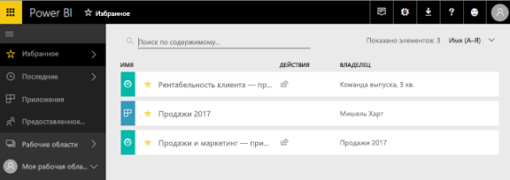
   
   Отсюда можно открыть информационную панель, увидеть сведения о ее владельце, исключить ее из избранного или предоставить к ней доступ коллегам для совместного использования.
4. Отметить панель мониторинга как избранную также можно на вкладке **Панели мониторинга**.  Просто откройте рабочую область с панелью мониторинга, и щелкните значок звездочки слева от названия панели.
   
   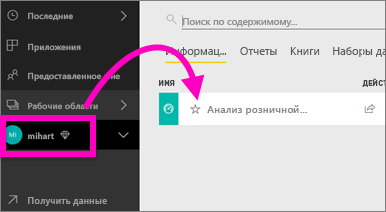

Дополнительные сведения см. в статье [Избранные панели мониторинга в Power BI](service-dashboard-favorite.md).

## Панель Recents (Последнее)
На панели **Recents** (Последнее) можно быстро получить доступ к отчетам и информационным панелям, к которым вы недавно обращались. Она содержит материалы со всех рабочих областей.

  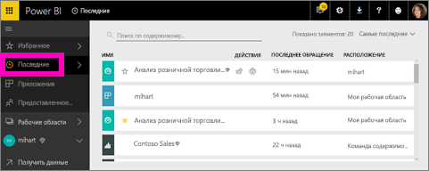

Так же, как и в меню "Избранное", вы можете быстро получить доступ к недавно использовавшимся объектам из любого расположения в службе Power BI, выбрав стрелку рядом с меню **Последние** на панели навигации слева.

  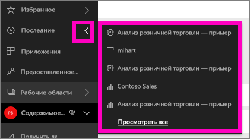

Дополнительные сведения см. в статье [Недавно просмотренное содержимое в службе Power BI](service-recent.md).

## Приложения
Приложение — это набор панелей мониторинга и отчетов, предоставляющих все ключевые метрики в одном решении. У вас могут быть приложения для использования в пределах организации, а также такие [приложения для внешних служб](service-connect-to-services.md), как Google Analytics и Microsoft Dynamics CRM. 

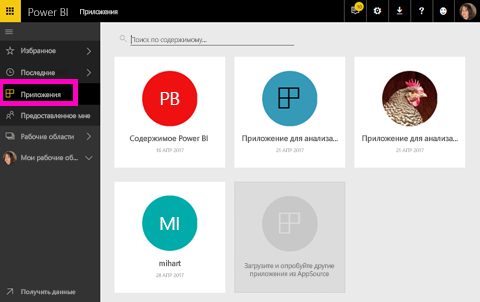

Дополнительные сведения см. в разделе **Рабочие области приложений** (ниже) и в статье [Что из себя представляют приложения в Power BI?](service-install-use-apps.md).

## Панель "Мне предоставлен доступ"
На панели **Мне предоставлен доступ** находятся все информационные панели, доступ к которым вам предоставлен.  Отфильтруйте данные по владельцу панели мониторинга, воспользуйтесь полем поиска для обнаружения нужных данных и отсортируйте элементы по дате.  Общее содержимое, которое вы часто просматриваете, можно с легкостью добавить в избранное прямо из представления **Мне предоставлен доступ**.

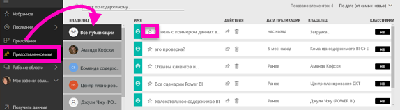

Дополнительные сведения см. в статье [Отображение информационных панелей Power BI, к которым мне предоставлен доступ](service-shared-with-me.md).

## Работа с рабочими областями
Далее на левой панели навигации находится раздел *Рабочие области*. Рабочие области —это нечто вроде *контейнеров* для содержимого Power BI. Существует два типа рабочих областей: **Моя рабочая область** и рабочие области приложений.

Если вы не участник или не администратор рабочей области, в области навигации слева может не быть ни одной рабочей области приложений. Если вы используете Power BI с бесплатной лицензией, рабочие области приложения не будут отображаться.

### Моя рабочая область
В разделе **Моя рабочая область** хранится все содержимое пользователя. Это своего рода личная песочница или рабочая область для хранения личного содержимого. Вы можете совместно использовать содержимое из своей рабочей области с коллегами. В разделе "Моя рабочая область" содержимое распределяется по 4 вкладкам: "Информационные панели", "Отчеты", "Книги" и "Наборы данных".

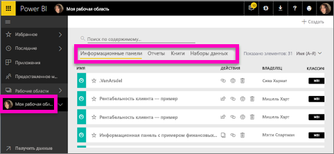

### Рабочие области приложений
Приложения и рабочие области приложений — это компоненты службы Power BI Pro. Рабочие области приложений используются при создании информационных панелей и отчетов для других пользователей. Рабочая область приложения — это место создания приложения. Поэтому чтобы создать приложение, сначала нужно создать рабочую область. Рабочие области приложений — это усовершенствованные рабочие области групп. Они представляют собой промежуточную область и контейнеры для хранения содержимого приложения.  Вы, ваши коллеги и даже целая организация можете совместно работать над информационными панелями, отчетами и другим содержимым, ориентированным на более широкую аудиторию.

Дополнительные сведения см. в статье [Создание и распространение приложения в Power BI](service-create-distribute-apps.md#app-workspaces).

Как и в разделе **Моя рабочая область**, содержимое распределяется по 4 вкладкам: "Информационные панели", "Отчеты", "Книги" и "Наборы данных".

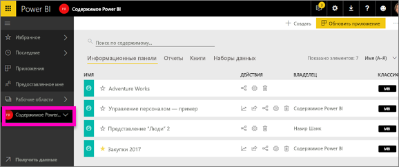

Чтобы переключиться между рабочими областями, выберите **Рабочие области** на левой панели навигации.

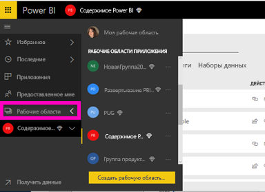

## Поиск и сортировка содержимого
Новое представление содержимого упрощает поиск, фильтрацию и сортировку содержимого. Чтобы найти панель мониторинга, отчет или книгу, введите строку в области поиска. Power BI отфильтрует данные и покажет только содержимое, которое содержит строку поиска как часть названия.

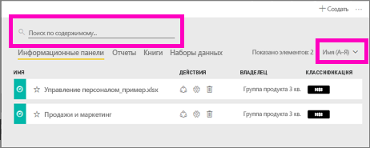

Вы также можете сортировать содержимое по имени или владельцу.  

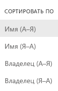

Дополнительные сведения см. в статье [Поиск и сортировка содержимого в Power BI](service-navigation-search-filter-sort.md).

Возникли вопросы или хотите оставить отзыв? [Посетите форум сообщества Power BI](http://community.powerbi.com/t5/Navigation-Preview-Forum/bd-p/NavigationPreview).

