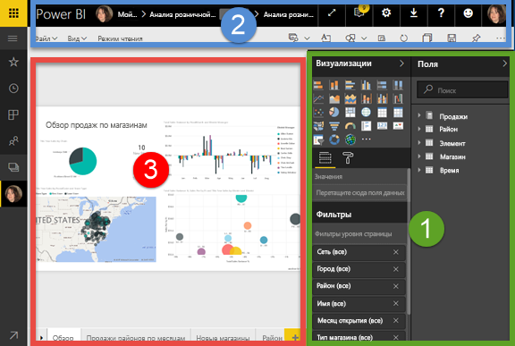
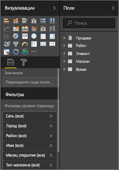
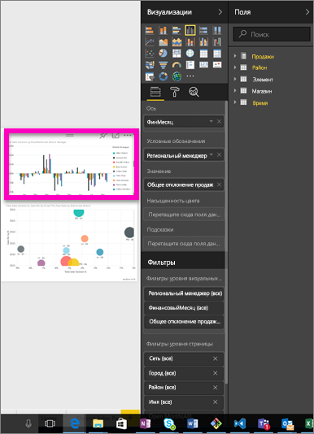
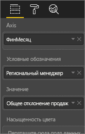
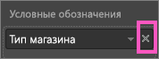
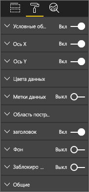
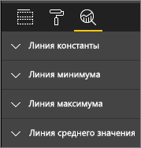
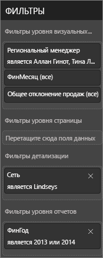
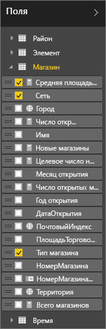

# Знакомство с редактором отчетов
Редакторы отчетов в службе Power BI и Power BI Desktop очень похожи. Видео описывает использование редактора отчетов в службе Power BI, а статья — использование в службе Power BI Desktop. 

<iframe width="560" height="315" src="https://www.youtube.com/embed/IkJda4O7oGs" frameborder="0" allowfullscreen></iframe>

В службе Power BI *редактор отчетов* доступен только в [режиме правки](service-reading-view-and-editing-view.md). Чтобы открыть отчет в режиме правки, необходимо быть его владельцем.

Редактор отчетов Power BI состоит из 3 разделов:  

1. Панелей **Поля**, **Визуализации** и **Фильтры**.
2. Верхняя область навигации    
3. Холст отчетов     

## 1. Панели редактора отчетов

При первом открытии отчета отображаются 3 панели: "Визуализации", "Фильтры" и "Поля". Панели в левой части — "Визуализации" и "Фильтры" — позволяют настроить внешний вид визуализаций, включая их тип, цвет, фильтрацию и форматирование,  а с помощью панели "Поля" справа можно управлять базовыми данными, используемыми в визуализациях. 

Содержимое, отображаемое в редакторе отчетов, зависит от параметров, выбранных на холсте отчетов.  Например, при выборе отдельного визуального элемента: 

|  |  |
| --- | --- |
|  |<ul><li>Верхняя часть панели визуализации определяет тип используемого визуального элемента. В нашем примере используется гистограмма с группировкой.  </li> <li>В нижней части области визуализации (может потребоваться прокрутить вниз) отображаются поля, используемые в визуальном элементе. На этой диаграмме используются параметры FiscalMonth, DistrictManager и Total Sales Variance (Суммарное отклонение продаж).   </li><li>На панели "Фильтры" (может потребоваться прокрутить вниз) отображаются все фильтры, которые были применены.   </li><li>На панели "Поля" указаны доступные таблицы и (при развертывании узла имени таблицы) поля, из которых состоит таблица. Желтый цвет шрифта означает, что в визуализации используется по крайней мере одно поле из таблицы.  </li><li> Чтобы отобразить панель форматирования для выбранной визуализации, щелкните значок с изображением валика.  </li><li> Чтобы отобразить панель "Аналитика", щелкните значок лупы.</ul> |
|  | |

## Панель "Визуализации" (сверху вниз)

Здесь указывается тип визуализации. Небольшие рисунки называются *шаблонами*. На приведенном выше рисунке выбрана линейчатая диаграмма с группировкой. Если вы не выбрали тип визуализации сначала и вместо этого приступили к созданию визуализации, выбрав поля, тип визуализации будет выбран службой Power BI. Вы можете сохранить выбор Power BI или изменить тип, выбрав другой шаблон. Переключайтесь между различными типами столько, сколько вам нужно, чтобы найти тип визуализации, который представляет данные самым оптимальным образом.

### Управляйте полями, используемыми в визуальном элементе.

Контейнеры (их иногда называют *категориями*) в этой области изменяются в зависимости от типа выбранной визуализации.  Например, если выбрана линейчатая диаграмма, вы увидите контейнеры для значений, оси и легенды. Когда вы выбираете поле или перетаскиваете его на холст, Power BI добавляет это поле в один из контейнеров.  Вы также можете перетаскивать поля из списка "Поля" непосредственно в контейнеры.  Некоторые контейнеры подходят только для определенных типов данных.  Например, контейнер **Значения** не принимает нечисловые поля. Таким образом, если перетащить поле **employeename** в контейнер **Значения** , Power BI изменяет его на **число employeename**.

### Удаление поля
Чтобы удалить поле из визуализации, нажмите кнопку **X** справа от имени поля.

Дополнительные сведения см. в разделе [Добавление визуализаций в отчет Power BI](power-bi-report-add-visualizations-i.md).

### Форматирование визуальных элементов
Отобразите область форматирования, щелкнув значок валика. Доступный параметр зависит от типа выбранной визуализации.

Возможности форматирования практически безграничны.  Чтобы узнать больше об этих возможностях и самостоятельно их изучить, ознакомьтесь с этими статьями:

* [Настройка заголовка, фона и условных обозначений визуализации](power-bi-visualization-customize-title-background-and-legend.md)
* [Форматирование цветом](service-getting-started-with-color-formatting-and-axis-properties.md)
* [Настройка свойств осей X и Y](power-bi-visualization-customize-x-axis-and-y-axis.md)

### Добавление аналитики в визуализации
Чтобы отобразить панель "Аналитика", щелкните значок лупы. Доступный параметр зависит от типа выбранной визуализации.

    
Панель "Аналитика" в службе Power BI позволяет добавлять динамические строки ссылок в визуализации, чтобы обратить внимание на важные тенденции и подробные сведения. См. дополнительные сведения о [панели аналитики в службе Power BI](service-analytics-pane.md) и [панели аналитики в службе Power BI Desktop](desktop-analytics-pane.md).

- - -
## Панель "Фильтры"
Эта панель используется для просмотра, создания и настройки фильтров уровня страницы, отчета, подробных сведений и визуального элемента.

Дополнительные сведения см. в разделе [Добавление фильтра в отчет](power-bi-report-add-filter.md).

- - -
## Панель "Поля"
На панели "Поля" отображаются таблицы и поля, которые существуют в ваших данных. Их можно использовать для создания визуализаций.

|  |  |
| --- | --- |
|  |<ul><li>Перетащите поле на страницу, чтобы начать новую визуализацию.  Вы также можете перетащить поле на имеющуюся визуализацию, чтобы добавить его в эту визуализацию.  </li> <li>При установке флажка рядом с полем Power BI добавляет поле в активную (или новую) визуализацию, а также определяет, в какой контейнер поместить это поле.  Например, следует ли использовать поле для легенды, оси или значения? Power BI делает самый оптимальный выбор. Вы можете переместить его из этого контейнера в другой при необходимости.   </li><li>В любом случае все выбранные поля добавляются в панель "Визуализации" в редакторе отчетов.</li></ul> |

**Примечание.** При использовании Power BI Desktop вы также можете получить доступ к параметрам для отображения и скрытия полей, добавления вычислений и т. д.

### Что означают значки полей?
* **Статистические выражения (∑)**. Статистическое выражение представляет числовое значение, которое будет, например, суммироваться или усредняться. Статистические выражения импортируются вместе с данными (определенными в модели данных, на которой основан отчет).
  Дополнительные сведения см. в разделе [Статистические выражения в отчетах Power BI](service-aggregates.md).
* **Вычисляемые меры (также называемые вычисляемыми полями)**  
   Каждое вычисляемое поле имеет собственную жестко заданную формулу. Это вычисление нельзя изменить: например, если это сумма, то нельзя получить ничего, кроме суммы. Дополнительные сведения см. в разделе [Основные сведения о мерах](desktop-measures.md)
*  **Уникальные поля**  
   Поля с этим значком были импортированы из Excel и настроены для отображения всех значений, даже если они имеют дубликаты. Например, в ваших данных могут присутствовать две записи для человека с именем "Николай Новиков", при этом каждая из них будет считаться уникальной, а суммироваться они не будут.  
* ** Поля географии**  
   Поля расположения можно использовать для создания визуализаций карты. 
* ** Иерархия**  
   Чтобы увидеть поля, из которых состоит иерархия, щелкните стрелку. 

- - -
## 2. Верхняя панель навигации
С помощью верхней панели навигации можно выполнять самые разные действия, и их набор постоянно расширяется. Сведения о том или ином действии см. в оглавлении к документации Power BI (кроме того, вы можете воспользоваться полем поиска).

## 3. Холст отчетов
Холст отчетов — это среда для отображения работы. При использовании панелей "Поля", "Фильтры" и "Визуализации" для создания визуальных элементов они создаются и отображаются на холсте отчетов. Каждая вкладка в нижней части холста представляет страницу отчета. Выберите вкладку, чтобы открыть эту страницу. 

## Дальнейшие действия:
[Создание отчета](service-report-create-new.md)

[Изменение отчета](service-interact-with-a-report-in-editing-view.md)

Дополнительные сведения об [отчетах в Power BI](service-reports.md)

[Приступая к работе с Power BI](service-get-started.md)

[Power BI — основные понятия](service-basic-concepts.md)

Появились дополнительные вопросы? [Ответы на них см. в сообществе Power BI.](http://community.powerbi.com/)

