# Советы и рекомендации по форматированию цветом в Power BI
В Power BI предусмотрено много разных способов настройки панелей мониторинга и отчетов. В этой статье приводятся советы о том, как сделать визуализации в Power BI более привлекательными и интересными и настроить их в соответствии с потребностями.

Предлагаются следующие советы. Есть еще один хороший совет? Отлично! Отправьте его нам, и мы добавим его в этот список.

* Изменение цвета отдельной точки данных
* Выбор цвета диаграммы на основе числового значения
* Выбор цвета точек данных на основе значения поля
* Настройка цветов, используемых в цветовой шкале
* Использование расходящихся цветовых шкал
* Отмена действий в Power BI

Чтобы внести изменения, необходимо открыть отчет в режиме редактирования: выберите нужный **отчет** в области **Моя рабочая область** , а затем выберите пункт **Изменить отчет** в верхнем меню, как показано на следующем рисунке.

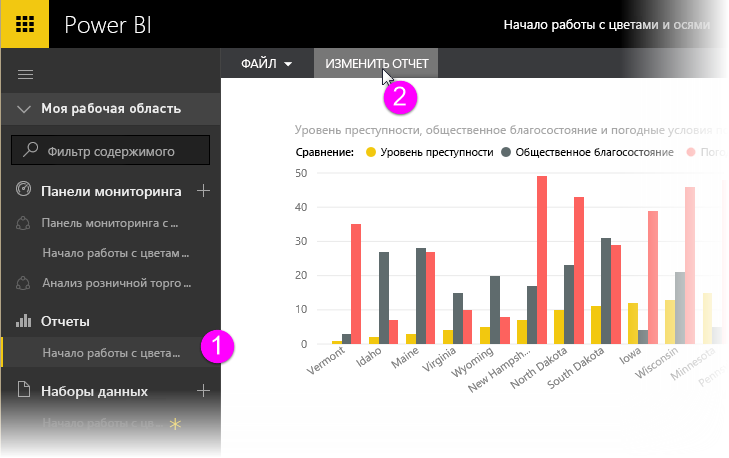

Когда в правой части холста **отчета** появится область **Визуализации** , можно приступать к настройке.

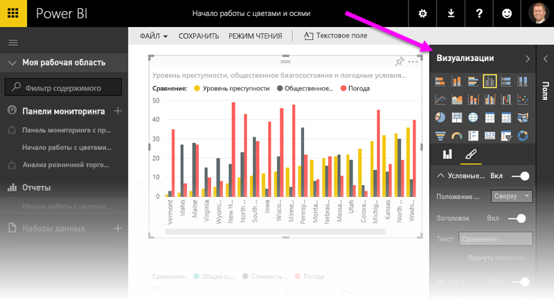

## Изменение цвета отдельной точки данных
Иногда требуется выделить одну точку данных. Возможно, это объемы продаж для запуска нового продукта или повышенные показатели качества после запуска новой программы. С помощью Power BI можно выделить конкретную точку данных, изменив ее цвет.

Следующая визуализация содержит список штатов, отсортированный по прожиточному уровню. 

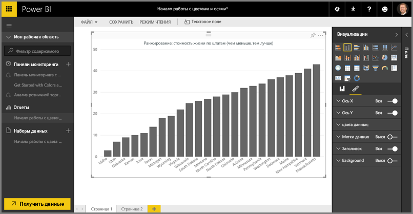

Предположим, вам требуется быстро выделить место штата Вашингтон в этом ранжированном списке с помощью цвета. Это делается следующим образом.

Разверните раздел **Цвета данных** . Появятся следующие элементы.

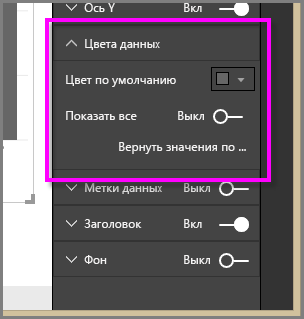

Задайте для параметра **Показать все** значение **Вкл**. Будут выведены цвета для каждого элемента данных в визуализации. При наведении указателя мыши на точки данных включается прокрутка, и вы можете изменить любые точки данных.

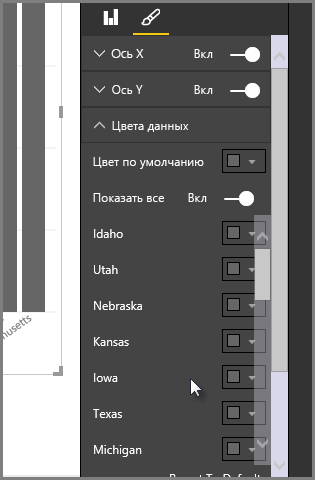

В нашем случае выберем для точки **Washington** (Вашингтон) зеленый цвет. Прокрутите список до пункта **Вашингтон** и щелкните стрелку "вниз" внутри его палитры. Появится окно выбора цвета.

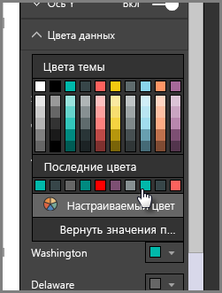

После выбора цвета точка данных **Вашингтон** получает красивый оттенок зеленого и, определенно, выделяется среди других.

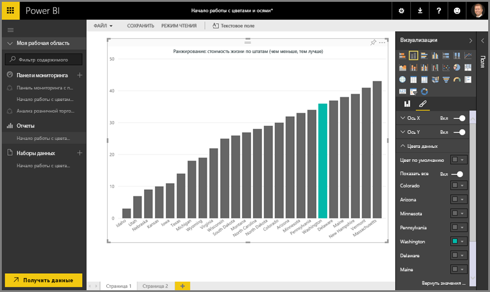

Даже если вы измените тип визуализации, а затем вернетесь к прежнему выбору, Power BI запомнит выбор и будет отображать пункт **Вашингтон** зеленым цветом.

Цвет точки данных можно изменить для нескольких элементов данных. На следующем рисунке **Аризона** отображается красным цветом, а **Вашингтон** — по-прежнему зеленым.

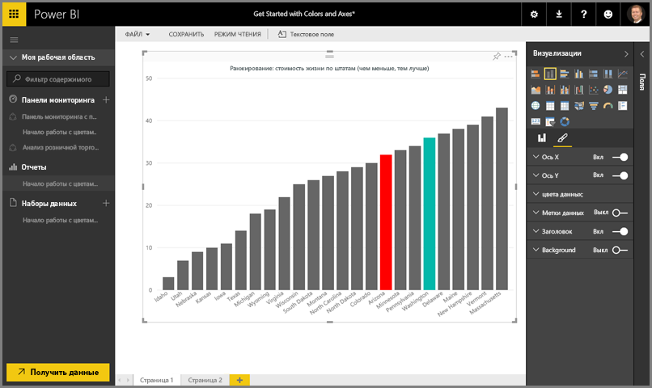

Применение цветов дает очень широкие возможности. В следующем разделе мы рассмотрим градиентные заливки.

## Выбор цвета диаграммы на основе числового значения
Для диаграмм часто удобно динамическое задание цвета на основе числового значения поля. Таким образом можно показать значение, которое отличается от используемого для размера столбца, или показать два значения на одной диаграмме. С помощью цвета также можно выделить точки выше (или ниже) определенного значения, например выделив области низкой рентабельности.

В следующих разделах демонстрируются разные способы настройки выбора цвета на основе числового значения.

## Выбор цвета точек данных на основе значения
Чтобы изменить цвет на основе значения, перетащите поля, на которых будет основываться цвет, в область **Насыщенность цвета** области **Поля** . На следующем рисунке в область **Насыщенность цвета** перемещено поле **Profit before tax**(Прибыль до налога). Как видите, хотя у **Velo****валовые продажи** выше (выше соответствующий столбец Gross Sales), у **Amarilla** больше значение **прибыли до налога** (более насыщенный цвет столбца).

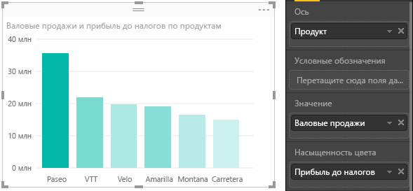

## Настройка цветов, используемых в цветовой шкале
Кроме того, можно настроить цвета, используемые в цветовой шкале. Разверните меню **Цвета данных** , и вы увидите градиентные заливки, используемые для визуализации данных. По умолчанию минимальному значению в данных соответствует наименее насыщенный оттенок, а максимальному значению — наиболее насыщенный.

Диапазон цветов отображается в строке градиента, которая показывает спектр между **минимальным** и **максимальным** значением цвета ( **минимальное** значение слева, **максимальное** — справа).

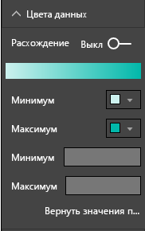

Чтобы изменить шкалу для использования другого диапазона цветов, щелкните раскрывающийся список в поле **Минимум** или **Максимум**и выберите цвет. На следующем рисунке для значения **Максимум** выбран черный цвет, а в строке градиента отображается новый спектр цветов между **минимальным** и **максимальным** значением.

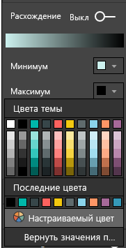

Можно также изменить способ сопоставления значений и цветов. На следующем рисунке для **минимального** и **максимального** значений заданы оранжевый и зеленый цвета соответственно.

На первом рисунке обратите внимание, как столбцы в диаграмме отражают градиент в строке: самому высокому значению назначен зеленый цвет, самому низкому — оранжевый, и каждый столбец между ними окрашен оттенками спектра между зеленым и оранжевым.

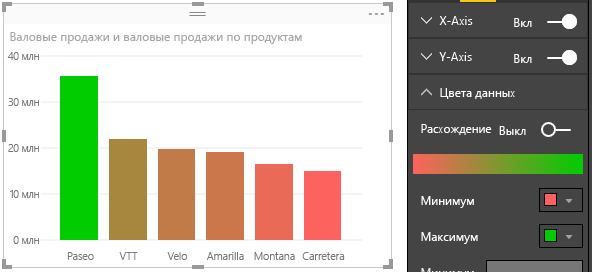

Давайте посмотрим, что произойдет, если мы укажем для полей **Минимум** и **Максимум** числовые значения, которые выходят за пределы **минимального** и **максимального** значения выбора цвета (как показано на следующем рисунке). Зададим для поля **Минимум** и для поля **Максимум** значение 20 000 000.

При выборе таких значений градиент больше не применяется к значениям на диаграмме, которые ниже **минимума** или выше **максимума**. Все столбцы со значением, превышающим **максимальное**, окрашены зеленым, а столбцы со значением ниже **минимального** окрашены красным.

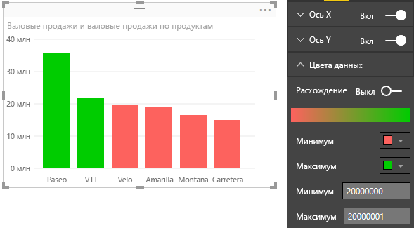

## Использование расходящихся цветовых шкал
Иногда к данным могут применяться естественные расходящиеся шкалы. Например, диапазон температур имеет естественный центр в точке замерзания, а показатели рентабельности — естественную среднюю точку (нуль).

Чтобы использовать расходящиеся цветовые шкалы, передвиньте ползунок **Расхождение** в значение **Вкл**. Если режим **расхождения** включен, появляются дополнительное поле выбора цвета и поле значения с именами **Центр**, как показано на следующем рисунке.

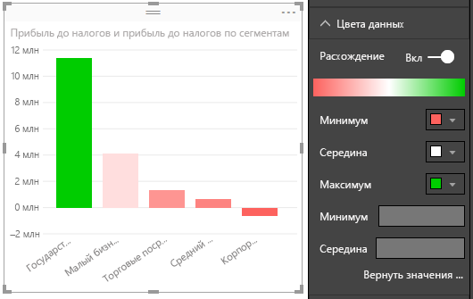

Если включен режим **расхождения** , можно задать цвета для полей **Минимум**, **Максимум** и **Центр** по-отдельности. На следующем рисунке в поле **Центр** задано значение 1, поэтому к столбцам со значениями выше единицы применяется градиентная заливка зеленым, а к столбцам со значениями ниже единицы — оттенки красного.

## Отмена действий в Power BI
Как и многие другие службы и программное обеспечение Майкрософт, Power BI обеспечивает простой способ отмены последней команды. Предположим, вы изменили цвет точки данных или ряда точек данных и вам не понравился цвет, когда он появился в визуализации. Вы не помните точно, какой цвет использовался раньше, но уверены, что его нужно вернуть.

Чтобы **отменить** последнее действие (или несколько последних действий), нужно всего лишь:

- нажать клавиши CTRL + Z.

## Отзывы
У вас есть совет, которым вы хотели бы поделиться? Отправьте его нам, и, возможно, мы добавим его в эту статью.

>[!NOTE]
>Цвета, оси и связанные настройки, доступные при выборе значка **Формат**, также доступны в Power BI Desktop.

## Дальнейшие действия
[Начало работы с форматированием цветом и свойствами осей](service-getting-started-with-color-formatting-and-axis-properties.md)

