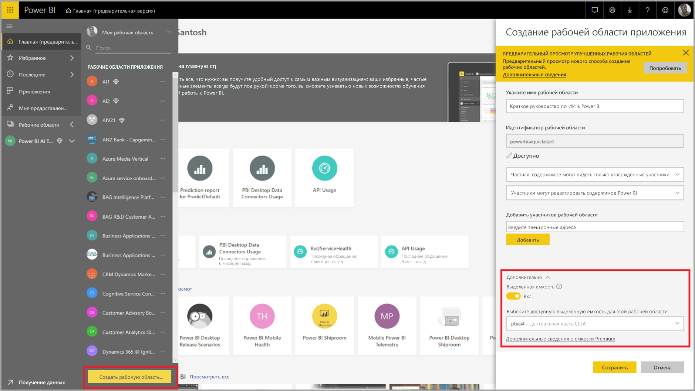
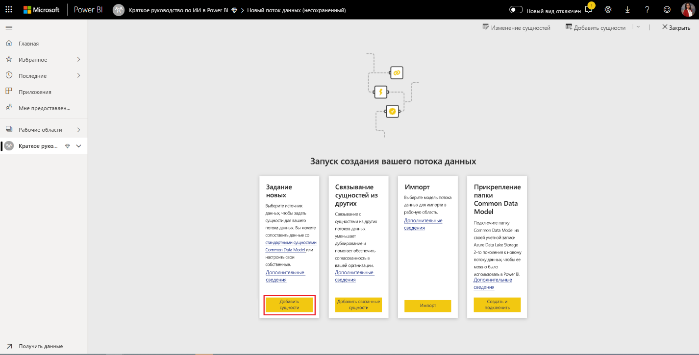
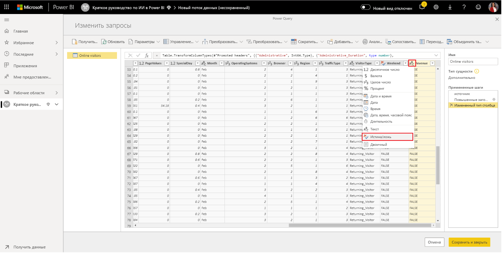
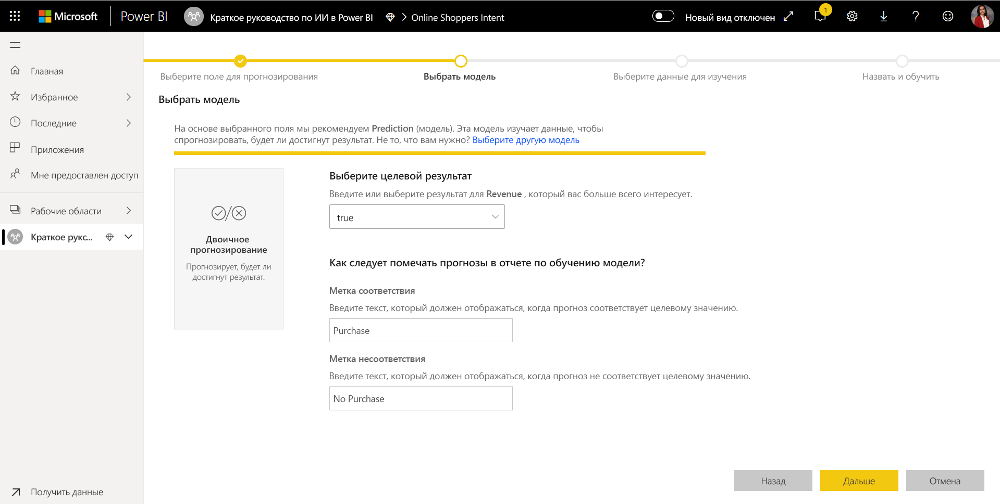
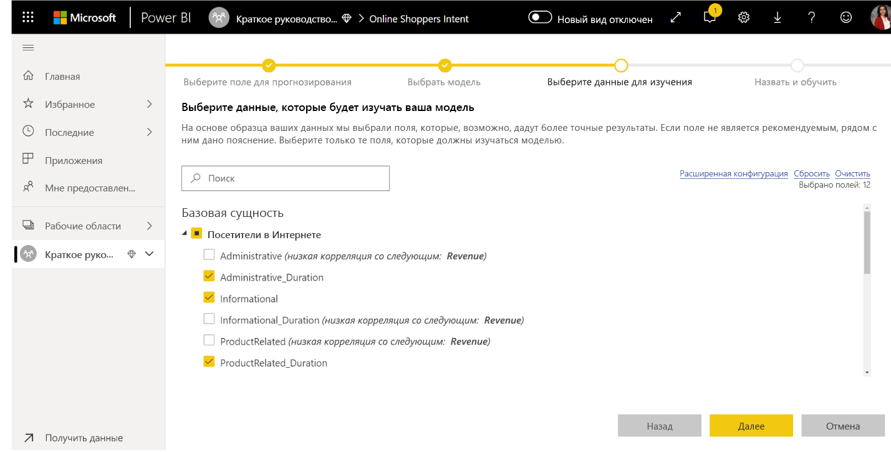
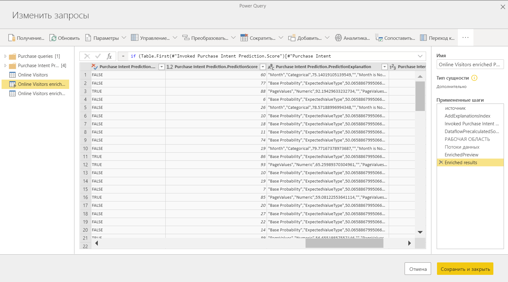

# Руководство. Создание модели машинного обучения в Power BI

В рамках этой учебной статьи **автоматизированное машинное обучение** используется для создания и применения модели двоичного прогнозирования с помощью Power BI. Это руководство содержит рекомендации по созданию потока данных Power BI, а также обучению и проверке модели машинного обучения непосредственно в Power BI с использованием сущностей, которые определяются в потоке данных. Затем эта модель применяется для оценки новых данных, чтобы создать прогнозы.

Сначала вы создадите модель машинного обучения для двоичного прогнозирования намерений сетевых покупателей по набору атрибутов их сеанса подключения. В этом упражнении используется оценочный набор данных машинного обучения. После обучения модели в Power BI автоматически создается отчет о проверке с объяснением результатов модели. Вы сможете просмотреть отчет о проверке и применить модель к данным для оценки.

В этом руководстве рассматриваются следующие этапы:
> [!div class="checklist"]

> * создание потока данных с входными данными;
> * создание и обучение модели машинного обучения;
> * просмотр отчета о проверке модели;
> * применение модели к сущности потока данных;
> * использование результатов оценки модели в отчете Power BI.

## Создание потока данных с входными данными

Первая часть этого руководства посвящена созданию потока данных с входными данными. Этот процесс разделен на несколько этапов, которые описаны в следующих разделах, начиная с получения данных.

### Получить данные

Первый этап при создании потока данных — подготовка источника данных. В нашем примере используется набор данных машинного обучения с информацией о нескольких сеансах подключения, часть из которых привела к покупке. Этот набор данных содержит набор атрибутов для этих сеансов, который мы применим для обучения нашей модели.

Набор данных можно скачать на веб-сайте UC Irvine. Мы сохранили его копию для работы с этим руководством по следующей ссылке: [online_shoppers_intention.csv](https://raw.githubusercontent.com/santoshc1/PowerBI-AI-samples/master/Tutorial_AutomatedML/online_shoppers_intention.csv).

### Создание сущностей

Чтобы создать сущности в потоке данных, войдите в службу Power BI и перейдите в вашей выделенной емкости к рабочей области, в которой включена функция ИИ.

Если у вас нет рабочей области, можете создать ее. Для этого в меню области навигации службы Power BI выберите **Рабочие области**, а затем выберите **Создать рабочую область** в нижней части появившейся панели. Справа откроется панель для ввода сведений о рабочей области. Введите имя рабочей области и щелкните **Расширенный**. Убедитесь, что для рабочей области выбрана выделенная емкость на соответствующем переключателе и для ее выделенного экземпляра емкости включена предварительная версия решения ИИ. Затем выберите **Сохранить**.

После создания рабочей области можно щелкнуть **Пропустить** в нижнем правом углу экрана приветствия, как показано на приведенном ниже изображении.

 Нажмите кнопку **Создать** в верхней части рабочей области справа, а затем выберите **Поток данных**.

Выберите **Добавить новые сущности**. В браузере откроется редактор **Power Query**.

В качестве источника данных выберите **Text/CSV File** (Текстовый файл или файл CSV), как показано на приведенном далее изображении.

После этого откроется страница **Соединение с источником данных**, на которой нужно вставить ссылку на файл _online_shoppers_intention.csv_ в поле **Путь к файлу или URL-адрес**, а затем нажать кнопку **Далее**.

`https://raw.githubusercontent.com/santoshc1/PowerBI-AI-samples/master/Tutorial_AutomatedML/online_shoppers_intention.csv`

В редакторе Power Query отобразятся данные из CSV-файла в режиме предварительного просмотра. Вы можете присвоить запросу более понятное имя, изменив значение в поле "Имя" в правой области. Например, укажите имя запроса _Online Visitors_ (Посетители в Интернете).

Power Query автоматически определяет тип столбцов. Вы можете изменить тип столбца, щелкнув значок типа атрибута в верхней части заголовка столбца. В этом примере мы изменяем тип столбца Revenue (Доход) на "Истина/ложь".

Нажмите кнопку **Сохранить и закрыть**, чтобы закрыть редактор Power Query. Укажите имя для потока данных и нажмите кнопку **Сохранить** в диалоговом окне, как показано на приведенном ниже изображении.

## создание и обучение модели машинного обучения;

Чтобы добавить модель машинного обучения, нажмите кнопку **Применить модель ML** в списке **Действия** для базовой сущности, которая содержит обучающие данные и сведения о метках. Затем щелкните **Добавить модель машинного обучения**.

Первый шаг при создании модели машинного обучения — определение исторических данных, включая поле с прогнозируемым результатом. Модель создается путем обучения на основе этих данных.

В наборе данных из нашего примера меткой является поле **Revenue**. Выберите **Revenue** в разделе "Поле результата" и нажмите кнопку **Далее**.

После этого нужно выбрать тип для создаваемой модели машинного обучения. Power BI анализирует значения в указанном поле результата и предлагает типы моделей машинного обучения, которые позволяют прогнозировать такое поле.

В нашем примере прогнозируется двоичный результат (будет пользователь делать покупку или нет), поэтому рекомендуется двоичное прогнозирование. Так как мы хотим узнать, кто из пользователей совершит покупку, выберите "Истина" в качестве интересующего вас результата для поля Revenue. Кроме того, можно указать понятные метки для результатов, которые будут использоваться в автоматически создаваемом отчете с результатами проверки модели. Нажмите кнопку "Далее".

Затем Power BI выполняет предварительное сканирование данных и предлагает входные данные, которые могут дать более точные прогнозы. Если Power BI не рекомендует поле, рядом с ним приводится обоснование. Вы можете изменить выбранные поля, оставив только те, которые необходимо изучить в модели, или выбрать все поля, установив флажок рядом с именем сущности. Щелкните **Далее**, чтобы подтвердить входные данные.

На последнем шаге необходимо указать имя модели. Назовите модель _Прогнозирование намерений покупки_. Вы можете уменьшить время обучения, чтобы получить результаты быстро, или увеличить его, чтобы получить более точную модель. Щелкните **Сохранить и обучить**, чтобы начать обучение модели.

Обучение начинается с выборки и нормализации исторических данных, а также разбиения набора данных на две новые сущности: _Purchase Intent Prediction Training Data_ (Обучающие данные для прогнозирования намерения покупки) и _Purchase Intent Prediction Testing Data_ (Тестовые данные для прогнозирования намерения покупки).

В зависимости от размера набора данных обучение может занять от нескольких минут до периода времени, выбранного на предыдущем экране. На этом этапе модель отображается на вкладке **Модели машинного обучения** для потока данных. Состояние "Готово" указывает, что модель поставлена в очередь для обучения или находится в процессе обучения.

Завершение обучения и проверки модели можно отследить по состоянию потока данных. В рабочей области на вкладке **Потоки данных** для него отображается значение "Выполняется обновление".

Когда завершится обучение модели, для потока данных отобразится новое время обновления. Вы можете убедиться, что модель обучена, открыв вкладку **Модели машинного обучения** в потоке данных. Для созданной модели должно отображаться состояние **Обучена** и свежее время в поле **Время последнего обучения**.

## просмотр отчета о проверке модели;
Чтобы просмотреть отчет о проверке модели, на вкладке "Модели машинного обучения" нажмите кнопку "Просмотр отчета об обучении" в столбце "Действия" для модели. В этом отчете описано ожидаемое поведение модели машинного обучения.

На странице **Производительность модели** отчета выберите элемент **Основные прогностические параметры**, чтобы просмотреть самые важные прогностические факторы для этой модели. Вы можете выбрать любой фактор, чтобы узнать, как с ним связано распределение результатов.

С помощью среза **Порог вероятности** на странице "Эффективность модели" вы можете изучить влияние порога на точность и полноту результатов модели.

На других страницах отчета представлены статистические показатели эффективности для модели.

Отчет также содержит страницу с подробными сведениями об обучении: параметры выполненных итераций, методы извлечения компонентов из входных данных, гиперпараметры в итоговой модели.

## применение модели к сущности потока данных;

Нажмите кнопку **Применить модель** в верхней части отчета, чтобы вызвать эту модель. В диалоговом окне **Применить** вы можете указать целевой объект с исходными данными, к которым нужно применить эту модель.

Чтобы просмотреть результаты в редакторе запросов, щелкните действие **Обновить** для потока данных в соответствующем запросе.

При применении модели будут созданы две сущности с суффиксами **enriched <имя_модели>** и **enriched <имя_модели> explanations**. В нашем примере модель применяется к сущности **Online Visitors**, поэтому создаются сущности **Online Visitors enriched Purchase Intent Prediction** с результатами прогнозирования, полученными от модели, и **Online Visitors enriched Purchase Intent Prediction explanations** с основными факторами влияния на прогноз для конкретной записи. 

При применении модели двоичного прогнозирования добавляются четыре столбца с прогнозируемым результатом, оценкой вероятности, основными факторами влияния на прогноз для конкретной записи и индексом пояснения. Имя каждого из них дополняется указанным префиксом имени столбца.  

После обновления потока данных вы можете выбрать сущность **Online Visitors enriched Purchase Intent Prediction** для просмотра результатов.

## использование результатов оценки модели в отчете Power BI.

Чтобы использовать выходные данные с результатами работы модели машинного обучения, можно подключиться к потоку данных из Power BI Desktop через соединитель потоков данных (Dataflows). После этого вы сможете применить сущность **Online Visitors enriched Purchase Intent Prediction** для включения прогнозов модели в отчеты Power BI.

## Дальнейшие действия

В рамках этого руководства вы создали и применили модель двоичного прогнозирования в Power BI, выполнив следующие действия:

* создание потока данных с входными данными;
* создание и обучение модели машинного обучения;
* просмотр отчета о проверке модели;
* применение модели к сущности потока данных;
* использование результатов оценки модели в отчете Power BI.

Дополнительные сведения см. в статье [Автоматизированное машинное обучение в Power BI](service-machine-learning-automated.md).
