# Руководство. Вызов модели Студии машинного обучения (классической) в Power BI (предварительная версия)

В этом руководстве описано добавление в Power BI аналитических сведений из модели **Студии машинного обучения Azure (классической)** . В руководстве приведены инструкции по предоставлению доступа пользователю Power BI к модели Azure ML, созданию потока данных и применению аналитических сведений из модели к потоку данных. Здесь также содержится ссылка на краткое руководство по созданию модели Azure ML.

В рамках этого руководства вы выполните следующие задачи:

> [!div class="checklist"]
> * создание и публикация модели Машинного обучения Azure;
> * предоставление доступа пользователю Power BI к модели;
> * создание потока данных;
> * применение аналитических сведений из модели Azure ML к потоку данных.

## Создание и публикация модели Azure ML

Выполните инструкции из статьи [Руководство 1. Создание рабочей области Студии машинного обучения (классической)](https://docs.microsoft.com/azure/machine-learning/studio/walkthrough-1-create-ml-workspace), чтобы создать рабочую область **Машинного обучения**.

Инструкции из этого руководства можно выполнять с любой готовой моделью Azure ML или набором данных. Если у вас нет опубликованной модели, можно быстро создать ее с помощью инструкций, приведенных в руководстве [Создание первого эксперимента по обработке и анализу данных в Студии машинного обучения Azure (классической)](https://docs.microsoft.com/azure/machine-learning/studio/create-experiment). В нем описано создание модели машинного обучения Azure для прогнозирования цен на автомобили.

Чтобы опубликовать модель машинного обучения Azure как веб-службу, выполните инструкции по [развертыванию веб-службы Студии машинного обучения Azure (классической)](https://docs.microsoft.com/azure/machine-learning/studio/tutorial-part3-credit-risk-deploy).

## Предоставление доступа пользователю Power BI

Чтобы получить доступ к модели машинного обучения Azure в Power BI, необходим доступ для **чтения** к подписке Azure и группе ресурсов, а также доступ для **чтения** к веб-службе Студии машинного обучения Azure (классической) для моделей Студии машинного обучения (классической).  Для модели машинного обучения Azure вам потребуется доступ для **чтения** к рабочей области машинного обучения.

Далее предполагается, что вы являетесь соадминистратором подписки и группы ресурсов Azure, в которых опубликована модель.

Войдите на [портал Azure](https://portal.azure.com) и перейдите на страницу **Подписки**, найти которую можно с помощью списка **Все службы** в меню области навигации.

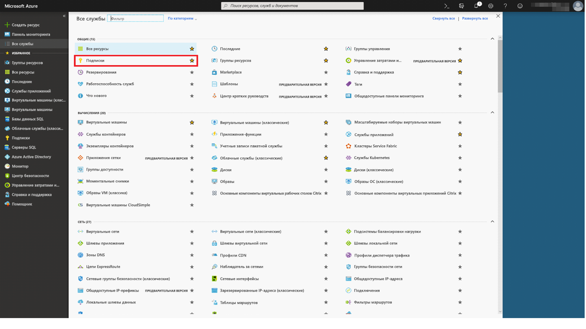

Выберите подписку Azure, которая использовалась для публикации модели, и выберите **Управление доступом (IAM)** . Затем щелкните **Добавить назначение ролей**, выберите роль **Читатель** и выберите пользователя Power BI. После завершения щелкните **Сохранить**. На приведенном ниже изображении показано, как выбрать эти элементы.

Затем повторите предыдущие действия, чтобы предоставить доступ роли **Участник**, назначенной пользователю Power BI, к веб-службе машинного обучения, в которой была развернута модель Azure ML.

## Создание потока данных

### Получение данных для создания потока данных

Войдите в службу Power BI с учетными данными пользователя, которому вы предоставили доступ к модели Azure ML на предыдущем шаге.

Предполагается, что у вас есть данные в формате CSV, оценка которых будет выполнятся с помощью модели Azure ML.  Если для создания модели в Студии машинного обучения (классической) вы использовали **эксперимент с ценами на автомобили**, набор данных из него доступен по этой ссылке:

* [Пример модели Студии машинного обучения Azure (классической)](https://github.com/santoshc1/PowerBI-AI-samples/blob/master/Tutorial_MLStudio_model_integration/Automobile%20price%20data%20_Raw_.csv)

### Создание потока данных

Чтобы создать сущности в потоке данных, войдите в службу Power BI и перейдите в вашей выделенной емкости к рабочей области, в которой включена предварительная версия функции ИИ.

Если у вас нет рабочей области, можно создать ее. Для этого выберите **Рабочие области** в меню слева, а затем щелкните **Создать рабочую область** на панели внизу.  Откроется панель для указания сведений о рабочей области. Введите имя рабочей области и щелкните **Сохранить**.

После создания рабочей области можно выбрать **Пропустить** в нижнем углу экрана приветствия справа.

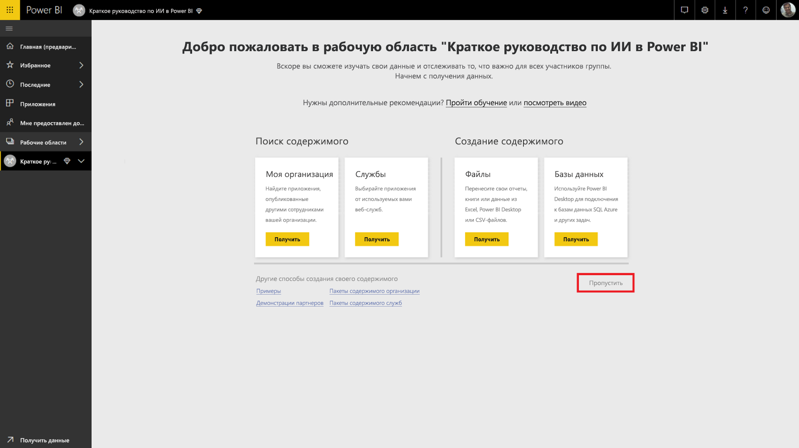

На вкладке **Потоки данных (предварительная версия)** нажмите кнопку **Создать** в верхней части рабочей области справа, а затем выберите **Поток данных**.

Выберите **Добавить новые сущности**, после чего в браузере запустится **редактор Power Query**.

В качестве источника данных выберите **Text/CSV File** (Текстовый файл или файл CSV).

После этого будет предложено подключиться к источнику данных. Вставьте ссылку на данные, которые вы использовали для создания модели Azure ML. Если вы использовали данные о _ценах на автомобили_, вставьте следующую ссылку в поле **File path or URL** (Путь к файлу или URL-адрес ) и нажмите кнопку **Далее**.

`https://raw.githubusercontent.com/MicrosoftLearning/Principles-of-Machine-Learning-Python/master/Module7/Automobile%20price%20data%20_Raw_.csv`

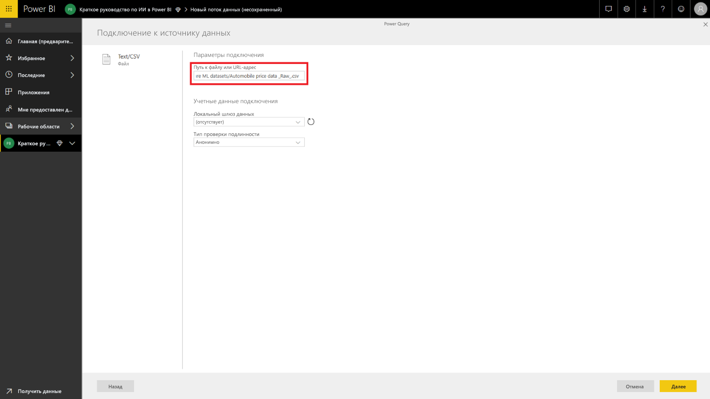

В редакторе Power Query отобразятся данные из CSV-файла в режиме предварительного просмотра. На ленте команд выберите **Преобразовать таблицу**, а затем щелкните **Использовать первую строку в качестве заголовков**.  После этого на панель **Примененные шаги** справа будет добавлен шаг выполнения запроса _Повышенные заголовки_. На этой панели можно изменить имя запроса на более понятное, назвав его, например _Цены на автомобили_.

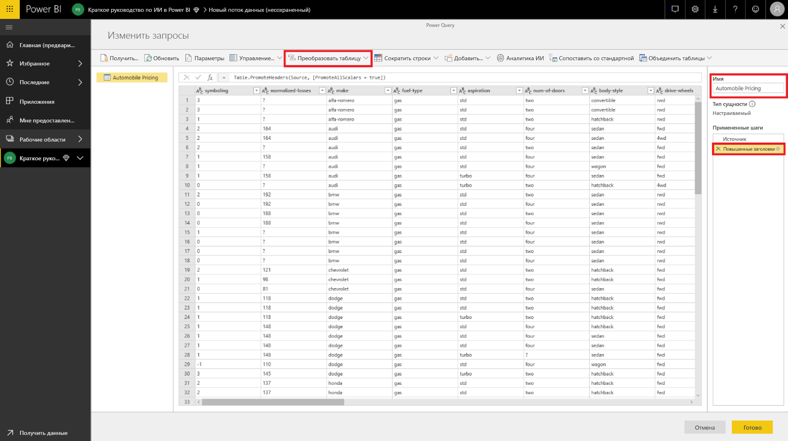

В нашем исходном наборе данных есть неизвестные значения "?".  Замените "?" на "0", чтобы избежать ошибок впоследствии.  Для этого выберите столбцы *normalized-losses*, *bore*, *stroke*, *compression-ratio*, *horsepower*, *peak-rpm* и *price*, щелкнув их заголовки. Нажмите "Преобразовать столбцы" и выберите "Заменить значения".  Замените "?" на "0".

Все столбцы в таблице из файла-источника считаются текстовыми.  Далее нам нужно установить для числовых столбцов требуемый нам тип данных.  Для этого в Power Query щелкните символ типа данных в заголовке столбца.  Измените типы столбцов на следующие:

- **Целое число.** Установите этот тип для столбцов symboling, normalized-losses, curb-weight, engine-size, horsepower, peak-rpm, city-mpg, highway-mpg, price.
- **Десятичное число.** Установите этот тип для столбцов wheel-base, length, width, height, bore, stroke, compression-ratio.

Нажмите кнопку **Готово**, чтобы закрыть редактор Power Query. Отобразится список сущностей с данными о _ценах на автомобили_, которые мы добавили. Выберите **Сохранить** в верхнем углу справа, укажите имя для потока данных и нажмите кнопку **Сохранить**.

### Обновление потока данных

При сохранении потока данных отображается соответствующее уведомление. Нажмите **Обновить сейчас**, чтобы данные из источника были приняты в потоке данных.

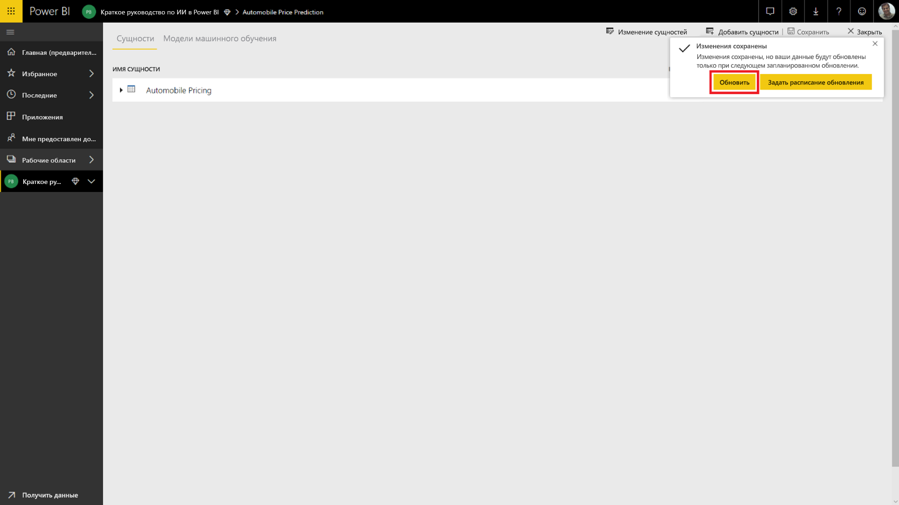

Нажмите **Закрыть** в верхнем углу справа и дождитесь, пока завершится обновление потока данных.

Вы также можете обновить поток данных с помощью команд **Действия**. По окончании обновления отображается метка времени для потока данных.

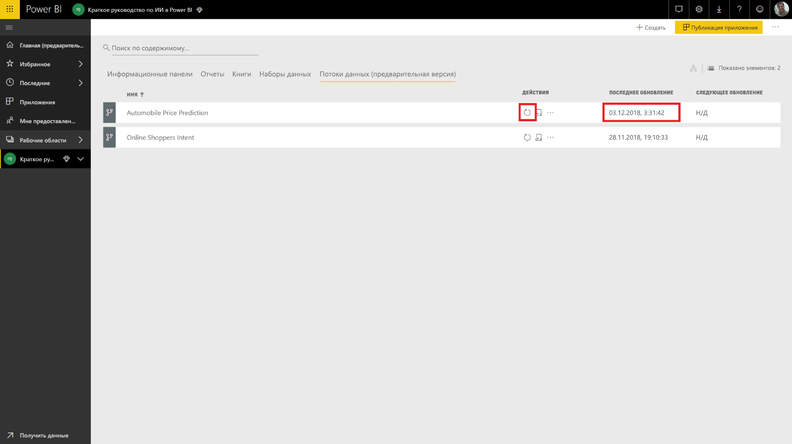

## Применение аналитических сведений из модели Azure ML

Чтобы обеспечить доступ к модели Azure ML для _прогнозирования цен на автомобили_, можно изменить сущность _Цены на автомобили_, в которую мы хотим добавить прогнозируемую цену.

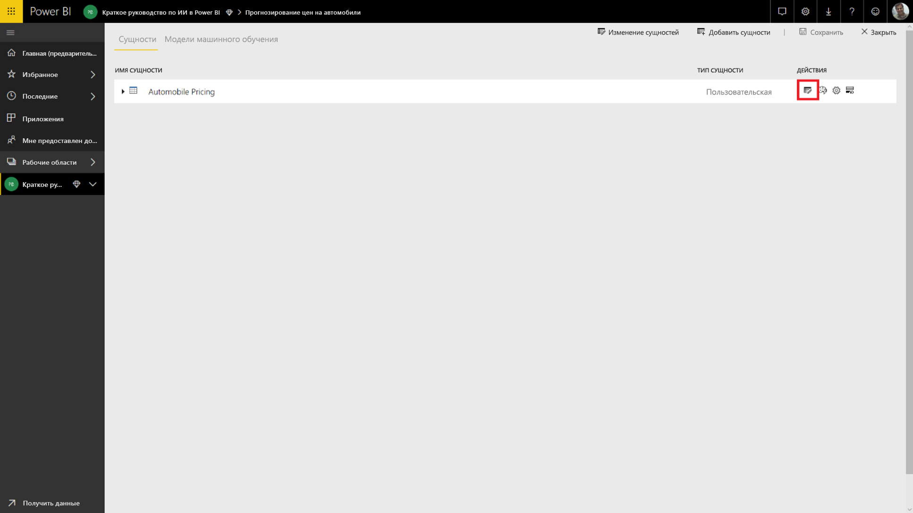

Нажмите **Изменить**, чтобы открыть редактор Power Query для изменения сущностей в потоке данных.

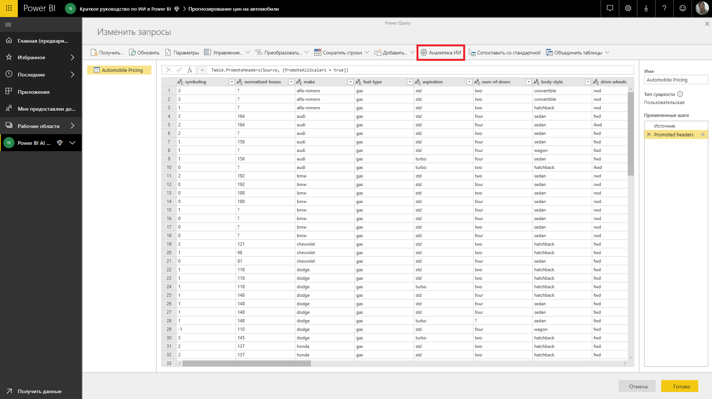

Нажмите кнопку **Аналитика ИИ** на ленте, а затем выберите папку _Модели Машинного обучения Azure_ в меню области навигации.

Модели Azure ML, к которым вы предоставили доступ, перечислены как функции Power Query с префиксом *AzureML*.  При выборе функции, которая соответствует модели _AutomobilePricePrediction_, параметры веб-службы модели отобразятся как параметры функции.

Чтобы вызвать модель Azure ML, вы можете указать в качестве входных данных любой из столбцов выбранной сущности из раскрывающегося списка. Кроме того, в качестве входных данных вы можете указать константу, переключив значок столбца слева от диалогового окна ввода. Если имя столбца соответствует имени одного из параметров функции, будет автоматически предложено использовать этот столбец в качестве входных данных.  Если имя столбца не совпадает ни с одним именем параметра, столбец можно выбрать в раскрывающемся списке.

Входные параметры модели _прогнозирования цен на автомобили_:

- make (производитель);
- body-style (кузов);
- wheel-base (колесная база);
- engine-size (объем двигателя);
- horsepower (мощность);
- peak-rpm (пиковое значение об/мин);
- highway-mpg (расход топлива за городом).

Так как в нашем случае таблица соответствует исходному набору данных, с помощью которых она обучалась, всем параметрам соответствуют требуемые столбцы.

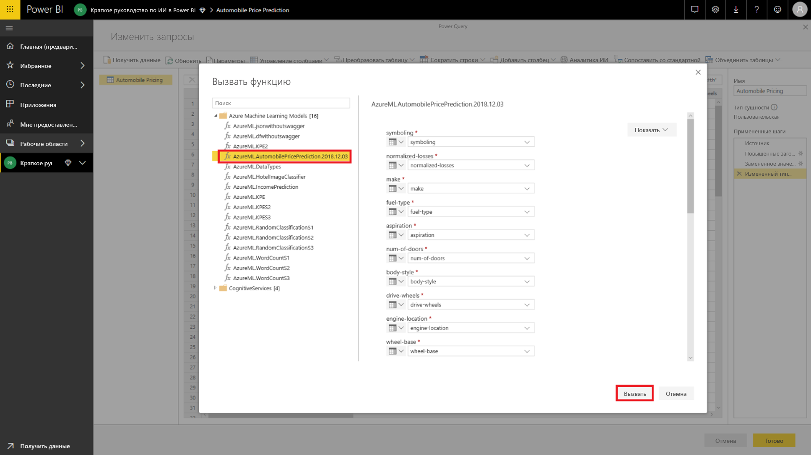

Щелкните **Вызвать** для просмотра предварительной версии выходных данных модели Azure ML в виде нового столбца в таблице сущности. При этом вызов модели отобразится как примененный шаг запроса.

Выходные данные модели отображаются в виде записи в столбце выходных данных. Для отображения конкретных выходных параметров в отдельных столбцах вы можете развернуть столбец. В нашем случае нас интересует только столбец _Scored Labels_ (Прогнозируемая цена) с данными прогноза цен на автомобили.  Поэтому выбор остальных столбцов нужно отменить. Затем нажмите кнопку **ОК**.

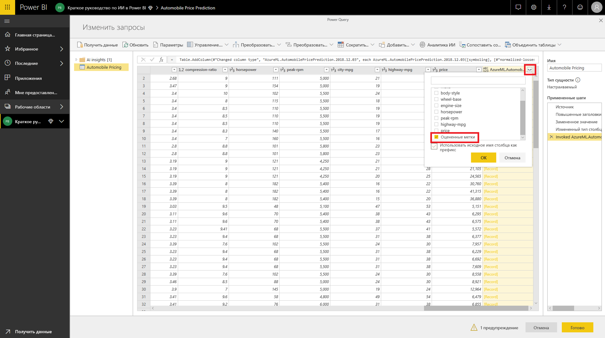

Итоговый столбец *Scored Labels* (Прогнозируемая цена) содержит данные о прогнозируемых ценах из модели Azure ML.

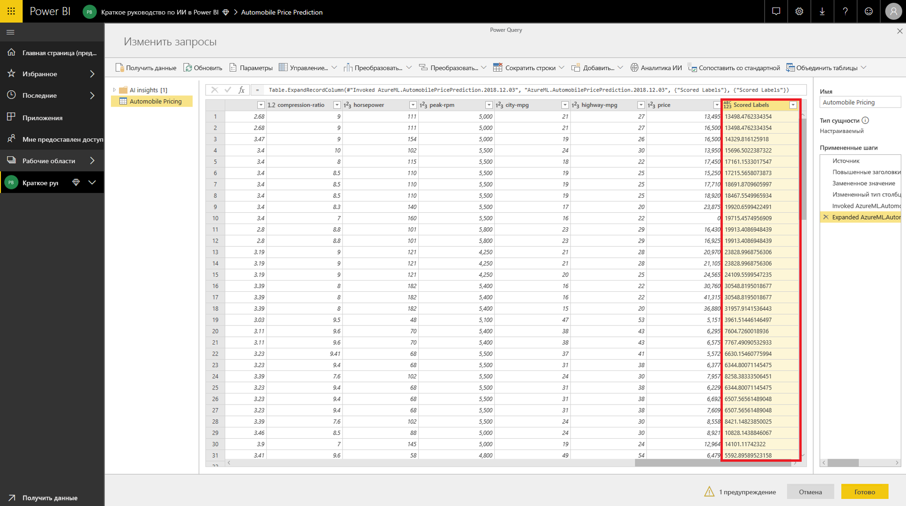

После сохранения потока данных модель будет автоматически вызываться при обновлении потока данных в связи с добавлением новых или изменением существующих строк в таблице сущностей.

## Очистка ресурсов

Если вам не нужны ресурсы Azure, созданные при выполнении инструкций из этой статьи, удалите их, чтобы за них не взималась плата.  Можно также удалить ненужные потоки данных, которые вы создали.

## Дальнейшие действия

С помощью этого руководства вы провели простой эксперимент в Студии машинного обучения Azure (классической) с простым набором данных и выполнили такие задачи:

- создание и публикация модели Машинного обучения Azure;
- предоставление доступа пользователю Power BI к модели;
- создание потока данных;
- применение аналитических сведений из модели Azure ML к потоку данных.

Дополнительные сведения об интеграции машинного обучения Azure в Power BI см. в статье [Интеграция Машинного обучения Azure в Power BI (предварительная версия)](service-machine-learning-integration.md).
