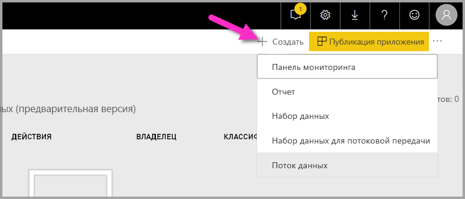
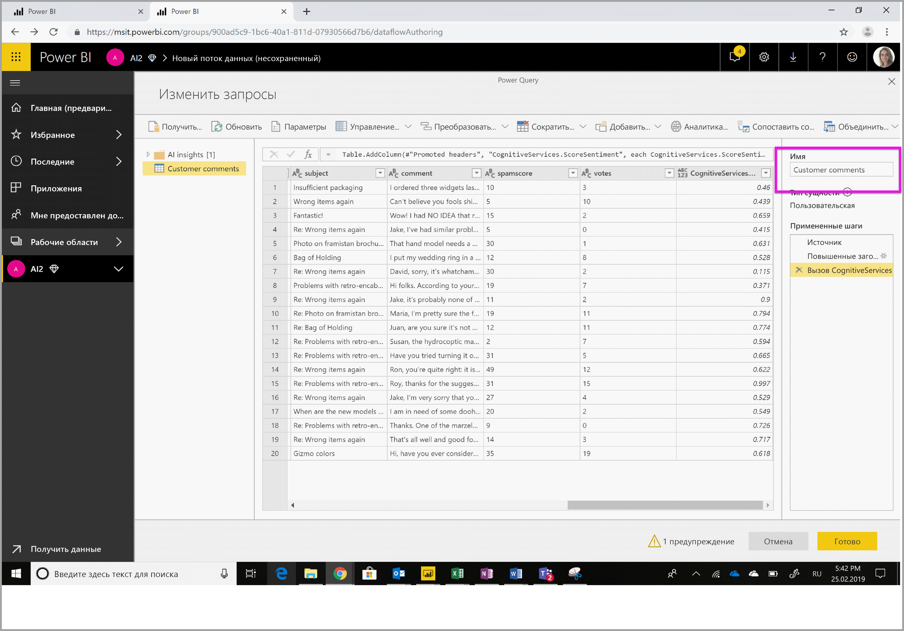
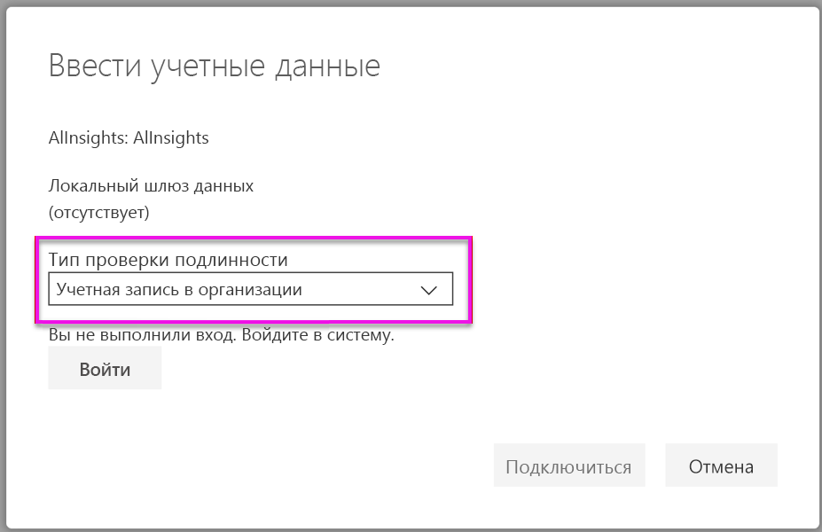
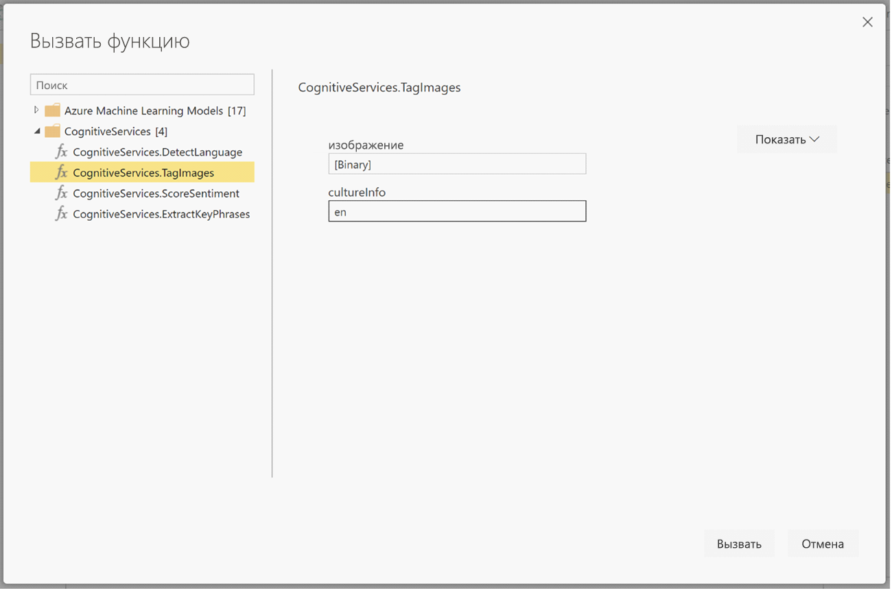

# <a name="tutorial-use-cognitive-services-in-power-bi"></a>Руководство. Использование Cognitive Services в Power BI

Power BI предоставляет доступ к набору функций Azure Cognitive Services, которые дополняют ваши данные при самостоятельной подготовке данных для потоков данных. Сейчас поддерживаются службы [анализа тональности](https://docs.microsoft.com/azure/cognitive-services/text-analytics/how-tos/text-analytics-how-to-sentiment-analysis), [извлечения ключевых фраз](https://docs.microsoft.com/azure/cognitive-services/text-analytics/how-tos/text-analytics-how-to-keyword-extraction), [распознавания языка](https://docs.microsoft.com/azure/cognitive-services/text-analytics/how-tos/text-analytics-how-to-language-detection) и [добавления тегов к изображению](https://docs.microsoft.com/azure/cognitive-services/computer-vision/concept-tagging-images). Преобразования выполняются в службе Power BI, для чего не требуется подписка на Azure Cognitive Services. Эта функция доступна в Power BI Premium.

Выполняемые Cognitive Services преобразования поддерживаются при [самостоятельной подготовке данных для потоков данных](https://powerbi.microsoft.com/blog/introducing-power-bi-data-prep-wtih-dataflows/). Воспользуйтесь пошаговыми примерами для текстовой аналитики и добавления тегов к изображениям ниже, чтобы начать работу.

Из этого руководства вы узнаете, как выполнять следующие задачи:

> [!div class="checklist"]
> * импорт данных в поток данных;
> * оценка тональности и извлечение ключевых фраз из текстового столбца в потоке данных;
> * подключение к результатам из Power BI Desktop.


## <a name="prerequisites"></a>Предварительные требования

Для работы с этим руководством вам нужно следующее: 

- Учетная запись Power BI. Если вы не зарегистрированы в Power BI, перед началом работы [пройдите бесплатную регистрацию](https://app.powerbi.com/signupredirect?pbi_source=web).
- Доступ к емкости Power BI Premium с включенной рабочей нагрузкой ИИ. По умолчанию для предварительной версии эта рабочая нагрузка отключена. Если вы используете емкость Premium, но Аналитика ИИ не отображается, обратитесь к своему администратору емкости Premium, чтобы включить рабочую нагрузку ИИ на портале администрирования.

## <a name="text-analytics"></a>Текстовая аналитика

Выполните шаги в этом разделе, чтобы пройти посвященную текстовой аналитике часть этого руководства.

### <a name="step-1-apply-sentiment-scoring-in-power-bi-service"></a>Шаг 1. Применение оценки тональности в службе Power BI

Чтобы начать работу, перейдите в рабочую область Power BI с емкостью Premium и создайте поток данных с помощью кнопки **Создать** в верхнем правом углу экрана.



В диалоговом окне потока данных доступны несколько вариантов создания потока данных. Выберите **Добавить новые сущности**. Затем выберите **Текст/CSV** из меню источников данных.


Вставьте этот URL-адрес в поле URL-адреса: [https://pbiaitutorials.blob.core.windows.net/textanalytics/FabrikamComments.csv](https://pbiaitutorials.blob.core.windows.net/textanalytics/FabrikamComments.csv) и нажмите кнопку **Далее**.


В ленте вверху выберите **Преобразовать таблицу** и **Использовать первую строку в качестве заголовков**. Данные теперь готовы для текстовой аналитики, и мы можем применить функции оценки тональности и извлечения ключевых фраз к столбцу с комментариями клиентов.

В редакторе Power Query выберите **Аналитика ИИ**


Разверните папку **Cognitive Services** и выберите нужную функцию. В этом примере используется оценка тональности в столбце комментариев, но вы можете выполнить эти же шаги, чтобы запустить распознавание языка и извлечение ключевых фраз.


После выбора функции отобразятся обязательные и необязательные поля. Чтобы оценить тональность в примерах отзывов, выберите столбец с отзывами в качестве текстовых входных данных. Язык и региональные параметры (в формате ISO) указывать необязательно. Например, введите en, если нужно, чтобы язык текст распознавался как английский. Если поле оставлено пустым, Power BI определит язык входного значения, прежде чем начинать оценку тональности.


Теперь нажмите **Вызвать**, чтобы выполнить функцию. В таблицу будет добавлен новый столбец с оценкой тональности для каждой строки. Вы можете вернуться к **Аналитике ИИ**, чтобы аналогичным способом извлечь ключевые фразы из текста отзывов.

После завершения преобразований измените имя запроса на "Комментарии клиентов" и нажмите **Готово**.



Затем нажмите **Сохранить**, чтобы сохранить поток данных, и присвойте ему имя Fabrikam. Нажмите кнопку **Обновить сейчас**, которая отобразилась после сохранения потока данных.


Сохранив и обновив поток данных, вы можете использовать его в отчете Power BI.

### <a name="step-2-connect-from-power-bi-desktop"></a>Шаг 2. Подключение из Power BI Desktop

Откройте Power BI Desktop. На вкладке ленты "Главная" выберите **Получить данные**.

Перейдите к пункту **Потоки данных Power BI (бета-версия**) в разделе Power BI и выберите **Подключить**.


Так как это предварительная версия функции, соединитель отобразит запрос на принятие соответствующих условий. Примите условия и войдите с помощью учетной записи своей организации.


Выберите поток данных, который вы только что создали. Перейдите к таблице "Комментарии клиентов" и щелкните **Загрузить**.


После загрузки данных вы можете приступить к созданию отчета.

## <a name="image-tagging"></a>Добавление тегов к изображениям

Перейдите в рабочую область Power BI с емкостью Premium. Создайте поток данных с помощью кнопки **Создать** в правом верхнем углу экрана.


Выберите **Добавить новые сущности**.


Когда вам будет предложено выбрать источник данных, выберите **Пустой запрос**.


Скопируйте запрос ниже в редактор запросов и нажмите кнопку "Далее". Вы можете заменить пути URL-адресов ниже другими изображениями или добавить дополнительные строки. Функция *Web.Contents* импортирует изображение по указанному URL-адресу в двоичном виде. Если вам доступен источник данных с изображениями, которые хранятся в двоичном виде, вы можете использовать их напрямую.


```python
let
  Source = Table.FromRows({
  { Web.Contents("https://images.pexels.com/photos/87452/flowers-background-butterflies-beautiful-87452.jpeg") },
  { Web.Contents("https://upload.wikimedia.org/wikipedia/commons/5/53/Colosseum_in_Rome%2C_Italy_-_April_2007.jpg") }}, { "Image" })
in
  Source
```


При запросе учетных данных выберите *анонимный вход*.


Отобразится следующее изображение.


Запрос учетных данных будет отображаться для каждой отдельной веб-страницы.

Выберите **Аналитика ИИ** в редакторе запросов.


Затем войдите с помощью своей **учетной записи в организации**.



Выберите функцию "Добавление тегов к изображению", введите _[Двоичный]_ в поле столбца и _en_ в поле языка и региональных параметров. 

> [!NOTE]
> Сейчас вы не сможете выбрать столбец в раскрывающемся списке. Такая возможность будет в ближайшем будущем добавлена в закрытой предварительной версии.



В редакторе функций удалите кавычки, в которые заключено имя столбца. 

> [!NOTE]
> Удаление кавычек — это временное решение. Полноценная функциональность будет в ближайшем будущем добавлена в предварительной версии.


Эта функция возвращает запись в формате разделенных запятыми списка тегов и в виде записи json. Нажмите кнопку "Развернуть", чтобы добавить в таблицу одну или обе этих записи в виде столбцов.


Нажмите **Готово** и сохраните поток данных. Обновив первый поток данных, вы можете подключить его из Power BI Desktop с помощью соединителей потоков данных. (См. шаги на стр. 5 этого документа.)

## <a name="clean-up-resources"></a>Очистка ресурсов

Если запрос вам больше не нужен, удалите его, щелкнув его имя правой кнопкой мыши в редакторе Power Query и нажав **Удалить**.

## <a name="next-steps"></a>Дальнейшие действия

В этом руководстве вы применили функции оценки тональности и добавления тегов к изображениям для потока данных Power BI. Подробнее о Cognitive Services в Power BI можно узнать в следующих статьях:

* [Документация по службам Azure Cognitive Services](https://docs.microsoft.com/azure/cognitive-services/).
* Начало работы [с самостоятельной подготовкой данных для потоков данных](service-dataflows-overview.md).
* Дополнительные сведения о [Power BI Premium](https://powerbi.microsoft.com/power-bi-premium/).

Также рекомендуем ознакомиться со следующими статьями.

* [Руководство. Вызов модели Студии машинного обучения в Power BI (предварительная версия)](service-tutorial-invoke-machine-learning-model.md)
* [Интеграция Машинного обучения Azure в Power BI (предварительная версия)](service-machine-learning-integration.md)
* [Использование Cognitive Services в Power BI (предварительная версия)](service-cognitive-services.md)