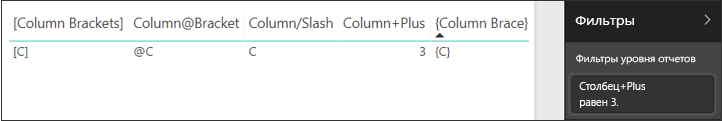

# <a name="filter-a-report-using-query-string-parameters-in-the-url"></a>Фильтрация отчета с помощью параметров строки запроса в URL-адресе

Когда вы открываете отчет в службе Power BI, можно заметить, что каждая страница отчета имеет собственный уникальный URL-адрес. Для фильтрации этой страницы отчета можно использовать область "Фильтры" на холсте отчета.  Также для предварительной фильтрации отчета можно добавить параметры строки запроса в URL-адрес. Возможно, у вас есть отчет, который вы хотите показать коллегам и который для этого необходимо предварительно отфильтровать. Это можно сделать, добавив параметры фильтрации к заданному по умолчанию URL-адресу отчета и затем отправив новый URL-адрес коллегам по электронной почте.


## <a name="uses-for-query-string-parameters"></a>Использование параметров строки запроса

Предположим, что вы работаете в Power BI Desktop. Вы хотите создать отчет, содержащий ссылки на другие отчеты Power BI, но в них нужно отображать только определенные сведения. Сначала отфильтруйте отчеты с помощью параметров строки запроса и сохраните URL-адреса. Затем в Desktop создайте таблицу с этими новыми URL-адресами отчета.  После этого опубликуйте отчет и предоставьте к нему общий доступ.

Параметры строки запроса можно также использовать для создания расширенного решения Power BI.  С помощью DAX можно создать отчет, который динамически формирует URL-адрес отфильтрованного отчета на основе выбора, осуществляемого клиентом в текущем отчете. Когда клиенты выберут URL-адрес, они увидят только нужные сведения. 

## <a name="query-string-parameter-syntax-for-filtering"></a>Синтаксис параметров строки запроса для фильтрации

С помощью параметров можно отфильтровать отчет по одному или нескольким значениям, даже если эти значения содержат пробелы или специальные символы. Базовый синтаксис довольно прост: начните с URL-адреса отчета, добавьте знак вопроса, а затем — синтаксис фильтра.

URL?filter=***Таблица***/***Поле*** eq '***значение***'


* Имена переменных **Таблица** и **Поле** чувствительны к регистру, а **значение** — нет.
* Поля отчета, которые являются скрытыми для просмотра, также можно отфильтровать.

### <a name="field-types"></a>Типы полей

Поля могут иметь тип number, datetime или string. Используемый тип должен соответствовать типу, заданному в наборе данных.  Например, столбец таблицы с типом string не будет работать, если вы ищете значение с типом datetime или number в столбце набора данных с типом date (например, Table/StringColumn eq 1).

* **Строки** (string) должны быть заключены в одинарные кавычки, например 'manager name'.
* Для **чисел** (number) специальное форматирование не требуется.
* **Даты и время** должны быть заключены в одинарные кавычки. В OData v3 перед ними должно стоять слово datetime. В OData v4 это не требуется.

Если эти инструкции вам непонятны, см. подробные объяснения ниже.  

## <a name="filter-on-a-field"></a>Фильтрация по полю

Предположим, URL-адрес нашего отчета выглядит так:


Как видно на визуализации карты (см. выше) у нас есть магазины в Северной Каролине.

>[!NOTE]
>В этом руководстве используется [образец "Анализ розничной торговли"](sample-datasets.md).
> 

Чтобы отфильтровать отчет для отображения данных, связанных только с магазинами в Северной Каролине (значение NC), добавьте в URL-адрес следующий текст:

?filter=Store/Territory eq 'NC'


>[!NOTE]
>*NC* — это значение, которое хранится в поле **Territory** в таблице **Store**.
> 

Отчет отфильтрован по Северной Каролине, следовательно, все визуализации на странице отчета показывают данные только по Северной Каролине.


## <a name="filter-on-multiple-fields"></a>Фильтрация по нескольким полям

Можно также применять фильтр по нескольким полям, добавив дополнительные параметры в URL-адрес. Вернемся к исходным параметрам фильтра.

```
?filter=Store/Territory eq 'NC'
```

Чтобы применить фильтр по дополнительным полям, добавьте **and** и еще одно поле в том же формате, как показано выше. Пример приведен ниже.

```
?filter=Store/Territory eq 'NC' and Store/Chain eq 'Fashions Direct'
```

<iframe width="640" height="360" src="https://www.youtube.com/embed/0sDGKxOaC8w?showinfo=0" frameborder="0" allowfullscreen></iframe>

## <a name="operators"></a>Операторы

Кроме **and**, Power BI поддерживает и другие операторы. Эти операторы и поддерживаемые ими типы содержимого приведены в таблице ниже.

|Оператор  | Определение | строка  | число | Дата |  Пример|
|---------|---------|---------|---------|---------|---------|
|**and**     | и |  да      | да |  да|  product/price le 200 and price gt 3.5 |
|**eq**     | равно |  да      | да   |  да       | Address/City eq 'Redmond' |
|**ne**     | не равно |   да      | да  | да        |  Address/City ne 'London' |
|**ge**     |  больше или равно       | нет | да |да |  product/price ge 10
|**gt**     | больше чем        |нет | да | да  | product/price gt 20
|**le**     |   меньше или равно      | нет | да | да  | product/price le 100
|**lt**     |  меньше чем       | нет | да | да |  product/price lt 20
|**in\*\***     |  включая       | да | да |  да | Student/Age in (27, 29)


\*\* При использовании **in** значением справа от **in** может быть разделенный запятыми список, заключенный в круглые скобки, или одно выражение, которое возвращает коллекцию.

### <a name="numeric-data-types"></a>Числовые типы данных

Фильтр URL-адреса для Power BI может содержать числа в следующих форматах.

|Числовой тип  |Пример  |
|---------|---------|
|**integer**     |   5      |
|**long**     |   5L или 5l      |
|**double**     |   5,5 или 55e-1, или 0,55e+1, или 5D, или 5d, или 0,5e1D, или 0,5e1d, или 5,5D, или 5,5d, или 55e-1D, или 55e-1d     |
|**decimal**     |   5M или 5m, или 5,5M, или 5,5m      |
|**float**     | 5F или 5f, или 0,5e1F, или 0,5e-1d        |

### <a name="date-data-types"></a>Типы данных Date

Для типов данных **Date** и **DateTimeOffset** Power BI поддерживает OData V3 и V4.  Для представления даты используется формат EDM (2019-02-12T00:00:00). Это означает, что при указании даты в формате ГГГГ-ММ-ДД Power BI интерпретирует ее как ГГГГ-ММ-ДДT00:00:00.

Почему это различие имеет значение? Предположим, вы создаете параметр строки запроса **Table/Date gt 2018-08-03**.  Будет ли дата 3 августа 2018 г. включена в результаты или же результаты будут начинаться с даты 4 августа 2018 г.? Так как Power BI преобразует запрос в **Table/Date gt 2018-08-03T00:00:00**, в результаты будут входить любые даты с ненулевой частью времени, поскольку эти даты будут больше **2018-08-03T00:00:00**.

## <a name="special-characters-in-url-filters"></a>Специальные символы в фильтрах URL-адресов

Для специальных символов и пробелов требуется дополнительное форматирование. Если запрос содержит пробелы, дефисы или другие символы не из набора ASCII, добавьте перед этими специальными символами *escape-код* в следующем формате: символ подчеркивания и X (**_x**), четырехзначный символ **Юникода** и еще один символ подчеркивания. Если символ Юникода содержит менее четырех знаков, заполните его нулями. Ниже приведено несколько примеров.

|Идентификатор  |Юникод  | Кодировка для Power BI  |
|---------|---------|---------|
|**Имя таблицы**     | Пробел — 0x20        |  Table_x0020_Name       |
|**Столбец**@**Номер**     |   @ — 0x40     |  Column_x0040_Number       |
|**[Столбец]**     |  [ — 0x0058, ] — 0x0050       |  _x0058_Column_x0050       |
|**Столбец+Plus**     | + — 0x2B        |  Column_x002B_Plus       |

Table_x0020_Name/Column_x002B_Plus eq 3 


Table_x0020_Special/_x005B_Column_x0020_Brackets_x005D_ eq '[C]' 

## <a name="use-dax-to-filter-on-multiple-values"></a>Использование DAX для фильтрации по нескольким значениям

Еще один способ фильтрации по нескольким полям заключается в следующем: можно создать вычисляемый столбец, который сцепляет два поля в одно значение. Затем можно выполнить фильтрацию по этому значению.

Например, у нас есть два поля: Territory и Chain. В Power BI Desktop нужно [создать новый вычисляемый столбец](desktop-tutorial-create-calculated-columns.md) (поле), который называется TerritoryChain. Помните, что имя **поля** не может содержать пробелы. Вот формула DAX для этого столбца:

TerritoryChain = [Territory] & " - " & [Chain]

Опубликуйте отчет в службе Power BI, а затем используйте строку запроса в URL-адресе для фильтрации и отображения данных, связанных только с магазинами Lindseys в Северной Каролине.

    https://app.powerbi.com/groups/me/reports/8d6e300b-696f-498e-b611-41ae03366851/ReportSection3?filter=Store/TerritoryChain eq 'NC – Lindseys'

## <a name="pin-a-tile-from-a-filtered-report"></a>Закрепление плитки на основе отфильтрованного отчета

Отфильтровав отчет с помощью параметров строки запроса, вы можете закрепить на панели мониторинга связанные визуализации.  Плитка на панели мониторинга отображает отфильтрованные данные. Выбрав эту плитку на панели мониторинга, вы откроете отчет, на основе которого она была создана.  При этом фильтрация, выполненная на основе URL-адреса, не сохраняется вместе с отчетом. Когда вы выбираете плитку панели мониторинга, отчет открывается в неотфильтрованном состоянии.  Это означает, что данные, отображаемые на плитке панели мониторинга, не соответствуют данным, отображаемым в визуализации отчета.

Это удобно, когда вам нужно увидеть разные результаты: отфильтрованные данные на панели мониторинга и неотфильтрованные в отчете.

## <a name="considerations-and-troubleshooting"></a>Рекомендации и устранение неполадок

Есть несколько моментов, которые следует учитывать при использовании параметров строки запроса.

* При использовании оператора *in* справа от *in* должен в круглых скобках идти список значений, разделенных запятыми.    
* Сервер отчетов Power BI позволяет вам [передавать параметры отчета](https://docs.microsoft.com/sql/reporting-services/pass-a-report-parameter-within-a-url?view=sql-server-2017.md), включая их в его URL-адрес. Эти параметры URL-адреса не имеют префиксов, так как они передаются непосредственно в подсистему обработки отчетов.
* Фильтрация строки запроса не поддерживается при [веб-публикации](service-publish-to-web.md).
* Фильтры URL-адреса не поддерживаются при [внедрении с помощью веб-части отчетов в SharePoint Online](service-embed-report-spo.md).
* Из-за ограничений JavaScript тип данных long равен (2^53-1).
* Фильтры URL-адреса могут содержать не более 10 выражений (10 фильтров, соединенных AND).

## <a name="next-steps"></a>Дальнейшие действия

[Закрепление визуализации на панели мониторинга](service-dashboard-pin-tile-from-report.md)  
[Зарегистрируйтесь для получения бесплатной пробной версии](https://powerbi.microsoft.com/get-started/)

Появились дополнительные вопросы? [Попробуйте задать вопрос в сообществе Power BI.](http://community.powerbi.com/)
