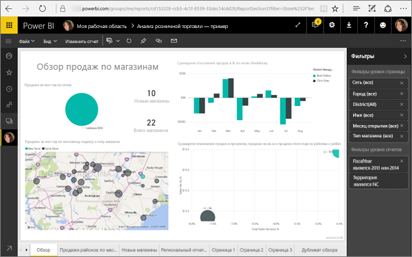

# <a name="filter-a-report-using-query-string-parameters-in-the-url"></a>Фильтрация отчета с помощью параметров строки запроса в URL-адресе
Когда вы открываете отчет в службе Power BI, можно заметить, что каждая страница отчета имеет собственный уникальный URL-адрес. Для фильтрации этой страницы отчета можно использовать область "Фильтры" на холсте отчета.  Также для фильтрации отчета можно добавить параметры строки запроса в URL-адрес. Возможно, у вас есть отчет, который вы хотите показать коллегам и который для этого необходимо предварительно отфильтровать. Это можно сделать, добавив параметры фильтрации к присваиваемому по умолчанию URL-адресу отчета для отправки по электронной почте.


<iframe width="640" height="360" src="https://www.youtube.com/embed/WQFtN8nvM4A?list=PLv2BtOtLblH3YE_Ycas5B1GtcoFfJXavO&amp;showinfo=0" frameborder="0" allowfullscreen></iframe>

## <a name="query-string-parameter-syntax-for-filtering"></a>Синтаксис параметров строки запроса для фильтрации
Синтаксис довольно прост: начните с URL-адреса отчета, добавьте знак вопроса, а затем — синтаксис фильтра.

URL?filter=***Таблица***/***Поле*** eq '***значение***'


* Имена переменных **Таблица** и **Поле** чувствительны к регистру, а **значение** — нет.
* Поля отчета, которые являются скрытыми для просмотра, также можно отфильтровать.
* **Значение** должно быть заключено в одинарные кавычки.
* Тип поля должен быть числовым или строковым
* Имена таблицы и поля не должны содержать пробелов.

Если эти инструкции вам непонятны, см. подробные объяснения ниже.  

## <a name="filter-on-a-field"></a>Фильтрация по полю
Предположим, URL-адрес нашего отчета выглядит так:


Как видно на визуализации карты (см. выше) у нас есть магазины в Северной Каролине.

>[!NOTE]
>В этом руководстве используется [образец "Анализ розничной торговли"](sample-datasets.md).
> 

Чтобы отфильтровать отчет для отображения данных, связанных только с магазинами в Северной Каролине (значение NC), добавьте в URL-адрес следующий текст:

?filter=Store/Territory eq 'NC'


>[!NOTE]
>*NC* — это значение, которое хранится в поле **Territory** в таблице **Store**.
> 
> 

Отчет отфильтрован по Северной Каролине, следовательно, все визуализации на странице отчета показывают данные только по Северной Каролине.



## <a name="filter-on-multiple-fields"></a>Фильтрация по нескольким полям
Можно также применять фильтр по нескольким полям, добавив дополнительные параметры в URL-адрес. Вернемся к исходным параметрам фильтра.

```
?filter=Store/Territory eq 'NC'
```

Чтобы применить фильтр по дополнительным полям, добавьте `and` и еще одно поле в том же формате, как показано выше. Пример приведен ниже.

```
?filter=Store/Territory eq 'NC' and Store/Chain eq 'Fashions Direct'
```

<iframe width="640" height="360" src="https://www.youtube.com/embed/0sDGKxOaC8w?showinfo=0" frameborder="0" allowfullscreen></iframe>


### <a name="using-dax-to-filter-on-multiple-values"></a>Использование DAX для фильтрации по нескольким значениям
Еще один способ фильтрации по нескольким полям заключается в следующем: можно создать вычисляемый столбец, который сцепляет два поля в одно значение. Затем можно выполнить фильтрацию по этому значению.

Например, у нас есть два поля: Territory и Chain. В Power BI Desktop нужно [создать новый вычисляемый столбец](desktop-tutorial-create-calculated-columns.md) (поле), который называется TerritoryChain. Помните, что имя **поля** не должно содержать пробелы. Вот формула DAX для этого столбца:

TerritoryChain = [Territory] & " - " & [Chain]

Опубликуйте отчет в службе Power BI, а затем используйте строку запроса в URL-адресе для фильтрации и отображения данных, связанных только с магазинами Lindseys в Северной Каролине.

    https://app.powerbi.com/groups/me/reports/8d6e300b-696f-498e-b611-41ae03366851/ReportSection3?filter=Store/TerritoryChain eq 'NC–Lindseys'

## <a name="pin-a-tile-from-a-filtered-report"></a>Закрепление плитки на основе отфильтрованного отчета
Отфильтровав отчет с помощью параметров строки запроса, вы можете закрепить на панели мониторинга связанные визуализации. Плитка на панели мониторинга будет отображать отфильтрованные данные. Выбрав эту плитку на панели мониторинга, вы откроете отчет, на основе которого она была создана.  При этом результаты фильтрации отчета с помощью URL-адреса не сохраняются, и при выборе плитки на панели мониторинга отчет отобразится в неотфильтрованном состоянии.  Это означает, что данные, отображаемые на плитке панели мониторинга, не будут соответствовать данным, отображаемым в визуализации отчета.

Тем не менее бывают ситуации, когда вам нужно увидеть разные результаты: отфильтрованные данные на панели мониторинга и неотфильтрованные в отчете.

## <a name="considerations-and-troubleshooting"></a>Рекомендации и устранение неполадок
Есть несколько моментов, которые следует учитывать при использовании параметров строки запроса.

* Сервер отчетов Power BI позволяет вам [передавать параметры отчета](https://docs.microsoft.com/sql/reporting-services/pass-a-report-parameter-within-a-url?view=sql-server-2017.md), включая их в его URL-адрес. Эти параметры URL-адреса не имеют никаких префиксов, так как они передаются непосредственно в подсистему обработки отчетов. 
* Фильтрация строки запроса не поддерживается при [веб-публикации](service-publish-to-web.md) и в Power BI Embedded.   
* Тип поля должен быть числовым или строковым.
* Имена таблицы и поля не должны содержать пробелов.

## <a name="next-steps"></a>Дальнейшие действия
[Закрепление визуализации на панели мониторинга](service-dashboard-pin-tile-from-report.md)  
[Бесплатная пробная версия](https://powerbi.com/)

Появились дополнительные вопросы? [Попробуйте задать вопрос в сообществе Power BI.](http://community.powerbi.com/)

