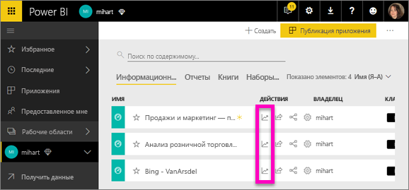
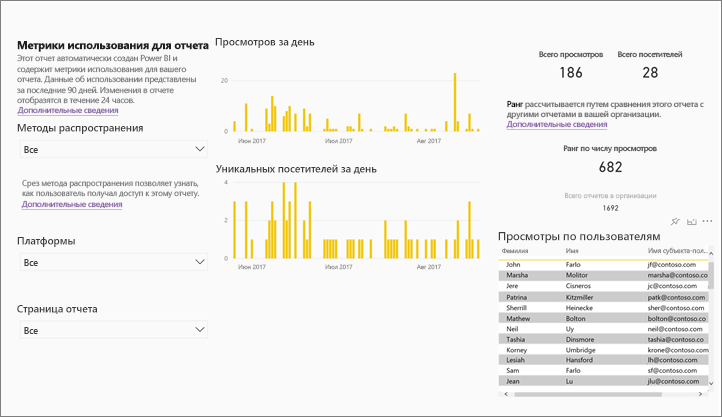
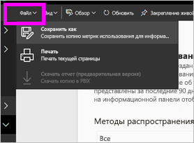
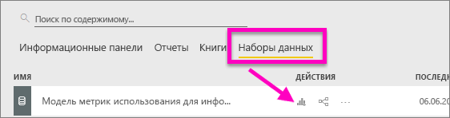
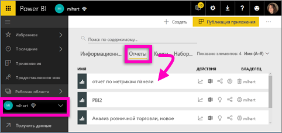
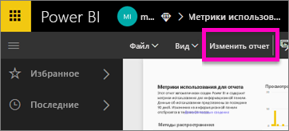
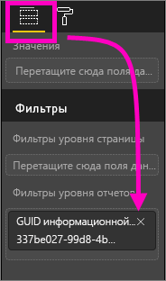
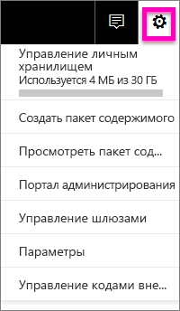
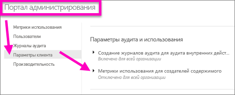

# Использование метрик для панелей мониторинга и отчетов
Когда вы создаете панели мониторинга и отчеты, метрики помогают проанализировать особенности использования этих компонентов. Запустив метрики использования для отчета или панели мониторинга, вы узнаете, как эти панели мониторинга и отчеты используются в организации, а также что используется, кем и для какой цели.  

> [!NOTE]
> В метриках использования будет отслеживаться использование отчетов, которые внедряются в SharePoint Online. Также будет отслеживаться внедрение панелей мониторинга и отчетов с помощью двух рабочих процессов: "учетные данные принадлежат пользователю" и "учетные данные принадлежат приложению". В метриках использования не будет отслеживаться использование отчетов, внедряемых с помощью рабочего процесса [опубликовать в Интернете](service-publish-to-web.md).

Эти отчеты на основе метрик использования доступны только для чтения. Тем не менее вы можете персонализировать отчет на основе метрик использования, выполнив команду "Сохранить как". В результате будет создан набор данных, а отчет только для чтения будет преобразован в полнофункциональный доступный для редактирования отчет Power BI. Персонализированный отчет не просто содержит метрики для выбранной панели мониторинга или отчета. При удалении фильтра по умолчанию в нем можно получить доступ к метрикам использования для всех панелей мониторинга и отчетов в выбранной рабочей области.

## Для чего нужны метрики использования?
Сведения об использовании содержимого помогут вам оценить закономерности его использования и расставить приоритеты. Показатели использования могут указывать на то, что один из ваших отчетов ежедневно используется большим числом сотрудников, а созданная панель мониторинга вообще не просматривается. Сведения подобного рода являются неоценимыми при перераспределении ресурсов.

Запуск отчетов на основе метрик использования доступен только в службе Power BI.  Однако при сохранении отчета на основе метрик использования или его закреплении на панели мониторинга вы сможете открывать этот отчет и взаимодействовать с ним на мобильных устройствах.

### Предварительные требования
- Функция метрик использования записывает сведения об использовании для всех пользователей бесплатной лицензии и версии Pro. Но для запуска и доступа к данным метрик использования требуется лицензия Pro.
- Метрики использования предоставляются на панелях мониторинга и отчетах в выбранной рабочей области. Чтобы получить метрики использования для конкретной панели мониторинга или отчета, вам нужно следующее:    
    • доступ к панели мониторинга или отчету с правами на изменение данных;   
    • лицензия Pro.

## Отчет на основе метрик использования

При выборе **метрик использования** или значка  служба Power BI создает готовый отчет с метриками использования для этого содержимого за последние 90 дней.  Отчет похож на отчеты Power BI, с которыми вы уже знакомы, но с ним нельзя взаимодействовать, он предназначен только для ознакомления. Вы сможете выполнить срез на основании того, как пользователи получили доступ, через веб-приложение или мобильное приложение и т. д. С улучшением панелей мониторинга и отчетов улучшается и отчет на основе метрик использования, в котором данные обновляются каждый день.  

Отчеты на основе метрик использования не отображаются в таких списках содержимого, как **Недавние**, **Рабочие области**, **Избранное** и т. д. Их невозможно добавить в приложение. Если закрепить плитку из отчета на основе метрик использования на панели мониторинга, такую панель мониторинга также невозможно будет добавить в приложение или пакет содержимого.

Чтобы получить дополнительные данные отчета или создать собственные отчеты для наборов данных, выполните команду **Сохранить как** (см. сведения в разделе [Сохранение отчета на основе метрик использования как полнофункционального отчета Power BI (персонализация)](#save-the-usage-metrics-report-as-a-full-featured-power-bi-report)).

## Открытие отчета на основе метрик использования для панели мониторинга или отчета
1. Запустите рабочую область, которая содержит панель мониторинга или отчет.
2. В списке содержимого рабочей области или на панели мониторинга либо в отчете выберите значок **Метрики использования** .
   
    
   
    
3. Когда вы делаете это впервые, служба Power BI создает отчет на основе метрик использования и сообщает, когда отчет готов.
   
        
4. Чтобы открыть результаты, выберите **Просмотр метрик использования**.
   
    Метрики использования будут очень полезны при развертывании и поддержке панелей мониторинга и отчетов Power BI. Интересно, какие страницы отчета наиболее полезны и какие из них следует исключить? Выполните срез **по страницам отчета**, чтобы узнать это. Интересно, необходимо ли создавать макет панели мониторинга для мобильного устройства? Срез **по платформам** позволит узнать, сколько пользователей получают доступ к содержимому через мобильные приложения и веб-браузер.

5. Вы также можете навести указатель мыши на визуализацию и выбрать значок булавки, чтобы добавить визуализацию на панель мониторинга. Или выберите действие **Закрепить активную страницу** в верхней строке меню, чтобы добавить на панель мониторинга всю страницу. С помощью панели мониторинга вам будет удобнее отслеживать показатели использования или делиться ими с коллегами.
   
   > **Примечание.** Если закрепить плитку из отчета на основе метрик использования на панели мониторинга, такую панель мониторинга также невозможно будет добавить в приложение или пакет содержимого.
   > 
   > 

  

## Какие метрики регистрируются?
| Метрика | Панель мониторинга | Отчет | Описание |
| --- | --- | --- | --- |
| Срез метода распространения |да |да |Как пользователи получают доступ к содержимому? Доступ к панели мониторинга или отчету можно получить тремя способами: пользователи являются участниками [рабочей области приложения](service-the-new-power-bi-experience.md), им [предоставлен общий доступ](service-share-dashboards.md) к содержимому или они установили пакет либо приложение содержимого.  Обратите внимание, что представления приложения считаются как "пакет содержимого". |
| Срез платформ |да |да |Пользователи получили доступ к панели мониторинга или отчету из службы Power BI (powerbi.com) или с мобильного устройства? Мобильные устройства включают все наши приложения iOS, Android и Windows. |
| Срез страницы отчета |нет |да |Если отчет содержит более одной страницы, можно разделить отчет по страницам, которые были просмотрены. Если вы видите в списке имен Blank (Пусто), значит страница отчета недавно добавлена (фактическое имя новой страницы появится в списке среза в течение 24 часов) или страницы отчета удалены. Параметр Blank (Пусто) охватывает ситуации такого типа. |
| Просмотров за день |да |да |Общее число просмотров за день — просмотром считается загрузка пользователем страницы отчета или панели мониторинга. |
| Уникальных просмотров за день |да |да |Количество *разных* пользователей, которые просматривали панель мониторинга или отчет (на основании учетной записи пользователя AAD). |
| Просмотры по пользователям |да |да |Число просмотров за последние 90 дней по отдельным пользователям. |
| Публикаций в день |да |нет |Сколько раз общий доступ к панели мониторинга предоставлялся другому пользователю или группе. |
| Всего просмотров |да |да |Количество просмотров за последние 90 дней. |
| Всего посетителей |да |да |Количество уникальных посетителей за последние 90 дней. |
| Всего публикаций |да |нет |Сколько раз за последние 90 дней предоставлялся общий доступ к панели мониторинга или отчету. |
| Общее количество в организации |да |да |Количество всех панелей мониторинга и отчетов в организации, которые просматривались по крайней мере один раз за последние 90 дней.  Используется для вычисления ранга. |
| Ранг: всего просмотров |да |да |Общее количество просмотров за последние 90 дней всех панелей мониторинга и отчетов в организации, где ранжируется эта панель мониторинга или отчет. |
| Ранг: всего публикаций |да |нет |Общее количество публикаций за последние 90 дней для всех панелей мониторинга в организации, где ранжируется эта панель мониторинга или отчет. |

### Отчет на основе метрик использования для панели мониторинга

### Отчет на основе метрик использования для отчета

## Сохранение отчета на основе метрик использования как полнофункционального отчета Power BI (персонализация)

Используйте действие **Сохранить как**, чтобы преобразовать отчет на основе метрик использования в полнофункциональный отчет Power BI, который можно настраивать и к которому можно предоставлять доступ. Создав персонализированную копию, вы сможете получить полный доступ к базовому набору данных и настроить отчет по метрикам использования в соответствии со своими потребностями. Вы также можете использовать Power BI Desktop для создания настраиваемых отчетов на основе метрик использования с помощью [динамического подключения к компоненту службы Power BI](https://powerbi.microsoft.com/blog/connecting-to-datasets-in-the-power-bi-service-from-desktop).

Более того, базовый набор данных включает сведения об использовании для всех панелей мониторинга и отчетов в рабочей области. Это открывает другие доступные возможности. Например, вы можете создать отчет, который сравнивает все панели мониторинга в рабочей области на основе сведений об использовании. Или вы можете создать панель мониторинга на основе метрик использования для приложения Power BI путем объединения данных об использовании всего содержимого, опубликованного в этом приложении.  Дополнительные сведения см. в разделе [Удаление фильтра для просмотра всех данных метрик использования в рабочей области](#remove-the-filter-to-see-all-the-usage-metrics-data-in-the-workspace) ниже.

### Что создается при выполнении команды "Сохранить как"?
Когда служба Power BI создает полнофункциональный отчет, она также создает набор данных, который **включает все панели мониторинга или отчеты в текущей рабочей области**, доступ к которой выполнялся за последние 90 дней. Например, предположим, что у вас есть рабочая область с именем "Продажи", которая содержит три панели мониторинга и два отчета. Затем вы создаете отчет на основе метрик использования на панели мониторинга "Северо-восток" и выполняете команду **Сохранить как**, чтобы персонализировать и преобразовать отчет в полнофункциональный отчет. Набор данных для нового отчета содержит метрики использования *не только для панели мониторинга "Северо-восток"*, но для всех трех панелей мониторинга в рабочей области "Продажи". По умолчанию отчет отобразит данные для панели мониторинга "Северо-восток", и вам потребуется [удалить фильтр](#remove-the-filter-to-see-all-the-usage-metrics-data-in-the-workspace) (одним щелчком мыши), чтобы отобразить данные для всех трех панелей мониторинга.

### Создание копии отчета об использовании с помощью команды "Сохранить как"
При создании копии с помощью команды "Сохранить как" (персонализировать) Power BI преобразовывает готовый отчет только для чтения в полнофункциональный отчет.  На первый взгляд он выглядит точно так же. Тем не менее теперь можно открыть отчет в режиме правки, добавить новые визуализации, фильтры и страницы, изменить или удалить имеющиеся визуализации и многое другое. Power BI сохраняет новый отчет и набор данных в текущей рабочей области. В следующем примере текущей является рабочая область **mihart**.

1. В готовом отчете на основе метрик использования выберите **Файл > Сохранить как**. Служба Power BI конвертирует отчет на основе метрик использования в полнофункциональный отчет Power BI. Это называется *персонализированным* отчетом на основе метрик использования. Персонализированный отчет об использовании и набор данных сохраняются в текущей рабочей области, которая называется **mihart*.
   
    
2. Откройте отчет в режиме правки и [работайте с ним, как с любым другим отчетом Power BI](service-interact-with-a-report-in-editing-view.md). Например, добавляйте новые страницы и создавайте новые визуализации, добавляйте фильтры, форматируйте шрифты и цвета и т. д.
   
    
3. Кроме того, вы можете создать новый набор данных и новый отчет с нуля.
   
    
4. Новый отчет сохраняется в текущей рабочей области (mihart) и добавляется в список содержимого **Последние**.
   
    

### Удаление фильтра для просмотра ***всех*** данных о метриках использования в рабочей области
Чтобы просмотреть метрики для всех панелей мониторинга или отчетов в рабочей области, потребуется удалить фильтр. По умолчанию персонализированный отчет фильтруется для отображения метрик только для панели мониторинга или отчета, использованных для его создания.

Например, если вы использовали для создания этого персонализированного отчета панель мониторинга с именем "Продажи в Европе", будут отображаться только данные об использовании из этой панели мониторинга. Чтобы удалить фильтр и включить данные со всех панелей мониторинга в этой рабочей области, сделайте следующее:

1. Откройте персонализированный отчет в режиме правки.
   
    
2. На панели "Фильтры" найдите контейнер **фильтров на уровне отчета** и удалите фильтр, щелкнув X.
   
    
   
    Теперь персонализированный отчет отображает метрики для всей рабочей области.

## Элементы управления метрик использования для администраторов Power BI
Отчеты на основе метрик использования — это функция, которую администратор Power BI или Office 365 может включать или выключать. Администраторы могут управлять доступом отдельных пользователей к метрикам использования. По умолчанию эти сведения доступны для всех корпоративных пользователей.

1. Откройте портал администрирования: выберите значок шестеренки в верхнем правом углу службы Power BI и выберите **Портал администрирования**.
   
    
2. На портале администрирования выберите **Параметры клиента** и выберите **Метрики использования для создателей содержимого**.
   
    
3. Включите (или выключите) метрики использования и нажмите кнопку **Применить**.
   
    

Блокируя доступ к метрикам использования для всей организации, администраторы могут **удалить все существующее содержимое метрик использования**. Сюда входят все существующие плитки отчетов и панелей мониторинга, созданные с помощью отчетов на основе метрик использования и наборов данных. Этот параметр блокирует доступ к данным метрик использования для всех корпоративных пользователей, которые уже могли работать с ними. Будьте внимательны, так как удаление существующего содержимого метрик использования является необратимым.

## Рекомендации и ограничения
Вопрос. Мне не удается запустить метрики использования для панели мониторинга или отчета.    
Ответ. Вы можете просматривать метрики использования, только если являетесь их владельцем или имеете право на их изменение.

Вопрос. Будут ли метрики использования собирать представления из внедренных панелей мониторинга и отчетов?     
Ответ. Сейчас метрики использования не поддерживают запись данных об использовании внедренных панелей мониторинга и отчетов. Эти метрики также нельзя использовать для потоков типа [данные принадлежат пользователю](developer/integrate-report.md), [данные принадлежат приложению](developer/embed-sample-for-customers.md) и [публикация в Интернете](service-publish-to-web.md). Для отслеживания использования портала или хост-приложения мы рекомендуем применять существующие платформы для веб-аналитики.

Вопрос. Я не могу запустить метрики использования для содержимого.    
Ответ 1. Администраторы могут отключать эту возможность для сотрудников организации.  Обратитесь к администратору, чтобы узнать, так ли это.    
Ответ 2. Метрики использования — это компонент Power BI Pro.

Вопрос. Похоже, данные не обновляются. Например, методы распределения не отображаются, страницы отчетов отсутствует и т. д.   
Ответ. Обновление данных может занять до 24 часов.

Вопрос. Существует четыре отчета в рабочей области, но в отчете на основе метрик использования отображается только 3.    
Ответ. Отчет на основе метрик использования включает только отчеты (или панели мониторинга), к которым получали доступ за последние 90 дней.  Если отчет (или панель мониторинга) не отображается, скорее всего, он не использовался более 90 дней.

## Дальнейшие действия
[Избранные панели мониторинга в Power BI](service-dashboard-favorite.md)

Появились дополнительные вопросы? [Ответы на них см. в сообществе Power BI.](http://community.powerbi.com/)

