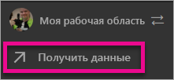
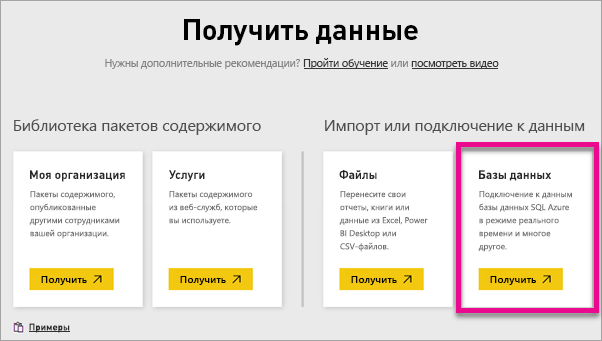
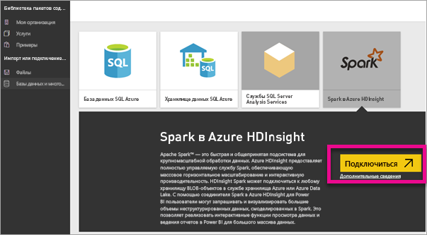
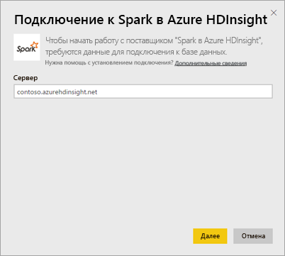
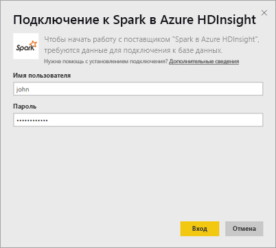
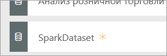
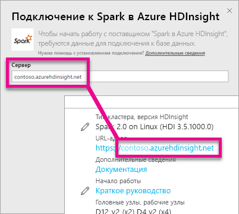
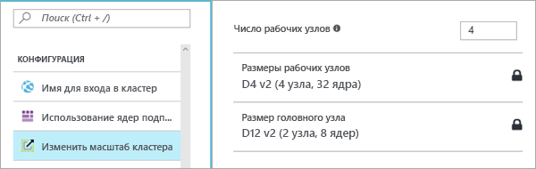

# Spark на HDInsight с поддержкой DirectQuery

Служба Spark на Azure HDInsight с поддержкой DirectQuery позволяет создавать динамические отчеты на основе уже имеющихся данных и метрик из кластера Spark. При использовании технологии DirectQuery запросы, формируемые при просмотре данных в представлении отчетов, отправляются обратно в кластер Azure HDInsight Spark. Этот тип взаимодействия рекомендуется пользователям, знакомым с сущностями, к которым они подключаются.

> [!WARNING]
> Для плиток панели мониторинга, которые используют наборы данных Spark, автоматическое обновление отключено. Их можно обновлять вручную с помощью команды **Обновить плитки панелей мониторинга**. Отключение автоматического обновления не касается отчетов — в них всегда отображается актуальная информация. 

Ниже представлены действия для подключения к источнику данных в Spark на Azure HDInsight с помощью DirectQuery в службе Power BI.

> [!Important]
> Мы улучшили параметры подключения к Spark.  Для наиболее эффективного подключения к источнику данных Spark используйте Power BI Desktop.  После создания модели и отчета их можно опубликовать в службе Power BI.  Прямое подключение к Spark в службе Power BI теперь признано нерекомендуемым.

1. Нажмите кнопку **Получить данные** в нижней части левой панели навигации.

     
2. Щелкните **Базы данных и другое**.

     
3. Щелкните соединитель со **Spark в HDInsight** и нажмите кнопку **Подключить**.

     
4. Введите имя **сервера**, к которому требуется подключиться, а также ваше **имя пользователя** и **пароль**. Сервер всегда указывается в формате \<имя_кластера\>.azurehdinsight.net, см. дополнительные сведения о поиске этих значений ниже.

     

     
5. После подключения вы увидите новый набор данных с именем SparkDataset. Обращаться к набору данных можно посредством созданной плитки-заполнителя.

     
6. Детализируя набор данных, можно просмотреть все таблицы и столбцы в базе данных. При выборе столбца источнику отправляется запрос, при этом динамически создается визуальный элемент. Эти визуальные элементы можно сохранить в новом отчете и закрепить на панели мониторинга.

## Поиск параметров Spark в HDInsight

Сервер всегда указывается в формате \<имя_кластера\>.azurehdinsight.net, и его можно найти на портале Azure.

Имя пользователя и пароль можно также найти на портале Azure.

## Ограничения

Эти ограничения и примечания могут быть изменены по мере улучшения службы. Дополнительную документацию можно найти в разделе [Использование средств бизнес-аналитики с Apache Spark в Azure HDInsight](/azure/hdinsight/spark/apache-spark-use-bi-tools/).

* Служба Power BI поддерживает только конфигурации Spark 2.0 и HDInsight 3.5.
* Каждое действие, например выбор столбца или добавление фильтра, отправляет запрос обратно в базу данных, поэтому перед выбором очень больших полей выберите соответствующий тип визуального элемента.
* Функция вопросов и ответов для наборов данных DirectQuery недоступна.
* Изменения схемы не извлекаются автоматически.
* Служба Power BI поддерживает 16 000 столбцов **во всех таблицах** в наборе данных. Она также включает внутренний столбец номеров строк на таблицу. Это значит, что если у вас, к примеру, 100 таблиц в наборе данных, доступное число столбцов будет 15 900. В зависимости от объема данных, с которыми вы работаете в источнике данных Spark, вы можете столкнуться с этим ограничением.

## Устранение неполадок

Если при выполнении запросов к кластеру встретились проблемы, убедитесь, что приложение по-прежнему выполняется, и при необходимости перезапустите его.

Вы также можете выделить дополнительные ресурсы на портале Azure в разделе **Конфигурация** > **Изменить масштаб кластера**:

## Дальнейшие действия

[Начало работы. Создание кластера Apache Spark в HDInsight на платформе Linux и выполнение интерактивных запросов с помощью SQL Spark](/azure/hdinsight/spark/apache-spark-jupyter-spark-sql/)  
[Что такое Power BI?](power-bi-overview.md)  
[Получение данных для Power BI](service-get-data.md)
[Используйте Kerberos в локальном шлюзе для единого входа](service-gateway-sso-kerberos.md)

Появились дополнительные вопросы? [Ответы на них см. в сообществе Power BI.](http://community.powerbi.com/)