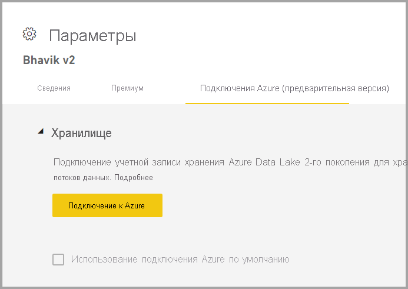
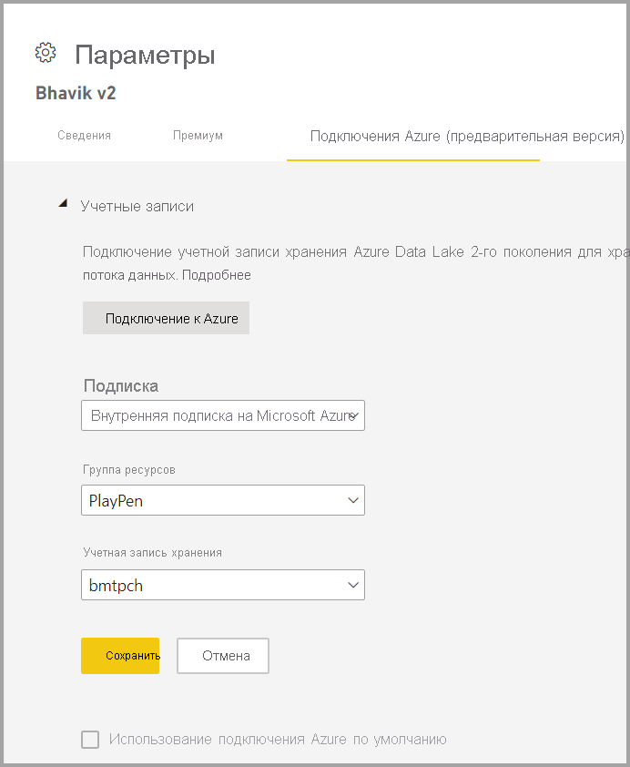

# Настройка хранилища потоков данных для использования Azure Data Lake 2-го поколения 

Данные, используемые в Power BI, хранятся во внутренней памяти, предоставляемой Power BI по умолчанию. С помощью интеграции потоков данных и Azure Data Lake Storage 2-го поколения (ADLS 2-го поколения) вы можете хранить свои потоки данных в корпоративной учетной записи Azure Data Lake Storage 2-го поколения.

Существует два способа настройки хранилища ADLS 2-го поколения: можно использовать клиент, которому назначена учетная запись ADLS 2-го поколения, или перевести собственное хранилище ADLS 2-го поколения на уровень рабочей области. 

## Предварительные требования

Чтобы использовать собственную учетную запись ADLS 2-го поколения, необходимо иметь разрешения владельца на уровне учетной записи хранения, группы ресурсов или подписки. Если вы являетесь администратором, вам все равно необходимо назначить себе разрешение владельца. 

Кроме того, учетная запись хранения ADLS 2-го поколения должна быть развернута в том же регионе, что и ваш клиент Power BI. Если расположения ресурсов находятся в разных регионах, возникает ошибка.

Наконец, к любому хранилищу ADLS 2-го поколения можно подключиться с портала администрирования, но в случае подключения к рабочей области напрямую сначала необходимо убедиться в отсутствии в ней потоков данных.

## Подключение к Azure Data Lake 2-го поколения в рабочей области
Перейдите к рабочей области, в которой нет потоков данных. Выберите **параметры рабочей области** на новой вкладке **Подключения Azure**. Откройте вкладку **Подключения Azure**, а затем выберите раздел **Хранилище**.

 
Если в клиенте уже настроено хранилище ADLS 2-го поколения, отображается параметр **Использовать подключение к Azure по умолчанию**. У вас есть два варианта: использовать настроенное в клиенте хранилище ADLS 2-го поколения, установив флажок **Использовать подключение к Azure по умолчанию**, или нажать кнопку **Подключиться к Azure**, чтобы указать новую учетную запись хранения Azure. 

При нажатии кнопки **Подключиться к Azure** Power BI извлекает список подписок Azure, к которым у вас есть доступ. Выберите допустимую подписку Azure, группу ресурсов и учетную запись хранения с включенным параметром иерархического пространства имен, который является флагом ADLS 2-го поколения.

 
Сделав выбор, нажмите кнопку **Сохранить**, после чего рабочая область будет подключена к вашей учетной записи ADLS 2-го поколения. Power BI автоматически настраивает учетную запись хранения с необходимыми разрешениями и настраивает файловую систему Power BI, в которую будут записываться данные. На этом этапе все данные потока данных в этой рабочей области будут записываться непосредственно в эту файловую систему, которую можно использовать с другими службами Azure, так как она будет представлять единый источник для всех данных организации или отдела.

## Отключение Azure Data Lake 2-го поколения от рабочей области или клиента

Чтобы удалить подключение на уровне рабочей области, сначала необходимо убедиться, что в рабочей области удалены все потоки данных. После удаления всех потоков данных выберите **Отключить** в параметрах рабочей области. То же самое касается и клиента, но сначала необходимо убедиться, что все рабочие области также отключены от учетной записи хранения клиента, и только после этого выполнять отключение на уровне клиента.

## Отключение Azure Data Lake 2-го поколения

На **портале администрирования** в разделе **Потоки данных** можно отключить доступ пользователей к этой функции и запретить администраторам рабочих областей использовать их собственное хранилище Azure.

## Дальнейшие действия
Дополнительные сведения о потоках данных и Power BI вы можете получить в следующих статьях.

* [Вводные сведения о потоках данных и самостоятельной подготовке данных](dataflows-introduction-self-service.md)
* [Создание потока данных](dataflows-create.md)
* [Настройка и использование потока данных](dataflows-configure-consume.md)
* [Функции потоков данных уровня "Премиум"](dataflows-premium-features.md)
* [ИИ с потоками данных](dataflows-machine-learning-integration.md)
* [Рекомендации и ограничения, касающиеся потоков данных](dataflows-features-limitations.md)