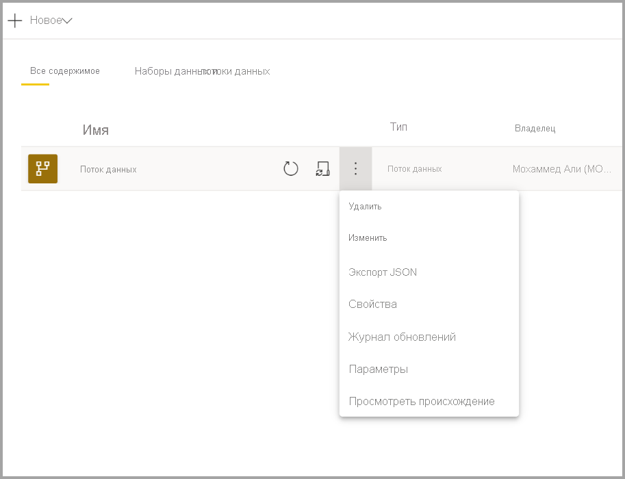
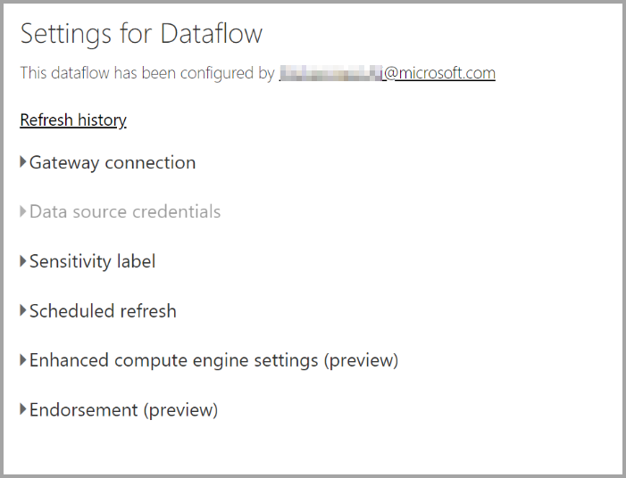
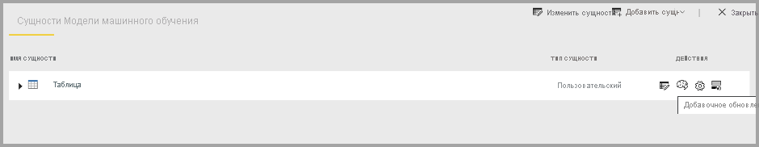
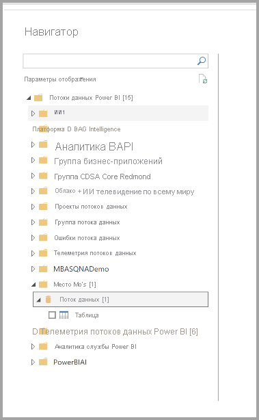

# Настройка и использование потока данных

С помощью потоков данных можно объединять данные из нескольких источников и подготавливать эти данные для моделирования. При каждом создании потока данных вам будет предложено обновить данные для потока данных. Обновление потока данных требуется для того, чтобы его можно было использовать в наборе данных в Power BI Desktop или ссылаться на него как на связанную или вычисляемую сущность.

## Настройка потока данных

Чтобы настроить обновление потока данных, щелкните меню **Дополнительно** (многоточие) и выберите **Параметры**.

В разделе **Параметры** доступно множество параметров для потока данных, как описано в следующих разделах.

* **Назначение владельцем.** Если вы не являетесь владельцем потока данных, многие из этих параметров будут отключены. Чтобы стать владельцем потока данных, выберите **Принять**, чтобы получить контроль. Вам будет предложено ввести учетные данные, чтобы убедиться в наличии у вас необходимого уровня доступа.

* **Подключение шлюза.** В этом разделе можно выбрать, использует ли поток данных шлюз, и выбрать, какой шлюз используется. 

* **Учетные данные источника данных.** В этом разделе можно выбрать используемые учетные данные и изменить способ проверки подлинности в источнике данных.

* **Метка конфиденциальности.** Здесь можно определить конфиденциальность данных в потоке данных. Дополнительные сведения о метках конфиденциальности см. в статье [Применение меток конфиденциальности в Power BI](../../admin/service-security-apply-data-sensitivity-labels.md).

* **Запланированное обновление.** Здесь можно определить время обновления выбранного потока данных. Поток данных можно обновлять с той же периодичностью, что и набор данных.

* **Параметры расширенного ядра вычислений.** Здесь можно определить, хранится ли поток данных в ядре вычислений. Ядро вычислений позволяет последующим потокам данных, которые ссылаются на этот поток данных, гораздо быстрее выполнять операции слияния и объединения и другие преобразования. Оно также позволяет выполнять DirectQuery в потоке данных. Значение **Вкл.** означает, что поток данных всегда поддерживается в режиме DirectQuery, и все ссылки работают должным образом. Значение **Оптимизировано** означает, что ядро используется только при наличии ссылки на этот поток данных. Значение **Выкл.** отключает ядро вычислений и возможность DirectQuery для этого потока данных.

* **Подтверждения.** Можно определить, является ли поток данных сертифицированным или имеет повышенный уровень. 

## Обновление потока данных
Потоки данных работают как стандартные блоки, располагаемые один поверх другого. Предположим, что имеется поток данных *Необработанные данные* и связанная сущность *Преобразованные данные*, которая содержит сущность, связанную с потоком данных *Необработанные данные*. После срабатывания расписания обновления для потока данных *Необработанные данные* и завершения обновления этого потока запускается обновление всех потоков данных, ссылающихся на этот поток. При этом создается эффект цепочки обновлений, что позволяет избежать необходимости планировать потоки данных вручную. Существует несколько нюансов, которые следует учитывать при обновлении связанных сущностей.

* Связанная сущность будет активирована при запуске обновления только в том случае, если она существует в той же рабочей области.

* При обновлении исходной сущности связанная сущность будет заблокирована для редактирования. Если не удается обновить какие-либо потоки данных в цепочке ссылок, все потоки данных будут возвращены к старым данным (обновления потока данных являются транзакционными в рабочей области).

* При активации в результате завершения обновления источника обновляются только сущности, на которые имеются ссылки. Чтобы запланировать обновление всех сущностей, необходимо также задать расписание обновления для связанной сущности. Во избежание двойного обновления не следует задавать расписание обновления для связанных потоков данных.

**Отмена обновления.** В отличие от наборов данных, потоки данных поддерживают возможность отмены обновления. Если обновление выполняется слишком долго, можно щелкнуть меню параметров потока данных (многоточие рядом с потоком данных), а затем выбрать **Отменить обновление**.

**Добавочное обновление (только для выпуска Premium).** Для потоков данных можно также настроить добавочное обновление. Для этого выберите поток данных, для которого нужно настроить добавочное обновление, а затем щелкните значок добавочного обновления.

При настройке добавочного обновления в поток данных добавляются параметры для указания диапазона дат. Подробные сведения о настройке добавочного обновления см. в статье о [добавочном обновлении в Power Query](https://docs.microsoft.com/power-query/dataflows/incremental-refresh).

В некоторых случаях настраивать добавочное обновление не следует.

* Связанные сущности не должны использовать добавочное обновление, если они ссылаются на поток данных. Потоки данных не поддерживают свертывание запросов (даже если сущность поддерживает DirectQuery). 

* Наборы данных, ссылающиеся на потоки данных, не должны использовать добавочное обновление. Обновления для потоков данных обычно выполняются нормально, поэтому добавочные обновления не требуются. Если применение обновления занимает слишком много времени, рекомендуется использовать ядро вычислений или режим DirectQuery.

## Использование потока данных

Существует три способа использования потока данных.

* Создание связанной сущности на основе потока данных, чтобы разрешить использовать данные другим авторам потоков данных.

* Создание набора данных на основе потока данных, чтобы разрешить пользователю использовать данные для создания отчетов.

* Создание подключения из внешних средств, которые могут считывать из формата CDM.

**Использование из Power BI Desktop.** Для использования потока данных запустите Power BI Desktop и в диалоговом окне **Получение данных** выберите **Соединитель потоков данных Power BI**.

> [!NOTE]
> Соединитель потоков данных Power BI использует набор учетных данных, отличный от набора текущего вошедшего в систему пользователя. Это сделано специально для поддержки пользователей с несколькими клиентами.

Выберите поток данных и сущности, к которым необходимо подключиться. 

> [!NOTE]
> Можно подключаться к любому потоку данных или сущности независимо от того, в какой рабочей области они находится, а также вне зависимости от того, были ли они определены в рабочей области Premium или в другой рабочей области.

Если доступен режим DirectQuery, вам предложено выбрать способ подключения к сущностям: с помощью DirectQuery или импорта. 

В режиме DirectQuery можно быстро опрашивать крупномасштабные наборы данных в локальной среде. Но при этом выполнять дополнительные преобразования невозможно. 

Функция импорта позволяет переносить данные в Power BI и требует обновления набора данных независимо от потока данных.

## Дальнейшие действия
Дополнительные сведения о потоках данных и Power BI вы можете получить в следующих статьях.

* [Вводные сведения о потоках данных и самостоятельной подготовке данных](dataflows-introduction-self-service.md)
* [Создание потока данных](dataflows-create.md)
* [Настройка хранилища потоков данных для использования Azure Data Lake 2-го поколения](dataflows-azure-data-lake-storage-integration.md)
* [Функции потоков данных уровня "Премиум"](dataflows-premium-features.md)
* [ИИ с потоками данных](dataflows-machine-learning-integration.md)
* [Рекомендации и ограничения, касающиеся потоков данных](dataflows-features-limitations.md)